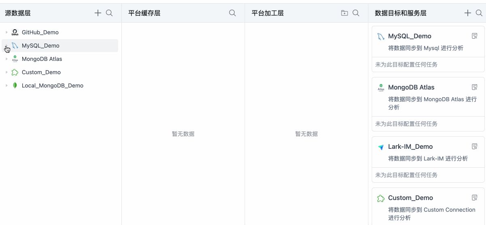
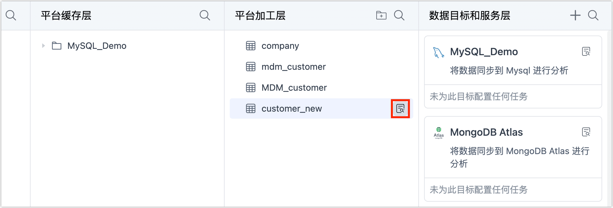

# 一键自动流转数据

在数据服务平台模式下，您只需要简单地拖动源表至所需层级，即可一键生成数据管道并自动启动任务，极大简化任务配置流程，本文介绍如何实现数据在不同层级间的流转，并最终为提供给终端业务。

## 操作步骤

1. 登录 Tapdata 平台。

2. 在左侧导航栏，单击**数据面板**。

3. 在本页面，您可以直观地看到您已录入的数据源信息，Tapdata 基于数据治理和流转顺序，展示了四个层级。

   

   :::tip

   关于各层级的详细说明，见[数据服务平台分层介绍](enable-daas-mode.md)。

   :::

4. 将数据同步至平台缓存层。

   1. 在**源数据层**，单击图标，找到您需要同步的表，将其拖动至平台缓存层。

   2. 在弹出的对话框中，填写表前缀并单击**确定**，本案例中，我们要同步的表为 **customer**，此处填写前缀为 **MySQL**，那么在平台缓存层中，该表名为 **FDM_MySQL_customer**。

      完成操作后，Tapdata 将自动创建一个数据复制任务，将您选择表（含全量数据）实时同步至平台缓存层并自动校验，您可以单击平台缓存中表名右侧的图标，跳转至任务监控页面来查看任务运行详情。

      

5. 将数据同步至平台加工层。

   :::tip

   该操作适用于对平台缓存层的的表进行表结构调整（如增加字段）、合并表、构建宽表等操作，如果缓存层的表已经满足您的需求，则无需执行本步骤，您可以直接发布 API 或将缓存层的表拖动至**数据目标和服务层**。

   :::

   1. 在**平台缓存层**，单击图标，找到您需要加工的表，将其拖动至平台加工层。

   2. 在弹出的对话框中，填写表名称并单击**确定**，如果该表名已存在则会覆盖表中已有的数据。

   3. 在平台加工层，找到目标表，单击其右侧的图标，可查看该表关联的任务和表的基本信息，包含列信息、样本数据、Scheme 等信息。

      

   4. （可选）如需针对该表执行自定义的 ETL 加工，单击图标图标后，选择**任务**标签，单击相关任务名称进入任务监控页面，可在该页面停止并编辑任务，基于业务需求加入相关[处理节点](../../data-pipeline/data-development/process-node.md)。具体操作，见[创建数据开发任务](../../data-pipeline/data-development/create-task.md)。

6. 将数据同步至数据目标和服务层。

   1. 从**平台缓存层**或**平台缓存层**中，找到要同步的表，将其拖动至**数据目标和服务层**。

   2. 在弹出的对话框中，填写具有业务意义的任务名称并单击**确定**。

      Tapdata 将自动创建一个数据开发任务，将您的源表实时同步到选定的目标库中，提供给最终业务。

   3. 在页面右侧，单击目标库卡片中生成的任务名称，进入任务配置页面。

   4. 在跳转到的任务配置页面，您可以直接单击右上角的**启动**，也可以基于业务需求加入相关处理节点以实现自定义 ETL 流程，具体操作，见[创建数据开发任务](../../data-pipeline/data-development/create-task.md)。

   