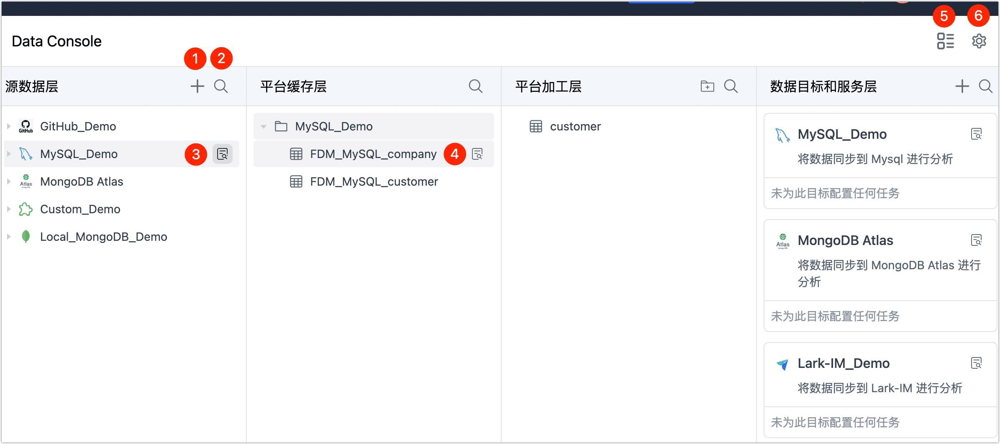
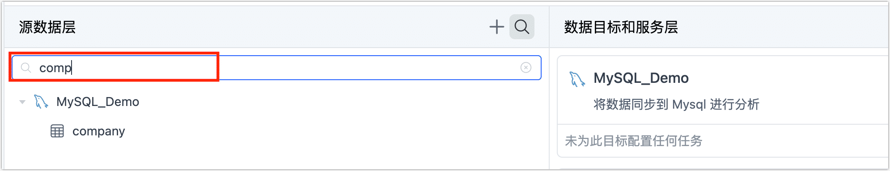
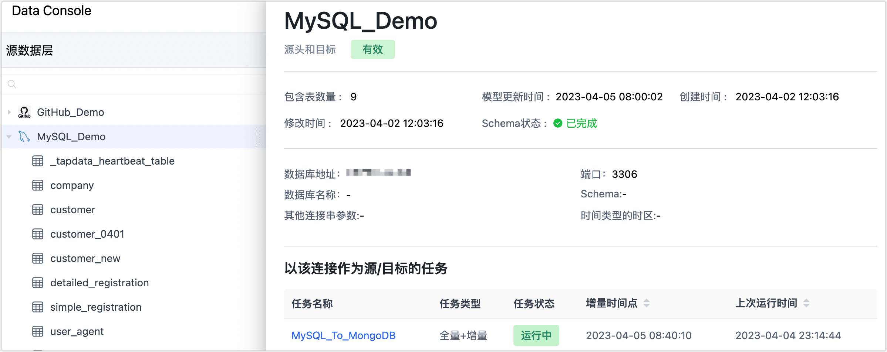
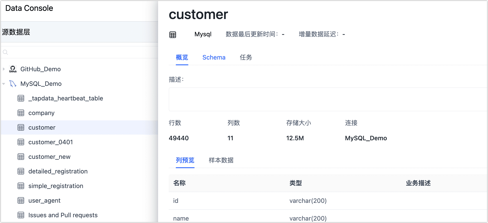

# 数据服务平台界面介绍

开启数据服务平台模式后，页面将基于我们前面[介绍的层级](enable-daas-mode.md)进行分类展示，您只需要简单地拖动表至下一层级，即可自动完成数据复制任务的创建，轻松完成数据的流转。本文介绍如何使用数据服务平台模式的界面，帮助您快速了解各功能模块。

## 操作步骤

1. 登录 Tapdata 平台。

2. 在左侧导航栏，单击**数据面板**。

3. 在本页面，您可以直观地看到您已录入的数据源信息，接下来，我们将介绍各模块的具体作用。

   

   

   | 序号  | 操作介绍                                                     |
   | ----- | ------------------------------------------------------------ |
   | **①** | 单击图标，在弹出的对话框，我们可以添加数据源，选中某个数据源后将跳转至连接配置页面，具体配置方法，见[连接数据源](../../connect-database/README.md)。 |
   | **②** | 单击图标，输入表名的关键词，可帮助您快速定位到具体的表，该操作在其他层级的模块中也可使用。 |
   | **③** | 在数据连接的右侧，单击图标，页面右侧将展示该数据源的连接信息和关联的任务。 |
   | **④** | 在表名的右侧，单击图标，页面右侧将展示该表关联的任务和表的基本信息，包含表大小、行数、列信息、样本数据、Scheme（如主键/外键） 等，该操作在其他层级的模块中也可使用。 |
   | **⑤** | 单击图标，以目录结构的形式展现数据源信息（再次单击可切换回 Console 视图），选中具体的表，也可以查看该表关联的任务和表的基本信息，包含表大小、行数、列信息、样本数据、Scheme（如主键/外键) 等。 |
   | **⑥** | 单击图标，在弹出的对话框中，可选择切换回[数据集成模式（Beta）](../etl-mode/etl-mode-dashboard.md)。 |