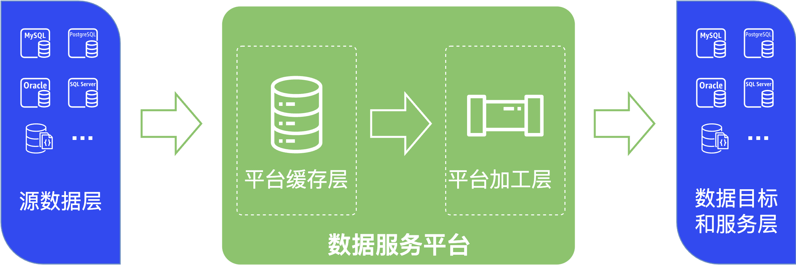
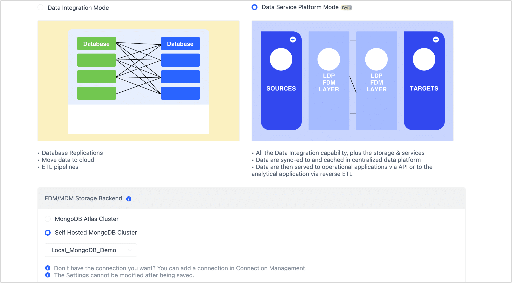

# 开启数据服务平台模式

随着数字化转型的持续深入，数据孤岛问题已逐渐成为主要的阻碍，同时业务对数据需求日益增多，传统的数据交付因其周期长、资源投入大而成为交付瓶颈，如何快速打通数据流转通道，发掘数据价值，已成为企业竞争力的关键因素。

借助 Tapdata 的数据服务平台模式，您可以将分散在不同业务系统的数据同步至统一的平台缓存层，可为后续的数据加工和业务提供基础数据，从而构建一致、实时的数据平台，连通数据孤岛。

## 背景介绍

在当今的数字化时代，企业面临的最大挑战之一是如何高效地处理和分析大量的实时数据。传统的数据处理方法，例如批处理或手动编写数据 ETL 脚本，通常无法提供及时的数据分析和处理，这限制了企业在快速变化的市场环境中做出及时决策的能力。此外，直接在生产数据库上进行数据操作可能影响其稳定性和安全性，进而影响整个业务的运行效率。

实时数据中心的引入，旨在解决这些问题。它提供了一个高效、可靠的平台，帮助企业实时处理和分析数据，快速响应市场和客户需求，例如：

* 通过引入 Tapdata 的实时数据中心，一家企业成功地构建了一个监控云端用户行为的数据看板。他们将生产环境的数据库实时导入到 Tapdata 的平台缓存层，可以在不影响源数据库的情况下，对缓存层的数据实时加工以生成关键业务指标，从而为业务所需的 BI 报表提供最新鲜的数据，提供即时的业务洞察和分析。
* 在另一个案例中，一个零售企业利用实时数据中心构建了一个数据门户。这个门户使前端业务开发者能够通过自助服务快速发现和处理数据，进而构建和发布 API。他们通过 Tapdata 的数据目录快速定位所需数据，实现自助加工和建模。这不仅提高了开发效率，还减少了对专业数据团队的依赖，为企业节省了大量成本。

这两个案例共同展示了实时数据中心如何帮助企业克服传统数据处理的局限性，提供更高效、灵活的数据管理解决方案。通过实时数据处理，企业能够更好地把握市场动态，快速响应客户需求，保持竞争优势。

## 数据分层介绍

随着源库承载的任务增多，为最大限度地降低数据提取对源库的影响，同时契合组织对数据分层治理的理念，Tapdata 根据数据流转顺序，将数据服务平台分层如下：

| 分层                 | 说明                                                                                                                                        |
| -------------------- |-------------------------------------------------------------------------------------------------------------------------------------------|
| **源数据层**         | Tapdata 将来自不同业务系统的数据源，抽象为统一的数据源层，建立打通数据孤岛的第一步，更多介绍，见[连接数据源](../../../prerequisites/README.md)。                                        |
| **平台缓存层**       | 可将源库的表数据提前同步至统一的平台缓存层，避免在后续执行复杂数据加工时直接读取/操作源库的数据，例如调整表字段、计算字段、合并表等操作，同时配合[共享挖掘](../../advanced-settings/share-mining.md)，可极大降低对源库所属业务的影响。 |
| **平台加工层**       | 基于平台缓存层的数据，执行定制化的加工运算生成最终业务要用的模型数据。                                                                                                       |
| **数据目标和服务层** | Tapdata 将支持作为目标的数据源集中展示在数据目标和服务层，您可以将加工后的数据提供给业务使用，从而为企业构建统一的数据服务平台。                                                                      |

## 准备工作

1. 准备一个 MongoDB 数据库（4.0 及以上），将其作为平台缓存层/平台加工层的存储引擎，相关部署介绍，见 [MongoDB 官网](https://www.mongodb.com/docs/manual/administration/install-on-linux/)。

   :::tip

   为保障业务高可用性，推荐 MongoDB 采用副本集/分配集群架构，同时需基于源数据层的数据规模预留足够的存储空间和 Oplog 空间（推荐 14 天及以上）。

   :::

2. [连接 MongoDB 数据库](../../../prerequisites/on-prem-databases/mongodb.md)。

## 操作步骤

Tapdata 默认处于数据集成模式，接下来，我们将介绍如何开启数据服务平台模式。

1. 登录 Tapdata 平台。

2. 在左侧导航栏，单击**实时数据中心**。

3. 在页面右侧，单击图标。

4. 选择数据服务平台模式，然后设置平台缓存层/平台加工层所用的存储引擎，即我们在准备工作中设置的 MongoDB 数据源。

   

   :::tip

   存储引擎一旦选定保存，后续无法修改，请谨慎操作。

   :::

5. 单击**保存**。

   

