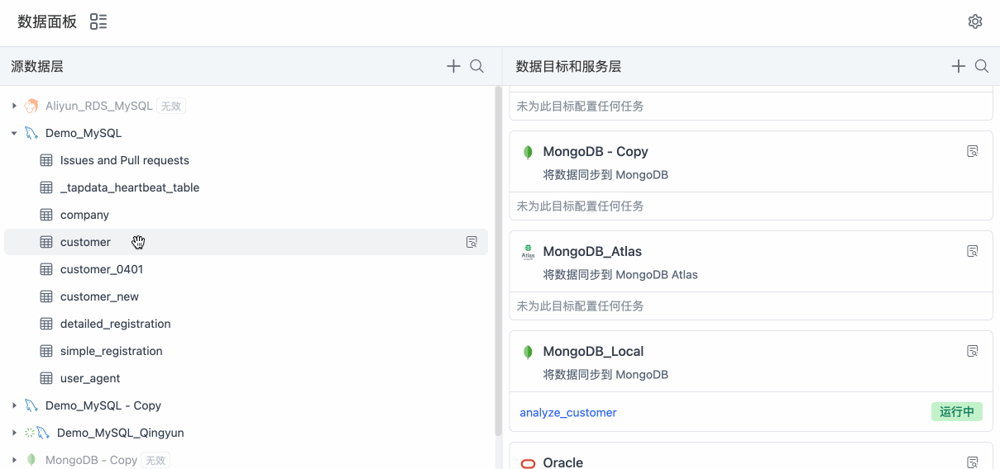

# 一键生成数据管道

在数据集成模式下，您只需要简单地拖动源表至目标库，即可一键生成数据管道，极大简化任务配置流程，实现源目数据的实时同步。本文介绍如何生成数据管道。

## 操作步骤

1. 登录 Tapdata 平台。

2. 在左侧导航栏，单击**数据面板**。

3. 在本页面，您可以直观地看到您已录入的数据源信息，Tapdata 将其以源和目标的形式分为左右两列。

   

4. （可选）单击🔍图标，找到您需要同步的源表，将其拖动至右侧目标数据源。

5. 在弹出的对话框中，填写具有业务意义的任务名称并单击确定。

   Tapdata 将自动创建一个数据管道，将您的源表实时同步到选定的目标库中，在本案例中，会将 **company** 表 从MySQL 实时同步至 MongoDB 中。

   

6. 在页面右侧，单击目标库卡片中生成的任务名称，进入任务配置页面。

   

7. 在跳转到的任务配置页面，您可以直接单击右上角的**启动**，也可以基于业务需求加入相关处理节点以实现自定义 ETL 流程，具体操作，见[创建数据开发任务](../../data-pipeline/data-development/create-task.md)。

   

   

   

   
