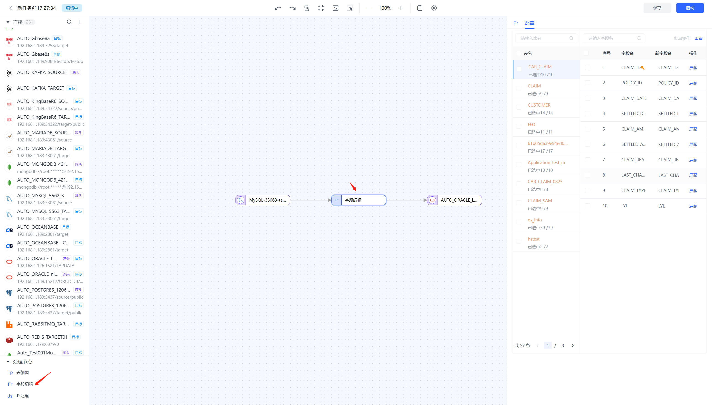

# 创建数据复制任务

Tapdata 的数据复制功能可实现据数据的全量/增量同步，您可以跟随本文的步骤创建数据复制任务。

## 操作步骤

1. 登录 Tapdata 平台。

2. 在左侧导航栏，选择**数据管道** > **数据复制**。

3. 单击页面右上角的**创建**，跳转到任务配置页面。

4. 在左侧的连接列表中，选择选择一个作为源的表节点并拖拽至画布中。

   

5. 然后选择选择一个支持作为目标的表节点并拖拽至画布中。

6. 将源节点和目标节点连接起来。

   

7. 单击源节点，在右侧弹出的面板中配置源节点的属性。

   

   * **选择表**：从左侧批量勾选想要复制的表再点击中间的“向右”箭头，移动至“已选择表”中，也可以点击右上角“粘贴表名”按钮来批量粘贴或手动输入表名。
   * **批量读取条数**：全量每批次读取的条数。
   * **动态新增表**：开启后可自动将源库新增/删除的表同步到目标端，仅下方选择表配置为“全部”时生效。
   * **DDL事件采集**：开启后任务将会自动采集选中的源端DDL事件。

8. 单击目标节点，在右侧弹出的面板中配置目标节点的属性。

   

   * **推演结果**：展示经过之前节点的推演，Tapdata 会写到目标库中的表结构信息。
   * **重复处理策略**：即当同步的表名重复时执行的策略。
   * **数据写入策略**：即针对各种事件的处理策略。
   * **全量写入线程数**：设置全量写入的线程数量。默认为8，可以根据服务器的性能适当进行调整。
   * **增量写入线程数**：设置增量写入的线程数量。默认关闭，开启后默认为4。可以根据服务器的性能适当进行调整。

9. 单击上方任务设置按钮来配置任务属性。

   

   * **任务名称**：设置任务的名称，任务名称不能重复。
   * **同步类型**：选择你需要的同步任务类型，不同同步类型对应的任务设置项会有一定的区分，具体如下：
     * **全量+增量同步**：把源表原有数据全部同步到目标表，同时当源表的数据发生变化时，也会实时同步到目标表。
     * **全量同步**：只一次性把源表的原有数据全部同步到目标表。
     * **增量同步**：当源表数据发生变更时会同步到目标表。
   * **任务描述**：设置任务的描述信息，非必填，可以根据需要设置。
   * **计划开始时间**：开启后可以从设置指定的时间点开始任务，同时纯全量任务可以支持周期调动，通过设置cron表达式来实现任务的定期执行。
   * **共享挖掘**：若有多个任务需要从源库读取数据时为降低源库压力，开启后我们会将增量日志存储至中间MongoDB库中供不同的任务使用。
   * **数据校验**：开启后会对任务中所有表的数据进行校验，不一致会在任务监控可观测性中展示。
   * **增量滞后判断时间设置**：开启后可设置滞后时间，超过该时间才会被判定为增量滞后。
   * **增量数据处理模式**：默认为逐条，支持逐条和批量。仅任务类型包含增量时支持该设置。
   * **增量批次读取条数**：用户根据需要设置，仅任务类型包含增量时支持该设置。
   * **agent设置**：用户可以根据需要平台自动分配或自己手动设置。需要注意的是，任务调度时本身有高可用保障，当一个Agent挂掉后，这个Agent上运行的任务会被重新调度到其它可用Agent上继续运行。但当用户手动指定来Agent时，如果指定的Agent挂掉，任务不会重新调度，需要用户进行干预。

10. 单击**保存**或**启动**完成创建。


## 复制任务支持的处理节点

### 表编辑节点

如果需要对表名进行修改可以使用表编辑节点。

首先从左下角拖拽一个表编辑节点至画布中


点击表编辑节点可以对表名进行设置

可以直接在右侧新表名列表对单个表名进行修改

也可以在下方通过批量操作对所有搜索展示出来的原表名进行修改（修改后需点击应用按钮才会生效）


### 字段编辑节点

如果需要对字段进行修改可以使用字段编辑节点。

首先从左下角拖拽一个字段编辑节点至画布中



进行连线后点击字段编辑节点，可进行字段的屏蔽及批量添加前缀后缀或大小写操作。


### JS 节点

如果需要通过JS脚本对源端进行修改可以使用JS节点。

首先从左下角拖拽一个JS节点至画布中


脚本写完后可节点下方试运行按钮查看输入输出以便进行调试


#### 复制任务JS节点的模型声明

针对JS节点，Tapdata会通过采样数据试运行的方式来推演节点的模型信息。如果发现推演出的模型不准确，丢失或者多了某些字段，可以通过模型声明显式的来定义模型里的字段信息。


在复制任务中，模型声明支持的方法如下所示

```javascript
// 增加一个字段，如果字段已存在则不操作
TapModelDeclare.addField(schemaApplyResultList, 'fieldName', 'TapString')
// 移除一个已存在字段
TapModelDeclare.removeField(schemaApplyResultList, 'fieldName')
// 更新一个已存在的字段
TapModelDeclare.updateField(schemaApplyResultList, 'fieldName', 'TapString')
// 更新字段，如果不存在则新增
TapModelDeclare.upsertField(schemaApplyResultList, 'fieldName', 'TapString')
// 设置字段为主键
TapModelDeclare.setPk(schemaApplyResultList, 'fieldName')
// 取消主键
TapModelDeclare.unsetPk(schemaApplyResultList, 'fieldName')
// 增加索引
TapModelDeclare.addIndex(schemaApplyResultList, 'indexName', [{'filedName':'fieldName1', 'order': 'asc'}])
// 移除索引
TapModelDeclare.removeIndex(schemaApplyResultList, 'indexName')
```

参数说明：

- `schemaApplyResultList`：复制任务时的固定参数
- `fieldName`：要新增或者操作的字段名
- `indexName`：要新增或者操作的索引名
- `TapType`：要新增的字段类型或者要将已有字段的类型修改为的目标类型。目前仅支持使用Tapdata内置的`TapType`。目前支持的`TapType`包括

- -  `TapBoolean`：布尔类型，使用boolean来存储布尔值
  - `TapDate`：日期类型，使用自定义的DateTime存储日期值
  - `TapArray`：数组类型，使用Array存储Array值
  - `TapNumber`：数值类型，使用java 的Double存储数字值
  - `TapBinary`：二进制类型，使用byte[]存储字节数组
  - `TapTime`：时间类型，使用DateTime存储时间值
  - `TapMap`：Map类型，使用Map存储Map值
  - `TapString`：字符串类型，使用java的String存储字符串
  - `TapDateTime`：日期时间类型，使用自定义的DateTime存储日期和时间值
  - `TapYear`：年份，使用DateTime存储时间值


