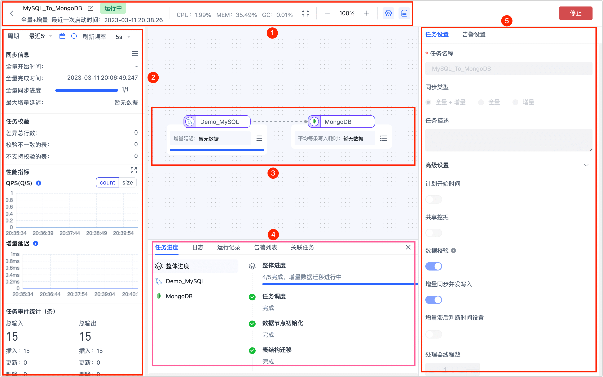
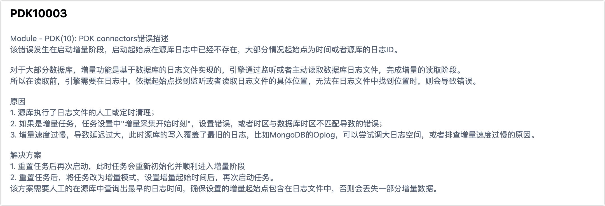

# 监控数据复制任务

数据复制任务启动后，页面将自动跳转至任务监控页面，通过该页面可观察任务运行细节，包括 Agent 状态、数据同步状态、任务进度、告警设置等信息。

:::tip

您也可以在任务列表页面，单击对应任务的**监控**来进入监控页面。

:::

## ① 顶部控制栏

可重命名任务名称，查看任务启动时间和 Agent 状态，其中 Agent 状态包括：

* CPU 使用率：引擎进程使用的CPU占系统总CPU的占比
* 内存使用率：已使用堆的内存数/堆内存最大值
* GC 吞吐量：（引擎累计运行时间-GC的耗时）/引擎累计运行时间*100%

## ② 任务关键指标展示栏

展示任务的基本信息和关键监控指标，包含同步信息、任务校验信息、性能指标和任务时间统计信息，其中：

* 任务校验：仅当任务开启了校验才会展示，如发现有异常可单击查看校验详情。
* QPS：任务平均每秒处理的输入事件数和输出事件数，支持基于事件数量或大小的维度来查看
* 增量延迟：事件从源库生成到经任务处理完成写入目标的延迟时间，当有多个目标时只统计最大的增量延迟时间，单位为毫秒。
* 任务统计事件：统计任务运行后所有的累计事件，统计注意事项如下：
  * 更新：如果输出到目标的插入事件在插入目标库时发现已存在，然后写入策略又设置了当目标存在时更新，则插入事件会变为更新事件。
  * DDL
    * 由于 Tapdata 根据推演结果直接在目标建表，所以在源端并不会统计到 DDL 事件的输出，但在目标节点可以统计到建表的 DDL 事件。
    * 如果目标是无需建表的数据库类型（如 MongoDB），则不会统计到目标的建表事件。
    - 如果目标的重复处理策略选择了清除目标结构和数据，则会统计到 DROP TABLE 和 CREATE TABLE 两次 DDL 事件

## ③ 节点信息展示区

将鼠标指针悬浮至节点，可展示对应节点的关键指标信息，单击节点右下角的图标可查看更多细节。

- 全量进度：全量时展示即该节点的全量进度。
- 增量时间点：增量时展示采集增量日志的时间点。此处以（当前引擎的时间-该节点的增量时间点） 的相对时间来表达，具体的增量时间点信息，鼠标移入时会在浮窗里展示。
- 写入耗时：数据写到目标端的耗时。
- QPS：即该节点的 QPS。
- 累计输入事件：即从上一个节点或源库输入到该节点的事件数。
- 累计输出事件：即从该节点输出到下一个节点或目标库的事件数。
- 处理耗时：该节点处理数据的耗时。

## ④ 任务日志展示区

单击页面顶部的图标，可展示任务日志展示区，在该区域，您可以查看任务运行的进度、日志、运行记录、告警列表和关联任务信息。而在**日志**标签中，您可以根据关键词、周期、等级来过滤日志，也可以下载日志在本地分析。

此外，针对常见问题，Tapdata 还支持显示相关错误码。

单击该错误码，可在弹出的对话框中详细了解详细的原因及解决方案，更多信息，见[任务错误码及解决方案](../../../troubleshooting/error-code.md)。

## ⑤ 任务/告警设置区

单击页面顶部的图标，可展示任务设置（不可修改)和告警设置，您可以设置告警规则：

* 任务运行出错告警
* 任务全量完成通知
* 任务增量开始通知
* 任务停止告知
* 任务增量延迟告警

