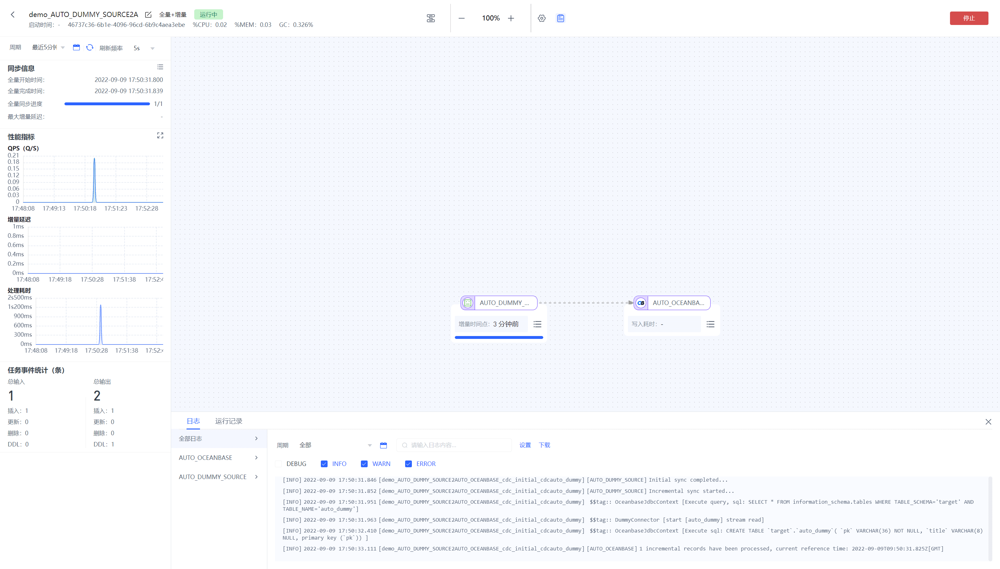
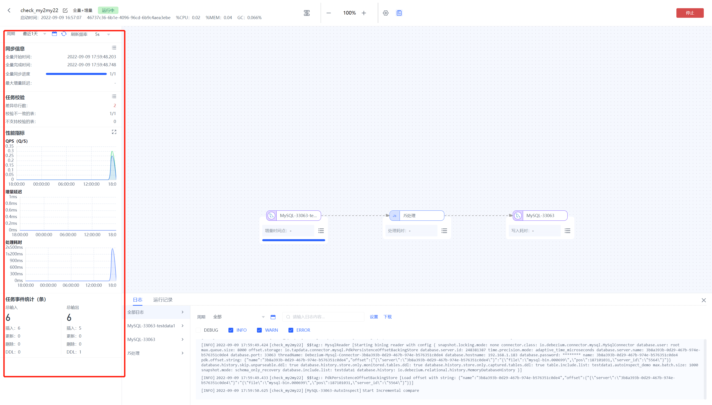

# 监控数据复制任务

点击任务列表对应任务的【运行监控】按钮，可以查看任务的运行监控可观测性页面

任务可观测性界面分几大部分：顶部任务操作区、左侧任务信息展示区、中间节点信息展示区、下方任务日志区、右侧设置展示区

## 顶部区域

该区域用来进行任务的改名、启停、查看信息等操作

左侧：

任务名称：可点击进行修改

启动时间：该任务启动时间

agent信息展示，包括：

- 引擎名称
- 引擎的CPU使用率：引擎进程使用的CPU占系统总CPU的占比
- 引擎的内存使用率：已使用堆的内存数/堆内存最大值
- 引擎的GC吞吐量：（引擎累计运行时间-GC的耗时）/引擎累计运行时间*100%

右侧：

任务日志按钮：点击后可在下方展开任务的日志信息

任务设置按钮：点击后可在右侧展开任务的设置信息

停止\启动按钮：点击后可以启动或停止该任务

## 左侧任务信息展示区

该区域用来展示任务的一些基本信息及监控指标信息

### 周期选择

可选择任务统计信息展示的时间周期，整个运行监控面板的指标数据会跟着所选周期进行过滤

### 同步信息

全量开始时间：该任务全量开始的时间

全量完成时间：该任务全量完成的时间

全量同步进度：该任务的全量同步进度

最大增量延迟：该任务的最大增量延迟时间

### 任务校验

若开启数据校验功能则展示校验信息

差异总行数：校验总的差异数据量

校验不一致的表：统计进行校验中不一致的表

不支持校验的表：统计不支持校验的表

校验信息：

点击右上角校验按钮打开校验信息

点击有问题的校验数据打开校验详情

左侧为校验列表：

可搜索表名并对选择的表进行重新校验

点击一行校验数据后右侧展示该校验的详细信息及结果

支持导出校验结果

默认展示差异字段可选择展示全部字段

### 性能指标

可点击右上角的放大按钮弹窗查看大图

QPS：显示当前任务的QPS曲线

增量延迟：任务进入经理后的延迟，单位ms

处理耗时：数据经过处理的耗时

### 任务事件统计

默认展示为从任务运行后所有的累计事件信息（包括插入、更新、删除、DDL）

总输入：任务从源端输入的事件总数

- 插入：源端的全量数据和新增的增量数据会被标记为插入事件。
- 更新：源端的数据修改会被标记为更新事件
- 删除：源端的数据删除会被标记为删除事件
- DDL：源端的DDL操作会被标记为DDL事件。

因为在目标建表时是根据推演出的结果直接在目标建表，所以在源端并不会统计到DDL事件的输出，但在目标节点可以统计到建表的DDL事件

总输出：任务输出到目标端的事件总数

- 插入：任务输出到目标端的插入事件数量
- 更新：任务输出到目标端的更新事件。需要注意如果输出到目标的插入事件在插入目标库时发现已存在，然后写入策略又设置了当目标存在时更新，则插入事件会变为更新事件。
- 删除：任务输出到目标端的删除事件。
- DDL：任务输出到目标端的DDL事件。关于目标端的DDL统计有几点需要注意：

- - 如果目标是无需建表的数据库类型，比如MongoDB，则在DDL事件统计时不会统计到目标的建表事件
  - 如果目标的重复处理策略选择了清除目标结构和数据，则在目标的DDL事件统计里会统计到drop table和create table两次DDL事件

### 中间节点信息展示区

该区域用来展示节点的指标信息

全量进度：全量时展示即该节点的全量进度

增量时间点：增量时展示采集增量日志的时间点。此处以（当前引擎的时间-该节点的增量时间点） 的相对时间来表达，具体的增量时间点信息，鼠标移入时会在浮窗里展示。

写入耗时：数据写到目标端的耗时

QPS：即该节点的QPS

累计输入事件：即从上一个节点或源库输入到该节点的事件数

累计输出事件：即从该节点输出到下一个节点或目标库的事件数

处理耗时：该节点处理数据的耗时

可以点击右下角详情同步弹窗打开节点详情页

可选择不同节点进行展示

### 下方任务日志区

该区域用来展示任务运行的日志及其他信息

#### 日志

默认展示全部日志，可以按不同节点进行选择。

右侧支持的功能有

搜索日志关键词

按周期展示日志

下载日志

按日志级别进行过滤。

#### 运行记录

记录该任务所有的历史运行记录（当任务重置有才算新的记录，正常的启停算一条运行记录）

可点击查看按钮打开新局面查看历史运行记录的详细信息

### 右侧设置展示区

该区域主要用来展示节点或任务级节点的配置

点击设置按钮可查看任务设置界面

**节点设置：**

点击节点打开相应节点设置

