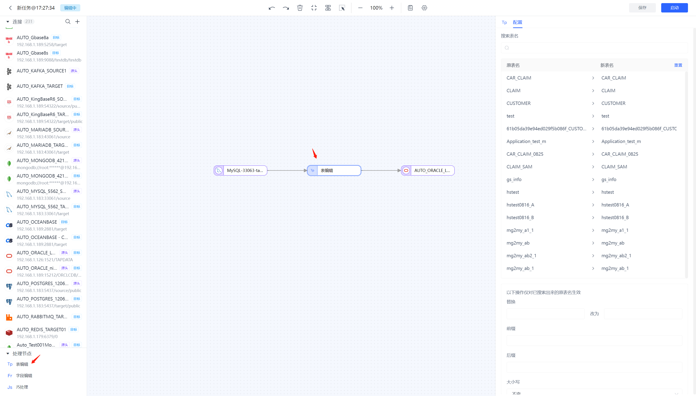
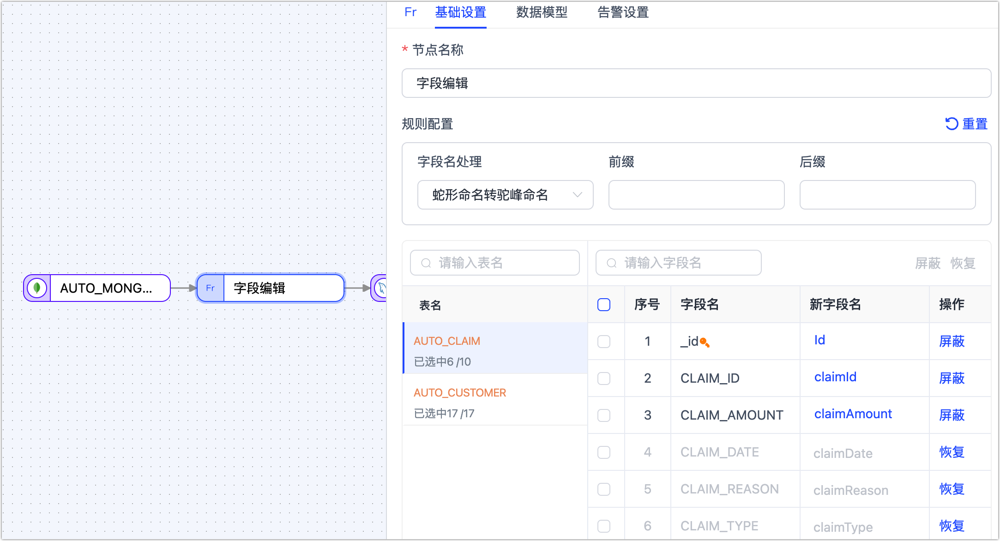
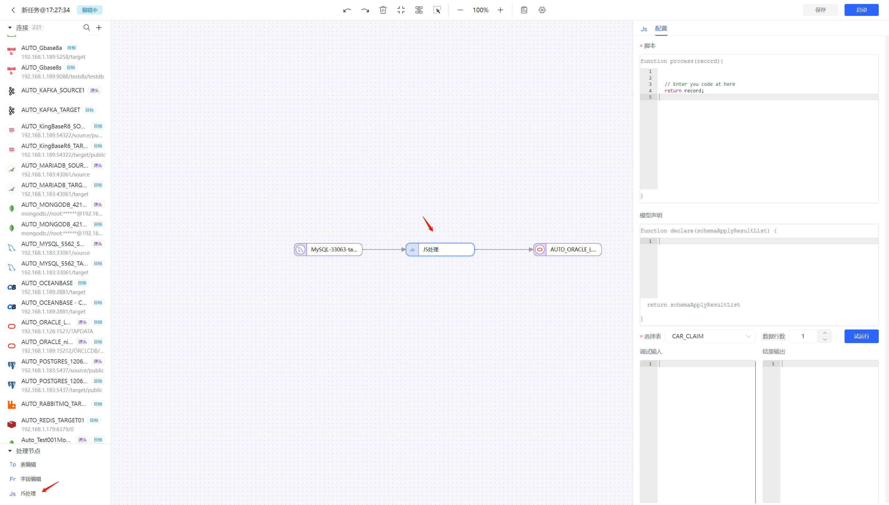
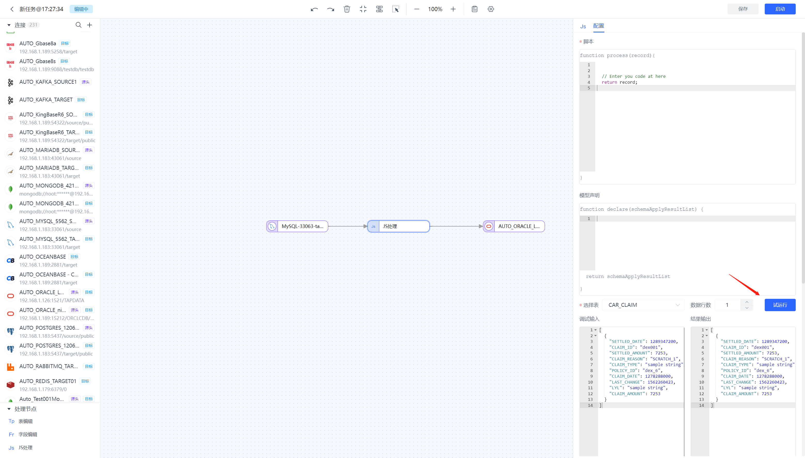

# 为复制任务添加处理节点

Tapdata 支持在数据复制任务中添加处理节点，满足对数据进行过滤、字段调整等需求。

## 表编辑节点

表编辑节点主要用来对表的名称进行调整，将**表编辑**节点添加到画布并与数据源连接起来，单击该节点并选择要执行的操作（应用至所有表）：

* 表名替换
* 表名大小写调整
* 表名增加前缀/后缀

除此以外，您也可以直接为单个目标表填写新表名。




## <span id="column-modification">字段编辑节点</span>

字段编辑节点主要用来对表字段做改名或转大小写操作，将**字段编辑**节点添加到画布并与数据源连接起来，单击该节点并选择字段名的统一处理方式（应用至所有表），您也可以直接单击目标字段名手动调整单个字段：

* 转大写：例如从  `claim_id` 转换为`CLAIM_ID`
* 转小写：例如从 `CLAIM_ID` 转换为 `claim_id`
* 蛇形命名转驼峰命名：例如从 `CLAIM_ID` 转换为 `claimId`
* 驼峰命名转蛇形命名：例如从 `claimId` 转换为  `CLAIM_ID` 

此外，您还可以选中目标字段单击**屏蔽**，被屏蔽的字段将不会传递至下个节点。




## JS 节点

支持通过 JavaScript 脚本或者 Java 代码对数据进行处理，编写代码时需先检测是否与源节点及目标节点相连，若未相连则无法编辑代码。  



脚本写完后可节点下方试运行按钮查看输入输出以便进行调试



### JS 节点的模型声明

针对JS节点，Tapdata会通过采样数据试运行的方式来推演节点的模型信息。如果发现推演出的模型不准确，丢失或者多了某些字段，可以通过模型声明显式的来定义模型里的字段信息。


在复制任务中，模型声明支持的方法如下所示

```javascript
// 增加一个字段，如果字段已存在则不操作
TapModelDeclare.addField(schemaApplyResultList, 'fieldName', 'TapString')
// 移除一个已存在字段
TapModelDeclare.removeField(schemaApplyResultList, 'fieldName')
// 更新一个已存在的字段
TapModelDeclare.updateField(schemaApplyResultList, 'fieldName', 'TapString')
// 更新字段，如果不存在则新增
TapModelDeclare.upsertField(schemaApplyResultList, 'fieldName', 'TapString')
// 设置字段为主键
TapModelDeclare.setPk(schemaApplyResultList, 'fieldName')
// 取消主键
TapModelDeclare.unsetPk(schemaApplyResultList, 'fieldName')
// 增加索引
TapModelDeclare.addIndex(schemaApplyResultList, 'indexName', [{'filedName':'fieldName1', 'order': 'asc'}])
// 移除索引
TapModelDeclare.removeIndex(schemaApplyResultList, 'indexName')
```

参数说明：

- `schemaApplyResultList`：复制任务时的固定参数
- `fieldName`：要新增或者操作的字段名
- `indexName`：要新增或者操作的索引名
- `TapType`：要新增的字段类型或者要将已有字段的类型修改为的目标类型。目前仅支持使用Tapdata内置的`TapType`。目前支持的`TapType`包括

- -  `TapBoolean`：布尔类型，使用boolean来存储布尔值
  -  `TapDate`：日期类型，使用自定义的DateTime存储日期值
  -  `TapArray`：数组类型，使用Array存储Array值
  -  `TapNumber`：数值类型，使用java 的Double存储数字值
  -  `TapBinary`：二进制类型，使用byte[]存储字节数组
  -  `TapTime`：时间类型，使用DateTime存储时间值
  -  `TapMap`：Map类型，使用Map存储Map值
  -  `TapString`：字符串类型，使用java的String存储字符串
  -  `TapDateTime`：日期时间类型，使用自定义的DateTime存储日期和时间值
  -  `TapYear`：年份，使用DateTime存储时间值

### JS 内置函数说明

* [标准 JS 内置函数](../../../appendix/standard-js.md)：可对数据记录进行处理与运算，如将日期字符串转换为 Date 类型。
* [增强 JS 内置函数（Beta）](../../../appendix/enhanced-js.md)：支持标准 JS 内置函数的基础上，可实现外部调用（如网络、数据库等）。


## <span id="time-calculation">时间运算</span>

某些场景下，数据处理的源库和目标库的时区不同，此时对日期/时间类型的字段进行运算处理，例如增加几个小时或减少几个小时从而实现时间调整，方便后续业务处理。此场景下，可以通过时间运算节点完成该需求。

**场景示例**：

本案例中，源数据库的时区为 UTC +8，目标库的时区为 UTC +0，时间相差 8 小时。

**操作流程**：

1. 登录 Tapdata 平台。

2. 在左侧导航栏，选择**数据管道** > **数据复制**。

3. 单击页面右侧的**创建**。

4. 在页面左侧依次拖入源库和目标库的数据源，然后在页面左侧拖入时间运算节点并将它们依次连接起来。

5. 单击源节点，完成节点配置和表的选择。

6. 单击**时间运算**节点，在右侧的面板中选择要运算的时间类型和运算方式。

   

   * **节点名称**：默认为连接名称，您也可以设置一个具有业务意义的名称。
   * **请选择您要运算的时间类型**：Tapdata 会自动检测支持的时间类型并展现，您需要基于业务需求选择，此外，您还可以单击**模型**标签页，查看时间类型与列名的对应关系。
   * **请选择运算方式**：支持增加或减少时间，颗粒度为整数的小时，本案例中，我们选择减少 8 小时。

7. 完成目标节点配置及任务配置，具体操作，见[创建数据复制任务](create-task.md)。


**结果验证**：

分别查询源和目标表中同一 id 的数据，可以看到时间已经按照我们的设置减少了 8 个小时。

```sql
-- 源表查询结果
SELECT birthdate FROM customer_new WHERE id="00027f47eef64717aa8ffb8115f1e66a";
+-------------------------+
| birthdate               |
+-------------------------+
| 2021-09-01 09:10:00.000 |
+-------------------------+
1 row in set (0.00 sec)

-- 目标表查询结果
SELECT birthdate FROM customer_new_time WHERE id="00027f47eef64717aa8ffb8115f1e66a";
+-------------------------+
| birthdate               |
+-------------------------+
| 2021-09-01 01:10:00.000 |
+-------------------------+
```


## 类型过滤

在异构数据源间的数据同步场景下，某些数据类型在目标库中不支持，同时它也不具备业务用途，此时，我们可以通过**类型过滤**节点将不需要的同类型列快速过滤，被过滤的字段将不会传递至下个节点。

具体操作：将**类型过滤**节点添加到画布并与数据源连接起来，单击该节点并选择要过滤的字段类型（暂不支持指定精度）：


:::tip

暂不支持指定字段类型的精度，例如要过滤的字段类型为 **varchar**，那么 **varchar(16)**、**varchar(12)** 等均会被过滤。

:::
