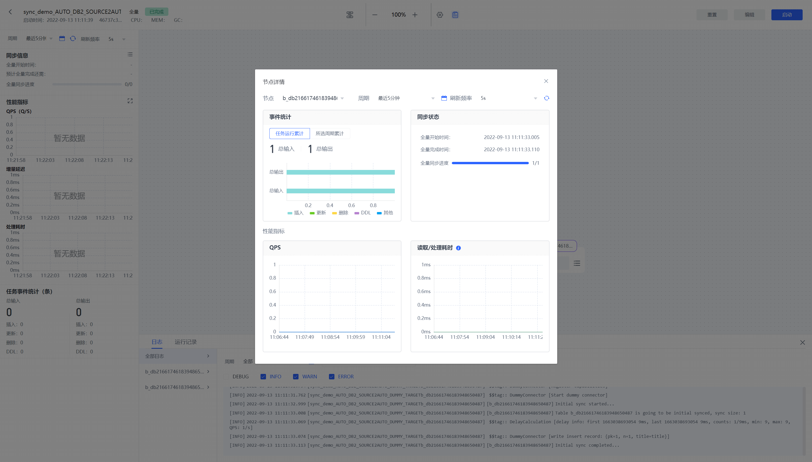
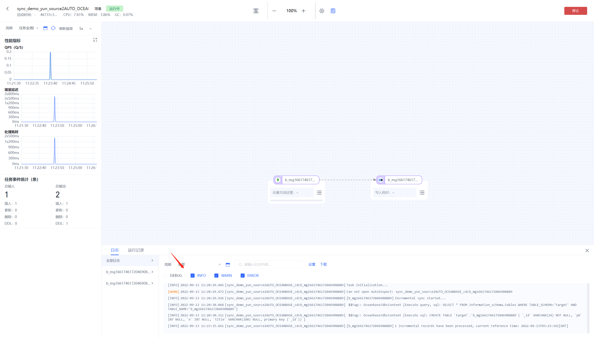
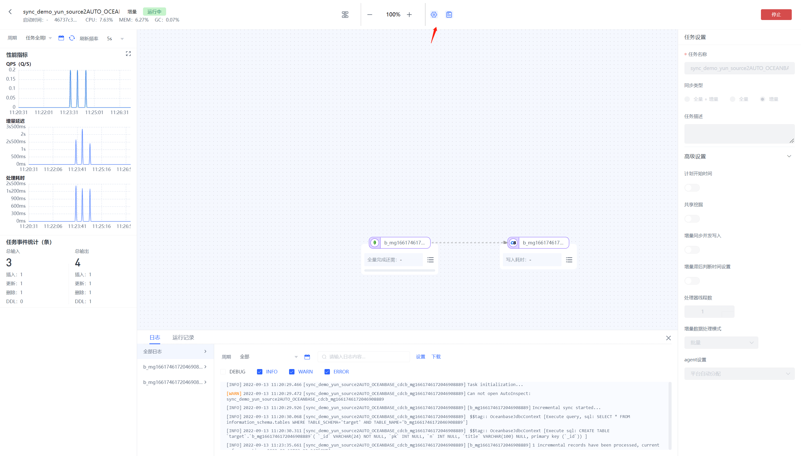
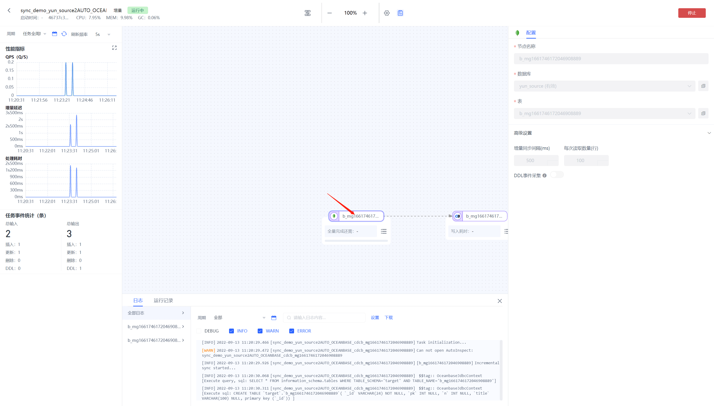

# 监控数据开发任务

点击任务列表对应任务的【运行监控】按钮，可以查看任务的运行监控可观测性页面。

任务可观测性界面分几大部分：顶部任务操作区、左侧任务信息展示区、中间节点信息展示区、下方任务日志区、右侧设置展示区

## 顶部任务操作区

该区域用来进行任务的改名、启停、查看信息等操作

左侧：

任务名称：可点击进行修改

启动时间：该任务启动时间

agent引擎名称

CPU、内存、GC等性能占用信息

右侧：

任务日志按钮：点击后可在下方展开任务的日志信息

任务设置按钮：点击后可在右侧展开任务的设置信息

停止\启动按钮：点击后可以启动或停止该任务

## 左侧任务信息展示区

该区域用来展示任务的一些基本信息及监控指标信息

周期：可选择任务统计信息展示的时间周期

### 同步信息

全量开始时间：该任务全量开始的时间

全量完成时间：该任务全量完成的时间

全量同步进度：该任务的全量同步进度

最大增量延迟：该任务的最大增量延迟时间

### 性能指标

可点击右上角的放大按钮弹窗查看大图

QPS：显示当前任务的QPS曲线

增量延迟：任务进入经理后的延迟，单位ms

处理耗时：数据经过处理的耗时

### 任务事件统计

默认展示为从任务运行后所有的累计信息（包括插入、更新、删除、DDL）

总输入：任务从源端输入的事件总数

总输出：任务输出到目标端的事件总数

### 中间节点信息展示区

该区域用来展示节点的指标信息

全量进度：全量时展示即该节点的全量进度

增量时间点：增量时展示采集增量日志的时间点

写入耗时：数据写到目标端的耗时

QPS：即该节点的QPS

累计输入事件：即从上一个节点或源库输入到该节点的事件数

累计输出事件：即从该节点输出到下一个节点或目标库的事件数

处理耗时：该节点处理数据的耗时

可以点击右下角详情同步弹窗打开节点详情页

可选择不同节点进行展示

### 下方任务日志区

该区域用来展示任务运行的日志及其他信息

#### 日志

默认展示全部日志，可以按不同节点进行选择。

右侧支持的功能有

搜索日志关键词

按周期展示日志

下载日志

按日志级别进行过滤。

#### 运行记录

记录该任务所有的历史运行记录（当任务重置有才算新的记录，正常的启停算一条运行记录）

可点击查看按钮打开新局面查看历史运行记录的详细信息

## 右侧设置展示区

该区域主要用来展示节点或任务级节点的配置

点击设置按钮可查看任务设置界面

### 节点设置

点击节点打开相应节点设置

