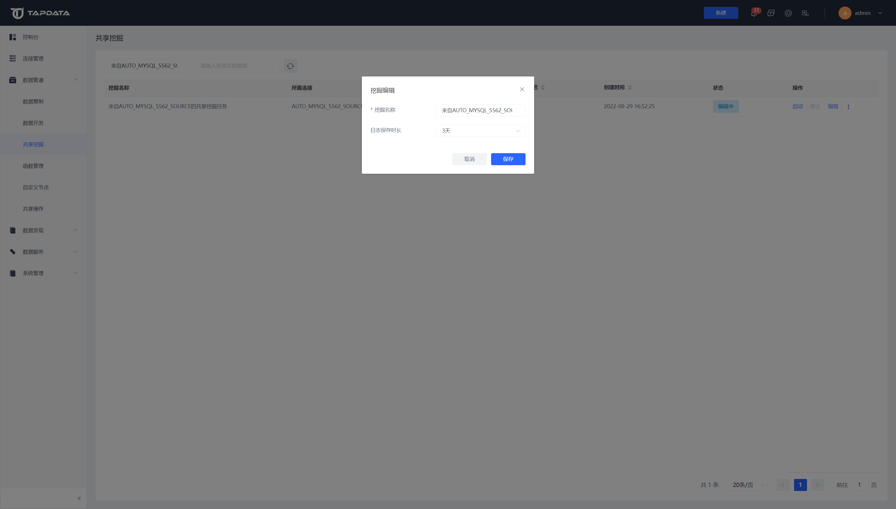

# 开启共享挖掘

为减轻增量时源端数据库压力，Tapdata 支持对增量日志进行共享挖掘，挖掘功能开启后并不会马上开始挖掘，而是在用户创建该数据源下所属表的任务时开启挖掘，无论挖掘任务暂停或者错误均不会影响同步任务正常运行。

## 开启共享挖掘

可在创建连接时开启共享挖掘，开启后从共享源读取数据，关闭后从源库读取数据。

若为首次开启并且未在共享挖掘管理的【挖掘设置】中进行配置则需填写存储挖掘连接（可选择一个MongoDB作为存储库）

## 创建挖掘任务

打开【数据管道】中的复制（开发）任务，点击【创建任务】

当任务为包含增量的任务且数据源已经支持共享挖掘后即可使用共享挖掘功能了

## 管理共享挖掘

任务创建成功后系统会自动生成挖掘任务，您可在【数据管道】中的【共享挖掘】界面查看挖掘任务状态或详情，同时还可以编辑挖掘信息。

**挖掘设置**

点击**编辑**按钮后可进行挖掘设置，可修改挖掘名称及修改日志保存时长

**挖掘详情：**

单击 **⋮** > **详情**，可查看详细挖掘信息，如调用该挖掘任务的正常数据同步任务及相应的表。

## 应用场景

希望创建一个 MySQL 到 Oracle 的同步任务，但为了减轻源库压力所以想通过共享挖掘来实现。

**操作思路：**

先创建一个mongo DB作为存储挖掘日志的中间库，再将需要进行增量日志挖掘的连接开启共享挖掘并选择该mongo DB，最后在创建任务时开启共享挖掘即可

**具体流程：**

1. 创建一个数据库连接，用来存储共享挖掘的数据。

   1. 打开连接管理，点击右上角**创建连接**按钮。
   2. 创建一个 MongoDB 连接，配置信息如下：
      * 连接名称：可任意命名，例：lyl_mongo
      * 连接类型：源和目标
      * 连接方式：标准连接
      * 数据库地址：47.115.163.**
      * 数据库名称：test
      * 其他为非必填项
   3. 点击下方**保存**按钮，跳转至连接管理界面。

2. 点击右上角**创建连接**按钮，创建一个MySQL连接作为源，开启共享挖掘。

3. 选择刚才创建的 MongoDB 连接作为存储中间库（这一步也可在共享挖掘-挖掘设置中操作）二次设置不会再显示

   * 存储MongoDB连接名称：lyl_mongo
   * 存储MongoDB表名：david_mongo_share

4. 点击**保存**按钮。

5. 创建一个 Oracle 连接作为目标（不需要开启共享挖掘）。

6. 打开数据开发，点击右上角**创建**按钮创建一个开发任务。

   1. 选择刚刚创建的 MySQL 连接作为源，表选择：lyl_demo_mysql。
   2. 再选择一个连接作为目标，表选择或新建：lyl_demo_oracle_target，将他们连线。
   3. 在DAG画布中点击右上角**设置**按钮。
   4. 打开**共享挖掘**按钮，然后单击右上角**保存**按钮。

7. 点击左上角**返回**按钮，跳转至任务列表页。

8. 点击该任务的**启动**按钮，系统在启动任务的同时会自动生成一个共享挖掘任务。

   您可点击数据管道-共享挖掘查看该挖掘任务，也可点击该挖掘任务的**详情**按钮查看详细信息。

**演示：**

在源库新增一条数据

查看MongoDB中间库：（看是否有增量日志）

 python376 tap.py --source_type=MongoDB --name=lyl_mongo --table=david_mongo_share  common_query

在目标库查看是否有增量数据

