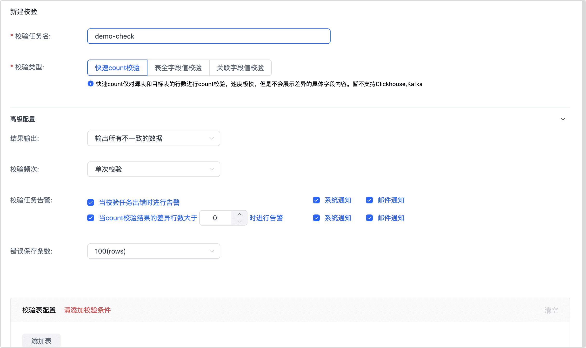

# 数据校验

基于多种自研技术，Tapdata 可最大程度保障数据一致性。除此以外，Tapdata 还支持对数据表执行数据校验，帮助您进一步验证和确保数据流转的正确性，满足生产环境的严苛要求。本文介绍数据校验任务的配置流程。

```mdx-code-block
import Tabs from '@theme/Tabs';
import TabItem from '@theme/TabItem';
```

## 操作步骤

1. 登录 Tapdata 平台。

2. 在左侧导航栏，选择**数据管道** > **数据校验**。

3. 在页面右上角，根据校验目标单击**任务一致性校验**或**任意表数据校验**，然后根据下述说明填写各项参数：


```mdx-code-block
<Tabs className="unique-tabs">
<TabItem value="任务一致性校验">
```


- **选择任务**：选择待校验的数据复制/数据转换任务。
- **校验任务名**：填写具有业务意义的任务名称。
- **校验类型**：目前支持下述三种校验方式。如在同步过程中修改了表的字段名，那么执行**表全字段值校验**或**关联字段值校验**时，可能因字段名不匹配而导致校验失败。
  - **快速 count 校验**：对源表和目标表的行数进行校验，不会展示具体的差异内容，速度极快。
  - **全表字段值校验**：对源表和目标表的全部字段的值逐行校验，可展示所有字段的差异内容，速度较慢。
  - **关联字段值校验**：仅对源表和目标表的关联字段的值进行校验，速度中等。
- **高级配置**：单击高级配置，展开更多配置项：
  - **结果输出**：选择**输出所有不一致的数据**或**只输出来源表不一致的数据**。
  - **校验任务告警**：选择当任务运行出错或校验结果不一致时，告警信息的规则配置和通知方式。
  - **校验频次**：默认为**单次校验**，如选择为**重复校验**，您还需要设置校验执行的起止时间和任务间隔时间。
  - **错误保存条数**：即不一致数据保存的最大条数，默认为 100，最大为 10000，推荐设置较大的值以确保记录的完整性。
  - **校验表配置**：默认由 Tapdata 自动加载数据复制/开发任务中的源/目标数据表。同时，您还可以打开**数据过滤**开关，从而只对特定条件的数据进行校验以减少校验规模（可通过 SQL 实现自定义查询和聚合查询过滤）。此外，您还可以通过高级校验添加 JS 校验逻辑。

</TabItem>

<TabItem value="任意表数据校验">




- **校验任务名**：填写具有业务意义的任务名称。
- **校验类型**：目前支持下述三种校验方式。
  - **快速 count 校验**：对源表和目标表的行数进行校验，不会展示具体的差异内容，速度极快。
  - **全表字段值校验**：对源表和目标表的全部字段的值逐行校验，可展示所有字段的差异内容，速度较慢。
  - **关联字段值校验**：仅对源表和目标表的关联字段的值进行校验，速度中等。
- **高级配置**：单击高级配置，展开更多配置项：
  - **结果输出**：选择**输出所有不一致的数据**或**只输出来源表不一致的数据**。
  - **校验任务告警**：选择当任务运行出错或校验结果不一致时，告警信息的规则配置和通知方式。
- **校验频次**：默认为**单次校验**，如选择为**重复校验**，您还需要设置校验执行的起止时间和任务间隔时间。
- **错误保存条数**：即不一致数据保存的最大条数，默认为 100，最大为 10000，推荐设置较大的值以确保记录的完整性。
- **校验表配置**：单击**添加表**，手动指定待校验的校验源/目标数据连接、待校验的表、索引字段、待校验模型，同时，您还可以打开**数据过滤**开关，从而只对特定条件的数据进行校验以减少校验规模（可通过 SQL 实现自定义查询和聚合查询过滤）。此外，您还可以通过高级校验添加 JS 校验逻辑。
  如需校验多个表，可单击**添加表**继续添加校验条件。

</TabItem>
</Tabs>


4. 单击**保存**，返回至任务列表后单击目标校验任务对应的**执行**。

5. （可选）单击校验任务对应的**详情**，查看详细校验结果。

   

   :::tip

   当校验类型为**全表字段值校验**或**关联字段值校验**时，您还可以单击右上角的**差异校验**，对本次全量校验的差异数据结果进行再次校验，以确认数据是否已经一致。

   :::


## 常见问题

关于校验任务出现失败、校验数据不一致等排查方法，见[数据校验常见问题](../../faq/data-pipeline#check-data)。


