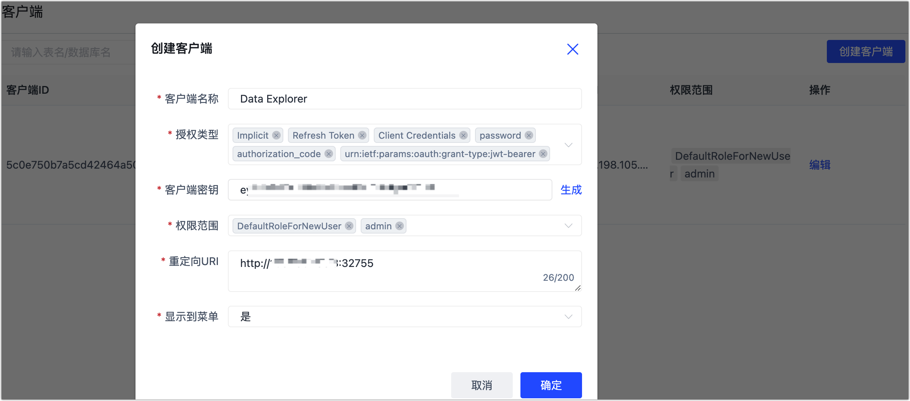

# 创建客户端

API客户端是用来管理和创建调用API，开发者设计开发的应用程序或者其他需要调用 API 接口的应用程序（统称客户端应用）在接入数据发布系统前需要先注册，注册完成后，得到一个专属客户端ID（client_id）和客户端密钥（client_secret）

## 操作步骤

1. 登录 Tapdata 平台。

2. 在左侧导航栏，选择**数据服务** > **客户端**。

3. 单击右上角的**创建客户端**，填写相应信息并单击**确定**。

   

   :::tip

   客户端密钥是客户端应用取得 API 访问授权的重要依据，应妥善保存，避免公共网络环境传输。

   :::

