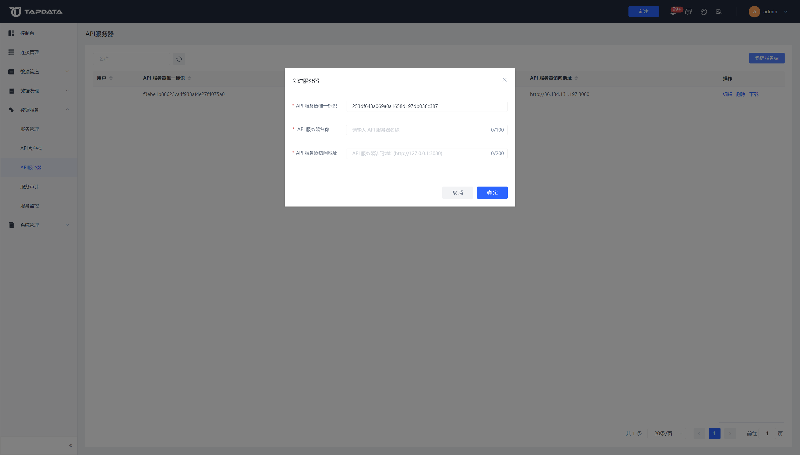

# 创建服务器

API 服务器可以配置对外暴露的API服务器地址，也可以增加多个服务器。

## 操作步骤

1. 登录 Tapdata 平台。

2. 在左侧导航栏，选择**数据服务** > **服务器**。

3. 单击页面右侧的**新建服务端**。

4. 在弹出的对话框中，填写服务器名称和访问地址，然后单击**确定**。

   

   :::tip

   Tapdata 默认包含一个 API 服务器，其地址和端口信息可从 Tapdata 安装目录下的 `application.yml` 文件中获取，请确保连接信息一致以免无法使用该功能。

   :::

