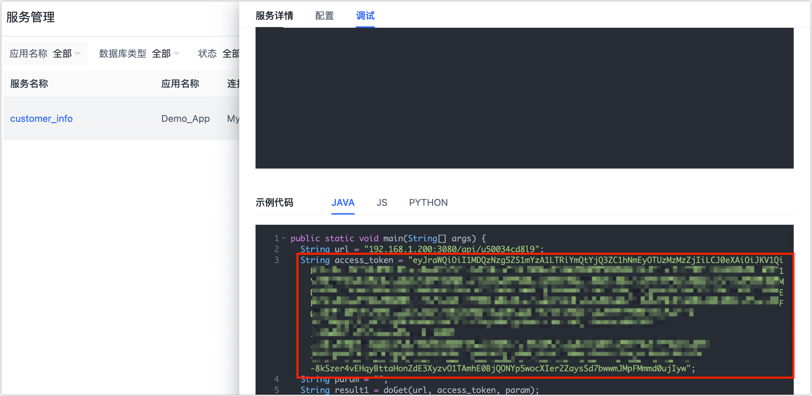
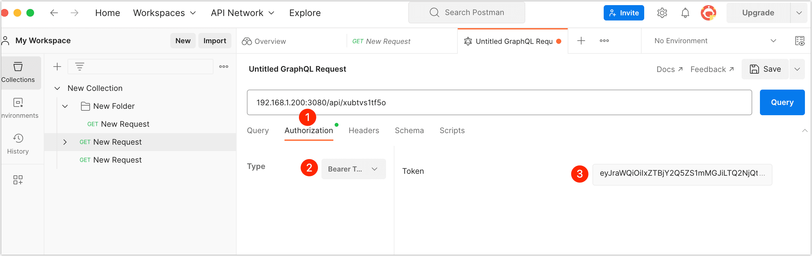

# 通过 RESTful 查询 API

RESTful API 是遵循 REST 架构规范的应用编程接口（API 或 Web API），Tapdata 支持集成了 RESTful API 服务，您可以通过 API 服务地址来执行请求，获取经治理后的数据信息。

本文我们将介绍如何借助 Postman 工具来调用 API 请求。

## 操作步骤

1. 登录 Tapdata 平台。

2. 在左侧导航栏，选择**数据服务** > **服务管理**。

3. 获取服务访问地址和 Access Token 认证信息。

   1. 找到并单击目标服务名称。

   2. 在右侧面板中，下翻至服务访问区域，获取服务访问的地址，本案例中，我们以 **GET** 类型的服务为例演示操作流程。

      

   3. 单击**调试**标签页，下翻至**示例代码**，获取 Access Token 认证信息。

      

4. 打开 [Postman 工具](https://www.postman.com/)，然后在软件页面的顶部单击 **Workspaces** 并选择您的 Workspace。

5. 单击 **New**，然后在弹出的对话框中选择 **HTTP Request**。

   

6. 在 Request URL 文本框中，填写您在步骤 3 中获取到的 API 查询请求地址。

6. （可选）单击文本框下方的 **Query Params**，设置查询的请求参数，支持的请求参数介绍请参加步骤 3。

7. 单击文本框下方的 **Authorization**，选择 **Type** 为 **Bearer Token** 并填写您在步骤 3 中获取到的 Access Token 认证信息。

   

8. 单击 **Query**，返回示例如下。

   
   
   :::tip
   
   Tapdata 支持在 URL 查询字符串中添加查询条件，从而查询结果的快速过滤，具体操作，见 [API 查询参数说明](api-query-params.md)。
   
   :::
