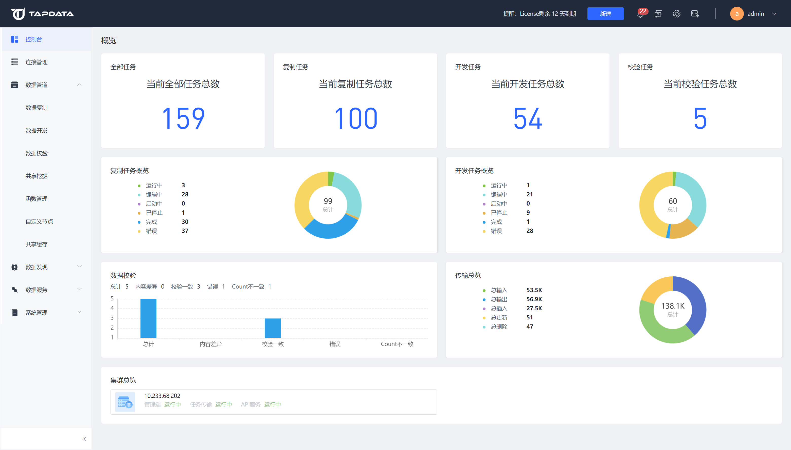

# 控制台介绍

登录 Tapdata 后默认会打开控制台页面，您可以在控制台页面看到当前系统所有任务的数量统计、状态统计和运行数据统计，并可以查看当前系统集群的运行状态。

控制台页面主要包含以下关键指标：

**全部任务**：展示当前用户全部任务总数量，包括数据复制任务、数据转换任务和数据校验任务。

**复制任务**：展示当前用户创建的数据复制任务的总数量

**转换任务**：展示当前用户创建的数据转换子任务的总数量

**校验任务**：展示当前用户创建的数据校验任务的总数量

**复制任务概览**：展示当前用户创建的所有数据复制任务的任务状态分布

**转换任务概览**：展示当前用户创建的数据转换任务的任务状态分布

**数据校验**：展示当前用户创建的所有数据校验任务的校验结果分布

**传输总览**：展示当前用户创建的所有数据复制任务和数据转换任务的事件传输统计

**集群总览**：展示系统集群下各节点服务的当前状态