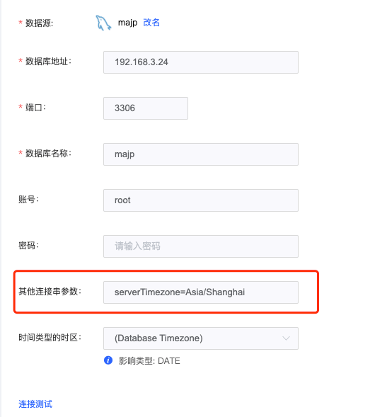
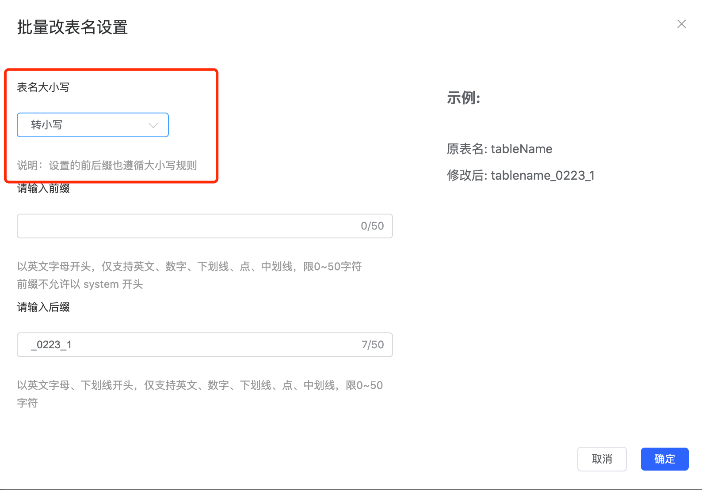
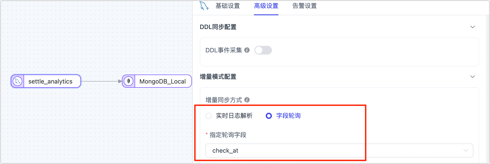

# 数据管道
import Content1 from '../reuse-content/_all-features.md';

<Content1 />

本文列出在构建数据管道时，可能遇到的问题及相关解决方案，包含数据复制任务、数据转换任务、数据校验等功能模块。

## 通用问题
### 数据复制和数据转换有什么区别？

数据复制主要用于整库或多表的数据同步，可满足数据库迁移上云、数据库升级、数据库备份等业务需求。

数据转换主要用于数据建模、数据 ETL、数据清理、数据合并（包括多表合并到单表）、宽表建设等业务场景，最大的不同点是数据开发的目标通常只能是单表。

### 是否支持跨区域、跨网络的数据同步？

支持。TapData Cloud 通过 Agent 来连接源和目标，仅通过开放有限的网络服务，即可实现同步需求。

### 是否支持源和目标为同一对象的数据同步？

支持。只需要同步操作的数据对象开放相应数据权限。


### 是否支持跨时区/字符集的数据同步？

支持。

### 是否支持分库分表的数据同步？

支持。TapData Cloud 可以从多源同时同步到同一目标表。


### 是否支持更改数据同步对象在目标库中的名称？

支持。


### 是否支持过滤部分字段或数据？

支持。

### 是否支持新增或移除同步对象？

支持。


## 任务管理

### 数据表的分类原则有哪些？

推荐的分类原则如下：

* 只有主键或者只有唯一索引的表：TapData Cloud 对此类表的能力支持比较完善，通常不会发生异常。
* 有主键且有唯一索引的表：此类表在一些极端情况下会出现目标表违反唯一索引的报错。
* 无主键和唯一索引的表：复制任务执行时会对此类表会进行全字段的同步匹配，对来源端大并发的增量同步场景执行速度会比较慢。
* 数据量超大的表：对于行数在千万以上表，建议使用单表配置任务，避免影响其他表的同步性能。


### 任务状态一直处于“启动中”，如何解决？

您可以联系我们[获取技术支持](../support.md)。

### 重置任务失败？

您需要在 TapData Cloud 的 Agent 页面中，检查任务对应 Agent 的健康状态。

### 任务显示错误，除了任务日志外还可以检查什么日志？

您还查看分析 Agent 的日志信息，路径为 Agent 安装目录下的 **logs/tapdata-agent.log**。

### 任务停止后，再次启动是否会丢失数据？

不会，TapData Cloud 通过 checkpoint 机制保证数据完整性。

### 任务连接测试和错误日志出现乱码？

通常是因为时区设置不正确，可更改时区后重试。


### 在创建任务时，待复制表列表为空？

加载 Schema 和创建连接是异步过程，因此可能出现加载不及时或者加载失败的情况，可以通过“连接管理->具体连接->加载schema”来手动更新。


### 部分表已经同步了数据，若重新全量同步，之前的数据会清空吗？

不会。

### 增加 DDL 时如何操作？

1. 在业务低峰期停止服务。
2. 校验源表，目标表数据是否完全一致；一致后，才能停止 CDC，否则会丢失数据；
3. 停止源 CDC。
4. 进行源表 DDL，重启 CDC。
5. 进行目标表 DDL。
6. 重新拉取连接 Schema。
7. 重启同步 Agent 服务。


### 任务无法删除？

当任务状态为调度中、运行中、停止中、强制停止中等中间状态时，是不能删除任务的，只有任务停下来后才能删除任务。


### 建计划任务时，无法搜索到表？

需要加载到源库的模型才可以创建任务。

编辑任务 -> 选择表 -> 加载模型。


### 任务的所属 agent 关联逻辑是什么？

目前是根据任务数做负载调度，以后会支持根据标签调度。


### 创建任务时，源地址的数据没有正确加载？

可以先检查实例所在机器是否可以访问数据库，如果仍然不能加载的话，可以联系在线客服支持协助解决。

### Oracle 同步到 MySQL，出现中文乱码怎么办？

在创建连接时可通过 jdbc 转换

`?useUnicode=true&characterEncoding=utf8 `或者 `?useUnicode=true&characterEncoding=gbk`


### PostgreSQL 作为目标时，如果事务失败后重试报错： ERROR : current transaction is aborted, commands ignored until end of transaction block

需要在配置 PostgreSQL 连接时，在连接串里增加如下参数即可解决：

```
autosave=always&cleanupSavePoints=ture
```


### 当测试 MySQL 连接时，提示：The server time zone value ' 'is unrecognized

出现该问题时，可以在您的 MySQL 连接的连接串里添加参数：**serverTimezone=Asia/Shanghai**。



### 连接测试失败怎么办？

连接测试的前提是要启动 agent ，请先检查 agent 状态。

创建数据连接时，需要参照页面右侧连接配置帮助，按指南完成相关参数的设定。


### kafka中的主题表达式什么意思

主题表达式是用来匹配消息队列名称的正则表达式，用户可以根据需求定义一个正则表达式来匹配订阅一个或者多个消息队列消费消息。


### Oracle 同步到 SQL Server，Select 权限是否足够？

Oracle 需要一些额外的权限来做 CDC，具体配置与授权，见 [Oracle 准备工作](../prerequisites/on-prem-databases/oracle.md)。


### 任务运行中能更改吗，例如增加同步的表？

可以重新编辑任务，不过要增加表的话，可能会影响原有的同步任务，需要去重置原有任务进度。如果要增加表不影响原有的，建议还是新建一个任务。


### 实时复制主表数据，从表数据也在增加，会有冲突吗？

TapData Cloud 会做 upsert 操作，如果目标已有数据，会识别出来，并按照源端更新，如果从表数据完全是新的，则不会影响。


### 开启增量并发的选项 为什么会和无主键同步冲突呢？

增量并发按照主键来将数据分组处理，无主键的情况下，这个分组处理的能力就失效了，所以做成了互斥 。


### 建表成功了，为什么任务运行时还报目标表不存在？

对于有些库做目标时，如果目标库设置了不区分表名大小写。当源表是大写表名时，同步到目标库会被强制转换为小写表名。此时任务通过源表的大写表名去目标库匹配时就会报找不到目标表的错误。

此时您可以通过任务设置过程中的字段映射设置里，将表名强制转换为与目标库表名大小写一致，即可正常同步。




## 数据复制任务

### 配置复制任务前需要检查源端数据库吗？

建议在任务配置前对源端数据库情况做如下了解，预估数据复制的规模：

- 源库有多少张表
- 最大的表有多少行，占用空间多少，大致推算出每条记录是多少 KB
- 这些表的主键（primary key），或者唯一索引（unique key）的情况
- 日常情况下这些表的增量事件，比如大约每天的增删改事件有多少

### 执行数据复制时，是否推荐将所有表放在一个任务中执行？

不推荐。我们建议对数据表进行分类，同类数据表用一个独立任务来处理，避免某类表的问题导致整个任务中断。

### 如何同步源库新增的表？

默认情况下，在配置数据同步任务时，可选择当前源库已有的表，如需在任务运行过程中自动识别源库新增的表并实时同步，您可以在配置数据同步任务阶段，通过正则表达式的方式来选择表，符合该表达式的表会被自动识别并同步。


### 源表没有主键，应该怎么处理？

推荐在任务配置时筛选出主键表和无主键表，为它们分别配置同步任务，避免影响主键表的同步性能；此外，在为无主键表配置同步任务时，为保障数据一致性和同步性能，可手动选特定的列组合作为数据更新的列，从而让其组合的值实现数据唯一性，避免使用全字段匹配而导致同步效率过低。


### 可以自动同步索引信息吗？

数据复制任务默认不会同步源表已有的索引，您可以在表结构同步完成后在目标库手动创建索引，此外，为提升数据同步效率，TapData 会在运行过程中根据源表的关联键/主键在目标创建索引。


### 重置任务配置会清空已同步的表和数据吗？

不会，重置任务配置只会清除任务运行的状态信息（如增量时间点灯），不会清除已同步到目标库的表和数据。


### 配置任务时，支持调整字段类型和长度吗？

支持，例如在异构数据库间执行同步时，TapData 从通用兼容性角度出发，自动推演出目标库的字段类型和长度。如果模型推演不准确或需要基于业务手动调整，您可以单击目标节点中的字段类型，然后在弹出的对话框中进行调整。


### 支持同步 DDL 变更吗？

支持，您需要在配置任务时打开对应的开关，此外，您需要了解表结构变更（如增减列）对数据同步流程的潜在影响，避免影响业务正常运行。更多介绍，见 [DDL 同步说明](../best-practice/handle-schema-change.md)。


### 增量同步时，源库的增量日志建议保存多久？

为保障增量数据的解析，推荐将源库的增量日志（如 Binlog）至少保留 7 天。


## 数据转换任务

### 单个数据转换任务可以将数据写入多个目标表吗？

写入的是单个表，数据转换任务主要用于数据建模、数据 ETL、数据清理、数据合并（包括多表合并到单表）、宽表建设等业务场景，其业务特性是目标通常是单表。


### 如果源表不支持通过实时日志解析，如何进行增量同步？

可以通过字段轮询的方式来获取增量数据，该字段通常是自增数值或时间戳，例如数据插入/变更时带上时间戳信息，TapData 可以通过定时查询该字段的值的来辅助判断增量数据变更，通常可获取并同步 INSERT/UPDATE 操作，无法获取 DELETE 操作。




### 支持同步 DDL 变更吗？

支持，您需要在配置任务时打开对应的开关，此外，您需要了解表结构变更（如增减列）对数据同步流程的潜在影响，避免影响业务正常运行。更多介绍，见 [DDL 同步说明](../best-practice/handle-schema-change.md)。


### 增量同步时，如果手动删除了目标表的某个字段引发报错，如何修复？

可编辑该任务，在目标节点前增加一个[增删字段节点](../user-guide/data-pipeline/data-development/process-node#add-and-del-cols)，将已删除的字段过滤，然后重启任务。

:::tip

在任务运行阶段，请勿手动调整目标表的结构以免因表结构变更引发任务中断，如需调整表结构，应当开启任务的 DDL 操作同步，并在源库调整表结构，更多介绍，见[处理 DDL 变更](../best-practice/handle-schema-change.md)。

:::


### 如何对全量同步阶段的数据进行过滤？

您可以在配置任务时，在源节点的高级设置中，打开全量自定义查询，然后填写全量数据同步阶段需要执行的 SQL 查询语句（不对增量阶段生效），可实现自定义的数据提取（如数据过滤、Join 等），例如填写 `SELECT id,name,address FROM customer WHERE id>1000;`。

:::tip

启用该功能要求目标节点为弱 Scheme 类的数据源（如 MongoDB/Kafka）等，如果需要对全量和增量阶段都执行数据过滤规则，可以通过添加[行过滤器](../user-guide/data-pipeline/data-development/process-node.md)来实现。

:::

## 实时数据中心

### 如需执行表 Join，推荐在哪个层级执行？

推荐 Join 等复杂操作在平台加工层（MDM）执行，该层级可基于平台缓存层的数据，执行定制化的加工运算生成最终业务要用的模型数据，即使反复运行和调试，也不会影响源库的读写性能。


## <span id="check-data">数据校验</span>

import Content from '../reuse-content/_enterprise-features.md';

<Content />

### 支持定时执行数据校验吗？

支持，可在配置校验任务时选择**校验频次**为**重复校验**，然后根据需要选择执行时间和间隔时间。

### 为什么会出现数据校验不一致？

TapData 基于多种自研技术保障数据一致性，如果执行校验后提示存在数据不一致，可能的原因如下：

* **有新业务数据入库**：可为校验任务添加过滤条件，从而排除新增的数据。
* **正在执行全量/增量同步**：如果是全量数据同步任务可等待任务完成后再校验，如果是增量数据同步任务，可通过添加过滤条件的方式排除某个时间点后的数据变更。
* **主键不一致**：检查相关表的主键和主键类型是否一致。
* **数据过滤条件引发**：例如数据管道本身加入了过滤条件，只同步了部分数据到目标表；此外，如果是校验增量任务的同步结果，需要保障过滤条件筛选的数据范围的准确性。

:::tip

对于 MongoDB 数据库，如果行数校验不一致，需要检查是否因孤儿文档，可[清理](https://www.mongodb.com/docs/manual/reference/command/cleanupOrphaned/)后重新运行数据校验任务；如果全字段校验不一致，需要对比的字段是否在同步范围内容，例如 MongoDB 双向同步场景应将 `__tapdata.deloo` 过滤掉。

:::


### 遇到数据校验不一致时，如何修复？

* **所有数据都不一致**：如果源和目标的字段类型不合理（如：字段宽度不够），调整同步任务配置，重置后重新执行数据同步。

* **不一致数据为增量事件导致**：如果数据管道中包含 JS 处理节点，需要检查 JS 节点的处理逻辑是否正确、源和目标的字段类型是否合理。

* **某时间段内变更的事件未同步**：创建一个数据同步任务，单击页面右上角的设置，仅同步增量数据并指定增量日志的获取时间，仅对未同步的时段进行同步，从而完成缺失增量数据的同步。

  


### 数据类型对校验结果有什么影响？

* **日期类型**：在异构数据库间同步时，可能对日期类型的格式处理逻辑不同，从而导致数据同步结果存在差异：
  * **时区**：源和目标库的时区不一致，此场景下，可在连接管理中，调整相关数据源上的时区来修正此问题，完成调整后需要重新同步数据再尝试校验。
  * **数据类型**：例如 DATE 类型在不同数据库中的含义不同，既有代表日期+时间 `1970-01-01 00:00:00`，也有只代表日期 `1970-01-01`两种形式。
  * **时间精度**：例如源精度为`.000`目标精度为`.000000`
* **数值类型**：检查源和目标的存储类型精度是否一致，如果不一致可能导致校验结果不一致。
* **布尔类型**：MySQL 中 `tinyint(1)` 正常读取时，其值为`0`或`1`；校验时如果另一个库存的类型为 `boolean`，会校验失败，因为`1`和`true`不相等，此场景下，可在 MySQL 数据源上设置参数：`tinyint1isBit=true`，这样同步及校验都会将值识别为 `boolean` 类型。


### 校验任务提示失败，如何处理？

单击校验任务对应的**详情**，查看相关报错提示，或联系我们[获取技术支持](../support.md)。

