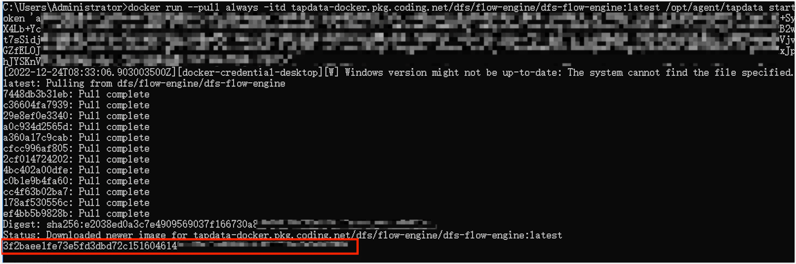
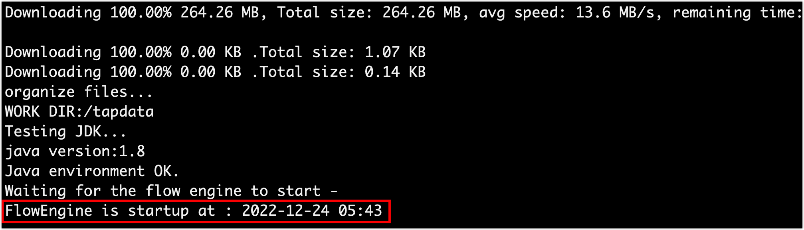

# 在本地设备上安装 Agent

import Content from '../../reuse-content/_cloud-features.md';

<Content />

TapData Agent 是数据同步、数据异构、数据管道场景的重要组件，您可以将其部署在云端，由 TapData Cloud 提供 Agent 运行所需的计算/存储资源并自动部署，同时提供统一的运行维护和资源监控以提升运行可靠性，免去部署和运维精力，专注业务本身；您也可以选购半托管实例，充分利用自有的硬件资源，获得更低的价格的同时，进一步提升安全性。

<details>
  <summary>Agent 介绍</summary>
  Agent 是数据同步、数据异构、数据开发场景中的关键程序，负责通过流式技术从源系统获取数据、处理转换数据并发送到目标系统，由云上的管理端统一管理，由 Agent 处理的数据不会上传或存储在 TapData Cloud 中，充分保障数据安全性。
</details>


```mdx-code-block
import Tabs from '@theme/Tabs';
import TabItem from '@theme/TabItem';
```

## 操作步骤

TapData Cloud 按照订阅 Agent 实例的**规格**和**数量**收费，您可以免费创建 1 个 SMALL 规格的 Agent 实例（半托管模式），此外，您还可以[购买更多的 Agent 实例](../../billing/billing-overview.md)，来满足业务需求，接下来，我们演示具体的操作流程。

1. [登录 TapData 平台](../../user-guide/log-in.md)。

2. 在左侧导航栏，单击**资源管理**。

3. 单击页面右侧的**创建计算引擎**。

4. 在弹出的对话框中，选择部署模式、规格和订阅周期。

   

   * **部署模式**

     - **自托管模式：您需要提供**部署和维护 Agent 的设备。这样可以优化利用现有硬件资源，从而降低成本并增强安全性。

     - **半托管模式**：由您提供设备来部署和运维 Agent，为其运行提供计算/存储资源，可充分利用现有硬件资源，获得更低的价格的同时，进一步提升安全性。

     - **全托管模式（推荐）**：由 TapData Cloud 提供 Agent 运行所需的计算/存储资源并自动部署，同时提供统一的运行维护和资源监控以提升运行可靠性，可实现一键交付使用，免去部署和运维精力，专注业务本身。

       :::tip

       选择**全托管模式**时，您还需要选择 Agent 部署的云服务商和区域。

       :::

   * **Agent 规格**：基于业务所需的任务数量和性能要求选择产品规格。您可以免费创建**SMALL**规格的示例，关于产品定价和规格的详细说明，见[计费概述](../../billing/billing-overview.md)。

   * **订阅周期**：选择所需的订阅周期，为了避免实例过期影响任务执行，推荐选择包年（**9折**）或包月（**95折**）。

   :::tip

   此外，您还可以通过[阿里云市场](https://market.aliyun.com/products/56024006/cmgj00061912.html)采购/试用 TapData Cloud，在阿里云市场获得授权码后，在本页面下方选择**直接使用阿里云授权码**以完成绑定。

   :::

5. 单击**订阅**。

   如果您选择**全托管模式**，Agent 将完成自动部署，如果您选择**自托管模式**，请在跳转到的页面，选择要部署的平台：
   
   
   
   <details><summary>环境要求</summary>
     <ul>
       <li>硬件环境：x86 架构处理器</li>
       <li>操作系统：64 位</li>
       <li>网络环境：可连通公网，且可与源/目标数据库通信</li>
       <li>软件依赖：Linux 平台依赖 Java 1.8 版本，可执行 java -version 命令查看版本，手动安装命令：yum -y install java-1.8.0-openjdk</li>
     </ul>
   </details>
   
   
   

```mdx-code-block
<Tabs className="unique-tabs">
<TabItem value="Linux（64 位）">
```
1. 单击复制以获取安装命令。

2. 登录至待部署 Agent 的设备上，为便于管理 Agent，我们首先创建一个文件夹（如 **tapdata**）并进入。

3. 粘贴并执行您在步骤 1 复制的安装命令，该命令包含下载、部署和启动 Agent 的流程，启动成功如下图所示。

   

</TabItem>

<TabItem value="Docker">

1. 单击复制以获取安装命令。

2. 登录至待部署 Agent 的设备上，为便于管理 Agent，我们首先创建一个文件夹（如 **tapdata**）并进入。

3. 粘贴并执行您在步骤 1 复制的安装命令，该命令包含下载、部署和启动 Agent 的流程，启动成功后会输出容器 ID，如下图所示。

   

</TabItem>

<TabItem value="Windows（64 位）">

1. 根据页面提示，下载 Agent 安装程序和配置文件（**application.yml**）。

2. 为方便管理，我们将下载的 Agent 安装程序和配置文件一起移动至安装目录（如 `C:\tapdata`）。

3. 双击 Agent 安装目录中的 **tapdata.exe** 以完成安装，启动成功后命令窗口将自动关闭。

4. （可选）双击 Agent 安装目录中的 **status.bat** 程序，查看 Agent 状态，正常启动的示例如下。

   

</TabItem>
</Tabs>


<details>
<summary>需要在 Mac（M1 芯片）上安装 Agent？</summary>

1. 打开 Mac 的命令行终端，依次执行下述命令下载并启动 JDK 镜像。

   ```shell
   # 下载镜像
   docker pull openjdk:8u312 
   # 启动镜像
   docker run -t -d openjdk:8u312
   ```

2. 执行 `docker ps` 获取容器 ID，然后执行下述格式的命令进入容器命令行，示例如下：

   ```shell
   docker exec -it 容器ID /bin/bash
   ```

   :::tip

   需替换命令中的容器 ID，例如 `docker exec -it 1dbee41b4adc /bin/bash`。

   :::

3. 为便于管理 Agent，在容器命令行中执行下述命令创建一个文件夹（如 **tapdata**）并进入。

   ```shell
   mkdir tapdata&&cd tapdata
   ```

4. 在容器命令行中，执行下述命令下载 Agent 程序并解压。

   ```shell
   wget 'https://resource.tapdata.net/doc-source/tapdata.zip' && unzip tapdata.zip
   ```

5. 返回 TapData Cloud 部署页面，选择目标操作系统为**Linux(64 位) **，然后点击**复制**。

      

6. 在 Docker 容器的命令行中，粘贴部署命令并去掉`./tapdata` 之前的内容，然后执行，启动成功示例如下。

   

</details>