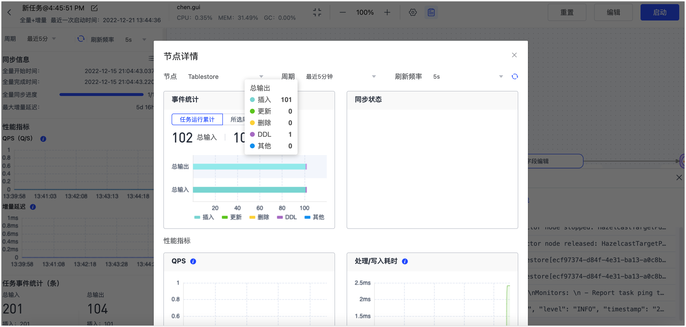

# 产品优势

Tapdata 支持丰富的数据源间的数据流转能力，为您提供了数据复制、数据转换、数据服务等多种核心功能，相对于传统数据迁移/同步工具，Tapdata 可为您提供功能丰富、简单易用、安全可靠的数据流转服务，极大提升数据开发效率。

## 支持丰富数据源

支持主流的开源数据库、国产信创、离线文件、云上应用和湖仓类型等数据源，更多介绍，见[支持的数据源](supported-databases.md)。

以外，Tapdata 还基于数据源注册框架全新定义数据源检测项，从而保障数据处理任务稳定可靠地运行。

## 零代码界面化操作

Tapdata 支持通过拖拽式操作完成任务的编排与设置，且支持多级多节点同时同步操作，极大降低了同步任务流定义的复杂度，提升了效率和质量。

## 灵活定义数据处理逻辑

Tapdata 在数据复的基础上，提供了一系列针对单表开发的[数据处理节点](../user-guide/data-pipeline/data-development/process-node.md)（如主从合并、字段计算等），您可以自行定义数据处理逻辑，可满足数据分析、处理、灾备等场景。

## 可视化任务监控

Tapdata 支持对任务运行状态的可视化监控，您可以快速获取数据链路中节点的数据读取统计、数据写入统计、延迟统计等关键监控信息。

## 共享日志挖掘

Tapdata 采用共享挖掘技术，将源端数据库的日志抽取到缓存数据库中，而数据复制任务作为消费者直接从缓存数据库中读取数据，实现数据变更的快速同步，可避免传统方案下，多个任务同时读取源库的日志信息而影响源库的性能、大型事务丢失、数据同步故障无法溯源等问题。

## 增量数据实时校验

Tapdata 支持在数据增量同步的基础上，实时对比同步到目标库的数据与源库是否一致且完整，无需编写 SQL 脚本进行校验，避免全量检查耗时久的问题。

## 高可用与容错机制

Tapdata 支持高可用部署和按需扩容，管理端本身通过双节点和三副本的分布式数据库可保障 99.99% 的系统高可用性，从容应对生产环境的严苛要求。

此外，Tapdata 还提供幂等性操作保障任务可以持续运行且数据的最终一致，具体如下：

- 数据处理任务在运行时会定期向管理端汇报健康状况，如果管理端在 1 分钟内未收到则判断该处理节点异常，由另一个正常节点接管该任务。
- 数据处理任务会定期记录当前处理流的位置，任务重启后会自动从该位置重新开始。

## Cloud 
## 创新的实时数据同步技术

创新性地将数据库 CDC 技术与流式计算技术融合，将数据同步过程中的数据处理过程向用户开放，让数据同步不再是单一的复制，使得用户可以基于数据实现更多创新可能。

## 统一的数据服务平台

基于数据分层治理的理念，可将分散在不同业务系统的数据同步至统一的平台缓存层，最大限度地降低数据提取对业务的影响，为后续的数据加工和业务提供基础数据，从而构建一致、实时的数据平台，连通数据孤岛。

## 零代码可视化拖拽操作

TapData Cloud 数据同步任务的编排与设置流程支持拖拽式零代码可视化操作，支持多级多节点同时同步操作，极大的降低了同步任务流定义的复杂度，提升了效率和质量。

## 完美支持SQL -> NoSQL

完美的 JSON 支持，可通过拖拽的方式轻松实现从关系型数据库到非关系型数据实时同步，同时还支持一对一、多对一、一对多等多种建模方式，轻松帮助用户实现数据库现代化。

## 全面的数据库支持

全面支持主流的开源数据库及商业数据库以及消息类中间件，包括 MongoDB、MySQL、Oracle、SQL Server、DB2、elastic、Kafka、Sybase、PostgreSQL、Redis、GaussDB 等。

## 可视化任务运行监控

通过可视化界面对数据传输任务的运行状态进行监控，用户可以快速掌握各个任务及节点的数据读取统计、数据写入统计、延迟统计等方面进行数据运行监控统计。

## 充分设计的安全保障

用户数据安全优先的架构设计，用户信息、任务信息全程加密的安全措施，充分保障用户的信息安全和数据安全，更多介绍，见[产品架构与工作原理](architecture.md)。
