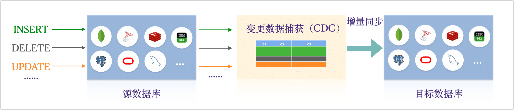
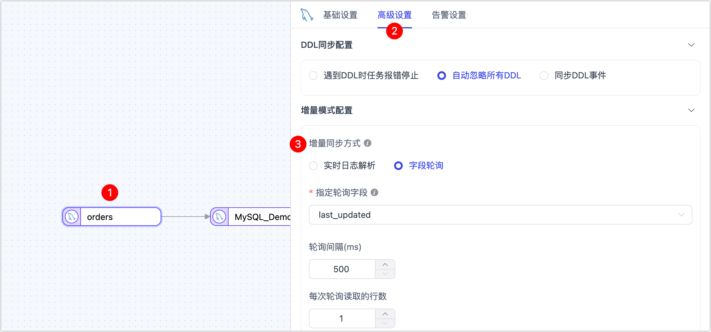

# 变更数据捕获（CDC）

更改数据捕获（Change Data Capture, CDC）是一种用于捕获并跟踪数据库中数据变化的方法，在数据同步和集成中起着关键作用，可用于实现增量数据同步。本文档将详细介绍 Tapdata 支持的各种 CDC 方法，帮助您了解其工作原理、优缺点，并提供具体的使用方法。

```mdx-code-block
import Tabs from '@theme/Tabs';
import TabItem from '@theme/TabItem';
```

## CDC 获取方法



```mdx-code-block
<Tabs className="unique-tabs">
<TabItem value="基于数据库日志 API">
```
基于数据库日志 API 解析的 CDC 是一种常用的数据变更捕获技术，它通过读取和解析数据库的事务日志来捕获数据的增量变化。该日志是数据库管理系统用来确保数据完整性和恢复能力的关键组成部分，每个数据库的详细操作都会被记录在这些日志中。

以 MySQL 数据库为例，管理员可以通过修改数据库配置文件（`mysql.cnf`）来启用 Binlog，从而记录数据修改的所有操作，捕获数据的变化详情。

```sql
server_id         = 223344
log_bin           = mysql-bin
expire_logs_days  = 7
binlog_format     = row
binlog_row_image  = full
```

完成[权限授予和数据源连接](../prerequisites/on-prem-databases/mysql.md)后，在 TapData 的任务配置中将其作为数据源即可实现全量+增量数据同步（默认）。


</TabItem>

<TabItem value="基于数据库日志文件">
对于 Oracle 和 Db2 数据源，为进一步提高数据变更捕获的效率，TapData 提供基于数据库日志 API 解析（LogMiner）CDC 的基础上，还开发了直接解析原生的二进制日志文件的能力，从而实现更高效的事件捕获，可获得更高的采集性能（QPS 20,000 以上），降低采集增量数据对源库的影响。

该方案需要额外安装日志解析插件，以 Oracle 数据库为例为例，联系 [TapData 技术支持](../support.md)完成插件部署后，在[配置 Oracle 连接](../prerequisites/on-prem-databases/oracle.md)时，可选择日志插件为 **bridge**，然后填写裸日志服务的 IP 地址，默认服务端口为 **8190**。


</TabItem>

<TabItem value="基于字段轮询">
字段轮询的 CDC 通过定期查询数据库表中的指定列（如时间戳或递增的标识列）来检测数据变化。通过比较前后的数据，可以确定数据的增量变化。

以 MySQL 为例，假设有一个表 `orders`，其中 `last_updated` 字段记录了每条记录的最后更新时间，TapData 通过定期轮询 `last_updated` 字段来检测数据变化，示例 SQL 如下：

```sql
-- 查询自上次轮询以来有变化的记录
SELECT * FROM orders WHERE last_updated > '2024-06-01 00:00:00';
```

完成[权限授予和数据源连接](../prerequisites/on-prem-databases/mysql.md)后，即可在 TapData 中[配置数据转换任务](../user-guide/data-pipeline/data-development/create-task.md)时，为源节点设置增量同步方式为**字段轮询**并选中目标字段（`last_updated`）。



</TabItem>

<TabItem value="基于触发器">
基于触发器的CDC通过在数据库表上创建触发器来捕获数据变化。触发器是一种特殊的存储过程，当特定的数据库事件（如INSERT、UPDATE或DELETE）发生时，触发器会自动执行预定义的操作，将变化的数据记录到另一个表中或发送到外部系统。

以 MySQL 为例，我们首先需要手动创建一个触发器，用于记录 `orders` 表的变化：

```sql
-- 创建记录变化的表
CREATE TABLE orders_changes (
    id INT AUTO_INCREMENT PRIMARY KEY,
    order_id INT,
    change_type VARCHAR(10),
    change_time TIMESTAMP DEFAULT CURRENT_TIMESTAMP
);

-- 创建触发器，跟踪 INSERT、UPDATE 和 DELETE
CREATE TRIGGER after_orders_insert
AFTER INSERT ON orders
FOR EACH ROW
BEGIN
    INSERT INTO orders_changes (order_id, change_type) VALUES (NEW.id, 'INSERT');
END;

CREATE TRIGGER after_orders_update
AFTER UPDATE ON orders
FOR EACH ROW
BEGIN
    INSERT INTO orders_changes (order_id, change_type) VALUES (NEW.id, 'UPDATE');
END;

CREATE TRIGGER after_orders_delete
AFTER DELETE ON orders
FOR EACH ROW
BEGIN
    INSERT INTO orders_changes (order_id, change_type) VALUES (OLD.id, 'DELETE');
END;

```

完成操作后，后续可以选择自行开发程序来解析和处理这些变更，也可以利用 Debezium 和 Apache Kafka 来实现更高效的增量数据处理。

:::tip

由于该方案并非最优解且会增加用户的运维成本，Tapdata 未采用该方案。

:::

</TabItem>
</Tabs>


## CDC 方案对比

```mdx-code-block
<Tabs className="unique-tabs">
<TabItem value="特性对比">
```
| 类别                | 数据库日志 API | 数据库日志文件         | 字段轮询 | 触发器                 |
| ------------------- | -------------- | ---------------------- | -------- | ---------------------- |
| 可区分插入/更新操作 | ✅              | ✅                      | ➖        | ✅                      |
| 可监测删除操作      | ✅              | ✅                      | ➖        | ✅                      |
| 可实时采集          | ✅              | ✅（超高性能）          | ➖        | ✅                      |
| 业务侵入性          | 🟢 低           | 🟢 低                   | 🔴 高     | 🟡 中                   |
| DBA 运维成本        | 🟡 中           | 🔴 高（需额外部署组件） | 🟢 低     | 🔴 高（触发器管理复杂） |
| 系统开销成本        | 🟢 低           | 🟢 低                   | 🔴 高     | 🔴 高                   |

</TabItem>

<TabItem value="优缺点对比">

| CDC 获取方法   | 优势                                                         | 不足                                                         |
| -------------- | ------------------------------------------------------------ | ------------------------------------------------------------ |
| 数据库日志 API | ● 利用现有日志，对数据库性能影响较小<br />● 可轻松跟踪表结构变更 | ● 需为日志预留充足的存储空间和过期时间                       |
| 数据库日志文件 | ● 直接解析原生二进制日志，减少中转<br/>● 采集性能更高，QPS 可达 20,000 以上 | ● 需要单独部署组件，需要一定运维成本<br />● 账号权限需适当放宽 |
| 字段轮询       | ● 实现简单，不依赖于日志或触发器<br />● 通用性高，几乎可用于各类数据库 | ● 实时性较低，依赖轮询的频次<br />● 对业务有侵入性，涉及表结构改动<br />● 无法跟踪删除和表结构变更操作 |
| 基于触发器     | ● 工作在 SQL 级别，实现简单<br />● 较为可靠详细，能够精确捕获数据变化 | ● 数据变更需要出触发多次写入<br />● 触发器过多会严重影响性能<br />● 需要在每个表上创建触发器，维护成本高<br />● 特定情况下，触发器可能被禁用 |

</TabItem>
</Tabs>

## 常见问题

* 问：TapData 哪些数据源支持获取 CDC？

  答：具体见[支持的数据源](../introduction/supported-databases.md)中的各表格，作为数据源时如支持增量则支持获取 CDC 信息。

* 问：如果我的数据源支持获取 CDC，如何选择 CDC 的采集方式？

  答：为最大化提升兼容性和采集性能，TapData 支持下述 CDC 采集方式：

  * **基于数据库日志 API 解析**：默认采集方式，绝大部分数据库均支持，受限于权限限制无法放开日志或某些 SaaS 类数据源，可选择**字段轮询**方式。
  * **基于数据库日志解析**：目前仅 Oracle 和 Db2 数据源支持。
  * **字段轮询**：可在 TapData 中[配置数据转换任务](../user-guide/data-pipeline/data-development/create-task.md)时，为源节点设置增量同步方式。