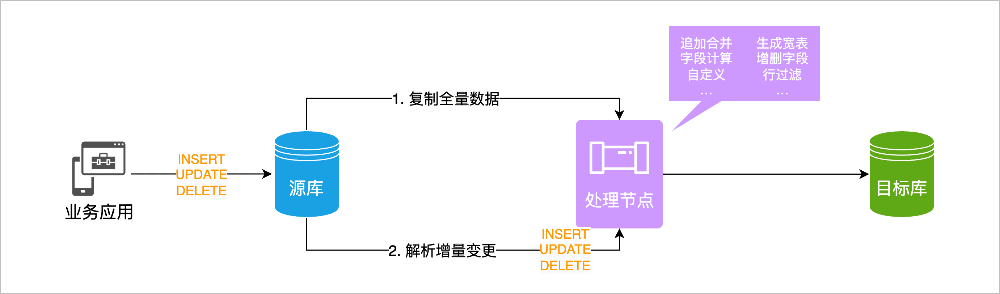
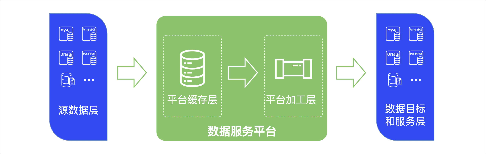

# 功能特性

import Content from '../reuse-content/_all-features.md';

<Content />

本文介绍 TapData 的功能特性，帮助您快速了解其核心能力。

## 数据复制

TapData 的数据同步包括全量同步和实时增量同步两部分，可帮助您快速实现同/异构数据源间的实时同步，适用于数据迁移/同步、数据灾备、读性能扩展等多种[业务场景](use-cases.md)，实现的过程如下图所示。

## 数据转换

针对复杂的数据处理需求，TapData 在数据复制能力的基础上，支持在数据源间增加多种[处理节点](../user-guide/data-pipeline/data-development/process-node.md)，快速实现多表合并、数据拆分、字段增减、共享挖掘等高级数据处理需求。

## 数据即服务（DaaS）

借助 TapData 的[实时数据中心](../user-guide/real-time-data-hub/README.md)，您可以将分散在不同业务系统的数据同步至统一的平台缓存层，可为后续的数据加工和业务提供基础数据，从根源上避免直接读取/操作源库的数据带来的的性能影响，从而构建一致、实时的数据平台，连通数据孤岛。

## 支持的数据源

TapData 支持主流数据库，包括商业数据库、开源数据库、云数据库、SaaS 平台数据源、文件数据源等，并支持自定义数据源，详见[支持的数据源](supported-databases.md)。
