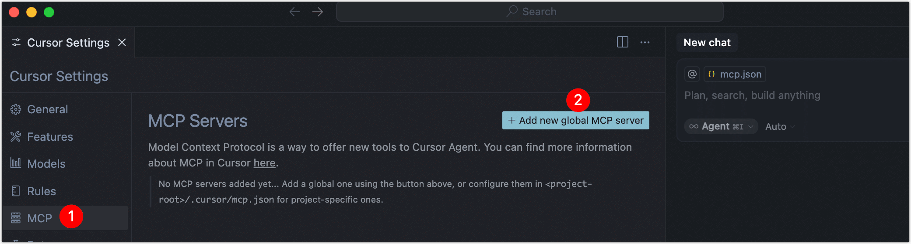

# 快速入门

本文将指导您如何在 TapData 中启用 [MCP（Model Context Protocol）服务](introduction.md)，并将其对接至支持 SSE 协议的 AI Agent 工具（如 Cursor），实现结构化上下文数据的实时推送，助力大模型更准确地理解业务背景。

## 前提条件

- 已部署并运行 TapData 平台。
- 拥有支持 MCP SSE 协议的 AI 模型服务或工具（如 Cursor）。


## 步骤一：授权用户并获取访问码

为保障平台安全，需创建并授权一个用户账户，使其拥有通过 MCP 协议访问数据的权限。

1. [登录 TapData 平台](../user-guide/log-in.md)。

2. 进入 **系统设置** > **角色管理**，创建名为 `mcp` 的角色（不区分大小写）。详见[管理角色](../user-guide/manage-system/manage-role.md)。

3. 进入 **系统设置** > **用户管理**，为某个用户账号添加 `mcp` 角色，详见[管理用户](../user-guide/manage-system/manage-user.md)。

4. 使用被授权的用户登录 TapData 平台，点击右上角用户名，选择 **个人设置**，复制其中的访问码（accessCode），后续配置时将使用。

   


## 步骤二：使用 MCP Server

接下来，我们以 Cursor 工具为例，演示如何配置和使用 TapData MCP Server：

1. 打开并登录 Cursor 软件，单击右上角的图标。

2. 单击左侧的 MCP，然后单击 **Add new global MCP Server**。

   

3. 在跳转到的 mcp.json 配置文件中，根据下述说明添加 TapData 的 MCP 服务认证信息。

   ```json
   {
     "mcpServers": {
       "mcp-tcp-server": {
           "url": "http://{server}:{port}/mcp/sse?accessCode={accessCode}"
       }
     }
   }
   ```

   您只需要修改上述配置信息中 `url` 参数的取值，配置说明如下：

   - **server**：替换为 TapData 平台的登录地址，可以是域名或者 IP 地址。
   - **port**：替换为 TapData 平台的服务端口，默认为 3000。
   - **accessCode**：替换为我们在准备工作阶段获取到的 TapData 平台的访问码。

   配置示例如下：

   ```json
   {
     "mcpServers": {
       "mcp-tcp-server": {
           "url": "http://192.168.1.18:3000/mcp/sse?accessCode=3324cf************"
       }
     }
   }
   ```

   :::tip

   除本方式外，TapData 还支持使用 Bearer Token 进行鉴权（适用于统一认证环境）。

   :::

4. 保存并关闭配置文件，返回至 MCP 设置处，等待左侧状态指示灯变为绿色，说明成功连接 TapData MCP Server。

5. 在 Cursor 中发起提问时，模型将自动通过 TapData MCP Server 获取上下文数据。你也可以通过自然语言提示词（Prompt）明确引导模型的行为，以实现更高效的数据调用与任务规划。

   ```bash
   # 角色
   你是一名数据分析助手，负责根据用户意图生成数据查询请求，并展示分析结果。
   
   # 任务准备
   请先获取当前系统中可用的数据库连接（如“电商物化视图”），再查询该视图的字段结构，以便理解数据模型。
   
   # 工作目录
   /Users/lg/tmp/worker
   ```
   
   Cursor 将自动识别上述任务需求，依次执行以下动作：
   
   1. 获取数据库连接与数据模型结构。
   2. 调用合适的数据查询与聚合工具，执行数据分析任务。
   3. 展示最终分析结果。


```mdx-code-block
import Tabs from '@theme/Tabs';
import TabItem from '@theme/TabItem';
```

<details>
<summary><b>了解 TapData MCP Server 原语</b></summary>

TapData MCP Server 基于三类核心原语构建，分别是 **Prompts**、**Resources** 和 **Tools**。它们共同构成了 AI 模型与数据系统交互的基础，使模型能够识别可用资源、选择合适操作，并基于提示词获取结构化上下文，从而完成更精准、高效的推理任务。


```mdx-code-block
<Tabs className="unique-tabs">
<TabItem value="Prompts" default>
```

Prompts（提示词）是为特定任务优化的自然语言模板，引导 AI 模型理解任务意图、规划执行流程并生成高质量响应。良好的提示词能显著提升推理准确性和任务完成度。

</TabItem>
<TabItem value="Resources">

Resources（资源）定义了 AI 模型可访问的数据资源，包括数据库连接和数据模型，帮助模型理解数据结构和上下文。

| 原语名称            | 描述                                                         |
| ------------------- | ------------------------------------------------------------ |
| **Data Connection** | 表示 MCP Server 中配置的数据库连接，支持添加业务标签，标识数据用途。 |
| **Data Model**      | 表示连接下的数据结构定义，包括集合名、字段、类型等，用于帮助模型理解数据组织方式。 |

</TabItem>

<TabItem value="Tools">

Tools 是模型可以直接调用的函数或指令，用于与结构化数据进行交互，如查询、聚合、采样等。

| 工具名称         | 功能说明                        |
| ---------------- | ------------------------------- |
| `listConnection` | 列出所有数据库连接及其标签信息  |
| `listDataModel`  | 获取连接下的所有数据模型结构    |
| `sampleData`     | 查询模型示例数据（最多 100 行） |
| `query`          | 执行 MongoDB 查询               |
| `aggregate`      | 使用 MongoDB 聚合管道处理数据   |
| `count`          | 获取集合中记录总数              |
| `listCollection` | 列出 MongoDB 数据库中的所有集合 |

</TabItem>

</Tabs>

</details>

:::tip

当前 MCP 服务已支持上下文数据的读取原语，包括结构化查询、聚合分析与样例提取。TapData 将陆续推出 **写入能力、数据发布 API、AI Agent 分析建模** 等增强功能，持续完善 MCP 的上下文闭环能力，助力 AI 分析安全高效落地。

:::


## 常见问题

- 问：MCP Server 连接失败，可能是什么原因？

  可能原因如下，请依次排查：

  - 填写的服务地址错误，请检查 SSE 接入点是否正确。
  - 网络防火墙或安全组限制，请确保 TapData 服务端口已放通。
  - 用户权限不足，请确保访问码对应的用户已分配 MCP 或管理员角色。

- 问：AI 模型推理结果出现延迟或数据丢失，该如何排查？

  建议检查 AI 模型服务端性能瓶颈、提供上下文数据的数据库是否有慢查询、TapData 与模型服务之间网络延迟情况。

- 问：如何快速调试 SSE 数据连接？

  您可以通过使用 `curl` 或 `Postman` 直接请求 MCP 的 SSE 接口，检查返回数据；也可以使用官方提供的 [MCP Inspector 工具](https://modelcontextprotocol.io/docs/tools/inspector) 测试 MCP Server 返回的数据结构与实时推送情况。

- 问：我使用的 AI Agent 工具仅支持 STDIO 协议，如何对接 TapData MCP 服务？

  可以使用 [mcp-proxy](https://github.com/sparfenyuk/mcp-proxy) 工具将 STDIO 协议转换为 SSE 协议，以实现对 TapData MCP 服务的接入。
