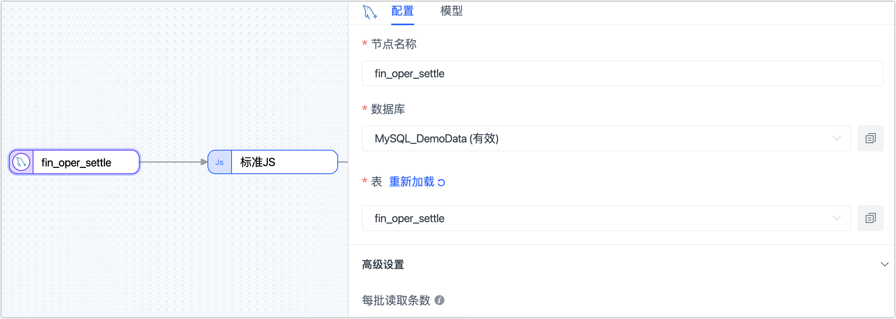
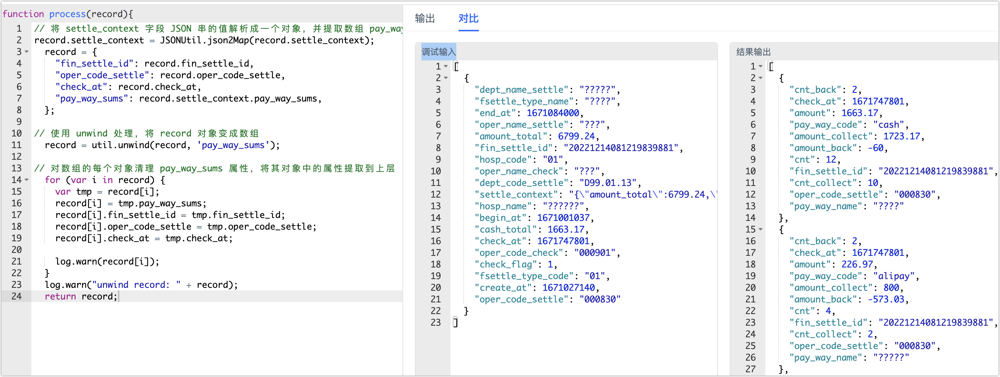

# 构建数组提取链路简化数据分析

在现代的支付系统中，支付数据的分析对于了解用户行为、优化业务流程以及制定决策至关重要。对于存储支付数据的数据库表来说，有时会将支付数据以 JSON 串的形式写入一个字段中，在后续分析时往往因其结构复杂而面临着处理复杂度高的问题。

本文将探讨在此场景下如何通过 Tapdata 的 JS 节点，将表中 JSON 嵌套数组的数据直接提出并作为顶级字段，从而帮助企业更便捷地对接 BI 报表进行数据分析。


## 场景说明

假设我们的业务场景中有一个支付系统（以 MySQL 数据库提供服务），该系统中的结算汇总表拥有一个 `settle_context` 字段，该字段使用 JSON 串的形式存储了多个支付相关的信息，包括支付方式、金额等，`settle_context` 字段的样例数据如下：

```json
{
	"amount_total": 6799.24,
	"cash_total": 1663.17,
	"invoice_count": 0,
	"invoice_normal_count": 0,
	"invoice_cancel_count": 0,
	"invoice_park_count": 0,
	"pay_way_sums": [{
		"pay_way_code": "cash",
		"pay_way_name": "现金支付",
		"cnt": 12,
		"cnt_collect": 10,
		"cnt_back": 2,
		"amount": 1663.17,
		"amount_collect": 1723.17,
		"amount_back": -60
	}, {
		"pay_way_code": "alipay",
		"pay_way_name": "支付宝平台",
		"cnt": 4,
		"cnt_collect": 2,
		"cnt_back": 2,
		"amount": 226.97,
		"amount_collect": 800,
		"amount_back": -573.03
	}
	......
	]
}
```

由于 JSON 串格式的数据在统计分析存在一些限制，本文将探讨如何拆解该字段并将结果实时同步到指定的数据表中，从而获得最新的数据，帮助企业更好地了解支付方式分布等信息、优化支付流程、改进用户体验以及制定更有效的商业策略，可用于下述分析场景：

* **支付方式分析**： 基于提取的支付方式统计信息，进行深入的数据分析，例如计算各支付方式的占比、分析支付方式的趋势变化、比较不同支付方式之间的金额差异等。这些分析结果将为企业提供洞察，帮助优化支付策略和决策制定。
* **可视化和报告**： 将支付方式分析的结果以可视化图表或报告的形式呈现，以便更直观地理解数据，借助数据可视化工具（如 Tableau等）可以创建柱状图、饼图或趋势图，从而更好地展示支付方式的分布和变化。

接下来，我们将介绍如何通过 Tapdata 内置的**标准 JS** 节点，将结算汇总表中的  `settle_context` 字段拆解，随后将提取到的支付方式等信息同步到一个指定的数据库中，从而帮助企业更便捷地对接 BI 报表，从而基于支付数据中获得更深入的洞察和分析。

## 准备工作

在创建数据转换任务前，您需要将结算汇总表所属的数据源添加至 Tapdata 中，同时，您还需要添加一个数据源（如 MySQL 数据库）作为目标库，具体操作，见[配置 MySQL 连接](../prerequisites/on-prem-databases/mysql.md)。

## 操作步骤

1. 登录 Tapdata 平台。

2. 在左侧导航栏，选择**数据管道** > **数据转换**。

3. 单击页面右侧的**创建**。

4. 选择并连接节点。

   1. 在页面左侧的**连接**区域，依次拖拽作为源和目标的数据连接至右侧画布中，

   2. 在页面左下方的**处理节点**区域，拖拽**标准 JS**节点到右侧画布中。

   3. 将上述 3 个节点按照源库、标准 JS 和 目标库的顺序连接起来，如下图所示。

      

5. 单击最左的源节点，在右侧的面板中选择待操作的结算汇总表（**fin_oper_settle**），其他配置可保持默认。

   

   如需了解更多配置介绍，见[创建数据转换任务](../user-guide/data-pipeline/data-development/create-task.md)。

6. 单击中间的标准 JS 节点，在右侧面板中的脚本文本框中输入下述代码。

   ```js
   // 使用 json2Map 函数，将 settle_context 字段解析成一个对象，并提取数组 pay_way_sums 的值 
   record.settle_context = JSONUtil.json2Map(record.settle_context);
   
   // 保留源表中的特定字段，如主键等信息
     record = {
       "fin_settle_id": record.fin_settle_id,
       "oper_code_settle": record.oper_code_settle,
       "check_at": record.check_at,
       "pay_way_sums": record.settle_context.pay_way_sums,
     };
   
   // 使用 unwind 函数，将 record 对象转变为数组
     record = util.unwind(record, 'pay_way_sums');
   
   // 对数组的每个对象清理 pay_way_sums 属性，将其对象中的属性提取到上层
     for (var i in record) {
       var tmp = record[i];
       record[i] = tmp.pay_way_sums;
       record[i].fin_settle_id = tmp.fin_settle_id;
       record[i].oper_code_settle = tmp.oper_code_settle;
       record[i].check_at = tmp.check_at;
   
       log.warn(record[i]);
     }
     log.warn("unwind record: " + record);
   	return record;
   ```

   :::tip

   关于上述代码中使用到的 json2Map、unwind 等函数用法的介绍，见[标准 JS 内置函数](../appendix/standard-js.md)。

   :::

7. 设置完成后，单击右下角的**试运行**，单击右侧的对比查看输入输出的数据示例，确认无问题后单击右上角的**退出全屏**。

   

8. 单击目标库所属的节点，在右侧的面板中选择或填写目标表名称，其他配置可保持默认。

   

   如需了解更多配置介绍，见[创建数据转换任务](../user-guide/data-pipeline/data-development/create-task.md)。

9. （可选）单击页面右上角的**设置**，配置任务属性。

   - **任务名称**：填写具有业务意义的名称。
   - **同步类型**：可选择**全量+增量**，也可单独选择**全量**或**增量**。 全量表示将源端的存量数据复制到目标端，增量表示将源端实时产生的新数据或数据变更复制到目标端，二者结合可用于实时数据同步场景。
   - **任务描述**：填写任务的描述信息。
   - **高级设置**：设置任务开始的时间、增量数据处理模式、处理器线程数、Agent 等。

10. 确认无误后，单击**启动**。

   操作完成后，您可以在当前页面观察任务的执行情况，如 QPS、延迟、任务时间统计等信息，示例如下：

   


## 结果验证

根据上述任务设置，Tapdata 会将源表 **fin_oper_settle** 的 **settle_context** 字段拆解，并将提取到的支付方式等信息同步到目标表 **settle_analytics** 中，同时源表数据发生变更也会实时同步到目标表。

首先我们登录目标库，查询 **settle_analytics** 表的数据，发现表结构与数据符合我们的预期，即包含了源表的特定字段（如主键）和从 JSON 字段中提取出的支付方式等信息。

```sql
SELECT * FROM settle_analytics LIMIT 1\G;
*************************** 1. row ***************************
   fin_settle_id: 20221214081219839881
        cnt_back: 7
          amount: 4909
    pay_way_code: weixin
  amount_collect: 7200
     amount_back: -2291
             cnt: 20
oper_code_settle: 000830
     cnt_collect: 13
    pay_way_name: "微信支付平台"
        check_at: 2022-12-22 17:23:21
```

我们在源表修改一条数据，通过任务的监控页面也可以看到该数据被实时同步到了目标表，您也可以直接在目标表中查询修改结果。


## 任务管理

在任务列表页面，您还可以对任务进行启动/停止、监控、编辑、复制、重置、删除等操作。

具体操作，见[管理任务](../user-guide/data-pipeline/data-development/monitor-task.md)。
