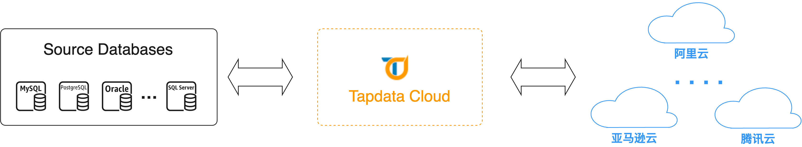
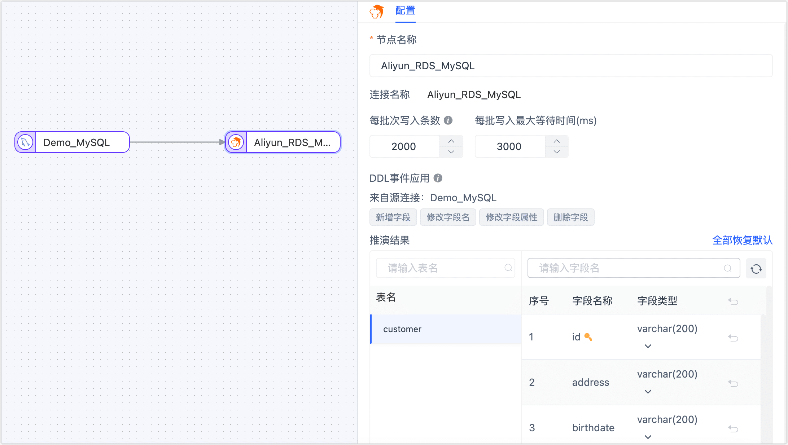
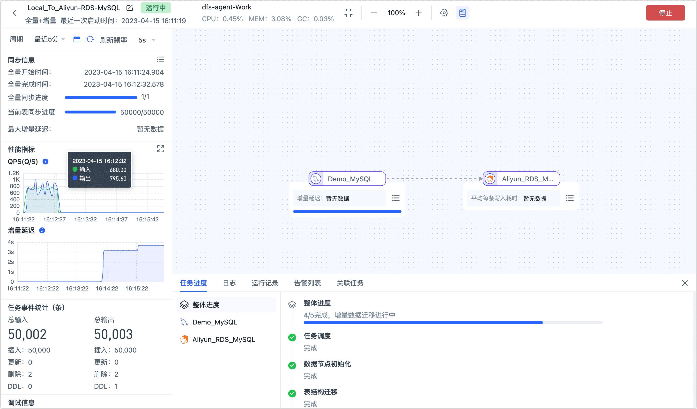

# MySQL 实时同步至阿里云

随着云计算的发展和普及，越来越多的企业希望将其业务从本地机房迁移到云端，以享受云计算的优势，如运维成本低、弹性灵活等。对于拥有本地 MySQL 数据库的企业而言，数据库迁移是迁移到云端的关键一步。

在本文中，我们将介绍如何通过 Tapdata 将 MySQL 数据库迁移到云端，实现业务的云化，企业提供简便高效的数据流转方案。


## 场景说明

本案例中，某企业目前在本地机房维护着一个 MySQL 数据库，用于存储其业务应用的数据。然而，随着业务的不断扩张和发展，该企业面临着日益增长的运维成本、扩展困难以及灾备和容灾需求的挑战。

为解决这些问题，并利用云计算的优势，该企业决定采用阿里云 RDS MySQL 中的 [Serverless 产品](https://help.aliyun.com/document_detail/411291.htm)，可实现 CPU 和内存的实时弹性能力，按需为计算资源付费，在快速响应业务变化的同时，合理地优化使用成本。然而，在实施数据迁移上云的过程中，该企业还面临了下述挑战：

* 如何简单快速迁移数据。
* 如何保障数据传输的安全性和完整性。
* 如何保障数据变更及时同步，以便后续可以快速完成业务切换。



为解决上述痛点，Tapdata 提供了可视化的操作界面，只需简单托拉拽操作即可完成任务配置，此外提供了任务状态监控，展示数据流转过程中的关键指标（如增量数据延迟等信息）；提供用户/任务信息的全程加密，且业务数据不会流经 Tapdata，全面保障数据传输安全性；基于多种自研技术，保障数据一致性的同时，提供毫秒级的数据实时同步能力，帮助企业实现平滑的数据上云。

接下来，我们介绍具体的操作流程。

## 准备工作

1. [连接本地 MySQL 数据库](../prerequisites/on-prem-databases/mysql.md)。

   :::tip

   您需要跟随该文档中的介绍，完成本地 MySQL 的 Binlog 配置并创建用于数据迁移的账号。

   :::

2. [连接阿里云 RDS MySQL](../prerequisites/cloud-databases/aliyun-rds-for-mysql.md)。


## 操作步骤

1. [登录 Tapdata 平台](../user-guide/log-in.md)。

2. 在左侧导航栏，单击**数据复制**。

3. 单击页面右侧的**创建**。

4. 在页面左侧，将本地自建 MySQL 和阿里云 RDS MySQL 数据源拖拽至右侧画布中，然后将其连接起来。

5. 单击本地自建 MySQL 数据源，根据下述说明完成右侧面板的参数配置。

   

   - **节点名称**：默认为连接名称，您也可以设置一个具有业务意义的名称。
   - **DDL 事件采集**：打开该开关后，Tapdata 会自动采集所选的源端 DDL 事件（如新增字段），实现 DDL 语句的同步。
   - **选择表**：根据业务需求选择。
     - **按表名选择**：在待复制表区域框选中表，然后单击向右箭头完成设置。
     - **按正则表达式匹配**：填写表名的正则表达式即可，此外，当源库新增的表满足表达式时，该表也会被自动同步至目标库。
   - **批量读取条数**：全量同步时，每批次读取的记录条数，默认为 **100**。

6. 单击阿里云 RDS MySQL 数据源，根据下述说明完成右侧面板的参数配置。

   1. 完成节点基础设置。

      - **节点名称**：默认为连接名称，您也可以设置一个具有业务意义的名称。
      - **每批次批量写入条数**：全量同步时，每批次写入的条目数。
      - **每批写入最大等待时间**：根据目标库的性能和网络延迟评估，设置最大等待时间，单位为毫秒。
      - **推演结果**：展示 Tapdata 将写入目标端的表结构信息，该信息基于源端节点设置所推演。

7. 下翻至**高级设置**区域框，完成高级设置。

   

   - **重复处理策略**：根据业务需求选择，也可保持默认。
   - **数据写入模式**：根据业务需求选择。
      - **按事件类型处理**：选择插入、更新、删除事件的数据写入策略。
     - **统计追加写入**：只处理插入事件，丢弃更新和删除事件。
   - **全量多线程写入**：全量数据写入的并发线程数，默认为 **8**，可基于目标端写性能适当调整。
   - **增量多线程写入**：增量数据写入的并发线程数，默认未启用，启用后可基于目标端写性能适当调整。

8. 确认无误后，单击**启动**。

   操作完成后，您可以在当前页面观察任务的执行情况，如 QPS、延迟、任务时间统计等信息，示例如下：

   

   如上图所示，我们在源库删除了 2 条数据，这个变更已实时同步到目标库，此时登录目标库查看数据条目数为 50000 - 2，即 49998 条。

   ```sql
   --登录至阿里云 RDS MySQL 数据库
   mysql -h rm-bp*******.rwlb.rds.aliyuncs.com -uroot -p
   
   --进入数据库，查看 customer 表的条目数
   USE aliyun_demodata;
   SELECT COUNT(*) FROM customer;
   
   --返回结果为 49998 条，数据变更完成了实时同步
   +----------+
   | COUNT(*) |
   +----------+
   |    49998 |
   +----------+
   ```
   
   至此，我们已经构建起了数据实时同步链路，此时，您可以在测试环境使用云上数据库进行业务的充分验证测试，后续再选择运维窗口期，临时停止源库的读写，将该链路暂停并正式将业务流量切换至云上数据库。

## 任务管理

在任务列表页面，您还可以对任务进行启动/停止、监控、编辑、复制、重置、删除等操作。

具体操作，见[管理任务](../user-guide/data-pipeline/copy-data/manage-task.md)。
