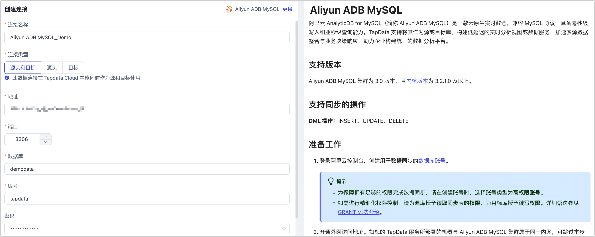

# Aliyun ADB MySQL

import Content from '../../reuse-content/_all-features.md';

<Content />


阿里云 AnalyticDB for MySQL（简称 Aliyun ADB MySQL）是一款云原生实时数仓，兼容 MySQL 协议，具备毫秒级写入和亚秒级查询能力。TapData 支持将其作为源或目标库，构建低延迟的实时分析视图或数据服务，加速多源数据整合与业务决策响应，助力企业构建统一的数据分析平台。

## 支持版本

Aliyun ADB MySQL 集群为 3.0 版本，且[内核版本](https://help.aliyun.com/zh/analyticdb/analyticdb-for-mysql/user-guide/update-the-minor-version-of-a-cluster#f01da9d186jss)为 3.2.1.0 及以上。

## 支持同步的操作

**DML 操作**：INSERT、UPDATE、DELETE

## 准备工作

1. 登录阿里云控制台，创建用于数据同步的[数据库账号](https://help.aliyun.com/zh/analyticdb/analyticdb-for-mysql/user-guide/create-database-accounts)。

   :::tip

   - 为保障拥有足够的权限完成数据同步，请在创建账号时，选择账号类型为**高权限账号**。
   - 如需进行精细化权限控制，请为源库授予**读取同步表的权限**，为目标库授予**读写权限**。详细语法参见：[GRANT 语法介绍](https://help.aliyun.com/zh/analyticdb/analyticdb-for-mysql/developer-reference/grant)。

   :::

2. 开通外网访问地址。如您的 TapData 服务所部署的机器与 Aliyun ADB MySQL 集群属于同一内网，可跳过本步骤。

      1. 在左侧导航栏，选择**数据库连接**。
      
      2. 单击**开通外网地址**。
      
      3. 在弹出的对话框中，将 TapData 服务所属的公网地址键入至白名单中。
         
      :::tip
         
      如使用 TapData 云版，则白名单固定为 47.93.190.224 和 47.242.251.110。
      
      :::
      
      4. 单击**确定**。

3. 如需通过外网连接数据库，请为集群[申请公网连接地址](https://help.aliyun.com/zh/analyticdb/analyticdb-for-mysql/user-guide/apply-for-or-release-a-public-endpoint)。

4. （可选）如需读取 Aliyun ADB MySQL 数据表的增量数据，您还需要执行下述命令为待同步的表设置 Binlog。

   1. 开启 Binlog。

      ```sql
      -- 替换 table_name 为真实的表名
      ALTER TABLE table_name BINLOG=true;
      ```

      :::tip

      [XUANWU_V2 ](https://help.aliyun.com/zh/analyticdb/analyticdb-for-mysql/developer-reference/table-engine)表不支持开启 Binlog。

      :::

   2. 调整 Binlog 保留时长，防止数据被清理，确保增量同步正常进行。

      您可以通过`SHOW CREATE TABLE source_table;` 查看查看当前 Binlog 保留时长。

      ```sql
      -- 替换 table_name 为真实的表名
      ALTER TABLE table_name binlog_ttl='1d';
      ```

      `binlog_ttl` 参数取值支持以下格式：

      - 毫秒：纯数字，例如 `60` 代表 60 毫秒。
      - 秒：数字+s，例如 `30s ` 代表 30 秒。
      - 小时：数字+h，例如 `2h` 代表 2 小时。
      - 天：数字+d，例如  `1d` 代表 1 天。


## 连接 Aliyun ADB MySQL

1. [登录 Tapdata 平台](../../user-guide/log-in.md)。

2. 在左侧导航栏，单击**连接管理**。

3. 单击页面右侧的**创建**。

4. 在弹出的对话框中，搜索并选择 **Aliyun ADB MySQL**。

5. 在跳转到的页面，根据下述说明填写 Aliyun ADB MySQL 集群的连接信息。

   

   * **连接信息设置**
     * **连接名称**：填写具有业务意义的独有名称。
     * **连接类型**：支持作为源或目标库。
     * **地址**：数据库连接地址，即您在准备工作获取到的外网连接地址或内网连接地址。
     * **端口**：数据库的服务端口，默认为 **3306**。
     * **数据库**：数据库名称，即一个连接对应一个数据库，如有多个数据库则需创建多个数据连接。
     * **账号**：具备高权限的账号名称。
     * **密码**：数据库账号对应的密码。
     * **连接参数**：额外的连接参数，默认为空。
     * **时区**：默认为数据库所用的时区，您也可以根据业务需求手动指定。
   * **高级设置**
     * **包含表**：默认为**全部**，您也可以选择自定义并填写包含的表，多个表之间用英文逗号（,）分隔。
     * **排除表**：打开该开关后，可以设定要排除的表，多个表之间用英文逗号（,）分隔。
     * **Agent 设置**：默认为**平台自动分配**，您也可以手动指定 Agent。
     * **模型加载时间**：如果数据源中的模型数量少于10000个，则每小时更新一次模型信息。但如果模型数量超过10000个，则刷新将在您指定的时间每天进行。
     * **开启心跳表**：当连接类型为源头或目标时，可启用该开关。TapData 会在源库创建 `_tapdata_heartbeat_table` 心跳表，并每 10 秒更新一次（需具备相应权限），用于监测数据源连接与任务的健康状况。心跳任务在数据复制/开发任务启动后自动启动，您可在数据源编辑页面查看心跳任务。

6. 单击**连接测试**，测试通过后单击**保存**。

   :::tip

   如提示连接测试失败，请根据页面提示进行修复。

   :::