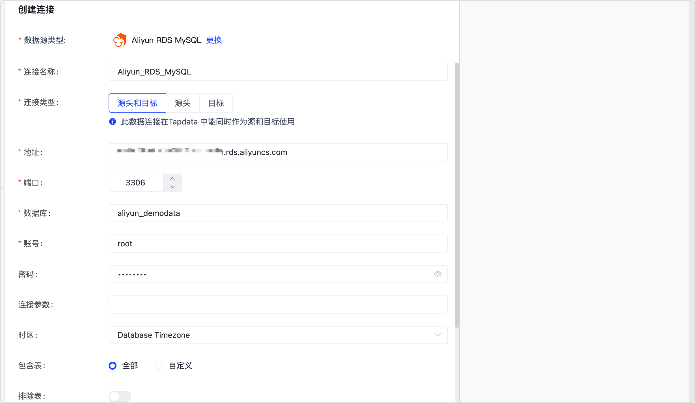

# Aliyun RDS for MySQL

阿里云关系型数据库 RDS（Relational Database Service）是一种稳定可靠、可弹性伸缩的在线数据库服务。完成 Agent 部署后，您可以跟随本文教程在 Tapdata 中添加 Aliyun RDS for MySQL 数据源，后续可将其作为源或目标库来构建数据管道。

## 支持版本

5.1、5.5、5.6、5.7、8.0


## 准备工作

连接阿里云 RDS for MySQL 时，作为源或目标库均可参考下述步骤操作。

1. 访问阿里云 [RDS 实例列表](https://rdsnext.console.aliyun.com/rdsList/basic)，在上方选择地域，然后单击目标实例ID。

2. 创建高权限账号。

   1. 在左侧导航栏，选择**账号管理**。

   2. 在页面右侧，单击**创建账号**。

   3. 在右侧的面板中，完成下述设置。

      

      * **数据库账号**：以小写字母开头，以小写字母或数字结尾，支持小写字母、数字和下划线，长度为 2~32 个字符。
      * **账号类型**：选择为**高权限**账号，以便可获取数据库的 Binlog 和读写数据库。更多账号类型介绍，见[账号类型](https://help.aliyun.com/document_detail/96089.htm#section-b3f-whz-q2b)。
      * **账号密码**：长度为 8~3 2个字符，至少包含大写字母、小写字母、数字、特殊字符中的任意三种。特殊字符为 `!@#$%^&*()_+-=`。

   4. 单击**确定**。

3. 创建数据库。

   1. 在左侧导航栏，选择**数据库管理**。
   2. 单击创建数据库，在弹出的对话框中填写数据库名称并选择字符集。
   3. 单击**创建**。

4. 开通外网访问地址，如您的 Agent 部署的机器与 RDS MySQL 属于同一内网，可跳过本步骤。
   1. 在左侧导航栏，选择**数据库连接**。
   
   2. 单击**开通外网地址**。
   
   3. 在弹出的对话框中，保持选项：**将0.0.0.0/0 加入白名单** 处于选中状态。
      
   
      
   
   4. 单击**确定**。
   
      :::tip
   
      完成操作后，您可以在本页面查看到外网连接地址，后续将在连接数据源时填写该地址。
   
      :::

## 添加数据源
1. 登录 Tapdata 平台。

2. 在左侧导航栏，单击**连接管理**。

3. 单击页面右侧的**创建**。

4. 在弹出的对话框中，搜索并选择 **Aliyun RDS MySQL**。

5. 在跳转到的页面，根据下述说明填写 Aliyun RDS MySQL 的连接信息。

   

   * 连接信息设置
      * **连接名称**：填写具有业务意义的独有名称。
      * **连接类型**：支持作为源或目标库。
      * **地址**：数据库连接地址，即您在准备工作获取到的外网连接地址。
      * **端口**：数据库的服务端口，默认为 **3306**。
      * **数据库**：数据库名称，即一个连接对应一个数据库，如有多个数据库则需创建多个数据连接。
      * **账号**：具备高权限的账号名称。
      * **密码**：数据库账号对应的密码。
      * **连接参数**：额外的连接参数，默认为空。
   * 高级设置
      * **时区**：默认为数据库所用的时区，您也可以根据业务需求手动指定。
        如果源库为默认数据库时区（+8:00），目标端数据库为指定时区+0:00，那么假设源端数据库存储的时间为 2020-01-01 16:00:00，目标端数据库存储的时间则为 2020-01-01 08:00:00
      * **包含表**：默认为**全部**，您也可以选择自定义并填写包含的表，多个表之间用英文逗号（,）分隔。
      * **排除表**：打开该开关后，可以设定要排除的表，多个表之间用英文逗号（,）分隔。
      * **Agent 设置**：默认为**平台自动分配**，您也可以手动指定 Agent。
      * **模型加载频率**：数据源中模型数量大于 1 万时，Tapdata 将按照设置的时间定期刷新模型。

6. 单击**连接测试**，测试通过后单击**保存**。

   :::tip

   如提示连接测试失败，请根据页面提示进行修复。

   :::


## 常见问题

* 问：执行异构数据源之间同步时，表级联出发的数据更新和删除没有同步到目标库？

  答：此场景下，如需要在目标端构建级联处理能力，可以视目标情况，通过触发器等手段来实现该类型的数据同步。

* 问：Tapdata 连接测试时，提示错误：“Unknown error 1044”？

  答：如果已经授予了正确的权限，可以通过下述方法检查并修复：

  ```sql
  SELECT host,user,Grant_priv,Super_priv FROM mysql.user where user='username';
  //查看Grant_priv字段的值是否为Y
  //如果不是，则执行以下命令
  UPDATE mysql.user SET Grant_priv='Y' WHERE user='username';
  FLUSH PRIVILEGES;
  ```