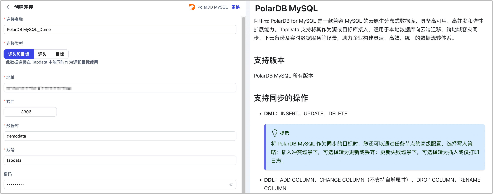

# PolarDB MySQL
import Content from '../../reuse-content/_all-features.md';

<Content />

阿里云 PolarDB for MySQL 是一款兼容 MySQL 的云原生分布式数据库，具备高可用、高并发和弹性扩展能力。TapData 支持将其作为源或目标库接入，适用于本地数据库向云端迁移、跨地域容灾同步、下云备份及实时数据服务等场景，助力企业构建灵活、高效、统一的数据流转体系。

## 支持版本

PolarDB MySQL 所有版本

## 支持同步的操作

- **DML**：INSERT、UPDATE、DELETE

  :::tip

  将 PolarDB MySQL 作为同步的目标时，您还可以通过任务节点的高级配置，选择写入策略：插入冲突场景下，可选择转为更新或丢弃；更新失败场景下，可选择转为插入或仅打印日志。

  :::

- **DDL**：ADD COLUMN、CHANGE COLUMN（不支持自增属性）、DROP COLUMN、RENAME COLUMN

## 准备工作

1. 登录阿里云控制台，创建用于数据同步的[数据库账号](https://help.aliyun.com/zh/polardb/polardb-for-mysql/user-guide/create-and-manage-database-accounts)。

   :::tip

   - 为保障拥有足够的权限完成数据同步，请在创建账号时，选择账号类型为**高权限账号**。
   - 如需进行精细化权限控制，请为源库授予**读取同步表的权限**，为目标库授予**读写权限**。更多介绍，见 [MySQL 账号权限管理](https://help.aliyun.com/zh/dms/manage-user-permissions-on-mysql-databases)。

   :::

2. 开通外网访问地址。如您的 TapData 服务所部署的机器与 PolarDB MySQL 集群属于同一内网，可跳过本步骤。

      1. 在左侧导航栏，选择**数据库连接**。

      2. 单击**开通外网地址**。

      3. 在弹出的对话框中，将 TapData 服务所属的公网地址键入至白名单中。
         
         :::tip
         
         如使用 TapData 云版，则白名单固定为 **47.93.190.224** 和 **47.242.251.110**。
         
         :::
         
      4. 单击**确定**。
      
3. 如需通过公网连接数据库，请为集群[管理集群连接地址](https://help.aliyun.com/zh/polardb/polardb-for-mysql/user-guide/apply-for-a-cluster-endpoint-or-a-primary-endpoint)。

4. （可选）如需读取 PolarDB MySQL 数据表的增量数据，您还需要为其[开启 Binlog](https://help.aliyun.com/zh/polardb/polardb-for-mysql/user-guide/enable-binary-logging)。

   :::tip

   推荐 Binlog 的[保留时长](https://help.aliyun.com/zh/polardb/polardb-for-mysql/user-guide/enable-binary-logging#7962e330893uy)至少设置为 7 天，避免增量变更记录数据被清理，确保增量同步正常进行。
   
   :::

## 连接 PolarDB MySQL

1. [登录 Tapdata 平台](../../user-guide/log-in.md)。

2. 在左侧导航栏，单击**连接管理**。

3. 单击页面右侧的**创建**。

4. 在弹出的对话框中，搜索并选择 **PolarDB MySQL**。

5. 在跳转到的页面，根据下述说明填写 PolarDB MySQL 集群的连接信息。

   

   * **连接信息设置**
     * **连接名称**：填写具有业务意义的独有名称。
     * **连接类型**：支持作为源或目标库。
     * **地址**：PolarDB MySQL 集群的**主地址**，即您在准备工作获取到的外网连接地址或内网连接地址。
     * **端口**：数据库的服务端口，默认为 **3306**。
     * **数据库**：数据库名称，即一个连接对应一个数据库，如有多个数据库则需创建多个数据连接。
     * **账号**：具备高权限的账号名称。
     * **密码**：数据库账号对应的密码。
     * **连接参数**：额外的连接参数，默认为空。
     * **时区**：默认为数据库所用的时区，您也可以根据业务需求手动指定。
   * **高级设置**
     * **共享挖掘**：[挖掘源库](../../user-guide/advanced-settings/share-mining.md)的增量日志，可为多个任务共享源库的增量日志，避免重复读取，从而最大程度上减轻增量同步对源库的压力，开启该功能后还需要选择一个外存用来存储增量日志信息。
     * **包含表**：默认为**全部**，您也可以选择自定义并填写包含的表，多个表之间用英文逗号（,）分隔。
     * **排除表**：打开该开关后，可以设定要排除的表，多个表之间用英文逗号（,）分隔。
     * **Agent 设置**：默认为**平台自动分配**，您也可以手动指定 Agent。
     * **模型加载时间**：如果数据源中的模型数量少于10000个，则每小时更新一次模型信息。但如果模型数量超过10000个，则刷新将在您指定的时间每天进行。
     * **开启心跳表**：当连接类型为源头或目标时，可启用该开关。TapData 会在源库创建 `_tapdata_heartbeat_table` 心跳表，并每 10 秒更新一次（需具备相应权限），用于监测数据源连接与任务的健康状况。心跳任务在数据复制/开发任务启动后自动启动，您可在数据源编辑页面查看心跳任务。

6. 单击**连接测试**，测试通过后单击**保存**。

   :::tip

   如提示连接测试失败，请根据页面提示进行修复。

   :::
