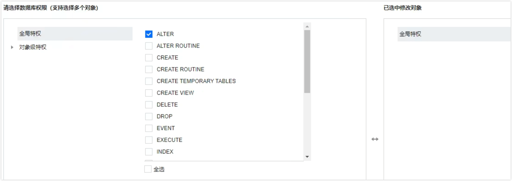
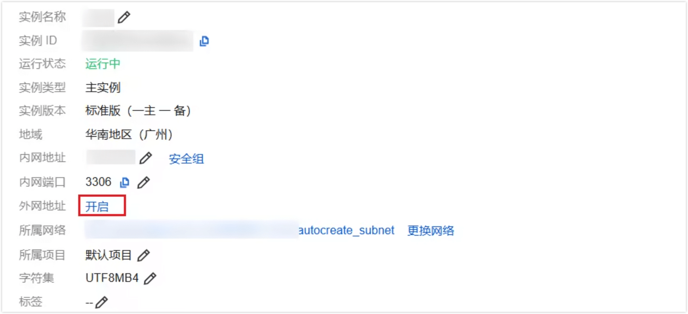
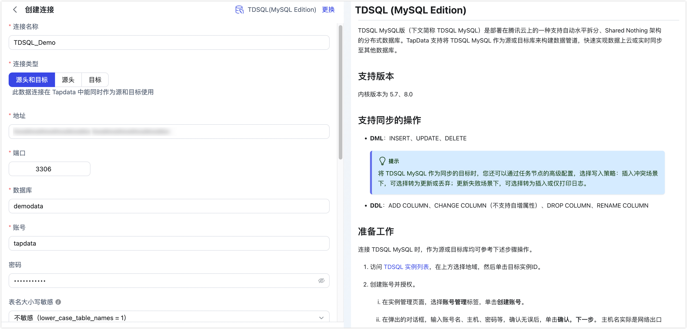
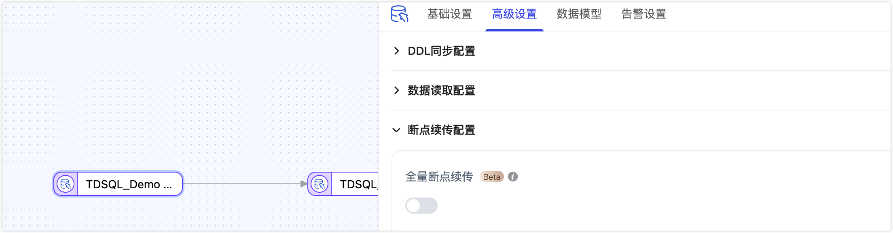

# TDSQL (MySQL Edition)

import Content from '../../reuse-content/_all-features.md';

<Content />

TDSQL MySQL版（下文简称 TDSQL MySQL）是部署在腾讯云上的一种支持自动水平拆分、Shared Nothing 架构的分布式数据库。TapData 支持将 TDSQL MySQL 作为源或目标库来构建数据管道，快速实现数据上云或实时同步至其他数据库。

```mdx-code-block
import Tabs from '@theme/Tabs';
import TabItem from '@theme/TabItem';
```

## 支持版本

内核版本为 5.7、8.0


## 支持同步的操作

- **DML**：INSERT、UPDATE、DELETE

  :::tip

  将 TDSQL MySQL 作为同步的目标时，您还可以通过任务节点的高级配置，选择写入策略：插入冲突场景下，可选择转为更新或丢弃；更新失败场景下，可选择转为插入或仅打印日志。

  :::

- **DDL**：ADD COLUMN、CHANGE COLUMN（不支持自增属性）、DROP COLUMN、RENAME COLUMN

## 准备工作

连接 TDSQL MySQL 时，无论是作为源库还是目标库，均可参考以下步骤操作。此外，由于 TDSQL MySQL 实例默认已开启 binlog 功能，作为源库进行增量同步时无需额外配置。

1. 访问 [TDSQL 实例列表](https://console.cloud.tencent.com/tdsqld/instance-tdmysql)，在上方选择地域，然后单击目标实例ID。

2. 创建账号并授权。
    
    1. 在实例管理页面，选择**账号管理**标签，单击**创建账号**。
    2. 在弹出的对话框，输入账号名、主机、密码等，确认无误后，单击**确认，下一步**。
        主机名实际是网络出口地址，支持 % 的匹配方式，代表所有 IP 均可访问。
    3. 单击该账号右侧的**修改权限**，根据需求选择分配权限后，单击**确定修改**。
        

        <Tabs className="unique-tabs">
        <TabItem value="作为源库" default>

        * **仅读取全量数据**：授予待同步库的 `SELECT` 权限
        * **读取全量+增量数据**：授予待同步库的 `SELECT` 权限，以及复制权限（`REPLICATION SLAVE`、`REPLICATION CLIENT`）
        
        </TabItem>
        
        <TabItem value="作为目标库">

        授予同步目标库的读写权限，包含 `ALTER`、`CREATE`、`CREATE ROUTINE`、`CREATE TEMPORARY TABLES`、`DELETE`、`DROP`、`INSERT`、`SELECT`、`UPDATE` 权限。
        
        </TabItem>
        
        </Tabs>


3. 在**实例详情**页，单击**外网地址区域框**中的**开启**，跟随页面提示完成操作即可获得唯一的外网连接地址。

    

    :::tip
    如果 TapData 所属机器与 TDSQL MySQL 实例属于同一内网，可跳过本步骤。
    :::

## 连接 TDSQL MySQL

1. [登录 Tapdata 平台](../../user-guide/log-in.md)。

2. 在左侧导航栏，单击**连接管理**。

3. 单击页面右侧的**创建**。

4. 在弹出的对话框中，搜索并选择 **TDSQL（MySQL Edition）**。

5. 在跳转到的页面，根据下述说明填写 TDSQL MySQL 的连接信息。

   

   * 连接信息设置
      * **连接名称**：填写具有业务意义的独有名称。
      * **连接类型**：支持作为源或目标库。
      * **地址**：数据库连接地址，即您在准备工作获取到的外网连接地址，如果 TapData 所属机器与 TDSQL MySQL 实例属于同一内网，可填写内网连接地址。
      * **端口**：数据库的服务端口。
      * **数据库**：数据库名称，即一个连接对应一个数据库，如有多个数据库则需创建多个数据连接。
      * **账号**：具备高权限的账号名称。
      * **密码**：数据库账号对应的密码。
      * **表名大小写敏感**：该参数为新建分布式数据库 TDSQL MySQL 实例的初始化参数（默认为不敏感），请根据实例的配置填写。
      * **连接参数**：额外的连接参数，默认为 `useUnicode=yes&characterEncoding=UTF-8`，请根据实例的配置填写，特别是实例的字符集设置。
      * **时区**：时区配置默认为 0 时区。若设置为其他时区，会影响不带时区信息的字段（如 `datetime`）的数据同步。带时区的字段（如 `timestamp`、`date` 和 `time` ）不受影响。   
   * 高级设置
      * **共享挖掘**：[挖掘源库](../../user-guide/advanced-settings/share-mining.md)的增量日志，可为多个任务共享源库的增量日志，避免重复读取，从而最大程度上减轻增量同步对源库的压力，开启该功能后还需要选择一个外存用来存储增量日志信息。
      * **包含表**：默认为**全部**，您也可以选择自定义并填写包含的表，多个表之间用英文逗号（,）分隔。
      * **排除表**：打开该开关后，可以设定要排除的表，多个表之间用英文逗号（,）分隔。
      * **Agent 设置**：默认为**平台自动分配**，您也可以手动指定 Agent。
      * **模型加载时间**：如果数据源中的模型数量少于10000个，则每小时更新一次模型信息。但如果模型数量超过10000个，则刷新将在您指定的时间每天进行。
      * **开启心跳表**：当连接类型为源头或目标时，可启用该开关。TapData 会在源库创建 `_tapdata_heartbeat_table` 心跳表，并每 10 秒更新一次（需具备相应权限），用于监测数据源连接与任务的健康状况。心跳任务在数据复制/开发任务启动后自动启动，您可在数据源编辑页面查看心跳任务。

6. 单击**连接测试**，测试通过后单击**保存**。

   :::tip

   如提示连接测试失败，请根据页面提示进行修复。

   :::


## 节点高级特性

在配置数据同步/转换任务时，将 TDSQL MySQL 作为源或目标节点时，为更好满足业务复杂需求，最大化发挥性能，TapData 为其内置更多高级特性能力，您可以基于业务需求配置：




* **作为源节点**：支持开启**全量断点续传**，在海量数据（记录数超过 1 亿）迁移场景下，可开启此功能，将数据分片并迁移，有效避免数据传输中断而导致的数据丢失和任务执行失败的问题，提高数据迁移的可靠性和效率。 
* **作为目标节点**：可选择当表不存在时的建表类型，包含单表和分区表，关于表类型的更多介绍，见 [TDSQL MySQL 官网文档](https://cloud.tencent.com/document/product/557/8767)。