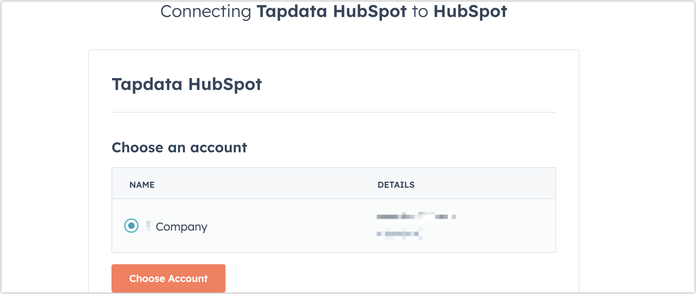

# HubSpot

HubSpot 是一个客户平台，提供连接营销、销售、内容管理和客户服务所需的所有软件、集成和资源。TapData 支持将 HubSpot 作为源库构建数据管道，帮助您读取 HubSpot 的运营数据，并同步到指定的数据源，本文介绍如何在 TapData 中添加 HubSpot 数据源。

## 连接 HubSpot
1. [登录 TapData 平台](../../user-guide/log-in.md)。

2. 在左侧导航栏，单击**连接管理**。

3. 单击页面右侧的**创建**。

4. 在弹出的对话框中，搜索并选择 **HubSpot**。

5. 根据下述说明完成数据源配置。

   

   * **连接名称**：填写具有业务意义的独有名称。
   * **连接类型**：仅支持**源头**。
   * **高级设置**
     * **Agent 设置**：默认为**平台自动分配**，您也可以手动指定。
     * **模型加载时间**：当数据源中模型数量小于 10,000 时，每小时刷新一次模型信息；如果模型数据超过 10,000，则每天按照您指定的时间刷新模型信息。

6. 单击**授权**，在跳转到的 **HubSpot** 授权页面，登录并选择要授权的账号。

   

   完成操作后，页面将自动返回至数据源配置页面并显示**成功授权**。

7. 单击**连接测试**，测试通过后单击**保存**。

   :::tip

   如提示连接测试失败，请根据页面提示进行修复。

   :::