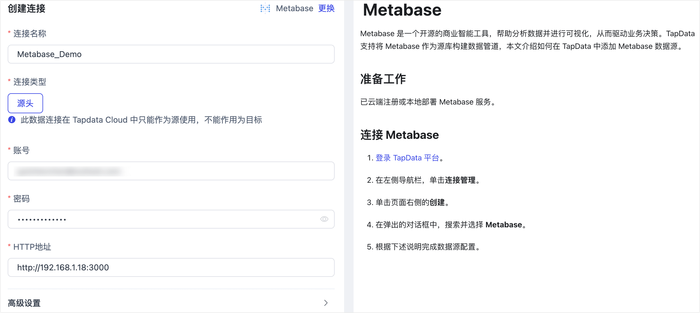

# Metabase
import Content from '../../reuse-content/_enterprise-and-cloud-features.md';

<Content />

Metabase 是一个开源的商业智能工具，帮助分析数据并进行可视化，从而驱动业务决策。TapData 支持将 Metabase 作为源库构建数据管道，本文介绍如何在 TapData 中添加 Metabase 数据源。

## 准备工作

已云端注册或本地部署 Metabase 服务。

## 连接 Metabase

1. [登录 TapData 平台](../../user-guide/log-in.md)。

2. 在左侧导航栏，单击**连接管理**。

3. 单击页面右侧的**创建**。

4. 在弹出的对话框中，搜索并选择 **Metabase**。

5. 根据下述说明完成数据源配置。

   

   * **连接信息设置**
       * **连接名称**：填写具有业务意义的独有名称。
       * **连接类型**：仅支持将 Metabase 作为源库。
       * **账号**：填写 Metabase 的登录账号，通常是邮箱地址。
       * **密码**：Metabase 账号对应的密码。
       * **HTTP 地址**：填写 Metabase 连接地址，包含端口号，例如 `http://192.168.1.18:3000`。
   * **高级设置**
       * **Agent 设置**：默认为**平台自动分配**，您也可以手动指定 Agent。
       * **模型加载频率**：当数据源中模型数量小于1万时，TapData 将每小时更新一次模型；当数据源中模型数量大于 10,000 时，会每天按照指定的时间进行模型刷新。

6. 单击**连接测试**，测试通过后单击**保存**。

   :::tip

   如提示连接测试失败，请根据页面提示进行修复。

   :::