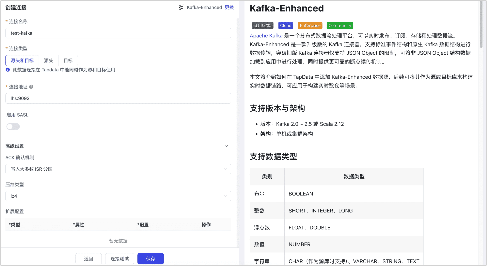

# Kafka-Enhanced
[Apache Kafka](https://kafka.apache.org/) 是一个分布式数据流处理平台，可以实时发布、订阅、存储和处理数据流。Kafka-Enhanced 是一款升级版的 Kafka 连接器，支持标准、原生 Kafka、Flink、Canal、Debezium 数据结构进行数据传输，突破旧版 Kafka 连接器仅支持 JSON Object 的限制，可将非 JSON Object 结构数据加载到应用中进行处理，同时提供更可靠的断点续传机制。

本文将介绍如何在 TapData 中添加 Kafka-Enhanced 数据源，后续可将其作为**源**或**目标库**来构建实时数据链路，可应用于构建实时数仓等场景。

:::tip

Kafka-Enhanced 数据源在 3.15.0 版本开始支持。

:::

```mdx-code-block
import Tabs from '@theme/Tabs';
import TabItem from '@theme/TabItem';
```

## 支持版本与架构

* **版本**：Kafka 2.0 ~ 2.5（基于 Scala 2.12 构建）
* **架构**：单机或集群架构

## 支持数据类型

| 类别       | 数据类型                                      |
| ---------- | --------------------------------------------- |
| 布尔       | BOOLEAN                                       |
| 整数       | SHORT、INTEGER、LONG                          |
| 浮点数     | FLOAT、DOUBLE                                 |
| 数值       | NUMBER                                        |
| 字符串     | CHAR（作为源库时支持）、VARCHAR、STRING、TEXT |
| 二进制     | BINARY                                        |
| 复合类型   | ARRAY、MAP、OBJECT（作为源库时支持）          |
| 日期/时间  | TIME、DATE、DATETIME、TIMESTAMP               |
| 唯一标识符 | UUID（作为源库时支持）                        |

## 消费说明

在后续配置数据复制/数据转换任务时，可通过右上角的任务设置，指定数据同步方式，对应的消费说明如下：

- **仅全量**：从第一条数据开始读取，直到记录的增量位点后停止任务。
- **全量 + 增量**：同样从第一条数据读取到记录位点，然后持续同步增量数据。
- **仅增量**：选择增量采集的起点为**此刻**，代表从当前位点开始同步；设置为**选择时间**，代表根据指定时间换算位点，从该位点开始同步。

:::tip

由于 Kafka 作为消息队列仅支持追加写入，应避免因源端重复消费带来的目标端出现重复数据。

:::

## 功能限制

- **数据类型适配**：作为数据源时，Kafka 的数据类型需要根据目标数据源的要求进行适当调整，或者手动在目标端创建相应的表结构以确保兼容性。
- **消息推送保障**：由于 Kafka 采用 `At least once` 消息推送语义，并且只支持追加写入，可能导致重复消费。在目标端，需通过实现幂等性保障，避免因源端重复消费而产生重复数据。
- **消费模式限制**：消费线程采用不同的消费组编号，请注意对消费并发度的影响。
- **安全认证限制**：当前仅支持免认证的 Kafka 实例。


## 连接 Kafka-Enhanced

1. 登录 Tapdata 平台。

2. 在左侧导航栏，单击**连接管理**。

3. 在页面右侧，单击**创建连接**。

4. 在跳转到的页面，搜索并选择 **Kafka-Enhanced**。

5. 根据下述说明完成数据源配置。

    

    * **连接设置**
        * **连接名称**：填写具有业务意义的独有名称。
        * **连接类型**：支持将 Kafka 作为源或目标库。
        * **连接地址**：Kafka 连接地址，包含地址和端口号，两者之间用英文冒号（:）分隔，例如 `113.222.22.***:9092`。
        * **启用 SASL**：是否启用 Kafka 的 SASL（Simple Authentication and Security Layer）认证机制，启用后需配置用户名、密码及 SASL 机制（如 **SCRAM-SHA-512** 算法加密）。
    * **高级设置**
        * **ACK 确认机制**：根据业务需求选择：不确认、仅写入 Master 分区、写入大多数 ISR 分区（默认）或写入所有 ISR 分区。
        * **压缩类型**：支持 **lz4**（默认）、**gzip**、**snappy**、**zstd**，消息量较大时可开启压缩以提高传输效率。
        * **扩展配置**：支持自定义 Kafka 管理者、生产者和消费者的高级连接属性，用于特定场景下的优化。
        * **共享挖掘**：挖掘源库的增量日志，可为多个任务共享源库的增量日志，避免重复读取，从而最大程度上减轻增量同步对源库的压力，开启该功能后还需要选择一个外存用来存储增量日志信息。
        * **包含表**：默认为**全部**，您也可以选择自定义并填写包含的表，多个表之间用英文逗号（,）分隔。
        * **排除表**：打开该开关后，可以设定要排除的表，多个表之间用英文逗号（,）分隔。
        * **Agent 设置**：默认为**平台自动分配**，您也可以手动指定 Agent。
        * **模型加载时间**：如果数据源中的模型数量少于10000个，则每小时更新一次模型信息。但如果模型数量超过10000个，则刷新将在您指定的时间每天进行。
    
6. 单击**连接测试**，测试通过后单击**保存**。

   :::tip

   如提示连接测试失败，请根据页面提示进行修复。

   :::


## 节点高级配置

在配置数据同步/转换任务时，将 Kafka-Enhanced 作为源或目标节点时，为更好满足业务复杂需求，最大化发挥性能，TapData 为其内置更多高级特性能力，您可以基于业务需求配置：


* 作为源节点

  **最大读并发数**：默认`1`，即单线程读，当设置大于 `1` 且主题 + 分区数大于 `1` 时生效，取两者最小值。

* 作为目标节点

  - **推送 Topic**：指定 Kafka 数据写入的目标 Topic，支持通过 `{db_name}`、`{schema_name}`、`{table_name}` 通配符动态拼接，实现按库表自动命名。
  
  - **副本数：**默认`1`，创建主题时使用，主题存在时不生效。
  
  - **分区数：**默认`3`，创建主题时使用，当配置大于对应主题的分区数时会自动扩充分区。
  
  - **结构模式**：您可以根据业务需求，选择数据写入目标端的结构模式：
  
```mdx-code-block
<Tabs className="unique-tabs">
<TabItem value="标准结构（默认）">
```

**说明**：支持同步完整的 DML 操作（INSERT、UPDATE、DELETE），作为源时解析并还原 DML + DDL 事件，作用于下游；作为目标时标准化存储这些事件，便于后续任务解析。

**典型案例**：在 **CDC 缓存队列** 中，使用“标准结构”将关系型数据变更事件从 MySQL 写入 Kafka，再消费写入其它数据库。

**样例数据**：

```js
{
    "ts": 1727097087513, 
    "op": "DML:UPDATE",
    "opTs": 1727097087512, 
    "namespaces": [], 
    "table": "表名",
    "before": {}, 
    "after": {}, 
}
```

- **ts**：应用解析事件的时间戳，用于记录事件被解析的时间点。
- **op**：事件类型，指示操作的具体类型，如 `DML:INSERT`、`DML:UPDATE`、`DML:DELETE`。
- **opTs**：事件发生时间戳，表示数据变更实际发生的时间。
- **namespaces**：多 schema 场景下的 schema 名称集合。
- **table**：表名，指示数据变更所在的表。
- **before**：修改前的数据内容，仅在 `UPDATE` 和 `DELETE` 操作时有值。
- **after**：修改后的数据内容，适用于 `INSERT` 和 `UPDATE` 操作。


</TabItem>

<TabItem value="原生结构">

**说明**：采用原生 Kafka 的数据同步方式，仅支持追加写入，类似 `INSERT`，作为源时处理复杂无规律的数据，传递至下游；作为目标时灵活控制分区、头信息、键和值信息，更自由地写入自定义数据。

**典型案例**：用于 **同构数据迁移** 或 **非结构化数据转换**，通过 Kafka -> JS 处理节点 -> Kafka/MySQL 的数据链路实现数据过滤和转换。**样例数据**：

```js
  {
    "offset": 12345,
    "timestampType": "LogAppendTime",
    "partition": 3,
    "timestamp": 1638349200000,
    "headers": {
      "headerKey1": "headerValue1",
    },
    "key": "user123",
    "value": {
      "id": 1,
      "name": "John Doe",
      "action": "login",
      "timestamp": "2021-12-01T10:00:00Z"
    }
  }
```

  - **offset**：偏移量标识消息位点，不写入目标消息体。
  - **timestampType**：时间戳类型，仅用于元数据，不作用于消息体。
  - **partition**：指定消息写入的分区号，有值时按指定分区写入。
  - **timestamp**：消息创建时间，有值时使用指定时间，否则为系统时间。
  - **headers**：消息头部信息，存在时写入头部，携带额外元数据。
  - **key**：消息键值，用于分区策略或标识消息来源。
  - **value**：消息内容，承载实际业务数据。

</TabItem>

<TabItem value="Canal">

**说明**：兼容开源 Canal 标准格式，支持详细的 MySQL 类型信息和结构变更（DDL/DML）。数据同步时携带详细的数据库类型、字段信息和元数据，适合对接 Canal 生态或要求保留 MySQL 原始信息的场景。

**典型案例**：适合需要消费 Canal 格式数据的场景，比如 Kafka → Hudi 或 Spark Streaming 等大数据生态的实时处理链路。

**样例数据**：

```json
{
  "data": [
    {
      "id": "1",
      "name": "张三",
      "age": "25",
      "update_time": "2023-10-01 12:00:00"
    }
  ],
  "database": "test_db",
  "es": 1696156800000,
  "id": 123456,
  "isDdl": false,
  "mysqlType": {
    "id": "int(11)",
    "name": "varchar(255)",
    "age": "int(11)",
    "update_time": "datetime"
  },
  "old": [
    {
      "age": "24"
    }
  ],
  "pkNames": ["id"],
  "sql": "",
  "table": "user",
  "ts": 1696156800123,
  "type": "UPDATE"
}
```

**参数说明**：

- **data**：变更后的数据内容，数组格式，包含所有变更后的字段值
- **database**：数据库名称，标识数据所属的数据库
- **es**：事件时间戳，毫秒级，表示事件发生的时间点
- **id**：事件唯一标识，用于追踪事件
- **isDdl**：是否为 DDL 操作，用于区分数据变更和结构变更
- **mysqlType**：MySQL 字段类型信息，包含每个字段的 MySQL 类型定义
- **old**：变更前的数据内容，数组格式，包含所有变更前的字段值
- **pkNames**：主键字段列表，用于标识表的主键
- **sql**：执行的 SQL 语句，记录导致变更的 SQL
- **table**：表名，标识数据所属的表
- **ts**：事件时间戳，毫秒级，表示事件发生的时间点
- **type**：事件类型，表示数据变更的操作类型

</TabItem>

<TabItem value="Debezium">

**说明**：与开源 Debezium 格式兼容，完整保留 Schema 定义和 binlog 元数据，可用于事务数据追踪和数据校验场景。

**典型案例**：适用于数据审计、实时数据验证、跨系统数据同步和质量管控等严格要求事务一致性与完整 schema 的场景。

**样例数据**：

```sql
{
  "before": {                          // 仅 UPDATE/DELETE 存在
    "id": 1,
    "name": "张三",
    "age": 24,
    "update_time": "2023-10-01 12:00:00"
  },
  "after": {                           // INSERT/UPDATE 后数据
    "id": 1,
    "name": "张三",
    "age": 25,
    "update_time": "2023-10-01 12:00:00"
  },
  "source": {
    "version": "2.3.0",
    "connector": "mysql",
    "name": "dbserver1",
    "ts_ms": 1696156800123,
    "snapshot": "false",
    "db": "test_db", 
    "table": "user",
    "server_id": 223344,
    "file": "mysql-bin.000001",
    "pos": 12345,
  },
  "op": "u",    
  "ts_ms": 1696156800123
}
```

**参数说明**：

- **before**：变更前的数据，包含所有变更前的字段值，仅当事件为更新和删除时存在。
- **after**：变更后的数据，包含所有变更后的字段值，仅当事件为插入和更新时存在。
- **source**：源信息，包含详细的源系统元数据
  - **version**：Debezium 版本信息
  - **connector**：连接器类型，如 "mysql"
  - **name**：逻辑服务器名称
  - **ts_ms**：时间时间戳，单位为毫秒
  - **snapshot**：是否为快照操作
  - **db**：数据库名
  - **table**：表名
  - **server_id**：服务器ID
  - **file**：binlog 文件名
  - **pos**：binlog 位置
- **op**：操作类型，表示数据变更的操作类型，取值：**c**（创建）、**u**（更新）、**d**（删除）
- **ts_ms**：事件时间戳，毫秒级

</TabItem>

<TabItem value="Flink CDC">

**说明**：兼容 Flink CDC 项目的轻量级变更数据结构，使用简单直观的操作符表示变更类型，支持与 Flink 生态系统的无缝集成，可直接用于 Flink SQL 或流式计算作业。

**典型案例**：主要用于 Kafka 数据源直接接入 Flink 流式计算场景，如实时维表更新、实时数据分析与指标计算等。

**样例数据**：

```json
{
    "data": {
        "order_id": 1,
        "quantity": 10
    },
    "op": "-U"
}
```

**参数说明**：

- **data**：数据内容，包含所有字段值
- **op**：操作类型，使用简化的符号表示
  - **+I**：插入操作
  - **-U**：更新前的数据
  - **+U**：更新后的数据
  - **-D**：删除操作

</TabItem>
</Tabs>

