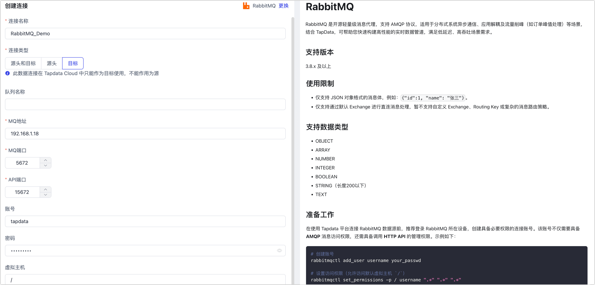

# RabbitMQ
import Content from '../../reuse-content/_all-features.md';

<Content />

RabbitMQ 是开源轻量级消息代理，支持 AMQP 协议，适用于分布式系统异步通信、应用解耦及流量削峰（如订单峰值处理）等场景，结合 TapData，可帮助您快速构建高性能的实时数据管道，满足低延迟、高吞吐场景需求。

## 支持版本

3.8.x 及以上

## 准备工作

在使用 Tapdata 平台连接 RabbitMQ 数据源前，推荐登录 RabbitMQ 所在设备，创建具备必要权限的连接账号。该账号不仅需要具备 **AMQP** 消息访问权限，还需具备调用 **HTTP API** 的管理权限。示例如下：

```bash
# 创建账号
rabbitmqctl add_user username your_passwd

# 设置访问权限（允许访问默认虚拟主机 `/`）
rabbitmqctl set_permissions -p / username ".*" ".*" ".*"

# 设置用户标签，授予管理 API 权限（供 Tapdata 使用 HTTP API）
rabbitmqctl set_user_tags tapdata management
```

- **username**：要创建的账号名。
- **your_passwd**：新账号对应的密码。


## 连接 RabbitMQ

1. [登录 Tapdata 平台](../../user-guide/log-in.md)。

2. 在左侧导航栏，单击**连接管理**。

3. 在页面右侧，单击**创建连接**。

4. 在跳转到的页面，搜索并选择 **RabbitMQ**。

5. 根据下述说明完成 RabbitMQ 数据源配置。

   

    * **连接信息设置**
      * **连接名称**：填写具有业务意义的独有名称。
      * **连接类型**：支持将 RabbitMQ 作为源或目标库。
      * **队列名称**：默认为空，TapData 将加载所有队列（Queue），您也可以手动指定，多个队列名称间采用英文逗号（,）分隔。
      * **MQ 地址**：填写 RabbitMQ 的服务器地址，支持 IP 或域名。
      * **MQ 端口**：RabbitMQ 的 AMQP 服务端口，默认为 **5672**，Tapdata 将通过此端口读取消息数据。
      * **API 端口**：RabbitMQ 管理接口的 HTTP API 端口，默认为 **15672**，用于获取队列元数据等信息。
      * **账号**、**密码**：填写已配置的 RabbitMQ 用户名和密码。该账号需同时拥有 AMQP 消息权限和 HTTP API 权限。若尚未配置账号，可参考前文的准备工作章节，通过 `rabbitmqctl` 命令行创建。
      * **虚拟主机**：RabbitMQ 的 Virtual Host（虚拟主机），可用于实现消息隔离。默认为 `/`。如填写其他虚拟主机，需确保该账号拥有对应虚拟主机的访问权限。
    * **高级设置**
      * **共享挖掘**：[挖掘源库](../../user-guide/advanced-settings/share-mining.md)的增量日志，可为多个任务共享源库的增量日志，避免重复读取，从而最大程度上减轻增量同步对源库的压力，开启该功能后还需要选择一个外存用来存储增量日志信息。
      * **Agent 设置**：默认为**平台自动分配**，您也可以手动指定。
      * **模型加载频率**：数据源中模型数量大于 1 万时，Tapdata 将按照本参数的设定定期刷新模型。

6. 单击**连接测试**，测试通过后单击**保存**。

   :::tip

   如提示连接测试失败，请根据页面提示进行修复。

   :::


## 常见问题

- **问**：进行连接测试时，报错 `ACCESS_REFUSED - Login was refused using authentication mechanism PLAIN`？

  **答**：通常是因为 RabbitMQ 拒绝了连接请求，例如账号密码不正确或用户没有对应虚拟主机的权限，可参考准备工作章节创建账号并完成授权。

- **问**：进行连接测试时，报错 `401 Unauthorized` 或 `HttpClientErrorException: 401`？

  **答**：通常是当前账号没有权限访问 RabbitMQ 的 HTTP API（默认端口 15672），或者 API 端口填写错误，Tapdata 无法获取队列等元数据。您可以通过 `rabbitmqctl set_user_tags your_username management` 命令完成售前，随后可在浏览器中访问 `http://<MQ地址>:15672`，验证该账号是否可以登录管理界面。

  :::tip

  可选择使用更高权限标签： `administrator`（拥有完全管理权限）。

  :::

