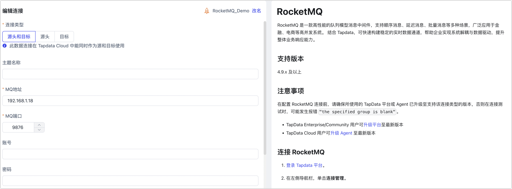

# RocketMQ
import Content from '../../reuse-content/_all-features.md';

<Content />

RocketMQ 是一款高性能的队列模型消息中间件，支持顺序消息、延迟消息、批量消息等多种场景，广泛应用于金融、电商等高并发系统。 结合 Tapdata，可快速构建稳定的实时数据通道，帮助企业实现系统解耦与数据驱动，提升整体业务响应能力。

## 支持版本

4.9.x 及以上

## 注意事项

在配置 RocketMQ 连接前，请确保所使用的 TapData 平台或 Agent 已升级至支持该连接类型的版本，否则在连接测试时，可能发生报错 `"the specified group is blank"`。

- TapData Enterprise/Community 用户可[升级平台](../../administration/operation.md)至最新版本
- TapData Cloud 用户可[升级 Agent](../../user-guide/manage-agent.md) 至最新版本

## 连接 RocketMQ

1. [登录 Tapdata 平台](../../user-guide/log-in.md)。

2. 在左侧导航栏，单击**连接管理**。

3. 在页面右侧，单击**创建连接**。

4. 在跳转到的页面，搜索并选择 **RocketMQ**。

5. 根据下述说明完成 RocketMQ 数据源配置。

   

    * **连接信息设置**
      * **连接名称**：填写具有业务意义的独有名称。
      * **连接类型**：支持将 RocketMQ 作为源或目标库。
      * **主题名称**：默认为空，TapData 将加载所有主题（Topic），您也可以手动指定，多个主题名称间采用英文逗号（,）分隔。
      * **MQ 地址**：填写 RocketMQ 的服务器地址，支持 IP 或域名。
      * **MQ 端口**：RocketMQ 的 AMQP 服务端口，默认为 **9876**，Tapdata 将通过此端口读取消息数据。
      * **账号**、**密码**：填写已配置的 RocketMQ 用户名和密码。
    * **高级设置**
      * **共享挖掘**：[挖掘源库](../../user-guide/advanced-settings/share-mining.md)的增量日志，可为多个任务共享源库的增量日志，避免重复读取，从而最大程度上减轻增量同步对源库的压力，开启该功能后还需要选择一个外存用来存储增量日志信息。
      * **Agent 设置**：默认为**平台自动分配**，您也可以手动指定。
      * **模型加载频率**：数据源中模型数量大于 1 万时，Tapdata 将按照本参数的设定定期刷新模型。
      * **开启心跳表**：当连接类型为源头或目标时，可启用该开关。TapData 会在源库创建 `_tapdata_heartbeat_table` 心跳表，并每 10 秒更新一次（需具备相应权限），用于监测数据源连接与任务的健康状况。心跳任务在数据复制/开发任务启动后自动启动，您可在数据源编辑页面查看心跳任务。
   
6. 单击**连接测试**，测试通过后单击**保存**。

   :::tip

   如提示连接测试失败，请根据页面提示进行修复。

   :::
