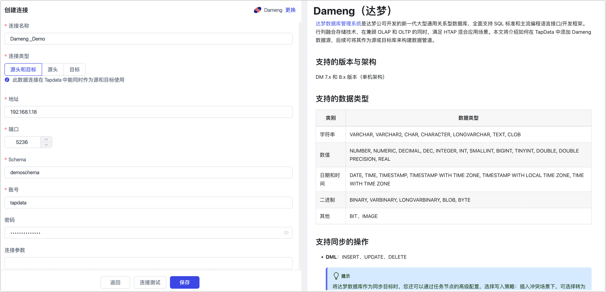
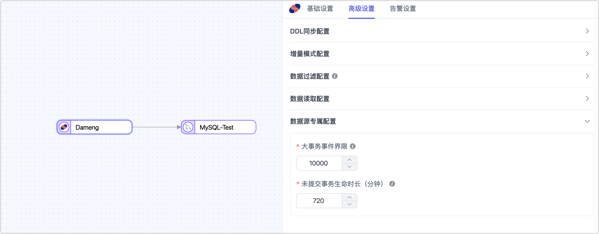

# Dameng（达梦）
[达梦数据库管理系统](https://www.dameng.com/DM8.html)是达梦公司开发的新一代大型通用关系型数据库，全面支持 SQL 标准和主流编程语言接口/开发框架。行列融合存储技术，在兼顾 OLAP 和 OLTP 的同时，满足 HTAP 混合应用场景。本文将介绍如何在 TapData 中添加 Dameng 数据源，后续可将其作为源或目标库来构建数据管道。

```mdx-code-block
import Tabs from '@theme/Tabs';
import TabItem from '@theme/TabItem';
```

## 支持的版本与架构

DM 7.x 和 8.x 版本（单机架构）

## 支持的数据类型

| 类别       | 数据类型                                                     |
| ---------- | ------------------------------------------------------------ |
| 字符串     | VARCHAR, VARCHAR2, CHAR, CHARACTER, LONGVARCHAR, TEXT, CLOB  |
| 数值       | NUMBER, NUMERIC, DECIMAL, DEC, INTEGER, INT, SMALLINT, BIGINT, TINYINT, DOUBLE, DOUBLE PRECISION, REAL |
| 日期和时间 | DATE, TIME, TIMESTAMP, TIMESTAMP WITH TIME ZONE, TIMESTAMP WITH LOCAL TIME ZONE, TIME WITH TIME ZONE |
| 二进制     | BINARY, VARBINARY, LONGVARBINARY, BLOB, BYTE                 |
| 其他       | BIT、IMAGE                                                   |

## 支持同步的操作

- **DML**：INSERT、UPDATE、DELETE

  :::tip

  将达梦数据库作为同步目标时，您还可以通过任务节点的高级配置，选择写入策略：插入冲突场景下，可选择转为更新或丢弃；更新失败场景下，可选择转为插入或仅打印日志。

  :::

- **DDL**：ADD COLUMN、CHANGE COLUMN、DROP COLUMN、RENAME COLUMN

## 注意事项

* 增量日志挖掘利用官方功能加载日志文件至临时视图，过滤追踪表的 DML 和 DDL 日志，类似于 Oracle 的 LogMiner，会占用一些数据库性能。若同步任务多且数据表分散，建议使用共享挖掘以降低数据库负载。
* 当数据库日志空间不足时，可以使用命令 `SF_ARCHIVELOG_DELETE_BEFORE_TIME(SYSDATE-1);` 来清理一天前的归档日志，从而仅保留最近一天的日志记录，您也可以根据需要指定保留的天数。

## 准备工作

在连接达梦数据库前，您还需要完成数据库账号的授权等准备工作：

* [作为源库](#source)
* [作为目标库](#target)

### <span id="source">作为源库</span>

1. 以拥有 DBA 权限的身份登录达梦数据库。

2. 依次执行下述格式的命令，创建用于数据复制/转换任务的用户。

   ```sql
   CREATE USER username IDENTIFIED BY "password" DEFAULT TABLESPACE table_space_name;
   ```

   * **username**：用户名。
   * **pass_word**：密码。
   * **table_space_name**：表空间名称。

3. 为刚创建的账号授予权限，您也可以基于业务需求自定义权限控制。

   ```mdx-code-block
   <Tabs className="unique-tabs">
   <TabItem value="仅读取全量数据">
   ```
   ```sql
   -- 替换下述命令中的 username 为真实的用户名，同 Schema 下无需授权
   GRANT SELECT ANY TABLE TO username;
   ```
   </TabItem>

   <TabItem value="读取全量+增量数据">

   ```sql
   -- 替换下述命令中的 username 为真实的用户名
   -- 查询表
   GRANT SELECT ANY TABLE TO username;
   -- 查询数据库初始化加载信息记录表
   GRANT SELECT ON V$DM_INI TO username;
   -- 查询归档日志信息
   GRANT SELECT ON V$ARCHIVED_LOG TO username;
   -- 查询归档日志总体信息
   GRANT SELECT ON V$RLOG TO username;
   -- 查询归档日志分析视图
   GRANT SELECT ON V$LOGMNR_CONTENTS TO username;
   -- 查询会话视图
   GRANT SELECT ON V$SESSIONS TO username;
   -- 查询事务视图
   GRANT SELECT ON V$TRX TO username;
   ```
   </TabItem>
   </Tabs>

4. 如需获取源库的数据变更以实现增量同步，您还需要跟随下述步骤开启数据库的归档功能和归档日志。

   1. 开启归档日志，详细参数介绍，见[达梦官网](https://eco.dameng.com/document/dm/zh-cn/pm/backup-restore-combat#3.1.2%20%E5%BD%92%E6%A1%A3%E9%85%8D%E7%BD%AE)。

      :::tip

      您也可以执行 `SELECT para_name, para_value FROM v$dm_ini WHERE para_name IN ('ARCH_INI','RLOG_APPEND_LOGIC');` 命令来查看是否已开启该功能，返回结果中， **PARA_VALUE** 列的值为 **1** 表示已开启，可跳过本步骤。

      :::

      ```sql
      -- 修改数据库为 MOUNT 状态
      ALTER DATABASE MOUNT;
      
      -- 配置本地归档，DEST 指定的目录不存在时会自动创建
      -- FILE_SIZE 表示单个归档文件大小，单位为 MB；SPACE_LIMIT 表示空间大小限制，取值为 0 表示不限制，后续可通过命令定期清理
      ALTER DATABASE ADD ARCHIVELOG 'DEST = /bak/dmdata/dameng, TYPE = local, FILE_SIZE = 1024, SPACE_LIMIT = 0';
      
      -- 开启归档模式
      ALTER DATABASE ARCHIVELOG;
      
      -- 修改数据库为 OPEN 状态
      ALTER DATABASE OPEN;
      ```

   2. 开启附加日志。

      ```sql
      -- 开启附加日志，推荐取值为 2，即不论是否有主键列，记录 UPDATE 和 DELETE 操作时包含所有列的信息
      ALTER SYSTEM SET 'RLOG_APPEND_LOGIC'=2 MEMORY;
      ```


### <span id="target">作为目标库</span>

1. 以拥有 DBA 权限的身份登录达梦数据库。

2. 依次执行下述格式的命令，创建用于数据复制/转换任务的用户。

   ```sql
   CREATE USER username IDENTIFIED BY "password" DEFAULT TABLESPACE table_space_name;
   ```

   * **username**：用户名。
   * **password**：密码。
   * **table_space_name**：表空间名称。

3. 为刚创建的账号授予权限，您也可以基于业务需求自定义权限控制。

   ```sql
   -- 替换下述命令中的 username 为真实的用户名
   GRANT CREATE TABLE, CREATE INDEX TO username;
   ```

## 添加数据源

1. 登录 TapData 平台。

2. 在左侧导航栏，单击**连接管理**。

3. 单击页面右侧的**创建**。

4. 在弹出的对话框中，搜索并选择 **Dameng**。

5. 在跳转到的页面，根据下述说明填写达梦数据库的连接信息。

   

   * **连接信息设置**
     
     * **连接名称**：填写具有业务意义的独有名称。
     * **连接类型**：支持将达梦数据库作为源或目标库。
     * **地址**：数据库连接地址。
     * **端口**：数据库的服务端口，默认为 5236。
     * **Schema**：Schema 名称，创建数据库用户时，达梦数据库会为自动创建一个与用户名相同的 Schema（全大写），如需连接多个 Schema 则需创建多个数据连接。
     * **账号**：数据库的账号。
     * **密码**：数据库账号对应的密码。
     * **连接参数**：额外的连接参数，默认为空。
     * **时区**：默认为 0 时区，如果更改为其他时区，不带时区的字段（如 TIMESTAMP）会受到影响，而带时区的字段（如 TIMESTAMP WITH TIME ZONE）和 DATE 类型则不会受到影响。
   * **高级设置**
     * **共享挖掘**：挖掘源库的增量日志，可为多个任务共享同一源库的增量日志采集进程，从而避免重复读取，从而最大程度上减轻增量同步对源库的压力，开启该功能后还需要选择一个外存用来存储增量日志信息。
     * **包含表**：默认为**全部**，您也可以选择自定义并填写包含的表，多个表之间用英文逗号（,）分隔。
     * **排除表**：打开该开关后，可以设定要排除的表，多个表之间用英文逗号（,）分隔。
     * **Agent 设置**：默认为**平台自动分配**，您也可以手动指定 Agent。
     * **模型加载时间**：如果数据源中的模型数量少于10000个，则每小时更新一次模型信息。但如果模型数量超过10000个，则刷新将在您指定的时间每天进行。
     * **开启心跳表**：当连接类型选择为**源头和目标**、**源头**时，支持打开该开关，由 TapData 在源库中创建一个名为 **_tapdata_heartbeat_table** 的心跳表并每隔 10 秒更新一次其中的数据（数据库账号需具备相关权限），用于数据源连接与任务的健康度监测。
       :::tip
       数据源需在数据复制/开发任务引用并启动后，心跳任务任务才会启动，此时您可以再次进入该数据源的编辑页面，即可单击**查看心跳任务**。
       :::


6. 单击**连接测试**，测试通过后单击**保存**。

   :::tip

   如提示连接测试失败，请根据页面提示进行修复。

   :::

## 节点高级特性

在配置数据同步/转换任务时，将 Dameng 作为**源节点**时，为更好满足业务复杂需求，最大化发挥性能，TapData 为其内置更多高级特性能力，您可以基于业务需求配置：



* **大事务事件界限**：使用 LogMiner 方案获取增量数据时，可通过该设置确定进入大事务逻辑的界限，默认为 10000（DML 事件数）。设置过大会增加内存压力，导致 OOM 风险；设置过小则频繁依赖磁盘缓存大事务而影响性能。因此，业务上应尽量避免千万级以上的数据批量写入操作，如 `insert into select` 或批量 `update` 等。
* **未提交事务生命时长**：为避免重启任务时数据丢失，TapData 会将长时间未提交的事务保留在任务缓存中，并在重启时从最早的未提交事务开始挖掘。为确保采集性能，您可以通过该参数控制未提交事务的保留时长（默认 702 分钟），超过该时长的事务将被自动清理。
