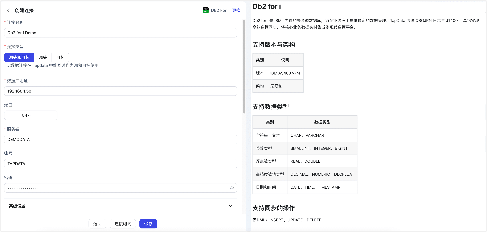
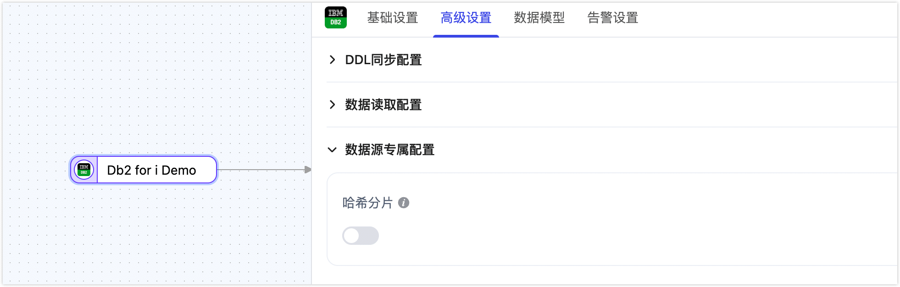

# Db2 for i


Db2 for i 是 IBM i 内置的关系型数据库，为企业级应用提供数据管理服务。TapData 通过 QSQJRN 日志与 JT400 工具包实现高效数据同步，将运行在 Db2 for i 上的核心业务数据实时集成到现代数据平台。

```mdx-code-block
import Tabs from '@theme/Tabs';
import TabItem from '@theme/TabItem';
```

## 支持版本与架构

| 类别 | 说明                                                         |
| ---- | ------------------------------------------------------------ |
| 版本 | IBM AS400 v7r4 |
| 架构 | 无限制    |

## 支持数据类型

| 类别      | 数据类型                     |
| ------- | ------------------------ |
| 字符串与文本  | CHAR、VARCHAR             |
| 整数类型    | SMALLINT、INTEGER、BIGINT  |
| 浮点数类型   | REAL、DOUBLE              |
| 高精度数值类型 | DECIMAL、NUMERIC、DECFLOAT |
| 日期和时间   | DATE、TIME、TIMESTAMP      |

## 支持同步的操作

仅**DML**：INSERT、UPDATE、DELETE

:::tip

当 Db2 for i 作为目标库时，支持在插入冲突时转为更新（类似 UPSERT）。

:::


## 注意事项

- 当 Db2 for i 作为源库并启用增量读取时，需要为 TapData 提供一个用于中转 Journal 数据的专用 Library。如果连接用户具备执行 `CRTLIB` 权限，测试连接或启动任务时会自动创建该 Library，您也可手动执行如下命令创建该 Library，TapData 会自动识别并启用：
    ```cl
    # 默认创建连接时，TAPLIB 为默认的 Library 名称
    CRTLIB LIB(TAPLIB) TEXT('TapData journal transit station')
    ```

- 获取增量变更时，系统会以多线程方式执行 Db2 for i 命令与 SQL 语句读取增量日志，因此会给数据库带来一定压力，并占用网络带宽和磁盘 I/O 资源。

## 准备工作

在连接 Db2 for i 数据库前，需完成账号授权等准备工作。本文以 IBM i 7.4 平台为例演示相关操作。

### 作为源库

1. 在 IBM i 的命令行环境中（可通过 5250 终端会话或 IBM ACS 终端访问），执行以下 CL 命令创建用户。

    ```bash
    # 请基于真实情况替换下述命令中的账号和密码
    CRTUSRPRF USRPRF(TAPDATA) PASSWORD(Password) 
    USRCLS(*USER) TEXT('TapData Connector User') SPCAUT(*AUDIT) INLPGM(*NONE)
    INLMNU(*SIGNOFF) LMTCPB(*YES)
    ```
2. 为刚创建的账号授予权限。

      ```mdx-code-block
      <Tabs className="unique-tabs">
      <TabItem value="全量数据同步">
      ```
      
      在 IBM i 的命令行环境中（可通过 5250 终端会话或 IBM ACS 终端访问），执行以下 CL 命令为业务库与对象赋权（请将 `TESTCDC` 替换为实际业务库名）。

      ```bash
      # 授予系统基础表读取权限
      GRTOBJAUT OBJ(TESTCDC) OBJTYPE(*LIB) USER(TAPDATA) AUT(*USE)
      # 授予业务库所有对象的使用权限
      GRTOBJAUT OBJ(TESTCDC/*ALL) OBJTYPE(*ALL) USER(TAPDATA) AUT(*USE)
      ```
      
      随后，在 SQL 客户端或 STRSQL 中执行下述 SQL 语句，为账号授予读取系统日志相关表与函数的权限。

      ```sql
      -- 替换 TAPDATA 为您之前创建的账号
      GRANT SELECT ON QSYS2.OBJECT_PRIVILEGES TO TAPDATA;
      GRANT SELECT ON QSYS2.SYSTABLES TO TAPDATA;
      GRANT SELECT ON QSYS2.SYSCOLUMNS TO TAPDATA;
      GRANT SELECT ON QSYS2.SYSKEYCST TO TAPDATA;
      GRANT SELECT ON QSYS2.SYSINDEXES TO TAPDATA;
      ```

      </TabItem>

      <TabItem value="增量数据同步">

      首先，在 IBM i 的命令行环境中（可通过 5250 终端会话或 IBM ACS 终端访问），执行以下 CL 命令创建 TapData 工作库并配置权限。

      ```bash
      # 创建 TAPDATA 工作库
      CRTLIB LIB(TAPLIB) TEXT('TapData Working Library')
      GRTOBJAUT OBJ(TAPLIB) OBJTYPE(*LIB) USER(TAPDATA) AUT(*ALL)
      CHGOBJOWN OBJ(TAPLIB) OBJTYPE(*LIB) NEWOWN(TAPDATA)
      # 替换 TESTCDC/QSQJRN 为存放 Journal 的 Library 和 Journal 名称
      GRTOBJAUT OBJ(TESTCDC/QSQJRN) OBJTYPE(*JRN) USER(TAPDATA) AUT(*ALL)
      GRTOBJAUT OBJ(QSYS/DSPJRN) OBJTYPE(*CMD) USER(TAPDATA) AUT(*USE)
      ```

      随后，在 SQL 客户端或 STRSQL 中执行下述 SQL 语句，为账号授予读取系统日志相关表与函数的权限。
      
      ```sql
      -- 替换 TAPDATA 为您之前创建的账号
      GRANT SELECT ON QSYS2.SYSSCHEMAS TO TAPDATA;
      GRANT SELECT ON QSYS2.JOURNAL_INFO TO TAPDATA;
      GRANT SELECT ON QSYS2.JOURNAL_RECEIVER_INFO TO TAPDATA;
      GRANT EXECUTE ON FUNCTION QSYS2.DISPLAY_JOURNAL TO TAPDATA;
      ```

      </TabItem>
      </Tabs>

### 作为目标库

1. 在 IBM i 的命令行环境中（可通过 5250 终端会话或 IBM ACS 终端访问），执行以下 CL 命令创建用户。

    ```bash
    # 请基于真实情况替换下述命令中的账号和密码
    CRTUSRPRF USRPRF(TAPDATA) PASSWORD(Password) 
    USRCLS(*USER) TEXT('TapData Connector User') SPCAUT(*AUDIT) INLPGM(*NONE)
    INLMNU(*SIGNOFF) LMTCPB(*YES)
    ```
2. 为刚创建的账号授予写权限。

    在 IBM i 命令行执行下述 CL 命令（请将 `TESTCDC` 替换为实际业务库名）：

    ```bash
    GRTOBJAUT OBJ(TESTCDC) OBJTYPE(*LIB) USER(TAPDATA) AUT(*ALL)
    GRTOBJAUT OBJ(TESTCDC/*ALL) OBJTYPE(*FILE) USER(TAPDATA) AUT(*ALL)
    ```

## 连接 Db2 for i

1. 登录 TapData 平台。

2. 在左侧导航栏，单击**连接管理**。

3. 单击页面右侧的**创建**。

4. 在弹出的对话框中，搜索并选择 **Db2 for i**。

5. 在跳转到的页面，根据下述说明填写 Db2 for i 的连接信息。

   

   * **连接信息设置**

     * **连接名称**：填写具有业务意义的独有名称。
     * **连接类型**：支持将 Db2 for i 作为源或目标库。
     * **数据库地址**：数据库连接地址。
     * **端口**：数据库的服务端口，默认为 8471。
     * **服务名**：填写数据库（Library）名称。
     * **账号**、**密码**：数据库的账号及对应的密码。
     * **日志名称**：采集增量日志的日志名称（JRN 对象名称，默认使用当前库的 QSQJRN）。
        - 通过 CREATE SCHEMA 或 CREATE DATABASE 创建的 Library 默认启用 QSQJRN 日志，无需填写。
        - 使用 CRTLIB 等 CL 命令创建的 Library 默认未启用 QSQJRN 日志，需填写自定义日志名称。
     * **存储日志的库名称**：日志（Journal）对象存放的 Library 名称，与日志名称中的库名保持一致
     * **TapData 工作库名称**：用于中转增量数据的临时 Library，默认使用 “TAPLIB”，需具备读写权限，可参照[准备工作](#作为源库)中的介绍创建，也可指定其他名称。

   * **高级设置**

      * **其他连接串参数**：额外的连接参数，默认为空。
      * **时区**：默认为 0 时区，您也可以根据业务需求手动指定，当配置为其他时区时，会影响不带时区的字段，例如 DATE、TIMESTAMP。
      * **使用共享挖掘**：[挖掘源库](../../user-guide/advanced-settings/share-mining.md)的增量日志，可为多个任务共享源库的增量日志，避免重复读取，从而最大程度上减轻增量同步对源库的压力，开启该功能后还需要选择一个外存用来存储增量日志信息。
      * **包含表**：默认为**全部**，您也可以选择自定义并填写包含的表，多个表之间用英文逗号（,）分隔。
      * **排除表**：打开该开关后，可以设定要排除的表，多个表之间用英文逗号（,）分隔。
      * **Agent 设置**：默认为**平台自动分配**，您也可以手动指定 Agent。
      * **模型加载时间**：如果数据源中的模型数量少于 10,000 个，则每小时更新一次模型信息。但如果模型数量超过 10,000 个，则刷新将在您指定的时间每天进行。
      * **开启心跳表**：当连接类型为**源头**或**源头和目标** 时，可开启该功能。TapData 会在源库中创建并定期更新 `_tapdata_heartbeat_table`（需具备写权限），用于监测连接和任务健康状态。仅当该数据源被任务引用并启动后，心跳任务才会自动启用，您可在该数据源的编辑页面查看其运行情况。

6. 单击**连接测试**，测试通过后单击**保存**。

   :::tip

   如提示连接测试失败，请根据页面提示进行修复。

   :::


## 节点高级特性

在配置数据同步/转换任务时，将 Db2 for i 作为源节点时，为更好满足业务复杂需求，最大化发挥性能，TapData 为其内置更多高级特性能力，您可以基于业务需求配置：



**哈希分片**：开启后，全表数据将在全量同步阶段按哈希值拆分为多个分片，并发读取数据，显著提升读取性能，加速全量数据同步，但也会增加数据库负载，最大分片数可在启用开关后手动设置。

