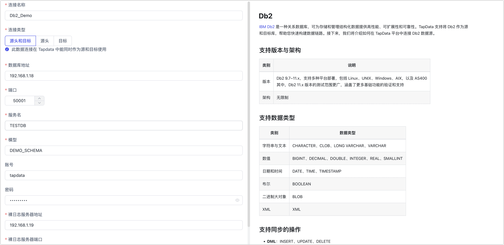

# Db2
import Content from '../../reuse-content/_enterprise-and-cloud-features.md';

<Content />

[IBM Db2](https://www.ibm.com/docs/zh/db2) 是一种关系数据库，可为存储和管理结构化数据提供高性能、可扩展性和可靠性。TapData 支持将 Db2 作为源和目标库，帮助您快速构建数据链路。接下来，我们将介绍如何在 TapData 平台中连接 Db2 数据源。

```mdx-code-block
import Tabs from '@theme/Tabs';
import TabItem from '@theme/TabItem';
```

## 支持版本与架构

| 类别 | 说明                                                         |
| ---- | ------------------------------------------------------------ |
| 版本 | Db2 9.7~11.x，其中 Db2 11.x 版本涵盖了更多基础功能的验证和支持<br />支持多种平台部署，包括 Linux、UNIX、Windows、AIX，以及 AS400 |
| 架构 | 无限制                                                       |

## 支持数据类型

| 类别         | 数据类型                                         |
| ------------ | ------------------------------------------------ |
| 字符串与文本 | CHARACTER、CLOB、LONG VARCHAR、VARCHAR           |
| 数值         | BIGINT、DECIMAL、DOUBLE、INTEGER、REAL、SMALLINT |
| 日期和时间   | DATE、TIME、TIMESTAMP                            |
| 布尔         | BOOLEAN                                          |
| 二进制大对象 | BLOB                                             |
| XML          | XML                                              |

## 支持同步的操作

- **DML**：INSERT、UPDATE、DELETE

  :::tip

  将 Db2 作为同步的目标场景下，支持在插入冲突时转为更新操作（类似 UPSERT 功能）。

  :::

- **DDL**：ADD COLUMN、CHANGE COLUMN、DROP COLUMN、RENAME COLUMN

## 功能限制

- 在 Db2 作为源库执行增量数据同步的场景中，一旦对 Db2 数据库执行了 DDL 操作，需要紧接着执行下述存储过程，否则可能导致数据同步失败等意外情况。
  ```sql
  CALL SYSPROC.ADMIN_CMD('REORG TABLE <schema>.<table>')
  ```
- 在 DB2 的 ReadLog 规模非常大的情况下，基于指定时间的增量同步可能会遇到初次查找 LRI 缓慢的问题，可能导致进入增量同步的时间较长。
- 由于 DB2 数据库中存在类似可变长字段的情况，在 DML 操作过程中可能会触发空间扩展，从而导致任务监控或日志中出现与预期不符的操作类型（如更新事件中同时出现插入和删除）。此场景下，虽然日志表现可能与预期不同，但不会影响数据的准确性。
- 部署裸日志服务可用于解析 Db2 的增量数据变更，在该服务部署完毕后，需要为其配置与 Db2 数据库相同的国家码语言码。
  ```bash
    # 语言码 UTF-8
    db2set db2codepage=1208
    # 语言码 GBK
    db2set db2codepage=1386
    # 国家码
    db2set db2country=86
  ```

## 注意事项

获取增量数据变更时，由于会周期性调用 Db2 数据库的 [ReadLog API](https://www.ibm.com/docs/zh/db2/11.5?topic=apis-db2readlog-read-log-records)，因此对数据库会产生一些负载，并且占用网络带宽和磁盘 I/O 资源。

## 准备工作

在连接 Db2 数据库前，您还需要完成数据库账号的授权等准备工作，本文以 Db2 数据库部署在 Linux 平台为例演示相关操作示例。

### 作为源库

1. 创建用户。

   以 Linux 平台为例，登录至依次执行下述格式的命令创建用于登录 Db2 数据库的用户并设置密码。

   ```bash
   -- 请替换 username 为您要创建的用户名
   sudo useradd username
   sudo passwd username
   ```

2. 为刚创建的账号授予权限。

   1. 以具有 DBA 权限的用户身份登录 Db2 数据库。

   2. 执行下述格式的命令为用户授予权限，您也可以基于业务需求自定义更精细化的权限控制，更多介绍，见 [GRANT TABLE](https://www.ibm.com/docs/en/db2/11.1?topic=statements-grant-table-view-nickname-privileges)。

      ```mdx-code-block
      <Tabs className="unique-tabs">
      <TabItem value="全量数据同步">
      ```
      ```sql
      -- 请分别替换 username、schema_name 为您要授权的用户名和 Schem 名称
      GRANT ON SCHEMA schema_name TO USER username;
      ```
      </TabItem>

      <TabItem value="增量数据同步">

      ```sql
      -- 切换至根容器
      -- 请替换 username 为要授权的用户名
      GRANT DBADM TO username;
      ```
      :::tip

      由于增量采集依赖于 Db2 官方的 ReadLog API，因此需要授予系统超管或数据库超管权限。

      :::
      </TabItem>
      </Tabs>


3. 如需增量数据同步，您需要为[联系 TapData 团队](../../support.md)，获取并部署裸日志采集服务。

   :::tip

   为进一步简化使用流程，该服务启动后，会自动执行 `ALTER TABLE <schema>.<table> DATA CAPTURE CHANGES;`为您开启表级数据变更捕获能力。

   :::


### 作为目标库

1. 创建用户。

   以 Linux 平台为例，登录至依次执行下述格式的命令创建用于登录 Db2 数据库的用户并设置密码

   ```bash
   -- 请替换 username 为您要创建的用户名
   sudo useradd username
   sudo passwd username
   ```

2. 为刚创建的账号授予权限。

   1. 以具有 DBA 权限的用户身份登录 Db2 数据库。

   2. 执行下述格式的命令，为用户授予指定 Schema 的对象管理和数据读写权限。

      ```sql
      -- 请分别替换 schema_name、username 为您要创建的 Schem 名称和用户名
      GRANT CREATEIN, ALTERIN, DROPIN ON SCHEMA schema_name TO USER username;
      ```

      :::tip

      您也可以基于业务需求自定义更精细化的权限控制，更多介绍，见 [GRANT TABLE](https://www.ibm.com/docs/en/db2/11.1?topic=statements-grant-table-view-nickname-privileges)。

      :::

## 添加数据源

1. [登录 TapData 平台](../../user-guide/log-in.md)。

2. 在左侧导航栏，单击**连接管理**。

3. 单击页面右侧的**创建**。

4. 在弹出的对话框中，搜索并选择 **Db2**。

5. 在跳转到的页面，根据下述说明填写 Db2 的连接信息。

   

   * **连接信息设置**

     * **连接名称**：填写具有业务意义的独有名称。
     * **连接类型**：支持将 Db2 作为源或目标库。
     * **数据库地址**：数据库连接地址。
     * **端口**：数据库的服务端口，默认为 50001。
     * **服务名**：填写数据库名称。
     * **模型**：模型（Schema） 名称，即一个连接对应一个 Schema，如需连接多个 Schema 则需创建多个数据连接。
     * **其他连接串参数**：额外的连接参数，默认为空。
     * **账号**、**密码**：数据库的账号及对应的密码。
     * **裸日志服务器地址**、**裸日志服务器端口**：请[联系 TapData 团队](../../support.md)，获取并部署裸日志采集组件，实现 Db2 增量数据的捕获，默认服务端口为 **50051**。

   * **高级设置**
     
      * **时区**：默认为 0 时区，您也可以根据业务需求手动指定，当配置为其他时区时，会影响不带时区的字段，例如 DATE、TIMESTAMP。
      * **使用共享挖掘**：[挖掘源库](../../user-guide/advanced-settings/share-mining)的增量日志，可为多个任务共享源库的增量日志，避免重复读取，从而最大程度上减轻增量同步对源库的压力，开启该功能后还需要选择一个外存用来存储增量日志信息。
      * **包含表**：默认为**全部**，您也可以选择自定义并填写包含的表，多个表之间用英文逗号（,）分隔。
      * **排除表**：打开该开关后，可以设定要排除的表，多个表之间用英文逗号（,）分隔。
      * **Agent 设置**：默认为**平台自动分配**，您也可以手动指定 Agent。
      * **模型加载频率**：当数据源中模型数量小于1万时，TapData 将每小时更新一次模型；当数据源中模型数量大于 10,000 时，会每天按照指定的时间进行模型刷新。
      * **开启心跳表**：当连接类型选择为**源头和目标**、**源头**时，支持打开该开关，由 TapData 在源库中创建一个名为 **_tapdata_heartbeat_table** 的心跳表并每隔 10 秒更新一次其中的数据（数据库账号需具备相关权限），用于数据源连接与任务的健康度监测。
      
        :::tip
      
        数据源需在数据复制/开发任务引用并启动后，心跳任务任务才会启动，此时您可以再次进入该数据源的编辑页面，即可单击**查看心跳任务**。
      
        :::

6. 单击**连接测试**，测试通过后单击**保存**。

   :::tip

   如提示连接测试失败，请根据页面提示进行修复。

   :::
