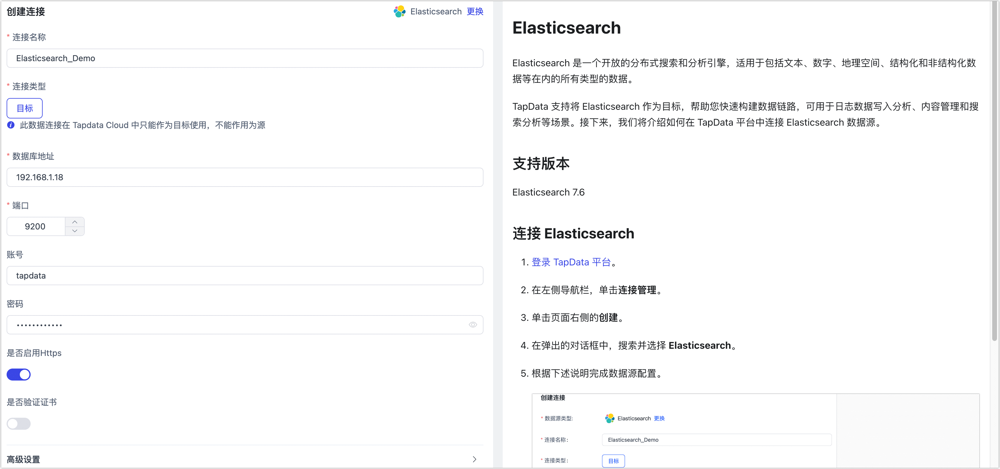

# Elasticsearch

Elasticsearch 是一个开放的分布式搜索和分析引擎，适用于包括文本、数字、地理空间、结构化和非结构化数据等在内的所有类型的数据。

Tapdata 支持将 Elasticsearch 作为目标，帮助您快速构建数据链路，可用于日志数据写入分析、内容管理和搜索分析等场景。接下来，我们将介绍如何在 Tapdata 平台中连接 Elasticsearch 数据源。

## 支持版本

Elasticsearch 7.6

## 连接 Elasticsearch

1. 登录 Tapdata 平台。

2. 在左侧导航栏，单击**连接管理**。

3. 单击页面右侧的**创建**。

4. 在弹出的对话框中，搜索并选择 **Elasticsearch**。

5. 根据下述说明完成数据源配置。

   

   * **连接名称**：填写具有业务意义的独有名称。
   * **连接类型**：目前仅支持将 Elasticsearch 作为目标库。
   * **数据库地址**：填写 Elasticsearch 的连接地址。
   * **端口**：填写 Elasticsearch 的服务端口，例如 **9200**。
   * **账号**、**密码**：分别填写登录 Elasticsearch 的账号和密码，如未设置密码可置空。
   * **Agent 设置**：默认为**平台自动分配**，您也可以手动指定 Agent。
   * **模型加载时间**：当数据源中模型数量小于 10,000 时，每小时刷新一次模型信息；如果模型数据超过 10,000，则每天按照您指定的时间刷新模型信息。

6. 单击**连接测试**，测试通过后单击**保存**。

   :::tip

   如提示连接测试失败，请根据页面提示进行修复。

   :::

