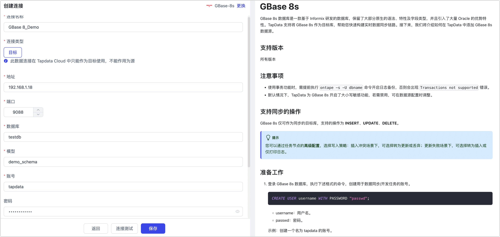

# GBase 8s
import Content from '../../reuse-content/_enterprise-and-cloud-features.md';

<Content />

GBase 8s 数据库是一款基于 Informix 研发的数据库，保留了大部分原生的语法、特性及字段类型，并且引入了大量 Oracle 的优势特性。TapData 支持将 GBase 8s 作为目标库，帮助您快速构建实时数据同步链路。接下来，我们将介绍如何在 TapData 中添加 GBase 8s 数据源。

## 支持版本

所有版本

## 注意事项

- 使用事务功能时，需提前执行 `ontape -s -U dbname` 命令开启日志备份，否则会出现 `Transactions not supported` 错误。
- 默认情况下，TapData 为 GBase 8s 开启了大小写敏感功能，若需禁用，可在数据源配置时调整。

## 支持同步的操作

GBase 8s 仅可作为同步的目标库，支持的操作为 **INSERT**、**UPDATE**、**DELETE**。

:::tip
您可以通过任务节点的**高级配置**，选择写入策略：插入冲突场景下，可选择转为更新或丢弃；更新失败场景下，可选择转为插入或仅打印日志。
:::

## 准备工作

1. 登录 GBase 8s 数据库，执行下述格式的命令，创建用于数据同步/开发任务的账号。

   ```sql
   CREATE USER username WITH PASSWORD "passwd";
   ```

   - username：用户名。
   - passwd：密码。

   示例：创建一个名为 tapdata 的账号。

   ```sql
   CREATE USER tapdata WITH PASSWORD "Your@passwd123";
   ```

2. 执行 `GRANT DBA TO 'username'` 为刚创建的账号授予 DBA  权限，您也可以基于业务需求设置更精细化的权限控制（如表级权限）。

## 连接 GBase 8s

1. [登录 TapData 平台](../../user-guide/log-in.md)。

2. 在左侧导航栏，单击连接管理。

3. 单击页面右侧的创建。

4. 在弹出的对话框中，搜索并选择 GBase 8s。

5. 在跳转到的页面，根据下述说明填写 GBase 8s 的连接信息。
   
   
   
   - **连接信息设置**
     - **连接名称**：填写具有业务意义的独有名称。
     - **连接类型**：仅支持将 GBase 8s 作为目标库。
     - **地址**：数据库连接地址。
     - **端口**：数据库的服务端口。
     - **数据库**：数据库名称，即一个连接对应一个数据库，如有多个数据库则需创建多个数据连接。
     - **模型**：模型名称。
     - **账号**：数据库的账号。
     - **密码**：数据库账号对应的密码。
     - **连接参数**：默认为 `:delimident=y`，表示开启大小写敏感。
     - **时区**：时区配置默认为 0 时区。
   - **高级设置**
     - **Agent 设置**：默认为平台自动分配，您也可以手动指定 Agent。
     - **模型加载时间**：如果数据源中的模型数量少于10000个，则每小时更新一次模型信息。但如果模型数量超过10000个，则刷新将在您指定的时间每天进行。
   
6. 单击**连接测试**，测试通过后单击保存。
    :::tip
    如提示连接测试失败，请根据页面提示进行修复。
    :::