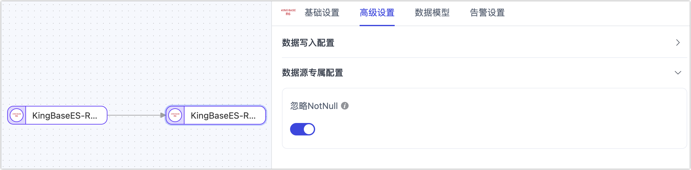

# KingbaseES-R6
import Content1 from '../../reuse-content/_enterprise-and-cloud-features.md';

<Content1 />

[金仓数据库管理系统](https://help.kingbase.com.cn/v8/index.html)（KingbaseES）是北京人大金仓信息技术股份有限公司自主研发的、具有自主知识产权的商用关系型数据库管理系统。KingbaseES-R6 可兼容 Postgres 9.6 版本的绝大多数特性，本文将介绍如何在 TapData 中添加 KingbaseES-R6 数据源，后续可将其作为源或目标库来构建数据管道。

```mdx-code-block
import Tabs from '@theme/Tabs';
import TabItem from '@theme/TabItem';
```

## 支持版本与架构

单节点架构下的 KingBaseES R6 V8 ~ V9

:::tip

KingbaseES-R6 支持的数据库模式为 Oracle、PostgreSQL 和 MySQL，需注意 Oracle 模式下默认对象全小写，更多介绍，见 [Kingbase ES 官方文档](https://help.kingbase.com.cn/v8/index.html)。

:::

## 支持数据类型

| **类别**         | **数据类型**                                                 |
| ---------------- | ------------------------------------------------------------ |
| 字符串与文本     | character、character varying、text                           |
| 数值类型         | smallint、integer、bigint、numeric、real、double precision   |
| 日期和时间       | date、timestamp (without time zone)、timestamp with time zone、time (without time zone)、time with time zone、interval |
| 二进制与位类型   | bytea、bit、bit varying                                      |
| 布尔类型         | boolean                                                      |
| 网络地址与标识符 | cidr、inet、macaddr、uuid                                    |
| 几何数据类型     | point、line、lseg、box、path、polygon、circle                |
| XML 与 JSON      | xml、json                                                    |
| 数组类型         | array（选择增量数据读取插件为 Walminer 时不支持）            |

## 支持同步的操作

**INSERT**、**UPDATE**、**DELETE**

:::tip

作为同步目标时，您可以通过任务节点的高级配置选择写入策略，如插入冲突时更新或丢弃，更新失败时插入或仅打印日志。此外，还可应用和执行源库解析的 ADD COLUMN、CHANGE COLUMN、DROP COLUMN 和 RENAME COLUMN 操作。

:::

## 功能限制

- KingbaseES-R6 作为源库时，不支持采集其 DDL（如增加字段），且不支持指定增量数据采集时间。
- KingbaseES-R6 不支持字符串类型存放`\0`，TapData 会将其自动过滤以避免异常报错。
- Walminer 插件目前仅支持连接合并共享挖掘。

## 注意事项

- 使用基于复制槽的日志插件（如 **wal2json**）时，过多的共享挖掘进程可能导致 WAL 日志积压，增加磁盘压力。建议减少挖掘进程数量或及时删除无用的 CDC 任务和复制槽。
- 基于 WAL 日志的插件（如 **walminer**）在执行共享挖掘时会频繁读写 `walminer_contents` 表，从而产生一定负载，但因目前仅支持单任务挖掘，影响相对较小。

## 准备工作

### 作为源库

1. 以管理员身份登录 KingbaseES-R6 数据库。

2. 执行下述格式的命令，创建用于数据同步/开发任务的账号。

   ```sql
   CREATE USER username WITH PASSWORD 'password';
   ```

   * **username**：用户名。
   * **password**：密码。

3. 为刚创建的账号授予权限，您也可以基于业务需求自定义权限控制。

   ```mdx-code-block
   <Tabs className="unique-tabs">
   <TabItem value="仅读取全量数据">
   ```

   ```sql
   -- 进入要授权的数据库
   \c database_name
   
   -- 授予目标 Schema 的表读取权限
   GRANT SELECT ON ALL TABLES IN SCHEMA schema_name TO username;
   
   -- 授予目标 Schema 的 USAGE 权限
   GRANT USAGE ON SCHEMA schema_name TO username;
   ```

   </TabItem>

   <TabItem value="读取全量+增量数据">

   ```sql
   -- 进入要授权的数据库
   \c database_name
   
   -- 授予目标 Schema 的表读取权限
   GRANT SELECT ON ALL TABLES IN SCHEMA schema_name TO username;
   
   -- 授予目标 Schema 的 USAGE 权限
   GRANT USAGE ON SCHEMA schema_name TO username;
   
   -- 授予复制权限
   ALTER USER username REPLICATION;
   ```

   </TabItem>
   </Tabs>

   * **database_name**：数据库名称。
   * **schema_name**：Schema 名称。
   * **username**：用户名。

4. 如需读取源库的增量变更，您还需要执行下述步骤。

   1. 修改复制标识为 **FULL**（使用整行作为标识），该属性决定了当数据发生 UPDATE/DELETE 时，日志记录的字段。

      ```sql
      ALTER TABLE schema_name.table_name REPLICA IDENTITY FULL;
      ```

      * **schema_name**：Schema 名称。
      * **table_name**：表名称。

   2. 修改配置文件 `kingbase.conf`，将 `wal_level` 的值修改为 `logical`，并调大 `max_replication_slots` 的值，示例如下。

      ```bash
      wal_level = logical
      # 至少要大于将其作为源时，挖掘的任务数
      max_replication_slots = 30
      ```

   3. 修改权限配置文件 `sys_hba.conf`，增加下述内容以保障账号访问权限。

      ```bash
      # 替换 username 为刚刚创建的用户
      local   replication     username                     trust
      host    replication     username  0.0.0.0/32         md5
      host    replication     username  ::1/128            trust
      ```

   4. 安装日志插件。

      * **wal2json**：登录 KingbaseES-R6 所属的服务器，跟随下述步骤完成插件的编译，最后将生成的 `wal2json.so` 文件复制到  KingbaseES-R6 对应目录，本案例中为 `/home/kingbase5b/ES/V8/KESRealPro/V008R006C005B0054/Server/lib/`。
      
        ```bash
        # 下载插件
        git clone https://github.com/eulerto/wal2json.git && cd wal2json
        
        # 修改 Makefile 内容：
        PG_CONFIG = pg_config
        PGXS := $(shell $(PG_CONFIG) --pgxs)
        
        # 替换为
        PG_CONFIG = sys_config
        PGXS := $(shell $(PG_CONFIG) --sysxs)
        
        # 切换用户
        su kingbase
        
        # 复制资源文件
        cp -a /home/kingbase/ES/V8/KESRealPro/V008R006C005B0054/Server/lib/plc/.server /home/kingbase/ES/V8/KESRealPro/V008R006C005B0054/Server/include/server
        
        # 执行 make，目录下即可生成 wal2json.so
        make
        ```
      
      * **walminer**：V87B 以上的版本内置该插件，使用方法，见 [WalMiner 使用示例](https://help.kingbase.com.cn/v8/admin/reference/walminer/walminer-4.html)。该方式不依赖逻辑复制，无需设置 `wal_level` 为 `logical`，也不需要调整复制槽配置，但需授予超级管理员权限。

### 作为目标库

1. 以管理员身份登录 KingbaseES-R6 数据库。

2. 执行下述格式的命令，创建用于数据同步/开发任务的账号。

   ```sql
   CREATE USER username WITH PASSWORD 'password';
   ```

   * **username**：用户名。
   * **password**：密码。

3. 为刚创建的账号授予权限，您也可以基于业务需求自定义权限控制。

   ```sql
   -- 进入要授权的数据库
   \c database_name;
   
   -- 授予目标 Schema 的 USAGE 和 CREATE 权限
   GRANT CREATE,USAGE ON SCHEMA schemaname TO username;
   
   -- 授予目标 Schema 的表读写权限
   GRANT SELECT,INSERT,UPDATE,DELETE,TRUNCATE ON ALL TABLES IN SCHEMA schemaname TO username;
   ```

   * **database_name**：数据库名称。
   * **schema_name**：Schema 名称。
   * **username**：用户名。


## 添加数据源

1. [登录 TapData 平台](../../user-guide/log-in.md)。

2. 在左侧导航栏，单击**连接管理**。

3. 单击页面右侧的**创建**。

4. 在弹出的对话框中，搜索并选择 **KingbaseES-R6**。

5. 在跳转到的页面，根据下述说明填写 KingbaseES-R6 的连接信息。

   

   * **连接信息设置**
     * **连接名称**：填写具有业务意义的独有名称。
     * **连接类型**：支持将 KingbaseES-R6 作为源或目标库。
     * **地址**：数据库连接地址。
     * **端口**：数据库的服务端口，默认为 54321。
     * **数据库**：数据库名称，即一个连接对应一个数据库，如有多个数据库则需创建多个数据连接。
     * **模型**：Schema 名称。
     * **额外参数**：额外的连接参数，默认为空。
     * **账号**：数据库的账号。
     * **密码**：数据库账号对应的密码。
     * **日志插件**：如需读取 KingbaseES-R6 的数据变更，实现增量数据同步，您需要根据[准备工作](#prerequisite)的指引，完成插件的安装。
   * **高级设置**
     * **共享挖掘**：[挖掘源库](../../user-guide/advanced-settings/share-mining.md)的增量日志，可为多个任务共享源库的增量日志，避免重复读取，从而最大程度上减轻增量同步对源库的压力，开启该功能后还需要选择一个外存用来存储增量日志信息。
     * **包含表**：默认为**全部**，您也可以选择自定义并填写包含的表，多个表之间用英文逗号（,）分隔。
     * **排除表**：打开该开关后，可以设定要排除的表，多个表之间用英文逗号（,）分隔。
     * **Agent 设置**：默认为**平台自动分配**，您也可以手动指定 Agent。
     * **模型加载频率**：数据源中模型数量大于 1 万时，TapData 将按照设置的时间定期刷新模型。
     * **开启心跳表**：当连接类型为源头或目标时，可启用该开关。TapData 会在源库创建 `_tapdata_heartbeat_table` 心跳表，并每 10 秒更新一次（需具备相应权限），用于监测数据源连接与任务的健康状况。心跳任务在数据复制/开发任务启动后自动启动，您可在数据源编辑页面查看心跳任务。
   
6. 单击**连接测试**，测试通过后单击**保存**。

   :::tip

   如提示连接测试失败，请根据页面提示进行修复。

   :::

## 节点高级特性

在配置数据同步/转换任务时，将 KingbaseES-R6 作为目标节点时，您可以选择是否开启**忽略 NotNull**（默认关闭），可实现在目标库建表时忽略 NOT NULL 的限制。



