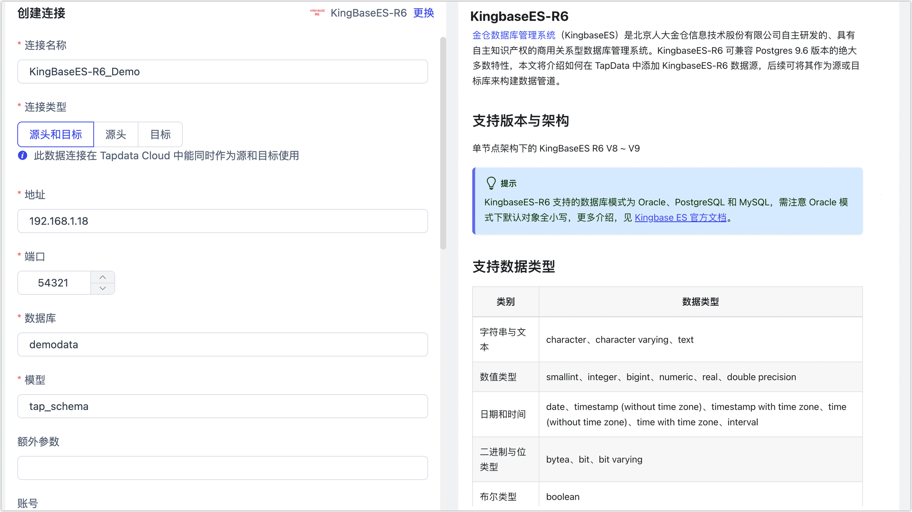

# KingbaseES-R6
import Content1 from '../../reuse-content/_enterprise-and-cloud-features.md';

<Content1 />

金仓数据库管理系统（KingbaseES）是北京人大金仓信息技术股份有限公司自主研发的、具有自主知识产权的商用关系型数据库管理系统。KingbaseES-R6 可兼容 Postgres 9.6 版本的绝大多数特性，本文将介绍如何在 TapData 中添加 KingbaseES-R6 数据源，后续可将其作为源或目标库来构建数据管道。

```mdx-code-block
import Tabs from '@theme/Tabs';
import TabItem from '@theme/TabItem';
```

## 支持版本

KingBaseES-V8R6

:::tip

KingbaseES-R6 支持的数据库模式为 Oracle、PostgreSQL 和 MySQL，需注意 Oracle 模式下默认对象全小写，更多介绍，见 [Kingbase ES 官方文档](https://help.kingbase.com.cn/v8/index.html)。

:::

import Content from '../../reuse-content/beta/_beta.md';

<Content />

## <span id="prerequisite">准备工作</span>

1. 以管理员身份登录 KingbaseES-R6 数据库。

2. 执行下述格式的命令，创建用于数据同步/开发任务的账号。

   ```sql
   CREATE USER username WITH PASSWORD 'password';
   ```

   * **username**：用户名。
   * **password**：密码。

3. 为刚创建的账号授予权限，您也可以基于业务需求自定义权限控制。

```mdx-code-block
<Tabs className="unique-tabs">
<TabItem value="作为源库">
```

```sql
-- 进入要授权的数据库
\c database_name

-- 授予目标 Schema 的表读取权限
GRANT SELECT ON ALL TABLES IN SCHEMA schema_name TO username;

-- 授予目标 Schema 的 USAGE 权限
GRANT USAGE ON SCHEMA schema_name TO username;

-- 授予复制权限，如仅需读取数据库的全量数据，则无需执行
ALTER USER username REPLICATION;
```

</TabItem>

<TabItem value="作为目标库">

```sql
-- 进入要授权的数据库
\c database_name;

-- 授予目标 Schema 的 USAGE 和 CREATE 权限
GRANT CREATE,USAGE ON SCHEMA schemaname TO username;

-- 授予目标 Schema 的表读写权限
GRANT SELECT,INSERT,UPDATE,DELETE,TRUNCATE ON ALL TABLES IN SCHEMA schemaname TO username;
```

</TabItem>
</Tabs>

* **database_name**：数据库名称。
* **schema_name**：Schema 名称。
* **username**：用户名。

4. 如需读取源库的增量变更，您还需要执行下述格式的命令，修改复制标识为 **FULL**（使用整行作为标识），该属性决定了当数据发生 UPDATE/DELETE 时，日志记录的字段。

   ```sql
   ALTER TABLE schema_name.table_name REPLICA IDENTITY FULL;
   ```

   * **schema_name**：Schema 名称。
   * **table_name**：表名称。

   完成操作后，您还需要联系[技术支持](../../support.md)提供相关插件，在 KingbaseES-R6 所属的服务器上进行安装。


## 添加数据源

1. [登录 TapData 平台](../../user-guide/log-in.md)。

2. 在左侧导航栏，单击**连接管理**。

3. 单击页面右侧的**创建**。

4. 在弹出的对话框中，搜索并选择 **KingbaseES-R6**。

5. 在跳转到的页面，根据下述说明填写 KingbaseES-R6 的连接信息。

   

   * **连接信息设置**
     * **连接名称**：填写具有业务意义的独有名称。
     * **连接类型**：支持将 KingbaseES-R6 作为源或目标库。
     * **地址**：数据库连接地址。
     * **端口**：数据库的服务端口。
     * **数据库**：数据库名称，即一个连接对应一个数据库，如有多个数据库则需创建多个数据连接。
     * **模型**：Schema 名称。
     * **额外参数**：额外的连接参数，默认为空。
     * **账号**：数据库的账号。
     * **密码**：数据库账号对应的密码。
     * **日志插件**：如需读取 KingbaseES-R6 的数据变更，实现增量数据同步，您需要根据[准备工作](#prerequisite)的指引，完成插件的安装。
   * **高级设置**
     * **时区**：默认为数据库所用的时区，您也可以根据业务需求手动指定。
     * **共享挖掘**：[挖掘源库](../../user-guide/advanced-settings/share-mining.md)的增量日志，可为多个任务共享源库的增量日志，避免重复读取，从而最大程度上减轻增量同步对源库的压力，开启该功能后还需要选择一个外存用来存储增量日志信息。
     * **包含表**：默认为**全部**，您也可以选择自定义并填写包含的表，多个表之间用英文逗号（,）分隔。
     * **排除表**：打开该开关后，可以设定要排除的表，多个表之间用英文逗号（,）分隔。
     * **Agent 设置**：默认为**平台自动分配**，您也可以手动指定 Agent。
     * **模型加载频率**：数据源中模型数量大于 1 万时，TapData 将按照设置的时间定期刷新模型。
     * **开启心跳表**：当连接类型选择为**源头和目标**、**源头**时，支持打开该开关，由 TapData 在源库中创建一个名为 **_tapdata_heartbeat_table** 的心跳表并每隔 10 秒更新一次其中的数据（数据库账号需具备相关权限），用于数据源连接与任务的健康度监测。
       :::tip
       数据源需在数据复制/开发任务引用并启动后，心跳任务任务才会启动，此时您可以再次进入该数据源的编辑页面，即可单击**查看心跳任务**。
       :::

6. 单击**连接测试**，测试通过后单击**保存**。

   :::tip

   如提示连接测试失败，请根据页面提示进行修复。

   :::