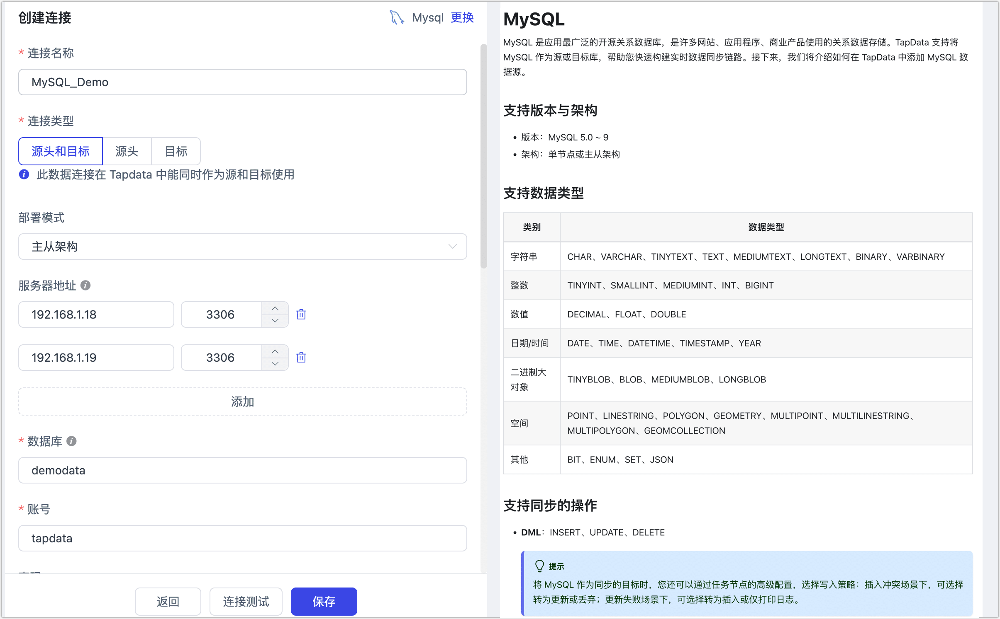

# MySQL
import Content from '../../reuse-content/_all-features.md';

<Content />

MySQL 是应用最广泛的开源关系数据库，是许多网站、应用程序、商业产品使用的关系数据存储。TapData 支持将 MySQL 作为源或目标库，帮助您快速构建实时数据同步链路。接下来，我们将介绍如何在 TapData 中添加 MySQL 数据源。

```mdx-code-block
import Tabs from '@theme/Tabs';
import TabItem from '@theme/TabItem';
```

## 支持版本与架构

* 版本：MySQL 5.0 ~ 9
* 架构：单节点或主从架构

## 支持数据类型

| 类别         | 数据类型                                                     |
| ------------ | ------------------------------------------------------------ |
| 字符串       | CHAR、VARCHAR、TINYTEXT、TEXT、MEDIUMTEXT、LONGTEXT、BINARY、VARBINARY |
| 整数         | TINYINT、SMALLINT、MEDIUMINT、INT、BIGINT                    |
| 数值         | DECIMAL、FLOAT、DOUBLE                                       |
| 日期/时间    | DATE、TIME、DATETIME、TIMESTAMP、YEAR                        |
| 二进制大对象 | TINYBLOB、BLOB、MEDIUMBLOB、LONGBLOB                         |
| 空间         | POINT、LINESTRING、POLYGON、GEOMETRY、MULTIPOINT、MULTILINESTRING、MULTIPOLYGON、GEOMCOLLECTION |
| 其他         | BIT、ENUM、SET、JSON                                         |

## 支持同步的操作

- **DML**：INSERT、UPDATE、DELETE

  :::tip

  将 MySQL 作为同步的目标时，您还可以通过任务节点的高级配置，选择写入策略：插入冲突场景下，可选择转为更新或丢弃；更新失败场景下，可选择转为插入或仅打印日志。

  :::

- **DDL**：ADD COLUMN、CHANGE COLUMN、DROP COLUMN、RENAME COLUMN

## 注意事项

* 增量数据采集主要通过解析 Binlog 实现，数据变更频繁时，可能会占用数据库一定的 CPU 和磁盘 I/O 资源。
* 在 MySQL 5.6 及更早版本中，应预处理 **TIME** 类型的时分秒为负数的数据（例如转换为合法的正值），以免增量采集发生异常。
* 在某些基于 MySQL 内核的数据源，若使用了原生 MySQL 不支持的 Schema 或函数，可能导致增量采集出错，此类情况可联系 [TapData 技术支持](../../support.md)进行适配。

## 准备工作

### 作为源库

1. 登录 MySQL 数据库，执行下述格式的命令，创建用于数据同步/开发任务的账号。

```mdx-code-block
<Tabs className="unique-tabs">
<TabItem value="MySQL 5.x" default>
```

```sql
CREATE USER 'username'@'host' IDENTIFIED BY 'password';
```

   </TabItem>
   <TabItem value="MySQL 8.x 及以上">

```sql
CREATE USER 'username'@'host' IDENTIFIED WITH mysql_native_password BY 'password';
```

   </TabItem>
  </Tabs>

  * **username**：用户名。
  * **password**：密码。
  * **host**：允许该账号登录的主机，百分号（%）表示允许任意主机。

示例：创建一个名为 tapdata 的账号。

```sql
CREATE USER 'tapdata'@'%' IDENTIFIED BY 'yourpasswd';
```

2. 为刚创建的账号授予权限，示例如下，您也可以基于业务需求设置更精细化的权限控制。

```mdx-code-block
<Tabs className="unique-tabs">
<TabItem value="仅读取全量数据" default>
```

```sql
-- 授予指定库的读权限
GRANT SELECT ON database_name.* TO 'username' IDENTIFIED BY 'password';
```

   </TabItem>
   <TabItem value="读取全量+增量数据">

```sql
-- 授予指定库的读权限
GRANT SELECT ON database_name.* TO 'username' IDENTIFIED BY 'password';
-- 授予复制权限
GRANT REPLICATION SLAVE, REPLICATION CLIENT ON *.* TO 'username' IDENTIFIED BY 'password';
```

   </TabItem>
  </Tabs>

* **database_name**：要授予权限的数据库名称。
* **username**：用户名。
* **password**：密码。

3. 为保障读取 MySQL 数据库的增量数据，您还需要跟随下述步骤开启 Binlog。

   1. 使用 `vim` 命令，修改 `$MYSQL_HOME/mysql.cnf` 中的配置，例如：

      ```bash
      server_id         = 223344
      log_bin           = mysql-bin
      expire_logs_days  = 1
      binlog_format     = row
      binlog_row_image  = full
      ```

      - **server_id**：对于 MySQL 中的每个服务器和复制客户端必须是唯一的，设置为大于 0 的整数
      - **log_bin**：Binlog 序列文件的基本名称
      - **expire_logs_days**：二进制日志文件保留的天数，到期自动删除
      - **binlog_format**：设置为 row
      - **binlog_row_image**：设置为 full

   2. 修改完成后，执行下述命令重启 MySQL 进程。

      ```bash
      /etc/inint.d/mysqld restart
      ```

   3. （可选）登录 MySQL 数据库，执行下述命令确认配置已生效，即输出的结果中，**format** 的值为 **ROW**。

      ```sql
      SHOW VARIABLES LIKE 'binlog_format';
      ```

      输出示例如下：

      ```sql
      +---------------+-------+
      | Variable_name | Value |
      +---------------+-------+
      | binlog_format | ROW   |
      +---------------+-------+
      1 row in set (0.00 sec)
      ```

​      

### 作为目标库

1. 登录 MySQL 数据库，执行下述格式的命令，创建用于数据同步/开发任务的账号。

```mdx-code-block
<Tabs className="unique-tabs">
<TabItem value="MySQL 5.x" default>
```

```sql
CREATE USER 'username'@'host' IDENTIFIED BY 'password';
```

</TabItem>

<TabItem value="MySQL 8.x 及以上">

```sql
CREATE USER 'username'@'host' IDENTIFIED WITH mysql_native_password BY 'password';
```

   </TabItem>
  </Tabs>

  * **username**：用户名。
  * **password**：密码。
  * **host**：允许该账号登录的主机，百分号（%）表示允许任意主机。

示例：创建一个名为 tapdata 的账号。

```sql
CREATE USER 'tapdata'@'%' IDENTIFIED BY 'yourpasswd';
```

2. 为刚创建的账号授予权限，示例如下，您也可以基于业务需求设置更精细化的权限控制。

<Tabs className="unique-tabs">
<TabItem value="授予指定库权限" default>

```sql
GRANT SELECT, INSERT, UPDATE, DELETE, ALTER, CREATE, CREATE ROUTINE, CREATE TEMPORARY TABLES, DROP ON database_name.* TO 'username';
```

</TabItem>

<TabItem value="授予所有库权限">

```sql
GRANT SELECT, INSERT, UPDATE, DELETE, ALTER, CREATE, CREATE ROUTINE, CREATE TEMPORARY TABLES, DROP ON *.* TO 'username';
```

   </TabItem>
  </Tabs>

* **database_name**：要授予权限的数据库名称。
* **username**：用户名。


### <span id="ssl">开启 SSL 连接（可选）</span>

为进一步提升数据链路的安全性，您还可以选择为 MySQL 数据库开启 SSL（Secure Sockets Layer）加密，实现在传输层对网络连接的加密，在提升通信数据安全性的同时，保证数据的完整性，具体操作流程如下：

1. 登录 MySQL 数据库所属的设备，运行 **mysql_ssl_rsa_setup** 程序来创建 SSL/RSA 文件，您可以通过 find 命令查找该程序的位置。

   在执行本步骤前，您可以登录 MySQL 数据库并执行 `SHOW GLOBAL VARIABLES LIKE '%ssl%';` 命令，查看是否生成过 SSL/RSA 文件及 SSL 开启状态。

   ```bash
   /usr/bin/mysql_ssl_rsa_setup
   ```

   :::tip

   * 运行该程序需确保您的设备已安装 **openssl**，例如在 CentOS 系统中，可执行 `yum install openssl -y` 命令来安装。
   * 命令执行完毕后，会自动生成文件： `ca-key.pem`、`server-key.pem` 和 `client-key.pem`，通常位于 `/var/lib/mysql/` 目录中，您可以将其下载至本机中，后续在 TapData 中配置连接时使用。

   :::

2. 使用 `vim` 命令，修改 `$MYSQL_HOME/mysql.cnf` 中的配置，开启强制 SSL 认证并指定相关 SSL/RSA 文件位置，修改完成后保存并退出编辑。

   ```bash
   [mysqld]
   require_secure_transport=ON
   # 自签名的 CA 证书
   ssl-ca=/var/lib/mysql/ca.pem
   # 服务端证书文件
   ssl-cert=/var/lib/mysql/server-cert.pem
   # 服务端私钥文件
   ssl-key=/var/lib/mysql/server-key.pem
   [client]
   # 开启 SSL 强制认证
   ssl-mode=REQUIRED
   # 客户端连接服务端所需提供的证书文件
   ssl-cert=/var/lib/mysql/client-cert.pem
   # 客户端连接服务端所需提供的私钥文件
   ssl-key=/var/lib/mysql/client-key.pem
   ```

3. 登录 MySQL 数据库，**选择**执行下述格式的命令，调整数据同步/开发任务的账号。

   ```sql
   ALTER USER 'username'@'host' REQUIRE x509; -- 强制要求客户端提供有效证书
   ALTER USER 'username'@'host' REQUIRE ssl; -- 不强制要求客户端提供有效证书
   FLUSH PRIVILEGES;
   ```

   * **username**：用户名。
   * **host**：允许该账号登录的主机，例如使用百分号（%）以允许任意主机。

4. 重启 MySQL 数据库。

   


## 连接 MySQL

1. [登录 TapData 平台](../../user-guide/log-in.md)。

2. 在左侧导航栏，单击**连接管理**。

3. 单击页面右侧的**创建**。

4. 在弹出的对话框中，搜索并选择 **MySQL**。

5. 在跳转到的页面，根据下述说明填写 MySQL 的连接信息。

   

    * **连接信息设置**
        * **连接名称**：填写具有业务意义的独有名称。
        * **连接类型**：支持将 MySQL 作为源或目标库。
        * **部署模式**：支持单机和主从架构。当选择主从架构时，需提供主从服务器地址和服务端口，其中主库信息应填写在第一行。
        * **地址**：数据库连接地址。
        * **端口**：数据库的服务端口。
        * **数据库**：数据库名称，即一个连接对应一个数据库，如有多个数据库则需创建多个数据连接。
        * **账号**：数据库的账号。
        * **密码**：数据库账号对应的密码。
    * **高级设置**
        * **连接参数**：默认为 `useUnicode=yes&characterEncoding=UTF-8`，表示数据传输将使用 UTF-8 编码的 Unicode 字符集，有助于避免字符编码问题。
        * **时区**：时区配置默认为 0 时区。若设置为其他时区，会影响不带时区信息的字段（如 `datetime`）的数据同步。带时区的字段（如 `timestamp`、`date` 和 `time` ）不受影响。
        * **共享挖掘**：[挖掘源库](../../user-guide/advanced-settings/share-mining.md)的增量日志，可为多个任务共享源库的增量日志，避免重复读取，从而最大程度上减轻增量同步对源库的压力，开启该功能后还需要选择一个外存用来存储增量日志信息。
        * **包含表**：默认为**全部**，您也可以选择自定义并填写包含的表，多个表之间用英文逗号（,）分隔。
        * **排除表**：打开该开关后，可以设定要排除的表，多个表之间用英文逗号（,）分隔。
        * **Agent 设置**：默认为**平台自动分配**，您也可以手动指定 Agent。
        * **模型加载时间**：如果数据源中的模型数量少于10000个，则每小时更新一次模型信息。但如果模型数量超过10000个，则刷新将在您指定的时间每天进行。
        * **开启心跳表**：当连接类型为源头或目标时，可启用该开关。TapData 会在源库创建 `_tapdata_heartbeat_table` 心跳表，并每 10 秒更新一次（需具备相应权限），用于监测数据源连接与任务的健康状况。心跳任务在数据复制/开发任务启动后自动启动，您可在数据源编辑页面查看心跳任务。
    * **SSL 设置**：选择是否开启 SSL 连接数据源，可进一步提升数据安全性，开启该功能后还需要上传 CA 文件、客户端证书、客户端密钥文件等，相关文件可在[开启 SSL 连接](#ssl)中获取。

6. 单击**连接测试**，测试通过后单击**保存**。

   :::tip

   如提示连接测试失败，请根据页面提示进行修复。

   :::

## 节点高级特性

在配置数据同步/转换任务时，将 MySQL 作为源节点时，为更好满足业务复杂需求，最大化发挥性能，TapData 为其内置更多高级特性能力，您可以基于业务需求配置：


* **哈希分片**：开启后，全表数据将在全量同步阶段按哈希值拆分为多个分片，并发读取数据，显著提升读取性能，加速全量数据同步，但也会增加数据库负载，最大分片数可在启用开关后手动设置。
* **最大队列大小**：控制增量数据读取队列的容量，默认为 **800**（DML 事件数）。若目标库同步速度较慢或表中单条数据较大，可适当降低该值。


## 常见问题

* 问：可以使用从库作为源进行数据同步吗？

  答：可以，除在从库上开启以上设置外，还需要：

  1. 执行下述命令，检查 MySQL 库的参数配置，确保 **log_slave_updates** 的值为 1。

     ```sql
     Select @@log_slave_updates
     ```

  2. 检查主从库是否一致，不一致时可查看从节点状态：`SHOW SLAVE STATUS`，

     根据具体报错修复后，再执行数据同步。

* 问：TapData 连接测试时，提示错误：“Unknown error 1044”

  答：如果已经授予了正确的权限，可以通过下述方法检查并修复：

  ```sql
  SELECT host,user,Grant_priv,Super_priv FROM mysql.user where user='username';
  //查看Grant_priv字段的值是否为Y
  //如果不是，则执行以下命令
  UPDATE mysql.user SET Grant_priv='Y' WHERE user='username';
  FLUSH PRIVILEGES;
  ```

## 相关文档

* [MySQL 实时同步至 Redis](../../pipeline-tutorial/mysql-to-redis.md)
* [采集 Excel 数据至 MySQL](../../pipeline-tutorial/excel-to-mysql.md)
* [构建数组提取链路简化数据分析](../../pipeline-tutorial/extract-array.md)
