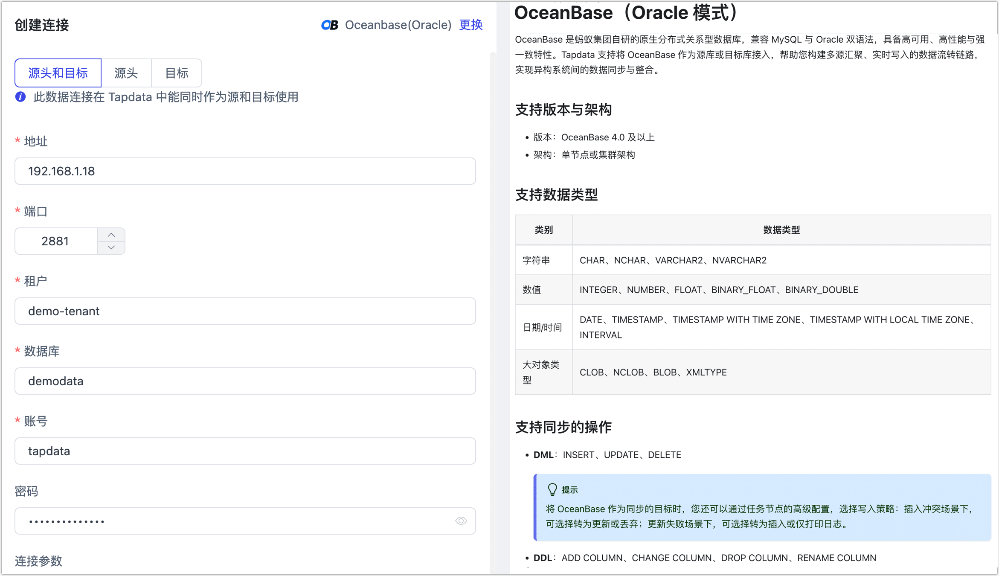

# OceanBase（Oracle 模式）

OceanBase 是蚂蚁集团自研的原生分布式关系型数据库，兼容 MySQL 与 Oracle 双语法，具备高可用、高性能与强一致特性。Tapdata 支持将 **OceanBase（Oracle 模式）** 作为源库或目标库接入，帮助您构建多源汇聚、实时写入的数据流转链路，实现异构系统间的数据同步与整合。

```mdx-code-block
import Tabs from '@theme/Tabs';
import TabItem from '@theme/TabItem';
```

## 支持版本与架构

* 版本：OceanBase 4.0 及以上
* 架构：单节点或集群架构

## 支持数据类型

| 类别       | 数据类型                                                     |
| ---------- | ------------------------------------------------------------ |
| 字符串     | CHAR、NCHAR、VARCHAR2、NVARCHAR2                             |
| 数值       | INTEGER、NUMBER、FLOAT、BINARY_FLOAT、BINARY_DOUBLE          |
| 日期/时间  | DATE、TIMESTAMP、TIMESTAMP WITH TIME ZONE、TIMESTAMP WITH LOCAL TIME ZONE、INTERVAL |
| 大对象类型 | CLOB、NCLOB、BLOB、XMLTYPE                                   |

## 支持同步的操作

- **DML**：INSERT、UPDATE、DELETE

  :::tip

  将 OceanBase 作为同步的目标时，您还可以通过任务节点的高级配置，选择写入策略：插入冲突场景下，可选择转为更新或丢弃；更新失败场景下，可选择转为插入或仅打印日志。

  :::

- **DDL**：ADD COLUMN、CHANGE COLUMN、DROP COLUMN、RENAME COLUMN

## 准备工作

```mdx-code-block
<Tabs className="unique-tabs">
<TabItem value="作为源库" default>
```

1. 确保 TapData Agent 所属的网络已加入 OceanBase 的[租户白名单](https://www.oceanbase.com/docs/common-oceanbase-database-standalone-1000000002701894)中，且内网可互通。

2. 以 `root` 身份登录到[租户](https://www.oceanbase.com/docs/common-oceanbase-database-standalone-1000000002701786)，执行下述格式的命令，创建用于数据同步的用户。

   ```sql
   CREATE USER 'username' IDENTIFIED BY 'password';
   ```

   * **username**：用户名。
   * **password**：密码。

3. 执行下述格式的命令，为刚创建的用户授予库级别读取权限，您也可以基于业务需求自定义更精细化的[权限控制](https://www.oceanbase.com/docs/common-oceanbase-database-standalone-1000000002702184)。

   ```mdx-code-block
   <Tabs className="unique-tabs">
   <TabItem value="仅读取全量数据">
   ```
   ```sql
   -- 替换下述命令中的 username 为真实的用户名
   GRANT
       CREATE SESSION,
       SELECT ANY TABLE,
   TO username;
   ```
   </TabItem>

   <TabItem value="读取全量+增量数据">

   ```sql
   -- 替换下述命令中的 username 为真实的用户名
   GRANT CREATE SESSION,
         ALTER SESSION,
         EXECUTE_CATALOG_ROLE,
         SELECT ANY DICTIONARY,
         SELECT ANY TRANSACTION,
         SELECT ANY TABLE
   TO username;
   ```
   </TabItem>
   </Tabs>

4. 为保障从 OceanBase 数据库中读取增量数据，您需完成以下相关组件的部署与配置：

   1. [部署 OBProxy](https://www.oceanbase.com/docs/common-odp-doc-cn-1000000002024070)（OceanBase 数据库代理服务），用于客户端接入和负载均衡。

   2. [部署 oblogproxy](https://www.oceanbase.com/docs/community-obd-cn-1000000002691301)（增量日志代理服务），用以与 OceanBase 建立连接并拉取增量日志。

   3. 联系 [Tapdata 团队](https://tapdata.net/) 获取 `OB-Log-Decoder` 安装包。
   
      :::tip
   
      OceanBase 在 Oracle 模式下的 oblogproxy 组件仅支持 C/C++ 客户端接入。为实现增量数据的跨语言消费，Tapdata 提供了专用的 **OB-Log-Decoder** 组件。该组件基于 `liboblog` 封装，可高性能稳定地解析输出变更数据（CDC），并可与 Tapdata 平台无缝对接。
   
      :::
   
   4. 解压 `OB-Log-Decoder` 安装包后，将 `obcdcServer` 文件复制至 OceanBase 安装目录下：
   
      ```bash
      ${work_directory}/home/admin/oceanbase/bin
      ```
   
   5. 执行下述命令，设置动态链接库环境变量。
   
      ```bash
      export LD_LIBRARY_PATH=${work_directory}/home/admin/oceanbase/lib64/
      ```
   
   6. 执行以下命令启动日志解码服务，可通过 `-p` 参数指定配置路径：
   
      ```bash
      ./obcdcServer -p ${cdc_conf_path}
      ```
   
      :::tip
   
      OceanBase Oracle 模式下使用的默认 CDC 用户为：`cluster_user=root@sys`。
   
      :::

</TabItem>

<TabItem value="作为目标库">

1. 确保 TapData Agent 所属的网络已加入 OceanBase 的[租户白名单](https://www.oceanbase.com/docs/common-oceanbase-database-standalone-1000000002701894)中，且内网可互通。

2. 以 `root` 身份登录到[租户](https://www.oceanbase.com/docs/common-oceanbase-database-standalone-1000000002701786)，执行下述格式的命令，创建用于数据同步的用户。

   ```sql
   CREATE USER 'username' IDENTIFIED BY 'password';
   ```

   * **username**：用户名。
   * **password**：密码。

4. 执行下述格式的命令，为刚创建的用户授予库级别所有权限，您也可以基于业务需求自定义更精细化的[权限控制](https://www.oceanbase.com/docs/common-oceanbase-database-standalone-1000000002702184)。

   ```sql
   -- 替换下述命令中的 username 为真实的用户名
   -- 用户自身 Schema 下
   GRANT 
       CREATE SESSION,
       CREATE ANY TABLE,
       UNLIMITED TABLESPACE
   TO username;
   ```
   

</TabItem>
</Tabs>


## 连接 OceanBase（Oracle 模式）

1. [登录 TapData 平台](../../user-guide/log-in.md)。

2. 在左侧导航栏，单击**连接管理**。

3. 单击页面右侧的**创建**。

4. 在弹出的对话框中，搜索并选择 **OceanBase（Oracle）**。

5. 在跳转到的页面，根据下述说明填写 OceanBase（Oracle） 的连接信息。

   

   * **连接信息设置**
     * **连接名称**：填写具有业务含义的名称，便于后续识别与管理。
     * **连接类型**：支持将 OceanBase 作为源或目标库。
     * **地址**：数据库主机地址，支持 IP 或域名。通常为 OBProxy 的部署地址。
     * **端口**：数据库访问端口，默认为 **2881**。
     * **租户**：OceanBase 中的逻辑租户（类似传统数据库的实例），此处请填写租户名。
     * **数据库**：数据库名称，即一个连接对应一个数据库，如有多个数据库则需创建多个数据连接。
     * **账号**：租户下的数据库用户名。
     * **密码**：上述账号对应的登录密码。
     * **连接参数**：可选项，填写 JDBC 连接参数（如编码、SSL 配置等），默认为空。
     * **RPC 端口**：OBProxy 的服务端口，用于访问 OceanBase，默认为 **2882**。
     * **日志服务器地址**：部署了 `OB-Log-Decoder` 的主机地址（支持 IP 或域名），用于建立增量日志拉取连接。
     * **日志服务器端口**：`OB-Log-Decoder` 服务监听的端口，默认为 **8190**。
     * **CDC 账号**：访问增量日志的账号，默认值为 `root@sys`。
     * **CDC 密码**：上述 CDC 账号对应的密码。
     * **时区**：时区默认设置为 UTC（0 时区）。如配置为其他时区，仅会影响 `TIMESTAMP` 等不带时区字段的同步时间，`TIMESTAMP WITH TIME ZONE` 和 `DATE` 类型不受影响。
   * **高级设置**
     * **使用共享挖掘**：[挖掘源库](../../user-guide/advanced-settings/share-mining.md)的增量日志，可为多个任务共享源库的增量日志，避免重复读取，从而最大程度上减轻增量同步对源库的压力，开启该功能后还需要选择一个外存用来存储增量日志信息。
     * **Agent 设置**：默认为**平台自动分配**，您也可以手动指定 Agent。
     * **模型加载时间**：如果数据源中的模型数量少于10000个，则每小时更新一次模型信息。但如果模型数量超过10000个，则刷新将在您指定的时间每天进行。
     * **开启心跳表**：当连接类型选择为**源头和目标**、**源头**时，支持打开该开关，任务引用并该数据源并启动后，由 TapData 在源库中创建一个名为 **_tapdata_heartbeat_table** 的心跳表并每隔 10 秒更新一次其中的数据（数据库账号需具备相关权限），用于数据源连接与任务的健康度监测。

6. 单击**连接测试**，测试通过后单击**保存**。

   :::tip

   如提示连接测试失败，请根据页面提示进行修复。

   :::


## 节点高级特性

在配置数据复制或转换任务时，若将 OceanBase（Oracle 模式） 作为**源节点**，Tapdata 提供了内置的高级特性选项，以提升性能并适应更复杂的业务场景。


**单表并发读**（默认关闭）：启用后，Tapdata 会根据数据分区对单表进行拆分，**并发启动多个读取线程**，同时读取不同分区的数据，从而显著提升全量读取的性能。该功能适用于大表场景，建议在数据库资源充足时开启。

- **默认单表分片数**：16
- **默认并发读取线程数**：8

上述参数均可在界面中进行调整。

