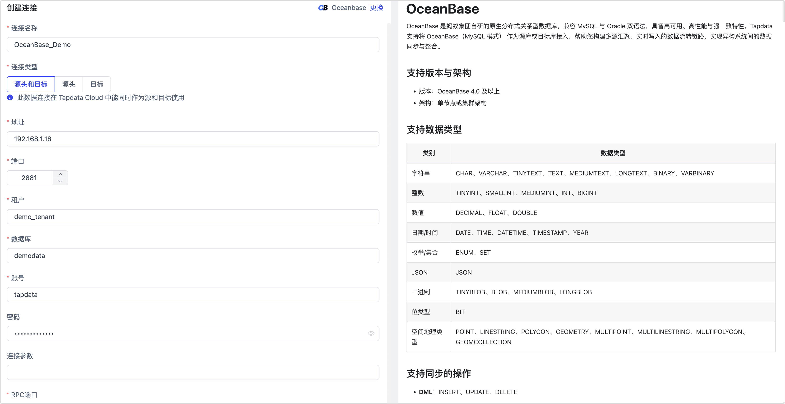

# OceanBase


OceanBase 数据库是一个金融级分布式关系数据库，TapData 支持将 OceanBase 作为目标库，帮助您快速构建数据流转链路。接下来，我们将介绍如何在 TapData 平台中连接 OceanBase 数据源。

## 支持版本

OceanBase 3.x


## 准备工作

1. 确保 TapData 所属的网络已加入 OceanBase 的[租户白名单](https://www.oceanbase.com/docs/community-observer-cn-10000000000015856)中。

2. 以 `root` 用户登录到[租户](https://www.oceanbase.com/docs/community-observer-cn-10000000000015851)。

3. 执行下述格式的命令，创建用于数据同步的用户。

   ```sql
   CREATE USER 'username' IDENTIFIED BY 'password';
   ```
   
   * **username**：用户名。
   * **password**：密码。
   
4. 执行下述格式的命令，为刚创建的用户授予库级别所有权限，您也可以基于业务需求自定义更精细化的[权限控制](https://www.oceanbase.com/docs/community-observer-cn-10000000000014488)。

   ```sql
   GRANT ALL ON database_name.* TO username;
   ```
   
   * **database_name**：数据库名称。
   * **username**：用户名。


## 添加数据源

1. 登录 Tapdata 平台。

2. 在左侧导航栏，单击**连接管理**。

3. 单击页面右侧的**创建**。

4. 在弹出的对话框中，搜索并选择 **OceanBase**。

5. 在跳转到的页面，根据下述说明填写 OceanBase 的连接信息。

   

   * **连接信息设置**
     * **连接名称**：填写具有业务意义的独有名称。
     * **连接类型**：目前仅支持 OceanBase 作为**目标**库。
     * **地址**：数据库连接地址。
     * **端口**：数据库的服务端口，默认为 **2881**。
     * **数据库**：数据库名称，即一个连接对应一个数据库，如有多个数据库则需创建多个数据连接。
     * **账号**：数据库的租户账号，格式为 `用户名@租户名`，例如要通过 `tapdata` 账号连接默认的 test 租户时，即填写为` tapdata@test`。
     * **密码**：租户账号对应的密码。
     * **额外参数**：额外的连接参数，默认为空。
     * **时区**：默认为数据库所用的时区，您也可以根据业务需求手动指定。
   * **高级设置**
     * **Agent 设置**：默认为**平台自动分配**，您也可以手动指定 Agent。
     * **模型加载频率**：数据源中模型数量大于 1 万时，TapData 将按照设置的时间定期刷新模型。

6. 单击**连接测试**，测试通过后单击**保存**。

   :::tip

   如提示连接测试失败，请根据页面提示进行修复。

   :::
