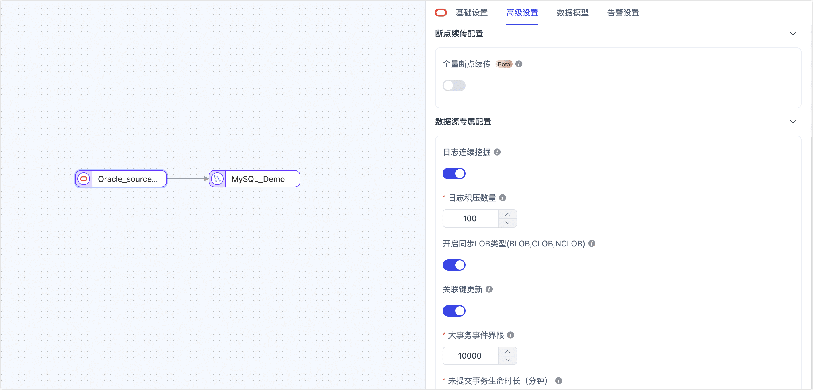

# Oracle
import Content from '../../reuse-content/_enterprise-and-cloud-features.md';

<Content />

Oracle Database（简称 Oracle）是甲骨文公司的一款关系数据库管理系统，以其高性能、强大扩展性和安全性著称。它支持复杂查询、高并发处理，并提供丰富的功能集，如数据备份、恢复、高可用性及多租户架构，广泛应用于企业级应用和关键任务系统。本文将介绍如何在 TapData 中添加 Oracle 数据源，后续可将其作为**源**或**目标库**来构建实时数据链路。

```mdx-code-block
import Tabs from '@theme/Tabs';
import TabItem from '@theme/TabItem';
```

## 支持版本与架构

| **类别** | **说明**                                                     |
| -------- | ------------------------------------------------------------ |
| 版本     | Oracle 9i、10g、11g、12c、18c、19c+                          |
| 架构     | 支持单实例或 RAC 环境支持连接至 Data Guard、Active Data Guard 或 Automatic Storage Management 的主节点。<br />当增量数据获取方式选择为**裸日志**方案时，支持连接至从节点以避免因采集数据对源库的影响。 |

## 支持数据类型

| 类别       | 数据类型                                                     |
| ---------- | ------------------------------------------------------------ |
| 字符串     | VARCHAR2、CHAR、NVARCHAR2、NCHAR、CLOB、NCLOB                |
| 数值       | NUMBER、INTEGER、FLOAT、BINARY_FLOAT、BINARY_DOUBLE          |
| 日期和时间 | DATE、TIMESTAMP、TIMESTAMP WITH TIME ZONE、TIMESTAMP WITH LOCAL TIME ZONE、INTERVAL |
| 其他       | BLOB、XMLTYPE                                                |

:::tip

- 当增量数据获取方式采用 LogMiner 方案时，不支持 **INTERVAL** 和 **XMLTYPE**；当采用裸日志方案时，不支持 **TIMESTAMP WITH LOCAL TIME ZONE**。
- 将 Oracle 作为目标库时，不支持 **TIMESTAMP WITH LOCAL TIME ZONE** 和 **INTERVAL**。

:::

## 支持同步的操作

- **DML**：INSERT、UPDATE、DELETE

  :::tip

  将 Oracle 作为同步的目标时，您还可以通过任务节点的高级配置，选择写入策略：插入冲突场景下，可选择转为更新或丢弃；更新失败场景下，可选择转为插入或仅打印日志。

  :::

- **DDL**：ADD COLUMN、CHANGE COLUMN、DROP COLUMN、RENAME COLUMN

## 增量数据获取方式

为了提高数据变更捕获的效率，TapData 不仅支持使用数据库原生日志解析工具（LogMiner），还开发了直接解析数据库增量日志文件的能力，从而实现更高效的事件捕获，两者的<span id="log-miner">对比如下</span>：

| 方案               | 特点                                                         | 适用场景                                                     |
| ------------------ | ------------------------------------------------------------ | ------------------------------------------------------------ |
| 传统 LogMiner 方案 | ●  无需额外部署组件，运维成本低<br />●  解析数据库的 redo log 获取增量变更<br />●  采集性能受数据库性能影响，通常 RPS 低于 20,000<br />●  19C RAC 版本及以上会涉及增量数据重扫，效率较低 | 适用于轻量化部署<br />对同步性能要求不高等场景               |
| TapData 裸日志方案 | ●  需要单独部署组件，需要一定运维成本<br />●  直接解析原生二进制日志，减少中转<br />●  采集性能更高，RPS 可达 60,000 以上<br />●  账号权限需适当放宽 | 适用于数据变更频繁，即同步性能要求高<br />希望采集增量数据时最小化对源库影响 |

:::tip

- 采用传统 LogMiner 方案时，每个数据同步任务会启动一个 Logminor session，当增量变更规模较大时，最多会占满 1 个 CPU 核的资源，增量变更规模不大时，可能约占用 0.25个 CPU 核的资源。推荐对于大数据量的任务挖掘可以单独占用一个挖掘进程，小数据量的任务挖掘可以使用[共享挖掘](../../user-guide/advanced-settings/share-mining.md)。
- 采用裸日志方案时，由于其解析性能非常高，在业务高峰期会占用部分 CPU、内存、磁盘 I/O 资源，推荐连接至从节点以最大程度降低对业务影响。

:::

## 功能限制

* Oracle 作为源库时：
  * 日志解析速度约为 10,000 条记录数每秒，如增量事件高于该速率，可能导致数据处理的延迟上升，如需提升速率，推荐采用 TapData 的[裸日志方案](#log-miner)。
  * 采用 LogMiner 采集方案时：
    - 受 [LogMiner 功能限制](https://docs.oracle.com/en/database/oracle/oracle-database/19/sutil/oracle-logminer-utility.html)，待同步的表和列名长度不能超过 30 字符，否则可能导致无法获取其增量数据变更。
    - 为避免增量同步阶段无法获取虚拟列的问题，可通过添加 JS 节点或手动创建目标表结构的方式解决。
    - 执行手动挖掘时，当表 DDL 变更时，同时针对该表执行了大量的 DML 事件，有极小概率无法因字典无法解析原  Schema 信息，导致采集信息异常的问题。
    - 对 RAC 节点执行手动挖掘时，可能存在少量重复采集的情况（不乱序），需要下游实现幂等，即会影响无主键表数据。
* Oracle 作为目标库时：
  * 异构数据库间同步时，由于 Oracle 没有空字符串，会自动转换为null，因此源库的非空约束通常不适合同步到 Oracle，可在任务配置时选择忽略 not null，从而将源表的字符串类型的非空约束进行过滤。
  * Db2 的非空字段可以用`""`赋值，但相关字段向 Oracle 写入的时候，Oracle 会认为该字段是 NULL，从而导致非空字段写入失败。

## 注意事项

* 如设置了 connect_time（自动断开超时会话），可能导致实时同步异常，可通过下述命令检查该参数的设置。
  ```sql
  SELECT resource_name, limit FROM dba_profiles WHERE profile=( SELECT profile FROM dba_users WHERE username = 'username');
  ```
* 您需要为归档日志预留足够的存储空间，可通过  `ALTER SYSTEM SET DB_RECOVERY_FILE_DEST_SIZE` 命令设置，避免存储占满影响数据库运行。
* 当采用裸日志方案采集增量数据时，如果强行终止引擎，重启裸日志采集组件时，会重新扫描目录中积攒的 fzs 文件，可能会导致进入增量缓慢，如果发生异常，您可以将相关解析日志保存提供给技术支持。
* 当采用 LogMiner 方案采集增量数据时，您需要注意：
  * 采集性能依赖源库机器性能，在自动挖掘或者 RAC 双节点的情况下，通常推荐 PGA 内存大于 16 GB， redo 大于 512MB 且小于 2 GB，如果是单节点可以适当地降低配置，同时应避免连续归档。
  * 对于未提交事务，相关数据会存放至内存，如果事物较大（包含大量 DML 事件），为避免内存溢出，TapData 会将其落盘。如果停止任务或重启引擎，TapData 会记录最早未提交事务的 scn 号，重启任务时会从该 scn 开始重新扫描，在下游支持幂等约束的情况下，可保障数据不丢失。为避免增量信息回退过长而影响同步信息，您可以在任务配置时设置**未提交事务生命时长**，由 TapData 清理超过该时长的未提交事务。
  * 为提升采集性能，可在配置任务时，关闭大字段（LOB）的同步，或者业务上明确不会更新主键字段/关联键字段。
  * 当 Oracle 低于 19C 版本时，TapData 将采用自动采集机制，可自动查找 redo 日志，无需关注 Oracle 部署架构，可连续不间断地采集日志。为提升采集性能，推荐基于数据变更规模设定任务配置中的 fetchSize（日志积压数量）。
  * 当 Oracle 为 19C 版本时，受限于 Oracle 内部机制调整，TapData 将采用手动采集机制，即线上日志连续扫描+归档日志补充循环的方式。此场景下，如果是单节点部署，由于最多只会同时扫描一份 redo 日志，性能较好；如果是 RAC 部署，由于 scn 号每个线程交替增长，因此最多会扫描 `{节点数 X 2}` 份 redo日志，最少为 `{节点数 X 1}` 份 redo 日志，当 redo 日志较大时，将会降低增量数据读取性能。
    
    :::tip
    
    由于采集过程中无法感知节点是否发生归档操作，为保障事物的顺序一致，可能触发部分节点数据重新采集的机制，因此需要目标库具备幂等约束。
    
    :::


## <span id="prerequisites">准备工作</span>

### 作为源库

1. 以具有 DBA 权限的用户身份登录 Oracle 数据库。

2. 依次执行下述格式的命令，创建用于数据复制/转换任务的用户。

```mdx-code-block
<Tabs className="unique-tabs">
<TabItem value="Oracle 标准模式">
```
```sql
CREATE USER username IDENTIFIED BY password;
```
</TabItem>

<TabItem value="Oracle 多租户模式">

```sql
-- 切换至根容器
ALTER SESSION SET CONTAINER=cdb$root;

-- 创建用户
CREATE USER username IDENTIFIED BY password CONTAINER=all;
```
</TabItem>
</Tabs>

   - **username**：用户名，当 Oracle 处于多租户模式下时，用户名需增加 `C##` 前缀。
   - **password**：密码。


3. 为刚创建的账号授予权限，您也可以基于业务需求自定义权限控制。

```mdx-code-block
<Tabs className="unique-tabs">
<TabItem value="仅读取全量数据">
```
```sql
-- 替换下述命令中的 username 为真实的用户名
-- 授予 V_$DATABASE 视图权限
GRANT 
    SELECT ON V_$DATABASE 
TO username;

-- 用户自身 Schema 下
GRANT 
    CREATE SESSION
TO username;

-- 其它 Schema 下（推荐）
GRANT
    CREATE SESSION,
    SELECT ANY TABLE,
TO username;   
-- 如为多租户模式，命令结尾需要需要指定容器，例如 CONTAINER=all
```
</TabItem>

<TabItem value="读取全量+增量数据">

```sql
-- 替换下述命令中的 username 为真实的用户名
-- 授予 V_$DATABASE 视图权限
GRANT 
    SELECT ON V_$DATABASE 
TO username;

GRANT CREATE SESSION,
      ALTER SESSION,
      EXECUTE_CATALOG_ROLE,
      SELECT ANY DICTIONARY,
      SELECT ANY TRANSACTION,
      SELECT ANY TABLE
TO username;
```
:::tip
当 Oracle 版本为 12c 及以上时，您还需要执行 `GRANT LOGMINING TO username;` 格式的命令授予 `LOGMINING` 权限。
:::
</TabItem>
</Tabs>


4. 如果您需要获取源库的数据变更以实现增量同步，您还需要以 DBA 身份登录数据库完成下述数据库设置。

   1. 开启数据库归档模式（ARCHIVELOG），由于涉及重启数据库，请在业务低峰期操作。

      :::tip

      您也可以执行 `SELECT log_mode FROM v$database;` 命令来查看是否已开启该功能，返回结果为 **ARCHIVELOG** 表示已开启，可跳过本步骤。

      :::

      ```sql
      -- 关闭数据库
      SHUTDOWN IMMEDIATE;
      
      -- 启动并挂载数据库
      STARTUP MOUNT;
      
      -- 开启归档并打开数据库
      ALTER DATABASE archivelog;
      ALTER DATABASE OPEN;
      ```

   2. 开启补充日志（Supplemental Logging）。
      ```sql
      -- 为库级开启主键补充日志，如需关闭，将 ADD 替换为 DROP
      ALTER DATABASE ADD SUPPLEMENTAL LOG DATA (PRIMARY KEY) COLUMNS;
      
      
      -- 为单个表开启主键补充日志，需替换命令中 Schema 名称和 表名称
      ALTER TABLE Schema名称.表名称 ADD SUPPLEMENTAL LOG DATA (PRIMARY KEY) COLUMNS;
      ```
   
      :::tip

      如日志磁盘存储空间相对充裕，可执行 `ALTER DATABASE ADD SUPPLEMENTAL LOG DATA (ALL) COLUMNS;` 命令开启库级的全补充日志，简化操作流程。

      :::
   
   3. 如存在无主键表，您还需要选择执行下述命令，为单个表或所有表开启全补充日志（full supplemental logging）。
   
      ```sql
      -- 为单个表开启，需替换命令中 Schema名称和表名称
      ALTER TABLE Schema名称.表名称 ADD SUPPLEMENTAL LOG DATA (ALL) COLUMNS;
      
      -- 为所有表开启
      ALTER DATABASE ADD SUPPLEMENTAL LOG DATA (ALL) COLUMNS;
      ```

      :::tip

      如果 Oracle 处于多租户模式，推荐为指定的容器开启，即在执行上述命令前先执行 `ALTER SESSION SET CONTAINER=PDB名称;` 格式的命令，将更改应用于容器。

      :::
   
   4. 提交更改。
   
      ```sql
      ALTER SYSTEM SWITCH LOGFILE;
      ```

   5. 如果 Oracle 处于多租户模式，您还需要执行下述命令打开可插拔数据库。

      ```sql
      ALTER PLUGGABLE DATABASE ALL OPEN;
      ```


### 作为目标库

1. 以具有 DBA 权限的用户身份登录 Oracle 数据库。

2. 依次执行下述格式的命令，创建用于数据复制/转换任务的用户。

```mdx-code-block
<Tabs className="unique-tabs">
<TabItem value="Oracle 标准模式">
```
```sql
CREATE USER username IDENTIFIED BY password;
```
</TabItem>

<TabItem value="Oracle 多租户模式">

```sql
-- 切换至根容器
ALTER SESSION SET CONTAINER=cdb$root;

-- 创建用户
CREATE USER username IDENTIFIED BY password CONTAINER=all;
```
</TabItem>
</Tabs>

   - **username**：用户名，当 Oracle 处于多租户模式下时，用户名需增加 `C##` 前缀。
   - **password**：密码。


3. 为刚创建的账号授予权限，您也可以基于业务需求自定义权限控制。

```mdx-code-block
<Tabs className="unique-tabs">
<TabItem value="Oracle 标准模式">
```
```sql
-- 替换下述命令中的 username 为真实的用户名
-- 用户自身 Schema 下
GRANT 
    CREATE SESSION,
    CREATE ANY TABLE,
    UNLIMITED TABLESPACE
TO username;

-- 其它 Schema 下
GRANT
    CREATE SESSION,
    CREATE ANY TABLE,
    DELETE ANY TABLE,
    DROP ANY TABLE,
    INSERT ANY TABLE,
    SELECT ANY TABLE,
    UPDATE ANY TABLE,
    ALTER ANY INDEX,
    CREATE ANY INDEX,
    DROP ANY INDEX,
    UNLIMITED TABLESPACE
TO username;
```
</TabItem>

<TabItem value="Oracle 多租户模式">

```sql
-- 替换下述命令中的 username 为真实的用户名
-- 用户自身 Schema 下
GRANT 
    CREATE SESSION,
    CREATE ANY TABLE,
    UNLIMITED TABLESPACE
TO username;

-- 其它 Schema 下
GRANT
    CREATE SESSION,
    CREATE ANY TABLE,
    DELETE ANY TABLE,
    DROP ANY TABLE,
    INSERT ANY TABLE,
    SELECT ANY TABLE,
    UPDATE ANY TABLE,
    ALTER ANY INDEX,
    CREATE ANY INDEX,
    DROP ANY INDEX,
    UNLIMITED TABLESPACE
TO  username CONTAINER=all;
```
</TabItem>
</Tabs>


### <span id="ssl">开启 SSL 连接（可选）</span>

为进一步提升数据链路的安全性，您还可以选择为 Oracle 数据库开启 SSL（Secure Sockets Layer）加密，实现在传输层对网络连接的加密，在提升通信数据安全性的同时，保证数据的完整性。

接下来，我们以部署在 Linux 平台上的 Oracle 12c 为例，演示具体的操作流程：

1. 登录 Oracle 数据库所属的设备，依次执行下述命令，调整目录权限并切换至 Oracle 用户。

   ```bash
   chown oracle:dba /opt/oracle/ -R
   su oracle
   mkdir -p /opt/oracle/wallet
   ```

2. 依次执行下述格式的命令，创建存放证书文件的目录并生成 Key 文件，其中 `{password}` 需更换为要设置的密码。

   ```bash
   $ORACLE_HOME/bin/orapki wallet create -wallet /opt/oracle/wallet -pwd {password} -auto_login
   $ORACLE_HOME/bin/orapki wallet add -wallet /opt/oracle/wallet  -pwd {password}   -dn "CN=localhost" -keysize 1024 -self_signed -validity 365
   ```


3. 执行下述命令，生成 jks 文件，需更换 {password} 为对应的密码。

   ```bash
   $ORACLE_HOME/bin/orapki wallet pkcs12_to_jks -wallet /opt/oracle/wallet -pwd {password} -jksKeyStoreLoc /opt/oracle/wallet/oracle12c_ks.jks -jksKeyStorepwd {password} -jksTrustStoreLoc /opt/oracle/wallet/oracle12c_ts.jks -jksTrustStorepwd {password}
   ```

   如需转换 pem 文件，可再执行下述命令：

   ```bash
   cd /opt/oracle/wallet&& openssl pkcs12 -clcerts -nokeys -out oracle_cert.pem -in ewallet.p12
   ```

4. 创建相关配置文件，完成 SSL 的配置。

   ```bash
   # 该目录需基于您的环境调整
   cd /u01/app/oracle/product/12.1.0/xe/network/admin
   touch listener.ora
   touch sqlnet.ora
   touch tnsnames.ora
   ```

   配置文件添加的内容分别如下：

```mdx-code-block
<Tabs className="unique-tabs">
<TabItem value="listener.ora">
```
```bash
# listener.ora

SSL_CLIENT_AUTHENTICATION = FALSE

WALLET_LOCATION =
  (SOURCE =
    (METHOD = FILE)
    (METHOD_DATA =
      (DIRECTORY = /opt/oracle/wallet)
    )
  )

LISTENER =
(DESCRIPTION_LIST =
  (DESCRIPTION =
    (ADDRESS = (PROTOCOL = IPC)(KEY = EXTPROC1))
    (ADDRESS = (PROTOCOL = TCP)(HOST = 0.0.0.0)(PORT = 1521))
  )
  (DESCRIPTION =
     (ADDRESS = (PROTOCOL = TCPS)(HOST = 0.0.0.0)(PORT = 2484))
   )
)

DEDICATED_THROUGH_BROKER_LISTENER=ON
DIAG_ADR_ENABLED = off
```
</TabItem>

<TabItem value="sqlnet.ora">

```bash
# sqlnet.ora

WALLET_LOCATION =
   (SOURCE =
     (METHOD = FILE)
     (METHOD_DATA =
       (DIRECTORY = /opt/oracle/wallet)
     )
   )

SQLNET.AUTHENTICATION_SERVICES = (TCPS,NTS,BEQ)
SSL_CLIENT_AUTHENTICATION = FALSE
SSL_CIPHER_SUITES = (SSL_RSA_WITH_AES_256_CBC_SHA, SSL_RSA_WITH_3DES_EDE_CBC_SHA)
```
</TabItem>

<TabItem value="tnsnames.ora">

```bash
# tnsnames.ora

SSL=
(DESCRIPTION =
  (ADDRESS = (PROTOCOL = TCPS)(HOST = 0.0.0.0)(PORT = 2484))
  (CONNECT_DATA =
    (SERVER = DEDICATED)
    (SERVICE_NAME = XE)
  )
)

XE=
(DESCRIPTION =
  (ADDRESS = (PROTOCOL = TCP)(HOST = 0.0.0.0)(PORT = 1521))
  (CONNECT_DATA =
    (SERVER = DEDICATED)
    (SERVICE_NAME = XE)
  )
)
```
</TabItem>
</Tabs>

5. 在业务低峰期，依次执行下述命令重启 Oracle 服务。

   ```bash
   $ORACLE_HOME/bin/lsnrctl stop
   $ORACLE_HOME/bin/lsnrctl start
   $ORACLE_HOME/bin/sqlplus / as sysdba
   shutdown
   startup
   ```

6. 验证 Oracle 可通过 SSL 登录，例如 `$ORACLE_HOME/bin/sqlplus username/password@SSL`。


## 添加数据源

1. [登录 TapData 平台](../../user-guide/log-in.md)。

2. 在左侧导航栏，单击**连接管理**。

3. 单击页面右侧的**创建**。

4. 在弹出的对话框中，搜索并选择 **Oracle**。

5. 在跳转到的页面，根据下述说明填写 Oracle 的连接信息。

   

   * **连接信息设置**
      * **连接名称**：填写具有业务意义的独有名称。
      * **连接类型**：支持将 Oracle 作为源或目标库。
      * **连接方式**：可选择通过 SID 或 Service Name 连接。
      * **数据库地址**：数据库连接地址。
      * **端口**：数据库的服务端口。
      * **SID**/**Service Name**：填写 SID 或 Service Name 信息。
      * **Schema**：Schema 名称，即一个连接对应一个 Schema，如需连接多个 Schema 则需创建多个数据连接。
      * **其他连接串参数**：额外的连接参数，默认为空。
      * **账号**：数据库的账号。
      * **密码**：数据库账号对应的密码。
      * **日志插件**：基于业务需求选择，默认为 **logMiner**，相关介绍，见[增量日志获取方式介绍](#log-miner)。
   * **<span id="advanced">高级设置</span>**
     * **加载表注释**：选择是否加载表注释信息（默认关闭），帮助快速识别表的业务意义，当表注释较多时可能影响模型加载效率。
      * **多租户模式**：如 Oracle 为多租户模式，需打开该开关并填写 PDB 信息。
      * **使用 SSL**：选择是否开启 SSL 连接数据源，可进一步提升数据安全性，开启该功能后还需要上传 SSL 证书文件并填写证书密码，相关文件已在[开启 SSL 连接](#ssl)中获取。
      * **时区**：默认为 0 时区，如果更改为其他时区，不带时区的字段（如 TIMESTAMP）会受到影响，而带时区的字段（如 TIMESTAMP WITH TIME ZONE）和 DATE 类型则不会受到影响。
      * **套接字超时时长**：设置此参数，以重试机制来避免 LogMiner 执行自动挖掘增量变更时，因意外情况（如套接字交互超时）而形成的僵尸连接，默认值为 0 表示不设置。
      * **共享挖掘**：[挖掘源库](../../user-guide/advanced-settings/share-mining.md)的增量日志，可为多个任务共享同一源库的增量日志采集进程，从而避免重复读取，从而最大程度上减轻增量同步对源库的压力，开启该功能后还需要选择一个外存用来存储增量日志信息。
      * **包含表**：默认为**全部**，您也可以选择自定义并填写包含的表，多个表之间用英文逗号（,）分隔。
      * **排除表**：打开该开关后，可以设定要排除的表，多个表之间用英文逗号（,）分隔。
      * **Agent 设置**：默认为**平台自动分配**，您也可以手动指定 Agent。
      * **模型加载时间**：如果数据源中的模型数量少于10000个，则每小时更新一次模型信息。但如果模型数量超过10000个，则刷新将在您指定的时间每天进行。
   
6. 单击**连接测试**，测试通过后单击**保存**。

   :::tip

   如提示连接测试失败，请根据页面提示进行修复。

   :::


## 节点高级特性

在配置数据同步/转换任务时，将 Oracle 作为源或目标节点时，为更好满足业务复杂需求，最大化发挥性能，TapData 为其内置更多高级特性能力，您可以基于业务需求配置：




```mdx-code-block
<Tabs className="unique-tabs">
<TabItem value="Oracle 作为源节点">
```

| **配置**            | **说明**                                                     |
| ------------------- | ------------------------------------------------------------ |
| 全量断点续传        | 面对海量数据（记录数超过 1 亿）的迁移场景，您可以借助 TapData 的全量断点续传功能，将数据分片并迁移，有效地避免数据传输中断而导致的数据丢失和任务执行失败的问题，提高数据迁移的可靠性和效率。 |
| 日志连续挖掘        | 选择是否开启自动挖掘：开启后可自动加载 Oracle 日志文件，处理编码字典更稳定，注意 19 及以上版本已不被 Oracle 支持。关闭该功能后，需要手动加载日志文件，动态实时地处理好归档导致的文件切换和挖掘的连续性，在合理的配置下性能略高于自动挖掘，且高版本继续支持。 |
| 日志积压数量        | 开启自动挖掘后，LogMiner 会积累一定数据量（包含  DML、COMMIT 和 ROLLBACK 事件数），默认 100 条后再供下游读取。请根据任务的数据变更频率进行设置：若设置过大，源库数据变更较少时可能导致少量尾部事件延迟较长；若设置过小，源库数据频繁变更时可能会影响性能。 |
| 开启同步 LOB 类型   | 选择是否同步大字段类型（如 BLOB、CLOB、NCLOB），默认开启。目前默认的同步方案为反查，关闭同步可提升性能，但会导致 LOB 类型解析不可靠。 |
| 关联键更新          | 如果业务上没有更新物理主键值的场景，可关闭以提升 UPDATE 事件的解析性能。 |
| 大事务事件界限      | 使用 LogMiner 方案获取增量数据时，可通过该设置确定进入大事务逻辑的界限，默认为 10000（DML 事件数）。设置过大会增加内存压力，导致 OOM 风险；设置过小则频繁依赖磁盘缓存，影响性能。因此，业务上应尽量避免千万级以上的数据批量写入操作，如 `insert into select` 或批量 `update` 等。 |
| 未提交事务生命时长  | 为避免重启任务时数据丢失，TapData 会将长时间未提交的事务保留在任务缓存中，并在重启时从最早的未提交事务开始挖掘。为确保采集性能，您可以通过该参数控制未提交事务的保留时长（默认 702 分钟），超过该时长的事务将被自动清理。 |
| 哈希分片            | 开启后，全表数据将在全量同步阶段按哈希值拆分为多个分片，并发读取数据，显著提升读取性能，但也会增加数据库负载，最大分片数可在启用开关后手动设置。 |
| 启用 Fzs 压缩       | 在采用裸日志方案时，裸日志组件通常部署在数据库层，且与 TapData 服务位于不同机器上。开启压缩可以有效减少网络传输带来的性能瓶颈，但会消耗一定的 CPU 资源，默认关闭。 |
| Fzs Socket 超时时间 | 通过重试机制避免裸日志组件，因意外情况（如套接字交互超时）导致的无响应问题，默认值为 10 秒。 |


</TabItem>

<TabItem value="Oracle 作为目标节点">

| **配置**     | **说明**                                                     |
| ------------ | ------------------------------------------------------------ |
| 忽略 NotNull | 默认开启，用于在 Oracle 数据库中去除字符串类型字段的非空限制。这避免了异构数据库同步场景下，由于 Oracle 将空字符串视为 null 而导致的数据同步错误。如果业务中不存在空字符串的情况，可以选择关闭此选项。 |

</TabItem>
</Tabs>


## 性能测试

### 测试环境

- Oracle 环境：**ecs.ebmhfc6.20xlarge** 机型，拥有 80 CPU 核数、192 GB 内存 和 500GB ESSD 磁盘。
- 表结构：测试表拥有 53 个字段，包括 30 个长度为 8 的随机字符串、21 个随机浮点数字段,、以及 1 个主键字段、1 个标题、1 个日期字段

### 测试结果

本次性能测试覆盖了全量与增量数据的读写操作，测试结果如下所示，仅代表在当前环境下的测试参考，并非 TapData 的性能极限。

| 类别                          | 每秒处理记录数（RPS） | 备注                                                      |
| ----------------------------- | --------------------- | --------------------------------------------------------- |
| 全量数据写入                  | 24 万                 | 无                                                        |
| 增量数据写入                  | 1.2 万                | 增量数据生成时，INSERT、UPDATE、DELETE 采用的比例为 1:1:1 |
| 全量数据读取                  | 30 万                 | 无                                                        |
| 增量数据读取（LgoMiner 方案） | 2 万                  | 增量延迟平均约 3 秒                                       |
| 增量数据读取（裸日志方案）    | 6.2 万                | 增量延迟平均约 10 秒                                      |

## 常见问题

- 问：Oracle 增量支持分区表吗？

  答：分区表的增量事件都可以解析到，但暂不支持采集增加分区的 DDL变更。

- 问：为什么 Oracle 数据库开了几个同步任务，发生告警提示连接数超限了？

  答：检查一下数据库版本是否为 11.2.0.4，此问题属于 Oracle 的一个 Bug（编号 19587324），即 LogMiner 启动了太多并行查询服务以收集统计信息，可通过安装补丁解决，也可以更换为裸日志方案。

- 问：使用 LogMiner 方案时，为什么增量数据的同步延迟较大？

  答：请检查是否开启了自动挖掘，可能设置的日志积压数量设置过大，但实际增量业务量较小，此场景下同步可能会积压一批后再同步。

- 问：Oracle 作为目标写入时，某些表的 QPS 速率下滑明显？

  答：可能该表为无主键表，推荐为其配置更新条件（业务逻辑主键），否则字段数较多时性能会受严重影响。

- 问：为什么裸日志解析出来的数据，存在乱码的情况？

  答：部署裸日志的系统语言环境变量需要和数据库的语言一致，可通过 `select userenv('languge') from dual;` 命令查询数据库的语言，然后执行下述命令修改裸日志所属设备的配置：

  ```sql
   # 修改系统变量，注意替换语言配置值
   vi ~/.bash_profile
   export NLS_LANG={数据库语言查询结果}
   
   # 使系统变量生效
   source ~/.bash_profile
  ```

- 问：为什么增量的 QPS 规模上升后，裸日志解析场景下，提升错误重试的日志？

- 需检查裸日志的配置 ，即 conf/export.conf 文件中的 `param_proc_max_mem` 参数是否设置过小，推荐设置值为 8192。

## 相关文档

[Oracle 实时同步到 Kakfa](../../case-practices/pipeline-tutorial/oracle-to-kafka.md)


