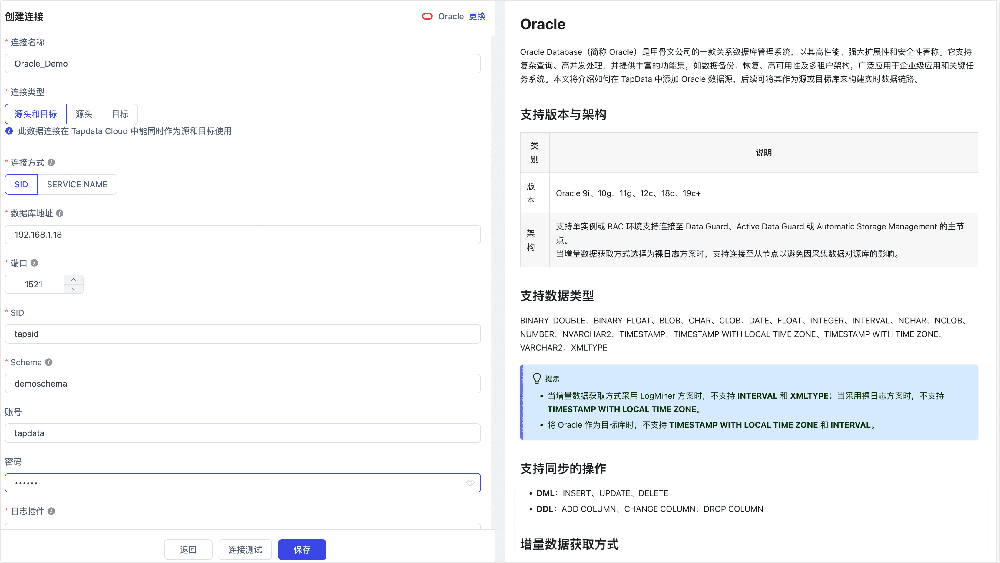

# Oracle

Oracle Database（简称 Oracle）是甲骨文公司的一款关系数据库管理系统。完成 Agent 部署后，您可以跟随本文教程在 Tapdata 中添加 Oracle 数据源，后续可将其作为源或目标库来构建数据管道。
```mdx-code-block
import Tabs from '@theme/Tabs';
import TabItem from '@theme/TabItem';
```

## 支持版本 

Oracle 9i、10g、11g、12c、19c

## 功能限制

* Oracle 作为源库时：
  * 日志解析速度约为 10,000 QPS，如增量事件高于该速率，可能导致数据处理的延迟上升，如需提升速率，推荐采用 Tapdata 的[裸日志方案](#log-miner)。
* Oracle 作为目标库时：
  * 异构数据库间同步时，由于 Oracle 没有空字符串，会自动转换为null，因此源库的非空约束通常不适合同步到 Oracle，可在任务配置时选择忽略 not null，从而将源表的字符串类型的非空约束进行过滤。
  * Db2 的非空字段可以用`""`赋值，但相关字段向 Oracle 写入的时候，Oracle 会认为该字段是 NULL，从而导致非空字段写入失败。

## 增量数据获取方式介绍

为了提高数据变更捕获的效率，Tapdata 不仅支持使用数据库原生日志解析工具（LogMiner），还开发了直接解析数据库增量日志文件的能力，从而实现更高效的事件捕获，两者的<span id="log-miner">对比如下</span>：

| 方案               | 特点                                                         | 适用场景                                                     |
| ------------------ | ------------------------------------------------------------ | ------------------------------------------------------------ |
| 传统 LogMiner 方案 | ●  无需额外部署组件，运维成本低<br />●  解析数据库的 redo log 获取增量变更<br />●  采集性能受数据库性能影响，通常 QPS 低于 10,000<br />●  19C RAC 版本及以上会涉及增量数据重扫，效率较低 | 适用于轻量化部署<br />对同步性能要求不高等场景               |
| Tapdata 裸日志方案 | ●  需要单独部署组件，需要一定运维成本<br />●  直接解析原生二进制日志，减少中转<br />●  采集性能更高，QPS 可达 20,000 以上<br />●  账号权限需适当放宽 | 适用于数据变更频繁，即同步性能要求高<br />希望采集增量数据时最小化对源库影响 |

:::tip

采用传统 LogMiner 方案时，只数据同步时会启动一个 Logminor session，当增量变更规模较大时，最多会占满 1 个 CPU 核的资源，增量变更规模不大时，可能约占用 0.25个 CPU 核的资源。

:::


## 注意事项

* 如设置了 connect_time（自动断开超时会话），可能导致实时同步异常，可通过下述命令检查该参数的设置。
  ```sql
  SELECT resource_name, limit FROM dba_profiles WHERE profile=( SELECT profile FROM dba_users WHERE username = 'username');
  ```
* 您需要为归档日志预留足够的存储空间，可通过  `ALTER SYSTEM SET DB_RECOVERY_FILE_DEST_SIZE` 命令设置，避免存储占满影响数据库运行。
* 当采用裸日志方案采集增量数据时，如果强行终止引擎，重启裸日志采集组件时，会重新扫描目录中积攒的 fzs 文件，可能会导致进入增量缓慢，如果发生异常，您可以将相关解析日志保存提供给技术支持。
* 当采用 LogMiner 方案采集增量数据时，您需要注意：
  * 采集性能依赖源库机器性能，在自动挖掘或者 RAC 双节点的情况下，通常推荐 PGA 内存大于 16 GB， redo 大于 512MB 且小于 2 GB，如果是单节点可以适当地降低配置，同时应避免连续归档。
  * 对于未提交事务，相关数据会存放至内存，如果事物较大（包含大量 DML 事件），为避免内存溢出，Tapdata 会将其落盘。如果停止任务或重启引擎，Tapdata 会记录最早未提交事务的 scn 号，重启任务时会从该 scn 开始重新扫描，在下游支持幂等约束的情况下，可保障数据不丢失。为避免增量信息回退过长而影响同步信息，您可以在任务配置时设置**未提交事务生命时长**，由 Tapdata 清理超过该时长的未提交事务。
  * 为提升采集性能，可在配置任务时，关闭大字段（LOB）的同步，或者业务上明确不会更新主键字段/关联键字段。
  * 当 Oracle 低于 19C 版本时，Tapdata 将采用自动采集机制，可自动查找 redo 日志，无需关注 Oracle 部署架构，可连续不间断地采集日志。为提升采集性能，推荐基于数据变更规模设定任务配置中的 fetchSize（日志积压数量）。
  * 当 Oracle 为 19C 版本时，受限于 Oracle 内部机制调整，Tapdata 将采用手动采集机制，即线上日志连续扫描+归档日志补充循环的方式。此场景下，如果是单节点部署，由于最多只会同时扫描一份 redo 日志，性能较好；如果是 RAC 部署，由于 scn 号每个线程交替增长，因此最多会扫描 `{节点数 X 2}` 份 redo日志，最少为 `{节点数 X 1}` 份 redo 日志，当 redo 日志较大时，将会降低增量数据读取性能。
    
    :::tip
    
    由于采集过程中无法感知节点是否发生归档操作，为保障事物的顺序一致，可能触发部分节点数据重新采集的机制，因此需要目标库具备幂等约束。
    
    :::


## 准备工作

### 作为源库

1. 以具有 DBA 权限的用户身份登录 Oracle 数据库。

2. 依次执行下述格式的命令，创建用于数据复制/转换任务的用户。

```mdx-code-block
<Tabs className="unique-tabs">
<TabItem value="Oracle 标准模式">
```
```sql
CREATE USER username IDENTIFIED BY password;
```
</TabItem>

<TabItem value="Oracle 多租户模式">

```sql
-- 切换至根容器
ALTER SESSION SET CONTAINER=cdb$root;

-- 创建用户
CREATE USER username IDENTIFIED BY password CONTAINER=all;
```
</TabItem>
</Tabs>

   - **username**：用户名，当 Oracle 处于多租户模式下时，用户名需增加 `C##` 前缀。
   - **password**：密码。


3. 为刚创建的账号授予权限，您也可以基于业务需求自定义权限控制。

```mdx-code-block
<Tabs className="unique-tabs">
<TabItem value="仅读取全量数据">
```
```sql
-- 替换下述命令中的 username 为真实的用户名
GRANT CREATE SESSION, SELECT ANY TABLE TO username;
```
</TabItem>

<TabItem value="读取全量+增量数据">

```sql
-- 替换下述命令中的 username 为真实的用户名
GRANT CREATE SESSION,
      ALTER SESSION,
      EXECUTE_CATALOG_ROLE,
      SELECT ANY DICTIONARY,
      SELECT ANY TRANSACTION,
      SELECT ANY TABLE
TO username;
```
:::tip
当 Oracle 版本为 12c 及以上时，您还需要执行 `GRANT LOGMINING TO username;` 格式的命令授予 `LOGMINING` 权限。
:::
</TabItem>
</Tabs>


4. 如果您需要获取源库的数据变更以实现增量同步，您还需要跟随下述步骤完成数据库设置。

   1. 开启数据库归档模式（ARCHIVELOG）。

      :::tip

      您也可以执行 `SELECT log_mode FROM v$database;` 命令来查看是否已开启该功能，返回结果为 **ARCHIVELOG** 表示已开启，可跳过本步骤。

      :::

      1. 执行下述命令，关闭数据库，请务必在业务低峰期操作，以免影响业务运行。

         ```sql
         SHUTDOWN IMMEDIATE;
         ```

      2. 执行下述命令，启动并挂载数据库。

         ```sql
         STARTUP MOUNT;
         ```

      3. 执行下述命令，开启存档并打开数据库。

         ```sql
         ALTER DATABASE archivelog;
         ALTER DATABASE OPEN;
         ```

   2. 开启补充日志（Supplemental Logging）。
      ```sql
      ALTER DATABASE ADD SUPPLEMENTAL LOG DATA;
      ```

   3. 选择执行下述命令，为单个表或所有表开启标识键日志（identification key）。

      ```sql
      -- 为单个表开启，需替换命令中 Schema 名称和 表名称
      ALTER TABLE Schema名称.表名称 ADD SUPPLEMENTAL LOG DATA (PRIMARY KEY) COLUMNS;
      
      -- 为所有表开启
      ALTER DATABASE ADD SUPPLEMENTAL LOG DATA (PRIMARY KEY) COLUMNS;
      ```

      :::tip

      如果 Oracle 处于多租户模式，推荐为指定的容器开启，即在执行上述命令前先执行 `ALTER SESSION SET CONTAINER=PDB名称;` 格式的命令，将更改应用于容器。

      :::

   4. 选择执行下述命令，为单个表或所有表开启全补充日志（full supplemental logging）。

      ```sql
      -- 为单个表开启，需替换命令中 Schema 名称和表名称
      ALTER TABLE Schema名称.表名称 ADD SUPPLEMENTAL LOG DATA (ALL) COLUMNS;
      
      -- 为所有表开启
      ALTER DATABASE ADD SUPPLEMENTAL LOG DATA (ALL) COLUMNS;
      ```

   5. 提交更改。

      ```sql
      ALTER SYSTEM SWITCH LOGFILE;
      ```
   
   6. 如果 Oracle 处于多租户模式，您还需要执行下述命令打开可插拔数据库。
   
      ```sql
      ALTER PLUGGABLE DATABASE ALL OPEN;
      ```


### 作为目标库

1. 以具有 DBA 权限的用户身份登录 Oracle 数据库。

2. 依次执行下述格式的命令，创建用于数据复制/转换任务的用户。

```mdx-code-block
<Tabs className="unique-tabs">
<TabItem value="Oracle 标准模式">
```
```sql
CREATE USER username IDENTIFIED BY password;
```
</TabItem>

<TabItem value="Oracle 多租户模式">

```sql
-- 切换至根容器
ALTER SESSION SET CONTAINER=cdb$root;

-- 创建用户
CREATE USER username IDENTIFIED BY password CONTAINER=all;
```
</TabItem>
</Tabs>

   - **username**：用户名，当 Oracle 处于多租户模式下时，用户名需增加 `C##` 前缀。
   - **password**：密码。


3. 为刚创建的账号授予权限，您也可以基于业务需求自定义权限控制。

```mdx-code-block
<Tabs className="unique-tabs">
<TabItem value="Oracle 标准模式">
```
```sql
-- 替换下述命令中的 username 为真实的用户名
GRANT CREATE SESSION,
      CREATE ANY TABLE,
      DELETE ANY TABLE,
      DROP ANY TABLE,
      INSERT ANY TABLE,
      SELECT ANY TABLE,
      UPDATE ANY TABLE,
      ALTER ANY INDEX,
      CREATE ANY INDEX,
      DROP ANY INDEX,
      UNLIMITED TABLESPACE
TO  username;
```
</TabItem>

<TabItem value="Oracle 多租户模式">

```sql
-- 替换下述命令中的 username 为真实的用户名
GRANT CREATE SESSION,
      CREATE ANY TABLE,
      DELETE ANY TABLE,
      DROP ANY TABLE,
      INSERT ANY TABLE,
      SELECT ANY TABLE,
      UPDATE ANY TABLE,
      ALTER ANY INDEX,
      CREATE ANY INDEX,
      DROP ANY INDEX,
      UNLIMITED TABLESPACE
TO  username CONTAINER=all;
```
</TabItem>
</Tabs>


### <span id="ssl">开启 SSL 连接（可选）</span>

为进一步提升数据链路的安全性，您还可以选择为 Oracle 数据库开启 SSL（Secure Sockets Layer）加密，实现在传输层对网络连接的加密，在提升通信数据安全性的同时，保证数据的完整性。

接下来，我们以部署在 Linux 平台上的 Oracle 12c 为例，演示具体的操作流程：

1. 登录 Oracle 数据库所属的设备，依次执行下述命令，调整目录权限并切换至 Oracle 用户。

   ```bash
   chown oracle:dba /opt/oracle/ -R
   su oracle
   mkdir -p /opt/oracle/wallet
   ```

2. 依次执行下述格式的命令，创建存放证书文件的目录并生成 Key 文件，其中 `{password}` 需更换为要设置的密码。

   ```bash
   $ORACLE_HOME/bin/orapki wallet create -wallet /opt/oracle/wallet -pwd {password} -auto_login
   $ORACLE_HOME/bin/orapki wallet add -wallet /opt/oracle/wallet  -pwd {password}   -dn "CN=localhost" -keysize 1024 -self_signed -validity 365
   ```


3. 执行下述命令，生成 jks 文件，需更换 {password} 为对应的密码。

   ```bash
   $ORACLE_HOME/bin/orapki wallet pkcs12_to_jks -wallet /opt/oracle/wallet -pwd {password} -jksKeyStoreLoc /opt/oracle/wallet/oracle12c_ks.jks -jksKeyStorepwd {password} -jksTrustStoreLoc /opt/oracle/wallet/oracle12c_ts.jks -jksTrustStorepwd {password}
   ```

   如需转换 pem 文件，可再执行下述命令：

   ```bash
   cd /opt/oracle/wallet&& openssl pkcs12 -clcerts -nokeys -out oracle_cert.pem -in ewallet.p12
   ```

4. 创建相关配置文件，完成 SSL 的配置。

   ```bash
   # 该目录需基于您的环境调整
   cd /u01/app/oracle/product/12.1.0/xe/network/admin
   touch listener.ora
   touch sqlnet.ora
   touch tnsnames.ora
   ```

   配置文件添加的内容分别如下：

```mdx-code-block
<Tabs className="unique-tabs">
<TabItem value="listener.ora">
```
```bash
# listener.ora

SSL_CLIENT_AUTHENTICATION = FALSE

WALLET_LOCATION =
  (SOURCE =
    (METHOD = FILE)
    (METHOD_DATA =
      (DIRECTORY = /opt/oracle/wallet)
    )
  )

LISTENER =
(DESCRIPTION_LIST =
  (DESCRIPTION =
    (ADDRESS = (PROTOCOL = IPC)(KEY = EXTPROC1))
    (ADDRESS = (PROTOCOL = TCP)(HOST = 0.0.0.0)(PORT = 1521))
  )
  (DESCRIPTION =
     (ADDRESS = (PROTOCOL = TCPS)(HOST = 0.0.0.0)(PORT = 2484))
   )
)

DEDICATED_THROUGH_BROKER_LISTENER=ON
DIAG_ADR_ENABLED = off
```
</TabItem>

<TabItem value="sqlnet.ora">

```bash
# sqlnet.ora

WALLET_LOCATION =
   (SOURCE =
     (METHOD = FILE)
     (METHOD_DATA =
       (DIRECTORY = /opt/oracle/wallet)
     )
   )

SQLNET.AUTHENTICATION_SERVICES = (TCPS,NTS,BEQ)
SSL_CLIENT_AUTHENTICATION = FALSE
SSL_CIPHER_SUITES = (SSL_RSA_WITH_AES_256_CBC_SHA, SSL_RSA_WITH_3DES_EDE_CBC_SHA)
```
</TabItem>

<TabItem value="tnsnames.ora">

```bash
# tnsnames.ora

SSL=
(DESCRIPTION =
  (ADDRESS = (PROTOCOL = TCPS)(HOST = 0.0.0.0)(PORT = 2484))
  (CONNECT_DATA =
    (SERVER = DEDICATED)
    (SERVICE_NAME = XE)
  )
)

XE=
(DESCRIPTION =
  (ADDRESS = (PROTOCOL = TCP)(HOST = 0.0.0.0)(PORT = 1521))
  (CONNECT_DATA =
    (SERVER = DEDICATED)
    (SERVICE_NAME = XE)
  )
)
```
</TabItem>
</Tabs>

5. 在业务低峰期，依次执行下述命令重启 Oracle 服务。

   ```bash
   $ORACLE_HOME/bin/lsnrctl stop
   $ORACLE_HOME/bin/lsnrctl start
   $ORACLE_HOME/bin/sqlplus / as sysdba
   shutdown
   startup
   ```

6. 验证 Oracle 可通过 SSL 登录，例如 `$ORACLE_HOME/bin/sqlplus username/password@SSL`。


## 添加数据源

1. 登录 Tapdata 平台。

2. 在左侧导航栏，单击**连接管理**。

3. 单击页面右侧的**创建**。

4. 在弹出的对话框中，搜索并选择 **Oracle**。

5. 在跳转到的页面，根据下述说明填写 Oracle 的连接信息。

   

   * 连接信息设置
      * **连接名称**：填写具有业务意义的独有名称。
      * **连接类型**：支持将 Oracle 作为源或目标库。
      * **连接方式**：可选择通过 SID 或 Service Name 连接。
      * **数据库地址**：数据库连接地址。
      * **端口**：数据库的服务端口。
      * **SID**/**Service Name**：填写 SID 或 Service Name 信息。
      * **Schema**：Schema 名称，即一个连接对应一个 Schema，如需连接多个 Schema 则需创建多个数据连接。
      * **其他连接串参数**：额外的连接参数，默认为空。
      * **账号**：数据库的账号。
      * **密码**：数据库账号对应的密码。
      * **日志插件**：基于业务需求选择，默认为 **logMiner**，相关介绍，见[增量日志获取方式介绍](#log-miner)。

   * **<span id="advanced">高级设置</span>**
     * **加载表注释**：选择是否加载表注释信息，帮助快速识别表的业务意义。
      * **多租户模式**：如 Oracle 为多租户模式，需打开该开关并填写 PDB 信息。
      * **使用 SSL**：选择是否开启 SSL 连接数据源，可进一步提升数据安全性，开启该功能后还需要上传 SSL 证书文件并填写证书密码，相关文件已在[开启 SSL 连接](#ssl)中获取。
      * **时间类型的时区**：默认为数据库所用的时区，您也可以根据业务需求手动指定。
      * **套接字超时时长**：设置此参数可以避免在特殊情况下无限制等待数据库返回结果，从而形成僵尸连接，单位为分钟，通常无需设置，默认值为 0 表示不设置。
      * **共享挖掘**：[挖掘源库](../../user-guide/advanced-settings/share-mining.md)的增量日志，可为多个任务共享源库的增量日志，避免重复读取，从而最大程度上减轻增量同步对源库的压力，开启该功能后还需要选择一个外存用来存储增量日志信息。
      * **包含表**：默认为**全部**，您也可以选择自定义并填写包含的表，多个表之间用英文逗号（,）分隔。
      * **排除表**：打开该开关后，可以设定要排除的表，多个表之间用英文逗号（,）分隔。
      * **Agent 设置**：默认为**平台自动分配**，您也可以手动指定 Agent。
      * **模型加载频率**：数据源中模型数量大于 1 万时，Tapdata 将按照设置的时间定期刷新模型。
   
6. 单击**连接测试**，测试通过后单击**保存**。

   :::tip

   如提示连接测试失败，请根据页面提示进行修复。

   :::


## 相关文档

[Oracle 实时同步到 Kakfa](../../pipeline-tutorial/oracle-to-kafka.md)


