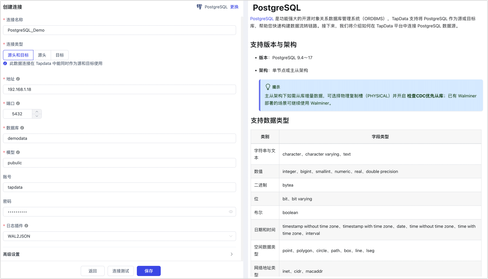
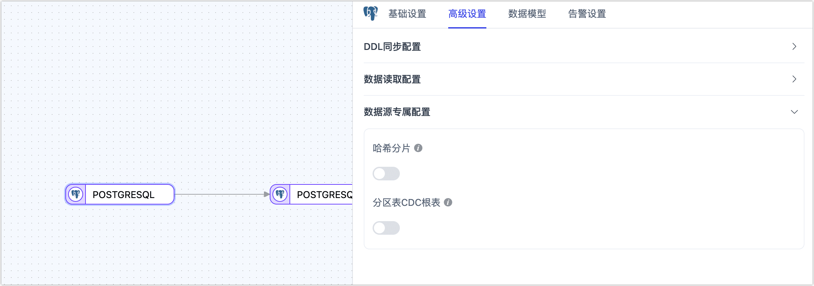

git: warning: confstr() failed with code 5: couldn't get path of DARWIN_USER_TEMP_DIR; using /tmp instead
git: error: couldn't create cache file '/tmp/xcrun_db-X3sRZZiI' (errno=Operation not permitted)
git: warning: confstr() failed with code 5: couldn't get path of DARWIN_USER_TEMP_DIR; using /tmp instead
git: error: couldn't create cache file '/tmp/xcrun_db-XyHWH38z' (errno=Operation not permitted)
---
pdkId: postgres
---

# PostgreSQL
import Content from '../../reuse-content/_all-features.md';

<Content />

[PostgreSQL](https://www.postgresql.org/) 是功能强大的开源对象关系数据库管理系统（ORDBMS），TapData 支持将 PostgreSQL 作为源或目标库，帮助您快速构建数据流转链路。接下来，我们将介绍如何在 TapData 平台中连接 PostgreSQL 数据源。

```mdx-code-block
import Tabs from '@theme/Tabs';
import TabItem from '@theme/TabItem';
```

## 支持版本与架构

* **版本**：PostgreSQL 9.4～17

* **架构**：单节点或主从架构
  
  :::tip
  
  主从架构下如需从库增量数据，可选择物理复制槽（PHYSICAL）并开启 **检查CDC优先从库**；已有 Walminer 部署的场景可继续使用 Walminer。
  
  :::

## 支持数据类型

| 类别         | 字段类型                                                     |
| ------------ | ------------------------------------------------------------ |
| 字符串与文本 | character、character varying、text                           |
| 数值         | integer、bigint、smallint、numeric、real、double precision   |
| 二进制       | bytea                                                        |
| 位           | bit、bit varying                                             |
| 布尔         | boolean                                                      |
| 日期和时间   | timestamp without time zone、timestamp with time zone、date、time without time zone、time with time zone、interval |
| 空间数据类型 | geometry、point、polygon、circle、path、box、line、lseg      |
| 网络地址类型 | inet、cidr、macaddr                                          |
| 标识符类型   | uuid、oid、regproc、regprocedure、regoper、regoperator、regclass、regtype、regconfig、regdictionary |
| 文本搜索类型 | tsvector、tsquery                                            |
| 其他         | xml、json、jsonb、array                                      |

:::tip

将 PostgreSQL 作为目标库或通过 Wal2json 插件获取其增量数据时，以下数据类型不受支持：`tsvector`、`tsquery`、`regproc`、`regprocedure`、`regoper`、`regoperator`、`regclass`、`regtype`、`regconfig` 和 `regdictionary`。如果使用 Walminer 插件，这些类型同样不受支持，此外还包括 `array` 和 `oid` 类型。

:::

## 支持同步的操作

**DML 操作**：**INSERT**、**UPDATE**、**DELETE**

**DDL 操作**：新增字段、修改字段名、修改字段属性、删除字段（逻辑复制需开启 DDL 触发器；PHYSICAL 依赖 WAL 中的系统目录变更，建议先验证）

:::tip

- 作为同步目标时，您可以通过任务节点的高级配置选择写入策略，如插入冲突时更新或丢弃、更新失败时插入或仅打印日志、启用文件写入方式等。此外，还可应用和执行源库解析的 ADD COLUMN、CHANGE COLUMN、DROP COLUMN 和 RENAME COLUMN 操作。
- 在 PostgreSQL 间数据同步的场景下，额外支持**字段默认值**、**自增列**和**外键约束**同步的能力；PostgreSQL 同步到 SQL Server 场景下，额外支持默认值和外键同步的能力。

:::

## 功能限制

- 按指定时间启动增量同步只能使用仍保留的连续 WAL；已回收的日志无法通过修改起始时间恢复。
- PHYSICAL 在 `wal_level=replica` 下依赖完整页面镜像（FPI）和页面缓存恢复 UPDATE/DELETE 的旧值，不能保证所有场景都能获得完整旧值。冷页、缓存淘汰或主从切换后的预热不足都可能导致旧值缺失。
- PostgreSQL 不支持字符串类型存放`\0`，TapData 会将其自动过滤以避免异常报错。
- 如需捕获分区主表的增量事件，必须使用 PostgreSQL 13 及以上版本，并选择 pgoutput 插件。
- Walminer 插件目前仅支持连接合并共享挖掘。

## 注意事项

- 使用 pgoutput、wal2json 或 decoderbufs 插件按指定时间启动时，将源节点高级特性中的 **保留Wal小时数** 设置为大于 0，并确认对应复制槽、任务断点和所需 WAL 仍有效。保留窗口不代表任意历史时间都可重放。
- 使用逻辑复制插件采集字段 DDL 时，需开启 **启用DDL触发器**，并授予同步账号创建审计表、函数及事件触发器的权限。PHYSICAL 通过解析系统目录的 WAL 变更采集字段 DDL，不依赖该开关；目录读取或旧值恢复不完整时，DDL 采集也可能受影响。
- 需要完整的 UPDATE/DELETE 旧值时，优先使用 `wal_level=logical`，并为采集表设置 `REPLICA IDENTITY FULL`；PHYSICAL 在 `replica` 模式下仍受全页写入（FPI）、页面缓存和页面压缩限制，需用实际数据验证。
- 物理和逻辑复制槽都会保留槽仍需的 WAL。长期停用任务或遗留槽可能占满 `pg_wal`；请通过 [`pg_replication_slots`](https://www.postgresql.org/docs/17/view-pg-replication-slots.html) 查看 `restart_lsn`。PostgreSQL 13 及以上可同时查看 `wal_status`，并结合 `max_slot_wal_keep_size` 设置保留上限；9.4～12 请通过磁盘监控和人工清理控制占用。确认不再需要恢复后再清理槽。
- 使用基于复制槽的日志插件（如 **wal2json**）时，过多的共享挖掘进程可能导致 WAL 日志积压，增加磁盘压力。请按实际采集需要配置挖掘进程，并监控 WAL 占用。仅在确认不再恢复相关任务后清理复制槽。
- 由于 PostgreSQL 的逻辑复制依赖复制槽 (Replication Slot) 的创建，如果数据库中有正在运行的任务（如刷新物化视图），可能导致复制槽创建语句被阻塞，尤其当连接测试长时间无响应时，应及时排查此类任务。
- 基于 WAL 日志的插件（如 **walminer**）在执行共享挖掘时会频繁读写 `walminer_contents` 表，从而产生一定负载，但因目前仅支持单任务挖掘，影响相对较小。
- PHYSICAL 的大事务缓冲可溢写到 Agent 磁盘，需为溢写目录预留空间和写权限。WAL 归档目录用于历史日志恢复，与临时溢写目录用途不同。
- 当前 PHYSICAL 解码器遇到外置 TOAST 指针或不受支持的压缩页面镜像时，可能无法从该条 WAL 记录恢复完整值；大字段及 UPDATE/DELETE 场景应使用实际数据验证后再运行任务。

## 准备工作

### 作为源库

<span id="prerequisites"></span>

如仅读取全量数据，完成账号授权即可。如需增量同步，请先选择采集方式，再完成对应准备工作。

#### 账号授权

1. 以管理员身份登录 PostgreSQL 数据库。

2. 创建用户并授权。

   1. 执行下述格式的命令，创建用于数据同步/开发任务的账号。

      ```sql
      CREATE USER username WITH PASSWORD 'password';
      ```

      * **username**：用户名。
      * **password**：密码。

   2. 执行下述格式的命令，授予账号权限。

      ```mdx-code-block
      <Tabs className="unique-tabs">
      <TabItem value="仅读取全量数据">
      ```
      
      ```sql
      -- 进入要授权的数据库
      \c database_name
      
      -- 授予目标 Schema 的表读取权限
      GRANT SELECT ON ALL TABLES IN SCHEMA schema_name TO username;
      
      -- Grant USAGE permission to schema
      GRANT USAGE ON SCHEMA schema_name TO username;
      ```
      
      </TabItem>
      
      <TabItem value="读取全量+增量数据">
      
      ```sql
      -- 进入要授权的数据库
      \c database_name
      
      -- 授予目标 Schema 的表读取权限
      GRANT SELECT ON ALL TABLES IN SCHEMA schema_name TO username;
      
      -- 授予目标 Schema 的 USAGE 权限
      GRANT USAGE ON SCHEMA schema_name TO username;
      
      -- 授予复制权限
      ALTER USER username REPLICATION;
      ```
      </TabItem>
      </Tabs>
      
      * **database_name**：数据库名称。
      * **schema_name**：Schema 名称。
      * **username**：用户名。

选择 Walminer 时不需要 `REPLICATION` 权限，但 Walminer/Pgto Server 场景通常需要超级用户权限；请按下方 Walminer 标签页的准备步骤执行。

#### 选择增量采集方式

常规增量同步建议优先使用**逻辑复制槽**；需要优先从库读取原始 WAL 时，选择 **PHYSICAL**；已有 Walminer 部署的场景可继续沿用。完成账号授权后，按所选方式执行以下步骤。

```mdx-code-block
<Tabs className="unique-tabs" groupId="postgres-cdc" queryString="cdc" defaultValue="logical">
<TabItem value="logical" label="逻辑复制槽">
```

#### 逻辑复制槽

1. 如采集表没有主键，或需要 UPDATE/DELETE 的完整旧值，由表所有者或有相应权限的账号执行下述命令，将复制标识修改为 FULL（使用整行作为标识）：

   :::tip

   含主键且可以接受默认复制标识的表可跳过本步骤；如仅需读取 PostgreSQL 的全量数据，则无需本步骤及后续步骤。

   :::

   ```sql
   ALTER TABLE schema_name.table_name REPLICA IDENTITY FULL;
   ```

   * **schema_name**：Schema 名称。
   * **table_name**：表名称。

2. 登录 PostgreSQL 所属的服务器，根据业务需求和版本选择解码器插件：

   - [Wal2json](https://github.com/eulerto/wal2json/blob/master/README.md)：适用于 PostgreSQL 9.4 及以上，将 WAL 日志转换为 JSON 格式；无主键采集表需检查 REPLICA IDENTITY FULL 配置，并验证更新和删除操作。

   - [Pgoutput](https://www.postgresql.org/docs/17/logicaldecoding-output-plugin.html)（默认）：PostgreSQL 10 引入的内置逻辑复制插件，无需额外安装。需要使用 publication 指定发布范围，详见[自定义复制槽和 publication](postgresql.md?cdc=logical#自定义复制槽和-publication)。含主键表使用 `REPLICA IDENTITY DEFAULT` 时，UPDATE 的旧值可能不完整，需要完整旧值时请使用 FULL。

   - [Decoderbufs](https://github.com/debezium/postgres-decoderbufs)：适用于 PostgreSQL 9.6 及以上，利用 Google Protocol Buffers 解析 WAL 日志，但配置较为复杂。

   连接器界面还可能显示 WAL2JSON 的 RDS 或 Streaming 变体；这些选项按对应环境提供的插件和版本说明安装，不套用下方 Wal2json 的 CentOS 示例。

   :::tip

   如需采集 PostgreSQL 源库的 DDL 事件，请选择 pgoutput、wal2json 或 decoderbufs 插件，并使用具备超级用户权限的同步账号创建事件触发器。TapData 会通过事件触发器将 DDL 写入 `public._tapdata_ddl_audit` 审计表，再由逻辑复制槽采集该审计表的变更；如果账号权限不足或不需要采集 DDL，可在任务源节点高级特性中关闭 **启用DDL触发器**。

   :::

   以下安装子步骤仅适用于选择 **Wal2json** 的环境；**Pgoutput** 为 PostgreSQL 10 及以上内置插件，无需安装，**Decoderbufs** 请按其项目文档完成安装。

   接下来，我们以 **Wal2json** 为例演示安装流程。

   :::tip

   本案例中，PostgreSQL 为 12 版本，安装在 CentOS 7 操作系统上，如您的环境与本案例不同，需要调整下述步骤中安装的开发包版本、环境变量的路径等。

   :::

   1. 添加仓库包。

      ```bash
      yum install https://download.postgresql.org/pub/repos/yum/reporpms/EL-7-x86_64/pgdg-redhat-repo-latest.noarch.rpm
      ```

   2. 安装 PostgreSQL 12 开发包。

      ```bash
      yum install -y postgresql12-devel
      ```

   3. 设置环境变量并使其生效。

      ```bash
      export PATH=$PATH:/usr/pgsql-12/bin
      source /etc/profile
      ```

   4. 安装环境依赖，包含 llvm、clang、gcc 等。

      ```bash
      yum install -y devtoolset-7-llvm centos-release-scl devtoolset-7-gcc* llvm5.0
      ```

   5. 依次执行下述命令，完成插件的安装。

      ```bash
      # 克隆并进入目录
      git clone https://github.com/eulerto/wal2json.git && cd wal2json
      
      # 进入 scl 的 devtoolset 环境
      scl enable devtoolset-7 bash
      
      # 编译安装
      make && make install
      ```

3. 配置逻辑复制日志。以下步骤适用于 pgoutput、wal2json 和 decoderbufs。修改配置文件 `postgresql.conf` ，将 `wal_level` 的值修改为 `logical`。

   :::tip

   同时按主从复制、CDC 消费者和连接测试临时槽的数量配置 `max_replication_slots` 与 `max_wal_senders`，确保有可用容量。

   :::

4. 修改配置文件 `pg_hba.conf` ，增加下述内容以保障 TapData 可访问到数据库。

   ```bash
   # 示例地址需替换为 TapData Agent 的实际出口 IP
   # 普通 SQL 连接和逻辑复制均匹配数据库名称
   host    database_name    username    192.0.2.10/32    md5
   ```

5. 在业务低峰期，重启 PostgreSQL 服务使日志参数生效。以下为 PostgreSQL 12 服务示例，请按实际部署方式调整。

   ```bash
   service postgresql-12.service restart
   ```

   重启后执行 `SHOW wal_level;`，确认结果为 `logical`，并使用同步账号从 Agent 所在网络连接目标数据库，核对网络和认证配置。

6. （可选）测试 Wal2json 插件。以下 SQL 仅用于已安装 Wal2json 的环境；使用 pgoutput 或 decoderbufs 时，请通过 TapData 测试任务验证增量采集。

   1. 连接 postgres 数据库，切换至需要同步的数据库并创建一张测试表。

      ```sql
      -- 假设需要同步的数据库为 demodata，模型为 public
      \c demodata
      
      CREATE TABLE public.test_decode
      (
        uid    integer not null
            constraint users_pk
                primary key,
        name   varchar(50),
        age    integer,
        score  decimal
      );
      ```

   2. 创建 Slot 连接，以 wal2json 插件为例。

      ```sql
      SELECT * FROM pg_create_logical_replication_slot('slot_test', 'wal2json');
      ```

   3. 对测试表插入一条数据。

      ```sql
      INSERT INTO public.test_decode (uid, name, age, score)
      VALUES (1, 'Jack', 18, 89);
      ```

   4. 监听日志并查看返回结果，是否有刚才插入操作的信息。

      ```sql
      SELECT * FROM pg_logical_slot_peek_changes('slot_test', null, null);
      ```

      返回示例如下（竖向显示）：

      ```sql
      lsn  | 0/3E38E60
      xid  | 610
      data | {"change":[{"kind":"insert","schema":"public","table":"test_decode","columnnames":["uid","name","age","score"],"columntypes":["integer","character varying(50)","integer","numeric"],"columnvalues":[1,"Jack",18,89]}]}
      ```

   5. 确认无问题后，可销毁 Slot 连接并删除测试表。

      ```sql
      SELECT * FROM pg_drop_replication_slot('slot_test');
      DROP TABLE public.test_decode;
      ```

##### 自定义复制槽和 publication

默认情况下，TapData 管理任务使用的复制槽。需要由 DBA 统一管理槽和发布范围时，可预先创建，再在源节点中指定名称。

1. 如需指定复制槽，在待采集数据库创建与日志插件一致的槽。例如使用 pgoutput：

   ```sql
   SELECT * FROM pg_create_logical_replication_slot('tapdata_slot', 'pgoutput');
   ```

   在任务源节点的 **指定逻辑复制槽名字** 中填写 `tapdata_slot`。同一槽同一时刻只能由一个消费者使用，独立采集任务应使用独立槽。恢复已有任务时会优先使用已保存的槽信息，不能仅修改此名称就认为任务已切换到新槽。

2. 使用 pgoutput 时，按是否开启 **部分订阅** 选择 publication 配置。

   | 配置方式 | 名称及范围 | 权限与维护 |
   | --- | --- | --- |
   | 关闭部分订阅 | 在连接中设置 **自定义全库订阅名**，默认 `dbz_publication`；启用分区根表采集时使用该名称加 `_root` | 未预建时，TapData 尝试创建全库 publication；`FOR ALL TABLES` 需超级用户权限，可由 DBA 预建 |
   | 开启部分订阅，未指定订阅名 | 使用任务槽名创建 publication，包含该任务的采集表集合 | 自动创建需数据库 CREATE 和相关表的所有者权限 |
   | 开启部分订阅，指定订阅名 | 在源节点 **自定义订阅名** 中填写预建 publication 名称 | publication 必须覆盖采集表；缺表时 TapData 仍会尝试追加，需要相应修改权限，或先由 DBA 补齐 |

   部分订阅仅缩小发布范围，使没有采集需求的表不必加入 publication；它不会解除已采集表的 UPDATE/DELETE 对复制标识的要求。这里的“订阅名”对应 PostgreSQL publication，无需为 TapData 创建 PostgreSQL SUBSCRIPTION。

   全库发布示例，按配置选择其中一种：

   ```sql
   -- 未开启分区根表采集
   CREATE PUBLICATION dbz_publication FOR ALL TABLES;

   -- PostgreSQL 13+，开启分区根表采集时
   CREATE PUBLICATION dbz_publication_root
     FOR ALL TABLES WITH (publish_via_partition_root = true);
   ```

   部分发布示例：

   ```sql
   CREATE PUBLICATION tapdata_publication FOR TABLE schema_name.table_name;
   ```

   如需逻辑 DDL 采集，还应将 DDL 审计表（默认 `public._tapdata_ddl_audit`）纳入 publication。审计表不存在时需先完成审计对象初始化；只发布业务表无法采集审计表中的 DDL 记录。

3. 使用同步账号检查槽与 publication。

   ```sql
   SELECT slot_name, slot_type, plugin, database, active,
          restart_lsn, confirmed_flush_lsn
   FROM pg_replication_slots
   WHERE slot_name = 'tapdata_slot';

   -- 将 tapdata_publication 替换为实际 publication 名称
   SELECT pubname, schemaname, tablename
   FROM pg_publication_tables
   WHERE pubname = 'tapdata_publication';
   ```

   确认槽的数据库和插件与连接配置一致，启动前未被其他消费者占用，publication 覆盖实际采集范围。长期保留自定义槽时，还需检查 **自动清理复制槽** 设置；自定义槽名不代表 TapData 一定不会清理该槽。

##### PostgreSQL 17 逻辑槽故障切换（可选）

此功能要求 PostgreSQL 17 及以上版本、pgoutput 插件，以及提供 **启用 PostgreSQL 17 逻辑槽故障切换** 配置项的连接器版本。它用于将逻辑槽同步到物理备库，区别于 PHYSICAL 的时间线恢复。

:::caution

该开关不是所有连接器版本都会显示。只有在节点高级设置中实际出现**启用 PostgreSQL 17 逻辑槽故障切换**时，以下步骤才适用；界面未显示时不要手动添加该配置。

:::

1. 由 DBA 完成 PostgreSQL 主备复制及槽同步配置：备库设置 `sync_replication_slots=on`、`hot_standby_feedback=on`，通过 `primary_slot_name` 使用主备间的物理槽，并在 `primary_conninfo` 中指定有效数据库名。主库建议设置 `synchronized_standby_slots`，避免逻辑消费者进度超过候选备库；等待备库可能增加消费延迟。详见 [PostgreSQL 槽同步说明](https://www.postgresql.org/docs/17/logicaldecoding-explanation.html#LOGICALDECODING-REPLICATION-SLOTS-SYNCHRONIZATION)。

2. 在源节点开启 **启用 PostgreSQL 17 逻辑槽故障切换**，使 TapData 在新建 pgoutput 槽时设置 `failover=true`。如需预建槽，请用以下方式替代前面普通逻辑槽的创建步骤，由 DBA 在待采集数据库执行（示例名称必须尚未被使用）：

   ```sql
   SELECT * FROM pg_create_logical_replication_slot(
     'tapdata_failover_slot', 'pgoutput', false, false, true
   );
   ```

   然后在 **指定逻辑复制槽名字** 中填写 `tapdata_failover_slot`。已有普通槽不会因打开开关自动转换；不要通过删除运行中任务的槽来启用此功能。

3. 在主库核对槽属性：

   ```sql
   SELECT slot_name, plugin, database, failover,
          restart_lsn, confirmed_flush_lsn
   FROM pg_replication_slots
   WHERE slot_name = 'tapdata_failover_slot';
   ```

   确认插件为 `pgoutput`、数据库正确且 `failover=true`。

4. 在拟提升的备库核对同步结果：

   ```sql
   SELECT slot_name, synced, temporary, invalidation_reason
   FROM pg_replication_slots
   WHERE slot_name = 'tapdata_failover_slot';
   ```

   该槽必须存在，且 `synced=true`、`temporary=false`、`invalidation_reason` 为空。槽同步是异步的，切换前还需确认备库进度满足恢复要求。切换后，TapData 应连接新主库，使用有效槽和已保存的断点继续采集；仅创建同名新槽不能恢复已丢失的历史变更。

</TabItem>

<TabItem value="physical" label="物理复制槽（PHYSICAL）">

#### 物理复制槽（PHYSICAL）

PHYSICAL 是 TapData 基于 PostgreSQL 官方物理复制槽和流复制协议实现的 WAL 解析方式：将原始 WAL 发送到 Agent，再由 TapData 解析为数据变更事件，详见 [PostgreSQL 流复制协议](https://www.postgresql.org/docs/17/protocol-replication.html)和[物理复制槽说明](https://www.postgresql.org/docs/17/warm-standby.html#STREAMING-REPLICATION-SLOTS)。

完成前面的账号授权后，由 DBA 配置以下数据库条件。

1. 在主库以及可能被连接器直接读取的候选从库配置日志与复制参数，并在修改后核对结果。先执行下述命令，查看配置文件路径和当前参数值：

   ```sql
   SHOW config_file;
   SHOW hba_file;
   SHOW wal_level;
   SHOW full_page_writes;
   SHOW max_replication_slots;
   SHOW max_wal_senders;
   ```

   根据采集需求修改 `postgresql.conf`。PHYSICAL 建立流复制连接时要求 `wal_level` 至少为 `replica`，并建议保持 `full_page_writes = on`，以便解码器利用完整页面镜像尽量恢复 UPDATE/DELETE 的变更前旧值：

   ```ini
   wal_level = replica
   full_page_writes = on
   ```

   :::tip 关于变更前旧值（Before Image）

   在 `wal_level = replica` 模式下，旧值恢复依赖完整页面镜像和缓存，冷页或缓存淘汰可能导致旧值缺失。若业务场景强依赖可靠的 UPDATE/DELETE 旧值，建议将 `wal_level` 设为 `logical`，并在下一步为采集表设置 `REPLICA IDENTITY FULL`。

   :::

   同时确认 `max_replication_slots` 和 `max_wal_senders` 能容纳现有主从复制、CDC 任务及连接测试所需连接，容量不足时调大。主从架构下，应在每个候选节点配置访问规则；如果配置从库作为 WAL 发送节点，还需确保其可接受 replication 连接且 WAL 已追平。物理槽需与实际连接节点一致：若 TapData 直接从某节点（如从库）接收 WAL，槽就在该节点创建或由平台自动管理。

2. 需要 UPDATE/DELETE 的完整旧值，或希望降低 PHYSICAL 在 `wal_level=replica` 下对页面缓存回溯的依赖时，由表所有者在主库对每张采集表执行：

   ```sql
   -- 替换为实际 schema 和表名
   ALTER TABLE schema_name.table_name REPLICA IDENTITY FULL;
   ```

3. 在 `pg_hba.conf` 中加入以下规则，替换数据库名、账号及 Agent 出口 IP，认证方式沿用实际环境设置：

   ```text
   host    database_name    username    192.0.2.10/32    md5
   host    replication      username    192.0.2.10/32    md5
   ```

   主从架构下，对每个候选节点配置访问规则。从库还需允许只读查询。两条规则分别用于普通 SQL 连接和物理复制连接，详见 [PostgreSQL 认证配置](https://www.postgresql.org/docs/17/auth-pg-hba-conf.html)。

4. 如果修改了需重启生效的日志或复制参数，在业务低峰期按现有部署方式重启对应数据库服务；如果仅修改 `pg_hba.conf`，由 DBA 执行 `SELECT pg_reload_conf();` 即可。随后重新执行步骤 1 中的 `SHOW` 命令，确认参数已生效。

   从 Agent 所在网络使用同步账号连接待采集数据库，替换实际 Schema 和表名后执行以下 SQL，确认能够读取表并判断主从状态：

   ```sql
   SELECT * FROM schema_name.table_name LIMIT 1;
   SELECT pg_is_in_recovery();
   ```

   `pg_is_in_recovery()` 主库返回 `false`，从库返回 `true`。PHYSICAL 启动需通过 WAL 相关函数或 `pg_control_checkpoint()` 获取时间线与位点，权限不足或版本不兼容时，页面预热与时间线恢复可能受限，实际以连接测试和测试任务为准。使用以下能力时还需核对对应权限：

   | 使用场景 | DBA 需核对的访问能力 |
   | --- | --- |
   | 时间线判断和页面预热 | 执行 `pg_control_checkpoint()`；无法授予时，PHYSICAL 的时间线判断或页面预热能力可能受限 |
   | 主从切换后的历史时间线恢复 | 使用 `pg_read_file()` 读取 timeline history 文件，或通过归档提供 history 文件 |
   | 按指定增量时间启动 | PostgreSQL 10 及以上核对 `pg_ls_waldir()`、`pg_read_binary_file()` 的执行权限；其他版本按连接器版本验证回退路径 |
   | 字段 DDL | 读取采集表和 `pg_attribute` 等系统目录元数据 |

   启用连接中的 **检查CDC优先从库** 并配置候选节点后，PHYSICAL 会探测候选节点的时间线，在主从切换时重新建立流；上线前仍需用实际切换测试验证续传和切换窗口内的 WAL 连续性。

5. （可选）如果当前连接器版本支持归档补读，配置 WAL 归档，以便在线日志不可用时恢复采集。

   <span id="物理-wal-故障恢复与归档可选"></span>
   <span id="physical-归档恢复配置参考"></span>

   支持归档补读的 PHYSICAL 版本可在在线 WAL 不可用时从已有归档补读。由 DBA 按 [PostgreSQL 归档说明](https://www.postgresql.org/docs/17/continuous-archiving.html#BACKUP-ARCHIVING-WAL)保留连续 WAL 段及 `.history` 文件；如果当前连接器版本提供 **WAL归档目录**，再将其设为 Agent 可读目录，例如 `/data/pg-wal-archive`。如果连接器版本未提供归档字段或归档补读能力，跳过本步骤，不能仅通过手动添加参数启用。

   如果当前连接器版本提供 **WAL归档恢复命令**，且需要从其他存储取回文件，可配置：

   ```bash
   cp "/mnt/pg-wal-backup/%f" "%p"
   ```

   替换实际备份路径；`%f` 为文件名，`%p` 为目标路径，`%t` 为 timeline 编号。命令由 Agent 通过 `/bin/sh` 执行，需有读写权限，返回 0 并生成目标文件。TapData 不会自动备份日志，缺段时仍需补齐。

完成准备后，按[连接 PostgreSQL](#连接-postgresql)配置连接；使用 PHYSICAL 时由 TapData 管理物理复制槽，无需预建逻辑槽或 publication。

如需复用预建物理槽，先在实际提供 WAL 的节点执行下述命令，再在源节点的 **指定逻辑复制槽名字** 中填写槽名：

```sql
SELECT * FROM pg_create_physical_replication_slot('tapdata_physical_slot');
```

确认该槽的 `slot_type` 为 `physical`（物理槽的 `database` 为 `NULL`），并且未被其他消费者占用；否则留空即可由 TapData 创建。

PostgreSQL 9.6 及以上如需在连接器首次连接前立即预留 WAL，可将第二个参数设为 `true`：`pg_create_physical_replication_slot('tapdata_physical_slot', true)`；PostgreSQL 9.4/9.5 按上面的单参数形式执行。

</TabItem>

<TabItem value="walminer" label="Walminer">

#### Walminer

适用于已有 Walminer 插件或 Pgto Server 部署的场景。新建任务如无现有部署依赖，可优先选择逻辑复制槽；需要从库优先采集时，可选择 PHYSICAL。

1. 确认已有 Walminer 组件与数据库版本、服务器环境匹配，并使用具备超级用户权限的同步账号。Walminer 不依赖逻辑复制，无需因本方案将 `wal_level` 改为 `logical`。
2. 在连接中选择 **Walminer** 日志插件。使用 Pgto Server 时，填写其服务地址和端口，并确保 Agent 可访问该服务。
3. 使用连接合并共享挖掘方式配置任务，完成连接测试后验证 INSERT、UPDATE 和 DELETE 的同步结果；主从环境还需验证切换后的续传。Walminer 目前仅支持连接合并共享挖掘。

</TabItem>
</Tabs>

### 作为目标库

1. 以管理员身份登录 PostgreSQL 数据库。

2. 执行下述格式的命令，创建用于数据同步/开发任务的账号。

   ```sql
   CREATE USER username WITH PASSWORD 'password';
   ```

   * **username**：用户名。
   * **password**：密码。

3. 执行下述格式的命令，为数据库账号授予权限。

   ```sql
   -- 进入要授权的数据库
   \c database_name;
   
   -- 授予目标 Schema 的 USAGE 和 CREATE 权限
   GRANT CREATE,USAGE ON SCHEMA schemaname TO username;
   
   -- 授予目标 Schema 的表读写权限
   GRANT SELECT,INSERT,UPDATE,DELETE,TRUNCATE ON ALL TABLES IN SCHEMA schemaname TO username;
   
	-- 如果源到目标存在外键关系的同步或需禁用目标表触发器时，需授权用户忽略外键约束（超级用户可跳过）
   -- 如需恢复外键和触发器约束，则将其值从 replica 设为 origin
   alter user username set session_replication_role = 'replica';
   
	-- 由于 PostgreSQL 自身限制，对于无主键表需要执行下面命令才可正常使用更新和删除（TapData 会自动执行）
	ALTER TABLE schema_name.table_name REPLICA IDENTITY FULL; 
	```
	
	* **database_name**：数据库名称。
	* **schema_name**：Schema 名称。
	* **username**：用户名。
	

### <span id="enable-ssl">开启 SSL 连接（可选）</span>

为进一步提升数据链路的安全性，您还可以选择为 PostgreSQL 数据库开启 SSL（Secure Sockets Layer）加密，实现在传输层对网络连接的加密，在提升通信数据安全性的同时，保证数据的完整性。

1. 登录 PostgreSQL 数据库所属的设备，依次执行下述命令创建自签名证书。

   ```bash
   # 生成根证书私钥（ pem文件）
   openssl genrsa -out ca.key 2048
   
   # 生成根证书签发申请文件（csr 文件）
   openssl req -new -key ca.key -out ca.csr -subj "/C=CN/ST=myprovince/L=mycity/O=myorganization/OU=mygroup/CN=myCA"
   
   # 创建自签发根证书，有效期为一年：
   openssl x509 -req -days 365 -extensions v3_ca -signkey ca.key -in ca.csr -out ca.crt
   ```

2. 依次执行下述命令，生成服务端私钥和证书。

   ```bash
   # 生成服务端私钥
   openssl genrsa -out server.key 2048
   
   # 生成服务端证书请求文件
   openssl req -new -key server.key -out server.csr -subj "/C=CN/ST=myprovince/L=mycity/O=myorganization/OU=mygroup/CN=myServer"
   
   # 使用自签 CA 证书签发服务端证书，有效期为一年
   openssl x509 -req -days 365 -extensions v3_req -CA ca.crt -CAkey ca.key -CAcreateserial -in server.csr -out server.crt
   ```

3. （可选）执行 `openssl verify -CAfile ca.crt server.crt` 命令，验证服务端证书是否正确签署。

4. 依次执行下述命令，生成客户端私钥和证书。

   ```bash
   # 生成客户端私钥
   openssl genrsa -out client.key 2048
   
   # 生成证书请求文件 ,为user1生成（完整认证时需要关注用户）
   openssl req -new -key client.key -out client.csr -subj "/C=CN/ST=myprovince/L=mycity/O=myorganization/OU=mygroup/CN=user1"
   
   # 使用根证书签发客户端证书
   openssl x509 -req -days 365 -extensions v3_req -CA ca.crt -CAkey ca.key -CAcreateserial -in client.csr -out client.crt
   ```

5. （可选）执行 `openssl verify -CAfile ca.crt client.crt` 命令，验证客户端证书是否正确签署。

6. 修改下述 PostgreSQL 配置文件，增加配置以启用 SSL 并指定相关证书/密钥文件。

   ```mdx-code-block
   <Tabs className="unique-tabs">
   <TabItem value="postgresql.conf">
   ```
   ```sql
   ssl = on
   ssl_ca_file = 'ca.crt'
   ssl_cert_file = 'server.crt'
   ssl_crl_file = ''
   ssl_key_file = 'server.key'
   ssl_ciphers = 'HIGH:MEDIUM:+3DES:!aNULL' # allowed SSL ciphers
   ssl_prefer_server_ciphers = on
   ```
   </TabItem>

   <TabItem value="pg_hba.conf">

   ```sql
   hostssl all all all trust clientcert=verify-ca
   ```
   </TabItem>
   </Tabs>

   


## 连接 PostgreSQL
1. [登录 TapData 平台](../../user-guide/log-in.md)。

2. 在左侧导航栏，单击**连接管理**。

3. 单击页面右侧的**创建**。

4. 在弹出的对话框中，搜索并选择 **PostgreSQL**。

5. 在跳转到的页面，根据下述说明填写 PostgreSQL 的连接信息。

   

   <!-- TODO: 更新连接配置截图，覆盖部署模式、PHYSICAL/TDE，以及仅在相应连接器版本显示的归档字段。 -->

   * **连接信息设置**
      * **连接名称**：填写具有业务意义的独有名称。
      * **连接类型**：支持将 PostgreSQL 作为源或目标库。
      * **部署模式**：选择单机部署或主从架构。主从架构需填写 **服务器地址** 中的主从节点地址和端口。
      * **地址**：单机部署时填写数据库连接地址。
      * **端口**：数据库的服务端口。
      * **数据库**：数据库名称，即一个连接对应一个数据库，如有多个数据库则需创建多个数据连接。
      * **模型**：Schema 名称。
      * **账号**：数据库的账号。
      * **密码**：数据库账号对应的密码。
      * **日志插件**：如需读取 PostgreSQL 的数据变更，实现增量数据同步，您需要根据[准备工作](#作为源库)的指引，完成采集方式选择及对应配置。使用物理复制槽采集时，选择 **PHYSICAL**。
      * **Pgto Server 地址/端口**：源连接选择 Walminer 时显示；非空时使用 Pgto Server 挖掘。填写实际服务地址和端口并确保 Agent 可访问；连接器默认值为 `127.0.0.1`/`9876`，使用本机默认服务时可保留。使用数据库内置 Walminer 且不走 Pgto Server 时清空地址，否则会按 Pgto 路径连接。
      * **部分订阅**：仅 pgoutput 支持，默认关闭。开启后按任务采集表集合管理 publication，使未采集表不受全库 publication 影响；已采集表仍须满足复制标识要求。
      * **自定义全库订阅名**：pgoutput 且关闭部分订阅时使用，默认 `dbz_publication`。启用分区根表采集时追加 `_root`，预建方式见[自定义复制槽和 publication](postgresql.md?cdc=logical#自定义复制槽和-publication)。
      * **检查CDC优先从库**：仅主从架构且选择 PHYSICAL 时使用，默认关闭。开启后优先选择可用从库；没有合适从库或正在故障恢复时可能使用主库。
      * **EDB TDE 密钥文件**：仅 PHYSICAL 读取 EDB TDE 加密 WAL 时配置，上传对应密钥文件（通常为 `PGDATA/pg_encryption/key.bin`）。
      * **EDB TDE 密钥密码**：用于解开包装后的密钥；上传已解开的原始密钥时可留空。
      * **TDE 密钥包装算法**：默认 Auto，按顺序尝试 AES-256-CBC、AES-128-CBC，也可按 EDB 包装配置指定。此项控制密钥解包方式，不代表所有数据库加密方案均适用。
      * **WAL归档目录**：仅在已安装连接器版本的连接表单提供该字段时可配置，且仅 PHYSICAL 使用。填写 Agent 可读的归档目录；需先完成[PHYSICAL 准备步骤](postgresql.md?cdc=physical#物理复制槽physical)中的归档配置。文件可直接存放在目录下，也可放在以 8 位十六进制 timeline 编号命名的子目录中。
      * **WAL归档恢复命令**：仅在已安装连接器版本的连接表单提供该字段时可配置，且仅 PHYSICAL 使用。Agent 在本地查找失败后通过 `/bin/sh` 执行：`%f` 为文件名，`%p` 为目标本地路径，`%t` 为 timeline 编号。确保所用工具可用、目标目录可写；命令须返回 0 并生成目标文件。目录与命令示例见[PHYSICAL 准备步骤](postgresql.md?cdc=physical#物理复制槽physical)中的第 5 步。

   * **高级设置**
      * **额外参数**：额外的连接参数，默认为空。
      * **时区**：默认为 0 时区，如果更改为其他时区，不带时区的字段（如 TIMESTAMP）会受到影响，而带时区的字段（如 TIMESTAMP WITH TIME ZONE）和 DATE 类型则不会受到影响。
      * **共享挖掘**：[挖掘源库](../../user-guide/advanced-settings/share-mining.md)的增量日志，可为多个任务共享源库的增量日志，避免重复读取，从而最大程度上减轻增量同步对源库的压力，开启该功能后还需要选择一个外存用来存储增量日志信息。
      * **包含表**：默认为**全部**，您也可以选择自定义并填写包含的表，多个表之间用英文逗号（,）分隔。
      * **排除表**：打开该开关后，可以设定要排除的表，多个表之间用英文逗号（,）分隔。
      * **Agent 设置**：默认为**平台自动分配**，您也可以手动指定 Agent。
      * **模型加载时间**：如果数据源中的模型数量少于10000个，则每小时更新一次模型信息。但如果模型数量超过10000个，则刷新将在您指定的时间每天进行。
      * **开启心跳表**：当连接类型选择为**源头和目标**、**源头**时，支持打开该开关，任务引用该数据源并启动后，由 TapData 在源库中创建一个名为 **_tapdata_heartbeat_table** 的心跳表并每隔 10 秒更新一次其中的数据（数据库账号需具备相关权限），用于数据源连接与任务的健康度监测。
      * **允许设置复制会话**：默认开启。关闭后，如果没有单独设置 replication role，含外键表的写入可能受影响。
      * **预设 Wal 日志总大小（MB）**：默认 `102400`，仅在开启数据源监控时生效，用于 WAL 占用告警和清理策略的阈值；实际清理还受空闲槽和监控策略影响。
   * **SSL 设置**：选择是否[开启 SSL](#开启-ssl-连接可选) 连接数据源，可进一步提升数据安全性，开启该功能后还需要上传 CA 文件、客户端证书、密钥填写客户端密码。

6. 单击**连接测试**，测试通过后单击**保存**。

   :::tip

   如提示连接测试失败，请根据页面提示进行修复。PHYSICAL 连接测试通过后，上线前还需通过测试任务核对增删改、大字段和所需 DDL 的同步结果；使用主从切换或归档恢复时，一并验证续传。

   :::

## 节点高级特性

在配置数据复制/转换任务时，您可以根据 PostgreSQL 节点的用途设置以下高级特性。



<!-- TODO: 更新源节点高级特性截图，确认新字段是否在客户连接器版本中显示。 -->

:::note

以下源节点参数以已安装连接器版本的节点配置界面为准；部分参数会根据节点类型或其他配置动态显示。界面未显示的参数不属于当前版本的对客配置，不应通过手动添加任务配置作为受支持用法。

:::

* 作为源节点
  * **哈希分片**：开启后，全表数据将在全量同步阶段按哈希值拆分为多个分片，并发读取数据，显著提升读取性能，但也会增加数据库负载，最大分片数可在启用开关后手动设置。
  * **分区表 CDC 根表**：仅在 PostgreSQL 13 及以上版本，并选择 pgoutput 日志插件时支持配置。开启时，仅感知根表的 CDC 事件；关闭时，仅感知子表的 CDC 事件。
  * **最大队列大小**：指定 PostgreSQL 读取增量数据队列大小，默认为 **8000**，如果下游同步较慢或表的单条数据过大，请调低此配置。
  * **启用DDL触发器**：界面默认开启，仅逻辑复制插件使用。开启后，TapData 会在源库默认创建 `public._tapdata_ddl_audit` 审计表、DDL 事件触发器和触发器函数，将源库 DDL 写入审计表并通过逻辑复制槽采集，支持采集新增字段、字段改名、字段属性变更和删除字段事件；创建事件触发器要求同步账号具备超级用户权限，如果权限不足或无需采集 DDL，可手动关闭。
  * **指定逻辑复制槽名字**：界面名称沿用现有配置；填写预建且与数据库、日志插件匹配的槽名。选择逻辑插件时填写逻辑槽，选择 PHYSICAL 时填写物理槽。留空时由 TapData 管理槽；恢复已有任务优先使用保存的槽信息。逻辑插件详见[自定义复制槽和 publication](postgresql.md?cdc=logical#自定义复制槽和-publication)，PHYSICAL 见[PHYSICAL 准备步骤](postgresql.md?cdc=physical#物理复制槽physical)。
  * **自定义订阅名**：仅 pgoutput 且开启部分订阅时生效。填写预建 publication 名称；留空时按任务采集表自动创建。缺少采集表时仍可能追加表，需要相应权限。指定的 publication 不会随任务自动销毁。
  * **保留Wal小时数**：默认 **0**，单位为小时，仅用于逻辑 CDC 的消费确认和历史保留窗口。0 表示按正常消费进度确认；大于 0 时延迟确认较新位点，以保留一定历史 WAL，源库磁盘占用可能增加。这不是手动设置 `restart_lsn`，也不会立即删除全部 WAL。按时间恢复仍要求槽、断点及 WAL 有效，不用于 PHYSICAL 的归档保留。
  * **自动清理复制槽**：仅在源节点同时填写**指定逻辑复制槽名字**且将**保留Wal小时数**设置为大于 0 时显示，默认开启。任务重置或删除、销毁采集资源时，尝试清理对应的非活跃槽，自定义槽也受此设置影响。长期保留槽时需关闭并自行管理 WAL 占用；暂停任务不等同于删除槽。
  * **页面缓存容量**：用于 PHYSICAL 在 replica 模式下缓存页面状态、辅助恢复旧值，默认 **0** 表示不设置条目上限。容量过小可能增加旧值恢复失败；不设上限也不能保证所有冷页旧值可恢复。
  * **溢写阈值**：仅 PHYSICAL 使用，单个事务缓冲达到该行数后溢写到磁盘，默认 **500000**。此值不是字节数或任务总内存上限。
  * **溢写目录**：PHYSICAL 临时事务文件的存放目录。在任务源节点中设置，目录需对 Agent 运行账号可写并有足够空间；未设置时使用运行环境配置或 Java 临时目录。
  * **回溯段数**：PHYSICAL 冷缓存预热回退时向前扫描的 WAL 段数，默认 **10**。增加后可能延长启动时间；它不是 WAL 保留时长。
  * **WAL调试日志**：默认关闭，仅用于 PHYSICAL 排障，输出包含 WAL 结构和内容的十六进制信息，排障完成后应关闭。
  * **修改唯一键拆分**：默认开启。用于处理唯一键字段更新时，将 UPDATE 拆分为 DELETE + INSERT 事件，增强对目标端兼容性；如需保留原始 UPDATE 事件（例如用于审计或变更追踪），可手动关闭。
* 作为目标节点
  * **忽略 NotNull**：默认关闭，即在目标库建表时忽略 NOT NULL 的限制。
  * **指定表所有者**：同步至 PostgreSQL 时，可指定自动创建表的拥有者，需确保用于数据同步的账号具备相应的权限。如未授权，可以通过管理员身份登录数据库，执行 `ALTER USER <tapdataUser> INHERIT;` 以及 `GRANT <tableOwner> TO <tapdataUser>;`。
  * **同步自增列**：在 PostgreSQL 10 及以上版本时，启用该选项可将源数据库的自增列属性同步至目标表，使用 `GENERATED BY DEFAULT AS IDENTITY` 方式生成唯一递增值。
  * **自增键跳跃**：适用于启用 **同步自增列** 时，可能出现自增 ID 间隙（如 1, 2, 4, 5，缺少 3），通常因数据库缓存或重启导致。默认值 `1000000`，表示预分配编号提升性能，事务回滚或重启可能造成编号跳跃，但不影响其唯一性。
  * **应用默认值**：默认关闭，开启后可同步字段默认值，适用于普通字符串和数值。异构数据源同步时，表达式和函数适配有限，目前支持 `CURRENT_TIMESTAMP`、`CURRENT_USER`、`gen_random_uuid()` 等。
  * **启用文件输入**：默认关闭。启用后，TapData 基于 **[COPY](https://www.postgresql.org/docs/current/sql-copy.html)** 方法以文件形式高效批量写入数据，避免约束冲突导致的性能下降，显著提升大数据量同步效率。注意此场景下不支持二进制数据类型（bytea）。

## 常见问题

* 问：为什么 PostgreSQL 作为数据源的任务，重置会提示失败？

  答：任务重置或删除时，TapData 会清理相关采集资源；开启 **自动清理复制槽** 时，还会尝试删除对应的非活跃 SLOT。如果数据库无法连接或权限不足，可能导致清理失败。

* 问：TapData 任务运行后，PostgreSQL 中出现了很多 SLOT，这些可以清理吗？

  答：每个任务使用基于复制槽的日志插件时，如果暂时停止任务，会在 PostgreSQL 中留下一个 SLOT。如果清理这些 SLOT，可能会导致任务重启时丢失 offset，从而数据不完整。如果任务不再需要，可在确认 **自动清理复制槽** 配置后重置或删除任务；关闭自动清理的槽需自行管理。此外，如果使用其他基于复制槽的同步工具，可能会出现复制槽无法被清理的情况，需要手动处理。

* 问：当 CDC 意外中断后，可能导致 SLOT 连接无法从 PostgreSQL 主节点删除，如何清理？

  答：先确认该槽已不再用于任务恢复，也没有其他消费者使用。若任务还需断点续传，请保留槽并排查连接；仅对确认无用的非活跃槽执行清理：

  ```sql
  -- 检查槽的类型与占用状态
  SELECT slot_name, slot_type, active, restart_lsn
  FROM pg_replication_slots;
  
  -- 将 tapdata_slot 替换为已确认无用的非活跃槽名
  SELECT pg_drop_replication_slot('tapdata_slot');
  ```

* 问：无法调整 WAL 配置或配置逻辑复制槽时，如何同步增量数据？

  答：可使用**字段轮询**作为替代，通过表的最后更新时间获取新增和更新数据，无需读取 WAL 或创建复制槽，但通常无法采集物理删除。已有更新时间字段且每次新增、更新都会维护该字段时可直接使用；否则需由表所有者添加字段和触发器，例如（替换 schema、表名并避免重名）：

  ```sql
  ALTER TABLE schema_name.mytable ADD COLUMN last_update timestamp DEFAULT now();

  CREATE OR REPLACE FUNCTION schema_name.update_lastmodified_column()
    RETURNS TRIGGER LANGUAGE plpgsql AS $$
    BEGIN
        NEW.last_update = now();
        RETURN NEW;
    END;
  $$;

  CREATE TRIGGER trg_uptime BEFORE UPDATE ON schema_name.mytable
    FOR EACH ROW EXECUTE PROCEDURE schema_name.update_lastmodified_column();
  ```

  在[任务源节点](../../user-guide/data-development/create-task.md)选择**字段轮询**，指定 `last_update`、轮询间隔和每次读取行数。`now()` 为[事务开始时间](https://www.postgresql.org/docs/17/functions-datetime.html#FUNCTIONS-DATETIME-CURRENT)，需验证长事务是否导致漏采。
