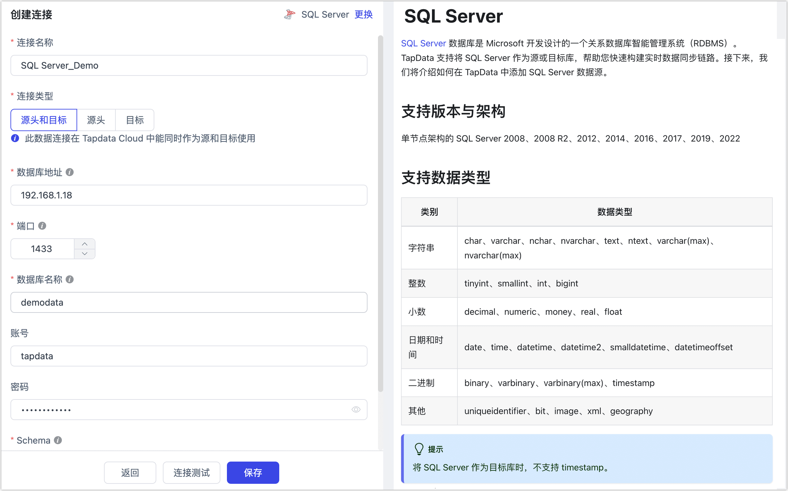
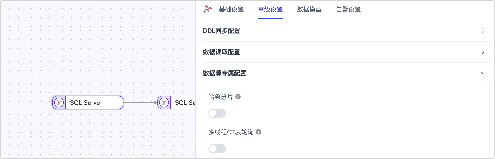

# SQL Server
[SQL Server](https://www.microsoft.com/zh-cn/sql-server/) 数据库是 Microsoft 开发设计的一个关系数据库智能管理系统（RDBMS）。TapData 支持将 SQL Server 作为源或目标库，帮助您快速构建实时数据同步链路。接下来，我们将介绍如何在 TapData 中添加 SQL Server 数据源。

```mdx-code-block
import Tabs from '@theme/Tabs';
import TabItem from '@theme/TabItem';
```

## 支持版本与架构

单节点架构的 SQL Server 2008、2008 R2、2012、2014、2016、2017、2019、2022

## 支持数据类型

| 类别       | 数据类型                                                     |
| ---------- | ------------------------------------------------------------ |
| 字符串     | char、varchar、nchar、nvarchar、text、ntext、varchar(max)、nvarchar(max) |
| 整数       | tinyint、smallint、int、bigint                               |
| 小数       | decimal、numeric、money、real、float                         |
| 日期和时间 | date、time、datetime、datetime2、smalldatetime、datetimeoffset |
| 二进制     | binary、varbinary、varbinary(max)、timestamp                 |
| 其他       | uniqueidentifier、bit、image、xml、geography                 |

:::tip

将 SQL Server 作为目标库时，不支持 timestamp。

:::

## 支持同步的操作

- **DML**：INSERT、UPDATE、DELETE

  :::tip

  将 SQL Server 作为同步的目标时，您还可以通过任务节点的高级配置，选择写入策略：插入冲突场景下，可选择转为更新或丢弃；更新失败场景下，可选择转为插入或仅打印日志。

  :::

- **DDL**：ADD COLUMN、CHANGE COLUMN、DROP COLUMN、RENAME COLUMN

此外，在 SQL Server 同步至 PostgreSQL 的场景下，还额外支持**字段默认值**、**自增列**和**外键约束**同步的能力。

## 注意事项

* SQL Server 的增量数据采集基于 CDC，TapData 通过轮询各表的CT表获取数据变更。因此，建议单个数据同步任务中的表数量保持较少，以缩短轮询周期，降低增量数据的延迟。若数据库性能较低，为避免频繁查询CT表影响数据库性能，建议按需开启表级或字段级 CDC，只采集必要的数据，并调整CT表数据保留时间，减少磁盘占用。

  ```sql
  -- 设置 CT 表数据保留时间为24小时，默认3天
  EXEC sys.sp_cdc_change_job @job_type = N'cleanup', 
                             @retention = 2880;
  ```

* SQL Server 的 CDC 方案对 DDL 采集支持较弱，隐式提交的 DDL 不会记录在 cdc.ddl_history 表中，可能影响同步。此外，执行 DDL 操作后，CT 表不会自动更新，系统通过轮询检测并重建 CT 表，因此 DDL 和 DML 在短时间内或同一事务中同时发生，可能导致 DML 数据丢失。

* SQL Server 作为源库时，如果对增量同步表的字段执行了 DDL 操作（如增加字段），您需要执行下述操作重启变更数据捕获，否则可能出现数据无法同步或报错等情况。

<details>
<summary>重启对应表的变更数据捕获</summary>

```sql
--关闭该表的变更数据捕获
  go
  EXEC sys.sp_cdc_disable_table
  @source_schema = N'[Schema]',
  @source_name = N'[Table]',
  @capture_instance = N'[Schema_Table]'
  go
  // capture_instance一般为schema_table的格式拼接而成，可以通过以下命令，查询实际的值
  exec sys.sp_cdc_help_change_data_capture
  @source_schema = N'[Schema]',
  @source_name = N'[Table]';
  
  
  --启动该表的变更数据捕获
  use [数据库名称]
  go
  EXEC sys.sp_cdc_enable_table
  @source_schema = N'[Schema]',
  @source_name = N'[Table]',
  @role_name = N'[Role]'
  go
```

</details>

## 功能限制

- 启用 CDC 的表无法使用 `truncate table` 语句或 `sp_rename` 修改字段名。
- 表级 CDC 只能开启或关闭，若之前处于关闭状态，配置数据同步任务时，任务设置中的指定增量时间将无效。
- 插入或更新大字段时，CDC 默认只处理最大 64KB 的数据，建议使用字段级 CDC 来处理大字段类型。

  

## 准备工作

:::tip

本文以 SQL Sever 2017 为例演示操作流程，其操作系统为 Windows Server 2019，如您部署在 Linux 平台且作为源库时，您还需要[安装并启用 SQL Server 代理](https://learn.microsoft.com/zh-cn/sql/linux/sql-server-linux-setup-sql-agent?view=sql-server-2017#EnableAgentAfterCU4)。

:::

### 作为源库

1. 以管理员（例如 **sa**）身份，登录到 SQL Server Management Studio 或 sqlcmd。

2. 依次执行下述格式的命令，创建用于数据复制/转换任务的用户。

   ```sql
   -- 创建登录账户
   CREATE LOGIN login_name WITH PASSWORD='passwd', default_database=database_name;
   
   -- 创建数据库操作用户
   CREATE USER login_name FOR LOGIN login_name with default_schema=schema_name;
   
   ```

   * **login_name**：登录名，即用户名。
   * **passwd**：用户密码。
   * **database_name**：与登录关联的默认数据库，即要登录的数据库名。
   * **schema_name**：数据库架构名称（例如 **dbo**），它充当对象（例如表、视图、过程和函数）的命名空间或容器。相关资料，见[创建数据库架构](https://learn.microsoft.com/zh-cn/sql/relational-databases/security/authentication-access/create-a-database-schema?view=sql-server-ver16)。

   下述示例表示创建一个名为 **tapdata** 的用户，指定登录的数据库为 **demodata**，架构为 **dbo**：

   ```sql
   -- 创建登录账户
   CREATE LOGIN tapdata WITH password='Tap@123456', default_database=demodata;
   
   -- 创建数据库操作用户
   CREATE USER tapdata FOR LOGIN tapdata with default_schema=dbo;
   ```

3. 为刚创建的账号授予权限，您也可以基于业务需求自定义权限控制。

   ```mdx-code-block
   <Tabs className="unique-tabs">
   <TabItem value="仅读取全量数据">
   ```
   ```sql
   -- 授予读取指定架构下所有表的权限
   GRANT SELECT ON SCHEMA::schema_name TO login_name;
   ```
   </TabItem>

   <TabItem value="读取全量+增量数据">

   ```sql
   -- 授予读取指定架构下所有表的权限
   GRANT SELECT ON SCHEMA::schema_name TO login_name;
   
   -- 授予读取变更数据捕获的权限，其 Schema 固定为 cdc
   GRANT SELECT ON SCHEMA::cdc TO login_name;
   ```
   </TabItem>
   </Tabs>

   * **login_name**：登录名，即用户名。
   * **schema_name**：数据库架构名称（例如 **dbo**），它充当对象（例如表、视图、过程和函数）的命名空间或容器。

   下述示例表示授予 **tapdata** 用户，拥有 **dbo** 架构和 **cdc** 架构下所有表的读取权限。

   ```sql
   GRANT SELECT ON SCHEMA::dbo TO tapdata;
   GRANT SELECT ON SCHEMA::cdc TO tapdata;
   ```

4. 如果您需要获取源库的数据变更以实现增量同步，您还需要跟随下述步骤完成数据库设置。

   1. [启用 SQL Server 代理服务](https://learn.microsoft.com/zh-cn/sql/ssms/agent/start-stop-or-pause-the-sql-server-agent-service?view=sql-server-ver16)。 

   2. 确定数据库的日志文件大小限制，可通过 [sys.master_files 官方文档](https://learn.microsoft.com/zh-cn/sql/relational-databases/system-catalog-views/sys-master-files-transact-sql?view=sql-server-ver16) 进行查询。

      如果日志文件大小设置过小，可能导致日志无法继续增长，进而影响 CDC 功能的正常运行。

   3. 选择执行下述命令，启用变更数据捕获能力。
   
      * 启用数据库级别的 CDC，在执行命令时CREATE LOGIN ，您需要替换 **database_name** 为真实的数据库名。
   
        ```sql
        -- 启用变更数据捕获能力
        USE database_name
        GO
        EXEC sys.sp_cdc_enable_db
        GO
        
        -- 查看是否启用变更数据捕获，is_cdc_enabled 值为 1 即表示已启用该功能
        SELECT [name], database_id, is_cdc_enabled
        FROM sys.databases
        WHERE [name] = N'database_name'
        GO
        ```
   
      * 启用表级别的 CDC。
   
        ```sql
        USE database_name
        -- 有主键表
        GO
        EXEC sys.sp_cdc_enable_table 
        @source_schema = N'schema_name', 
        @source_name   = N'table_name',
        @capture_instance = NULL,
        @role_name     = N'role_name',
        @supports_net_changes = 1
        GO
        
        -- 无主键表
        GO
        EXEC sys.sp_cdc_enable_table 
        @source_schema = N'schema_name', 
        @source_name   = N'table_name',
        @capture_instance = NULL,
        @role_name     = N'role_name',
        @supports_net_changes = 0
        GO
        ```
   
        - **database_name**：数据库名称。
        - **schema_name**：架构名称，例如 **dbo**。
        - **table_name**：数据表的名称。
        - **role_name**：可以访问更改数据的角色，如不希望使用设置角色，可将其设置为 NULL，如果在启用增量复制时指定了角色，则需确保数据库用户具有适当的角色，以便 TapData 可以访问增量复制表。
        - **capture_instance**：默认值为 NULL，由系统自动生成。如果存在残留的 CDC 资源，可能会因 **capture_instance** 冲突导致无法启动表的 CDC。此时可以通过指定一个新的 capture_instance 来启用。


### 作为目标库

1. 以管理员（例如 **sa**）身份，登录到 SQL Server Management Studio 或 sqlcmd。

2. 依次执行下述格式的命令，创建用于数据复制/转换任务的用户。

   ```sql
   -- 创建登录账户
   CREATE LOGIN login_name WITH PASSWORD='passwd', default_database=database_name;
   
   -- 创建数据库操作用户
   CREATE USER login_name FOR LOGIN login_name with default_schema=schema_name;
   ```
   
   * **login_name**：登录名，即用户名。
   * **passwd**：用户密码。
   * **database_name**：与登录关联的默认数据库，即要登录的数据库名。
   * **schema_name**：数据库架构名称（例如 **dbo**），它充当对象（例如表、视图、过程和函数）的命名空间或容器。相关资料，见[创建数据库架构](https://learn.microsoft.com/zh-cn/sql/relational-databases/security/authentication-access/create-a-database-schema?view=sql-server-ver16)。
   
   下述示例表示创建一个名为 **tapdata** 的用户，指定登录的数据库为 **demodata**，架构为 **dbo**：
   
   ```sql
   -- 创建登录账户
   CREATE LOGIN tapdata WITH password='Tap@123456', default_database=demodata;
   
   -- 创建数据库操作用户
   CREATE USER tapdata FOR LOGIN tapdata with default_schema=dbo;
   ```
   
3. 为刚创建的账号授予权限，您也可以基于业务需求自定义权限控制。

   ```sql
   -- 授予建表权限
   GRANT CREATE TABLE TO login_name;
   
   -- 授予增删改查所有表的权限
   GRANT ALTER, DELETE, INSERT, SELECT, UPDATE ON SCHEMA::schema_name TO login_name;
   ```
   
   * **login_name**：登录名，即用户名。
   * **schema_name**：数据库架构名称（例如 **dbo**），它充当对象（例如表、视图、过程和函数）的命名空间或容器。
   
   下述示例表示授予 **tapdata** 用户，在 **dbo** 架构建表并对所有表执行增删改查的权限：
   
   ```sql
   GRANT CREATE TABLE TO tapdata
   GRANT ALTER, DELETE, INSERT, SELECT, UPDATE ON SCHEMA::dbo TO tapdata;
   ```


## <span id="ssl">开启 SSL 连接（可选）</span>

为进一步提升数据链路的安全性，您还可以选择为 SQL Server 数据库开启 SSL（Secure Sockets Layer）加密，实现在传输层对网络连接的加密，在提升通信数据安全性的同时，保证数据的完整性，具体操作可参考官方文档：

* [Windows 平台](https://learn.microsoft.com/zh-cn/sql/database-engine/configure-windows/configure-sql-server-encryption?view=sql-server-ver15)
* [Linux 平台](https://learn.microsoft.com/zh-cn/sql/linux/sql-server-linux-encrypted-connections?view=sql-server-ver15&tabs=server)

:::tip

完成配置后，妥善保存证书相关文件，后续将后续在配置连接时使用。

:::


## 添加数据源

1. 登录 TapData 平台。

2. 在左侧导航栏，单击**连接管理**。

3. 单击页面右侧的**创建**。

4. 在弹出的对话框中，搜索并选择 **SQL Server**。

5. 在跳转到的页面，根据下述说明填写 SQL Server 的连接信息。

   

   * **连接信息设置**
      * **连接名称**：填写具有业务意义的独有名称。
      * **连接类型**：支持将 SQL Server 作为源或目标库。
      * **数据库地址**：数据库连接地址。
      * **端口**：数据库的服务端口。
      * **数据库名称**：数据库名称，即一个连接对应一个数据库，如有多个数据库则需创建多个数据连接。
      * **账号**：数据库的账号。
      * **密码**：数据库账号对应的密码。
      * **Schema**：Schema 名称，每个数据库下有多个 Schema，默认为 dbo。
   * **高级设置**
      * **其他连接串参数**：额外的连接参数，默认为空。
      * **时间类型的时区**：时区默认设置为 0 时区。如果配置了其他时区，将影响不带时区字段的数据同步时间，如 time、datetime、datetime2 和 smalldatetime；而带时区的字段（如 datetimeoffset）以及 date 类型字段则不受影响。
      * **使用 SSL/TLS**：选择是否开启 SSL 连接数据源，可进一步提升数据安全性，开启该功能后还需要上传 CA 证书、证书密码和服务器主机名信息，相关文件已在[开启 SSL 连接](#ssl)中获取。
      * **共享挖掘**：挖掘源库的增量日志，可为多个任务共享源库的增量日志，避免重复读取，从而最大程度上减轻增量同步对源库的压力，开启该功能后还需要选择一个外存用来存储增量日志信息。
      * **包含表**：默认为**全部**，您也可以选择自定义并填写包含的表，多个表之间用英文逗号（,）分隔。
      * **排除表**：打开该开关后，可以设定要排除的表，多个表之间用英文逗号（,）分隔。
      * **Agent 设置**：默认为**平台自动分配**，您也可以手动指定 Agent。
      * **模型加载时间**：如果数据源中的模型数量少于10000个，则每小时更新一次模型信息。但如果模型数量超过10000个，则刷新将在您指定的时间每天进行。
      * **开启心跳表**：当连接类型为源头或目标时，可启用该开关。TapData 会在源库创建 _tapdata_heartbeat_table 心跳表，并每 10 秒更新一次（需具备相应权限），用于监测数据源连接与任务的健康状况。心跳任务在数据复制/开发任务启动后自动启动，您可在数据源编辑页面查看心跳任务。

6. 单击**连接测试**，测试通过后单击**保存**。

   :::tip

   如提示连接测试失败，请根据页面提示进行修复。

   :::

## 节点高级特性

将 SQL Server 作为任务的源节点时，TapData 提供了多个高级功能以提升性能和应对复杂场景：



* **哈希分片**：默认关闭，打开后 TapData 将在全量同步阶段，根据哈希值拆分为多个分片并发读取，显著提升读取性能，但同时也会增加数据库负载。

* **多线程 CT 表轮询**：默认关闭，当源 SQL Server 有大量表（超过 500 表）需要同步时，可打开开关，优化增量采集性能，提升同步效率。

  :::tip

  该功能仅在配置数据复制任务时支持。

  :::

## 常见问题

* 问：为什么 SQL Server 的增量任务无法正常运行，任务日志中有告警：“open cdc failed”

  答：可以参考源增量的前置条件，可能是之前使用过其他 CDC 工具，导致资源残留未删除或释放，可重启数据库级 CDC 快速解决。

* 问：SQL Server2005版本可以支持吗？

  答：2005 版 SQL Server 尚未支持 CDC 功能，因此增量需要使用字段轮询方案，或采用下述方式：
  
  <details>
  <summary>SQL Server 2005 作为源库解决方案</summary>
  由于 CDC 支持从 SQLServer 2008 开始支持，对于较早的版本，您需要使用 Custom SQL 功能来模拟更改数据捕获，在从旧版本复制数据时，源表必须有一个更改跟踪列，比如 <b>LAST_UPDATED_TIME</b>，它在每次插入或更新记录时都会更新；随后在创建数据复制任务时，任务的同步类型选择为<b>全量</b>，将<b>重复运行自定义 SQL</b>设置为 <b>True</b>，同时在映射设计上提供适当的自定义 SQL。
  </details>

## 扩展阅读


本小节介绍在使用变更数据捕获功能时可能会遇到的问题，更多信息，请参考[微软官方文档](https://docs.microsoft.com/en-us/sql/relational-databases/system-stored-procedures/change-data-capture-stored-procedures-transact-sql?view=sql-server-ver15)。


* 清理变更数据捕获日志

  SQL Server 不会自动清理变更数据捕获日志，需要进行如下设置开启清理任务。

  ```sql
  --retention 的单位为分钟，本处设定清理周期为2天
  USE AdventureWorks2012;  
  GO  
  EXECUTE sys.sp_cdc_change_job   
      @job_type = N'cleanup',  
      @retention = 2880;  
  GO 
  ```

  

* 开启全库变更数据捕获

  ```sql
  -- 全局替换 将 TAPDATA 替换为实际的数据库名
  -- 全局替换 将 INSURANCE 替换为实际的 schema 名称
  USE TAPDATA
  GO
  EXEC sys.sp_cdc_enable_db
  GO
  
  declare @table_name varchar(100)
  declare @database_name varchar(100)
  declare @schema_name varchar(100)
  
  set @database_name = 'TAPDATA'
  set @schema_name = 'INSURANCE'
  
  declare my_cursor cursor for SELECT TABLE_NAME
                               FROM TAPDATA.INFORMATION_SCHEMA.TABLES
                               where TABLE_CATALOG = @database_name
                                 and TABLE_SCHEMA = @schema_name;
  open my_cursor
  fetch next from my_cursor into @table_name
  while @@FETCH_STATUS = 0
      begin
          begin try
              exec sys.sp_cdc_enable_table
                   @source_schema = @schema_name,
                   @source_name = @table_name,
                   @role_name = NULL
          end try
          begin catch
              print('[ERROR] ' + @table_name)
          end catch
  
          fetch next from my_cursor into @table_name
      end
  close my_cursor
  deallocate my_cursor
  ```

* 关闭全局变更数据捕获

  ```sql
  -- 全局替换 将 TAPDATA 替换为实际的数据库名
  -- 全局替换 将 INSURANCE 替换为实际的 schema 名称
  USE TAPDATA
  GO
  
  declare @table_name varchar(100)
  declare @database_name varchar(100)
  declare @schema_name varchar(100)
  
  set @database_name = 'TAPDATA'
  set @schema_name = 'INSURANCE'
  
  declare my_cursor cursor for SELECT TABLE_NAME
                               FROM TAPDATA.INFORMATION_SCHEMA.TABLES
                               where TABLE_CATALOG = @database_name
                                 and TABLE_SCHEMA = @schema_name;
  open my_cursor
  fetch next from my_cursor into @table_name
  while @@FETCH_STATUS = 0
      begin
          begin try
              EXEC sys.sp_cdc_disable_table
                   @source_schema = @schema_name,
                   @source_name = @table_name,
                   @capture_instance = 'all';
          end try
          begin catch
              print ('[ERROR] ' + @table_name)
          end catch
  
          fetch next from my_cursor into @table_name
      end
  close my_cursor
  deallocate my_cursor
  
  EXEC sys.sp_cdc_disable_db
  GO
  ```

  
