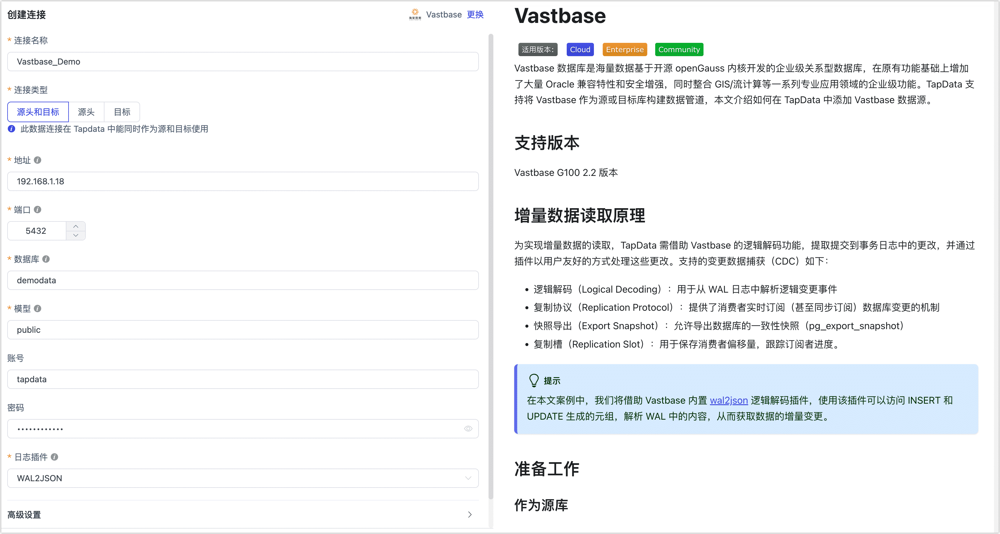

# Vastbase


Vastbase 数据库是海量数据基于开源 openGauss 内核开发的企业级关系型数据库，在原有功能基础上增加了大量 Oracle 兼容特性和安全增强，同时整合 GIS/流计算等一系列专业应用领域的企业级功能。TapData 支持将 Vastbase 作为源或目标库构建数据管道，本文介绍如何在 TapData 中添加 Vastbase 数据源。

## 支持版本

Vastbase G100 2.2 版本


## 增量数据读取原理

为实现增量数据的读取，TapData 需借助 Vastbase 的逻辑解码功能，提取提交到事务日志中的更改，并通过插件以用户友好的方式处理这些更改。支持的变更数据捕获（CDC）如下：

- 逻辑解码（Logical Decoding）：用于从 WAL 日志中解析逻辑变更事件
- 复制协议（Replication Protocol）：提供了消费者实时订阅（甚至同步订阅）数据库变更的机制
- 快照导出（Export Snapshot）：允许导出数据库的一致性快照（pg_export_snapshot）
- 复制槽（Replication Slot）：用于保存消费者偏移量，跟踪订阅者进度。 

:::tip

在本文案例中，我们将借助 Vastbase 内置 [wal2json](https://docs.vastdata.com.cn/zh/docs/VastbaseG100Ver2.2.10/doc/%E5%BC%80%E5%8F%91%E8%80%85%E6%8C%87%E5%8D%97/wal2json%E6%8F%92%E4%BB%B6.html) 逻辑解码插件，使用该插件可以访问 INSERT 和 UPDATE 生成的元组，解析 WAL 中的内容，从而获取数据的增量变更。

:::

## 准备工作

### 作为源库

1. 以管理员身份登录 Vastbase 数据库。

2. 创建用户并授权。

   1. 执行下述格式的命令，创建用于数据同步/开发任务的账号。

      ```sql
      CREATE USER username WITH PASSWORD 'password';
      ```

      * **username**：用户名。
      * **password**：密码。

   2. 执行下述格式的命令，授予账号权限。

      ```sql
      -- 进入要授权的数据库
      \c database_name
      
      -- 授予目标 Schema 的表读取权限
      GRANT SELECT ON ALL TABLES IN SCHEMA schema_name TO username;
      
      -- 授予目标 Schema 的 USAGE 权限
      GRANT USAGE ON SCHEMA schema_name TO username;
      
      -- 授予复制权限，仅需读取数据库的全量数据，则无需执行
      ALTER USER username REPLICATION;
      ```

      * **database_name**：数据库名称。
      * **schema_name**：Schema 名称。
      * **username**：用户名。
      
      :::tip
      
      如仅需读取 Vastbase 的全量数据（不包含增量变更），则无需执行后续步骤。
      
      :::

3. 执行下述格式的命令，修改复制标识为 **FULL**（使用整行作为标识），该属性决定了当数据发生 UPDATE/DELETE 时，日志记录的字段。

   ```sql
   ALTER TABLE 'schema_name'.'table_name' REPLICA IDENTITY FULL;   
   ```

   * **schema_name**：Schema 名称。
   * **table_name**：表名称。

4. 执行下述命令，修改相关参数以支持 [wal2json](https://docs.vastdata.com.cn/zh/docs/VastbaseG100Ver2.2.10/doc/%E5%BC%80%E5%8F%91%E8%80%85%E6%8C%87%E5%8D%97/wal2json%E6%8F%92%E4%BB%B6.html)  逻辑解码能力。

   ```sql
ALTER SYSTEM SET wal_level to logical;
   ALTER SYSTEM SET max_wal_senders to 10;
ALTER SYSTEM SET max_replication_slots to 10;
   ```

4. 在业务低峰期重启数据库实例。

6. （可选）测试日志插件。

   1. 连接 Vastbase 数据库，切换至需要同步的数据库并创建一张测试表。

      ```sql
      -- 假设需要同步的数据库为 demodata，模型为 public
      \c demodata
      
      CREATE TABLE public.test_decode
      (
        uid    integer not null
            constraint users_pk
                primary key,
        name   varchar(50),
        age    integer,
        score  decimal
      );
      ```

   2. 创建 Slot 连接，以 wal2json 插件为例。

      ```sql
      SELECT * FROM pg_create_logical_replication_slot('slot_test', 'wal2json');
      ```

   3. 对测试表插入一条数据。

      ```sql
      INSERT INTO public.test_decode (uid, name, age, score)
      VALUES (1, 'Jack', 18, 89);
      ```

   4. 监听日志并查看返回结果，是否有刚才插入操作的信息。

      ```sql
      SELECT * FROM pg_logical_slot_peek_changes('slot_test', null, null);
      ```

      返回示例如下（竖向显示）：

      ```sql
      lsn  | 0/3C91A10
      xid  | 16914
      data | {"change":[{"kind":"insert","schema":"public","table":"test_decode","columnnames":["uid","name","age","score"],"columntypes":["integer","varchar(50)","integer","numeric"],"columnvalues":[1,"Jack",18,89]}]}
      ```

   5. 确认无问题后，可销毁 Slot 连接并删除测试表。

      ```sql
      SELECT * FROM pg_drop_replication_slot('slot_test');
      DROP TABLE public.test_decode;
      ```

6. （可选）如需使用最后更新时间戳的方式进行增量同步，您需要执行下述步骤。

   1. 在源数据库中，执行下述命令创建公共函数，需替换 schema 名称。

      ```sql
      CREATE OR REPLACE FUNCTION schema_name.update_lastmodified_column()
        RETURNS TRIGGER LANGUAGE plpgsql AS $$
        BEGIN
            NEW.last_update = now();
            RETURN NEW;
        END;
      $$;
      ```

   2. 创建字段和 trigger，每个表均需执行一次，例如表名为 **mytable**。

      ```sql
      // 创建 last_update 字段
      ALTER TABLE schema_name.mytable ADD COLUMN last_udpate timestamp DEFAULT now();
      
      // 创建 trigger
      CREATE TRIGGER trg_uptime BEFORE UPDATE ON schema_name.mytable FOR EACH ROW EXECUTE PROCEDURE
        update_lastmodified_column();
      ```


### 作为目标库

1. 以管理员身份登录 Vastbase 数据库。

2. 执行下述格式的命令，创建用于数据同步/开发任务的账号。

   ```sql
   CREATE USER username WITH PASSWORD 'password';
   ```

   * **username**：用户名。
   * **password**：密码。

3. 执行下述格式的命令，为数据库账号授予权限。

   ```sql
   -- 进入要授权的数据库
   \c database_name;
   
   -- 授予目标 Schema 的 USAGE 和 CREATE 权限
   GRANT CREATE,USAGE ON SCHEMA schemaname TO username;
   
   -- 授予目标 Schema 的表读写权限
   GRANT SELECT,INSERT,UPDATE,DELETE,TRUNCATE ON ALL TABLES IN SCHEMA schemaname TO username;
   ```

   * **database_name**：数据库名称。
   * **schema_name**：Schema 名称。
   * **username**：用户名。
	


## 添加数据源
1. 登录 Tapdata 平台。

2. 在左侧导航栏，单击**连接管理**。

3. 单击页面右侧的**创建**。

4. 在弹出的对话框中，搜索并选择 **Vastbase**。

5. 在跳转到的页面，根据下述说明填写 Vastbase 的连接信息。

   

   * **连接信息设置**
      * **连接名称**：填写具有业务意义的独有名称。
      * **连接类型**：支持将 Vastbase 作为源或目标库。
      * **地址**：数据库连接地址。
      * **端口**：数据库的服务端口，默认为 **5432**。
      * **数据库**：数据库名称，即一个连接对应一个数据库，如有多个数据库则需创建多个数据连接。
      * **模型**：Schema 名称。
      * **额外参数**：额外的连接参数，默认为空。
      * **账号**：数据库的账号。
      * **密码**：数据库账号对应的密码。
      * **日志插件**：如需读取 Vastbase 的数据变更，实现增量数据同步，您需要根据准备工作的指引，完成插件的安装。
   * **高级设置**
      * **额外参数**：额外的连接参数，默认为空。
      * **时区**：默认为数据库所用的时区，您也可以根据业务需求手动指定。
      * **共享挖掘**：挖掘源库的增量日志，可为多个任务共享源库的增量日志，避免重复读取，从而最大程度上减轻增量同步对源库的压力，开启该功能后还需要选择一个外存用来存储增量日志信息。
      * **包含表**：默认为**全部**，您也可以选择自定义并填写包含的表，多个表之间用英文逗号（,）分隔。
      * **排除表**：打开该开关后，可以设定要排除的表，多个表之间用英文逗号（,）分隔。
      * **Agent 设置**：默认为**平台自动分配**，您也可以手动指定 Agent。
      * **模型加载频率**：数据源中模型数量大于 1 万时，TapData 将按照设置的时间定期刷新模型。
      * **开启心跳表**：当连接类型选择为**源头和目标**、**源头**时，支持打开该开关，由 Tapdata 在源库中创建一个名为 **_tapdata_heartbeat_table** 的心跳表并每隔 10 秒更新一次其中的数据（数据库账号需具备相关权限），用于数据源连接与任务的健康度监测。
   * **SSL 设置**：选择是否开启 SSL 连接数据源，可进一步提升数据安全性，开启该功能后还需要上传 CA 文件、客户端证书、密钥填写客户端密码。

6. 单击**连接测试**，测试通过后单击**保存**。

   :::tip

   如提示连接测试失败，请根据页面提示进行修复。

   :::


## 异常处理

当 CDC 意外中断后，可能导致 Slot 连接无法从 Vastbase 主节点删除，此时需手动登录主节点，删除相关 Slot 避免一直占用。

```sql
-- 查看是否有 slot_name=tapdata 的信息
TABLE pg_replication_slots;

-- 删除 Slot 节点
select * from pg_drop_replication_slot('tapdata');
```