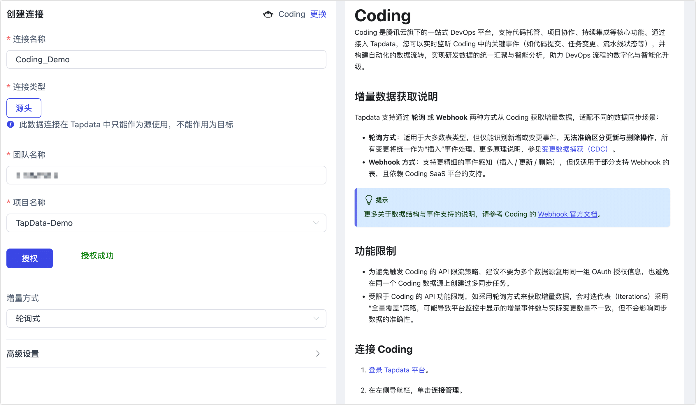
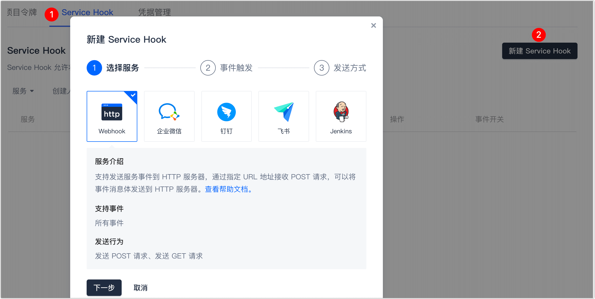
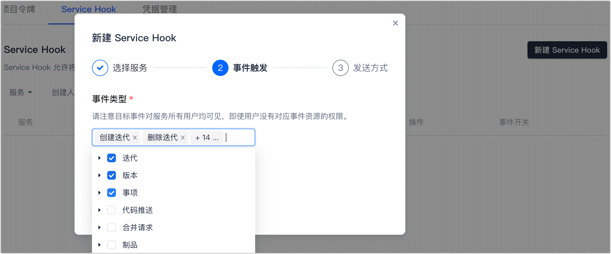
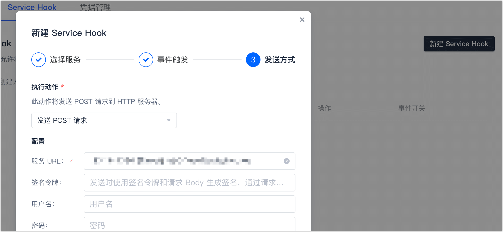

# Coding
import Content from '../../reuse-content/_all-features.md';

<Content />

Coding 是腾讯云旗下的一站式 DevOps 平台，支持代码托管、项目协作、持续集成等核心功能。通过接入 Tapdata，您可以实时监听 Coding 中的关键事件（如代码提交、任务变更等），并构建自动化的数据流转，实现研发数据的统一汇聚与智能分析，助力 DevOps 流程的数字化与智能化升级。

## 增量数据获取说明

Tapdata 支持通过 **轮询** 或 **Webhook** 两种方式从 Coding 获取增量数据，适配不同的数据同步场景：

- **轮询方式**：适用于大多数表类型，但仅能识别新增或变更事件，**无法准确区分更新与删除操作**，所有变更将统一作为“插入”事件处理。更多原理说明，参见[变更数据捕获（CDC）](../../introduction/change-data-capture-mechanism.md)。
- **Webhook 方式**：支持更精细的事件感知（插入 / 更新 / 删除），但仅适用于部分支持 Webhook 的表，且依赖 Coding SaaS 平台的支持。

:::tip
更多关于数据结构与事件支持的说明，请参考 Coding 的 [Webhook 官方文档](https://coding.net/help/docs/project-settings/open/webhook.html)。
:::

## 功能限制

- 为避免触发 Coding 的 API 限流策略，建议不要为多个数据源复用同一组 OAuth 授权信息，也避免在同一个 Coding 数据源上创建过多同步任务。
- 受限于 Coding 的 API 功能限制，如采用轮询方式来获取增量数据，会对迭代表（Iterations）采用“全量覆盖”策略，可能导致平台监控中显示的增量事件数与实际变更数量不一致，但不会影响同步数据的准确性。

## 连接 Coding

1. [登录 Tapdata 平台](../../user-guide/log-in.md)。

2. 在左侧导航栏，单击**连接管理**。

3. 单击页面右侧的**创建**。

4. 在弹出的对话框中，搜索并选择 **Coding**。

5. 在跳转到的页面，根据下述说明填写 Coding 的连接信息。
   
   
   
   * **连接名称**：填写具有业务意义的独有名称。
   
   * **连接类型**：当前仅支持将 Coding 作为源头。
   
   * **团队名称**：您可以通过 Coding 平台的登录链接来获取，例如链接为 **https://team_name.coding.net/** ，那么团队名称就是 **team_name**。填写完成后，单击**授权**，在跳转到的页面完成登录授权。
   
   * **项目名称**：完成授权操作后，即可选择要连接的项目名称。
   
   * **增量方式**：基于业务需求选择：
   
     * **轮询式**（默认）：通过定期查询数据库表中的指定列（如时间戳），然后比较时间点前后的数据来确定数据的增量变化。此方式无法跟踪删除和表结构变更操作，更多介绍，见[变更数据捕获（CDC）](../../introduction/change-data-capture-mechanism.md)。
   
     * **Webhook**：通过 Coding 平台提供的 Webhook 功能监听其事件信息，当事件发生变化时通过 HTTP POST 方式通知到 TapData 平台。选择此方式时，您还需要单击**生成**来获取服务 URL，然后跟随下述流程前往 Coding 平台完成配置。
   
       

       
Coding 平台配置 Webhook

   
       1. 以管理员身份[登录 Coding 平台](https://e.coding.net/login)。
   
       2. 选择**项目设置** > **开发者选项**，然后在 **Service Hook** 页签，单击**新建 Service Hook**。
   
       3. 在弹出的对话框中，保持默认的 **HTTP** 方式并单击**下一步**。
   
          
   
       4. 选择要的监听的事件类型，单击**下一步**。
   
          
   
       5. 填写从 TapData 平台连接数据源页面生成的 Service URL，随后可以单击**发送测试 PING 事件**，确认无误后单击**完成**。
   
          
   
       

   
   * **高级设置**：基于业务需求调整：
     
     * **共享挖掘**：[挖掘源库](../../user-guide/advanced-settings/share-mining.md)的增量日志，可为多个任务共享源库的增量日志，避免重复读取，从而最大程度上减轻增量同步对源库的压力，开启该功能后还需要选择一个外存用来存储增量日志信息。
     * **Agent 设置**：默认为**平台自动分配**，您也可以手动指定 Agent。
     * **模型加载时间**：如果数据源中的模型数量少于10000个，则每小时更新一次模型信息。但如果模型数量超过10000个，则刷新将在您指定的时间每天进行。
   
6. 单击**连接测试**，测试通过后单击**保存**。

   :::tip

   如提示连接测试失败，请根据页面提示进行修复。

   :::

