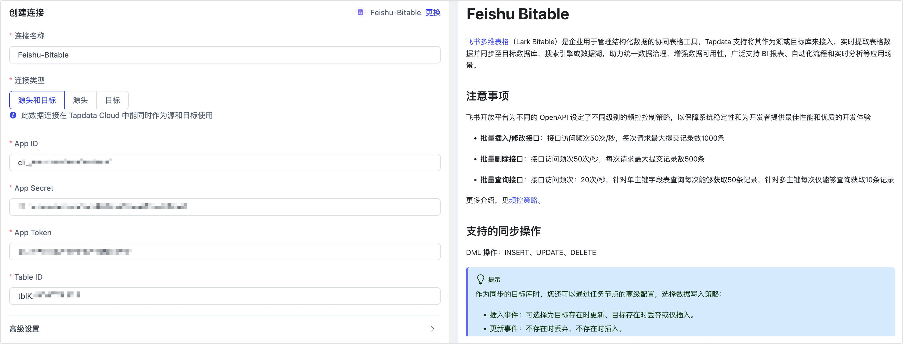

# Feishu Bitable

import Content from '../../reuse-content/_enterprise-and-cloud-features.md';

<Content />

[飞书多维表格](https://open.feishu.cn/document/server-docs/docs/bitable-v1/bitable-overview)（Lark Bitable）是企业用于管理结构化数据的协同表格工具，Tapdata 支持将其作为源或目标库来接入，实时提取表格数据并同步至目标数据库、搜索引擎或数据湖，助力统一数据治理、增强数据可用性，广泛支持 BI 报表、自动化流程和实时分析等应用场景。

## 注意事项

飞书开放平台为不同的 OpenAPI 设定了不同级别的频控控制策略，以保障系统稳定性和为开发者提供最佳性能和优质的开发体验

- **批量插入/修改接口**：接口访问频次50次/秒，每次请求最大提交记录数1000条

- **批量删除接口**：接口访问频次50次/秒，每次请求最大提交记录数500条

- **批量查询接口**：接口访问频次：20次/秒，针对单主键字段表查询每次能够获取50条记录，针对多主键每次仅能够查询获取10条记录

更多介绍，见[频控策略](https://open.feishu.cn/document/server-docs/api-call-guide/frequency-control)。

## 支持的同步操作

DML 操作：INSERT、UPDATE、DELETE

:::tip

作为同步的目标库时，您还可以通过任务节点的高级配置，选择数据写入策略：

- 插入事件：可选择为目标存在时更新、目标存在时丢弃或仅插入。
- 更新事件：不存在时丢弃、不存在时插入。

:::

## 准备工作

1. 以管理员的身份登录[飞书开放平台](https://open.feishu.cn/app)。

2. 在开发平台首页，进入企业自建的应用。

   :::tip

   关于企业自建应用的创建方法，见[开发流程](https://open.feishu.cn/document/home/introduction-to-custom-app-development/self-built-application-development-process)。

   :::

3. 在左侧导航栏，单击**凭证与基础信息**，获取 App ID 和 App Secret 信息，后续将在连接数据源时使用。

   

## 连接 Lark Doc

1. [登录 Tapdata 平台](../../user-guide/log-in.md)。

2. 在左侧导航栏，单击**连接管理**。

3. 在页面右侧，单击**创建连接**。

4. 在弹出的对话框中，搜索并选择 **Feishu Bitable**。

5. 根据下述说明完成数据源配置。

   

   * **连接名称**：填写具有业务意义的独有名称。
   * **连接类型**：支持作为源头或目标。
   * **App ID**、**App Secret**：可通过飞书开放平台获取，具体操作，见[准备工作](#prerequisite)。
   * **App Token**：每个多维表格应用可视为一个独立的 App，其唯一标识为 `app_token`。获取方式，见[接入指南](https://open.feishu.cn/document/server-docs/docs/bitable-v1/notification)。
   * **Table ID**：一个多维表格应用下可包含多个数据表，每个表的唯一标识为 `table_id`。获取方式，见[接入指南](https://open.feishu.cn/document/server-docs/docs/bitable-v1/notification)，或通过调用 [List all tables](https://open.feishu.cn/document/uAjLw4CM/ukTMukTMukTM/reference/bitable-v1/app-table/list) 接口获取。
   * **高级设置**
     * **agent 设置**：默认为**平台自动分配**，您也可以手动指定。
     * **模型加载频率**：数据源中模型数量大于 1 万时，Tapdata 将按照本参数的设定定期刷新模型。

6. 单击**连接测试**，测试通过后单击**保存**。

   :::tip

   如提示连接测试失败，请根据页面提示进行修复。

   :::
