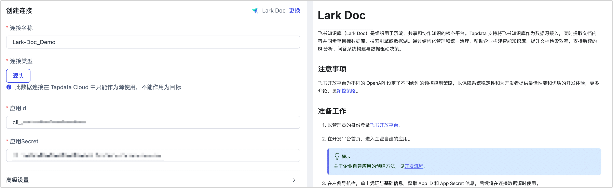

# Lark Doc
import Content from '../../reuse-content/_enterprise-and-cloud-features.md';

<Content />

飞书知识库（Lark Doc）是组织用于沉淀、共享和协作知识的核心平台。Tapdata 支持将飞书知识库作为数据源接入，实时提取文档内容并同步至目标数据库、搜索引擎或数据湖。通过结构化管理和统一治理，帮助企业构建智能知识库、提升文档检索效率，支持后续的 BI 分析、问答系统构建与数据驱动决策。

## 注意事项

飞书开放平台为不同的 OpenAPI 设定了不同级别的频控控制策略，以保障系统稳定性和为开发者提供最佳性能和优质的开发体验，更多介绍，见[频控策略](https://open.feishu.cn/document/server-docs/api-call-guide/frequency-control)。

## 准备工作

1. 以管理员的身份登录[飞书开放平台](https://open.feishu.cn/app)。

2. 在开发平台首页，进入企业自建的应用。

   :::tip

   关于企业自建应用的创建方法，见[开发流程](https://open.feishu.cn/document/home/introduction-to-custom-app-development/self-built-application-development-process)。

   :::

3. 在左侧导航栏，单击**凭证与基础信息**，获取 App ID 和 App Secret 信息，后续将在连接数据源时使用。

   
   
4. [设置应用可用范围](https://open.feishu.cn/document/develop-process/test-and-release-app/availability)，确保飞书消息的目标用户或群组已纳入飞书自建应用的可见范围，避免消息接受失败。

5. 为应用开启[机器人能力](https://open.feishu.cn/document/uAjLw4CM/ugTN1YjL4UTN24CO1UjN/trouble-shooting/how-to-enable-bot-ability)，注意需要应用发布后才能生效。

5. [将应用设置为知识库管理员](https://open.feishu.cn/document/server-docs/docs/wiki-v2/wiki-qa#b5da330b)，保障可接收和发送通知信息。

## 连接 Lark Doc

1. [登录 Tapdata 平台](../../user-guide/log-in.md)。

2. 在左侧导航栏，单击**连接管理**。

3. 在页面右侧，单击**创建连接**。

4. 在弹出的对话框中，搜索并选择 **Lark Doc**。

5. 根据下述说明完成数据源配置。

   

   * **连接名称**：填写具有业务意义的独有名称。
   * **连接类型**：仅支持作为**源头**。
   * **应用 ID**、**应用 Secret**：可通过飞书开放平台获取，具体操作，见[准备工作](#prerequisite)。
   * **高级设置**
     * **agent 设置**：默认为**平台自动分配**，您也可以手动指定。
     * **模型加载频率**：数据源中模型数量大于 1 万时，Tapdata 将按照本参数的设定定期刷新模型。

6. 单击**连接测试**，测试通过后单击**保存**。

   :::tip

   如提示连接测试失败，请根据页面提示进行修复。

   :::